> [!IMPORTANT]
>
> * ① C 语言是一门`面向过程`的`编译型`的`编程语言`，其最大特点在于 `运行速度极快`，仅次于`汇编语言`，这使得 C 语言在需要高性能的场景中得到广泛应用，如：操作系统、硬件驱动程序和嵌入式系统。然而，`开发效率较低`也是 C 语言的一大特点，程序员需要手动管理内存和处理低级别的操作，这对编程能力要求较高。
> * ② C 语言不仅仅是一门`编程`语言，更是计算机行业的`核心`语言。它是计算机专业的基础课程，无论是操作系统的构建、硬件驱动的开发，还是数据库系统的实现，都离不开 C 语言的支持。`学习 C 语言` 不仅是掌握编程技能的必经之路，也是深入理解计算机底层原理的关键。如果忽视了 C 语言的学习，将难以深入理解计算机系统的工作原理，也很难在计算机行业中取得长远的发展。


# 第一章：计算机组成原理

## 1.1 计算机系统

* 计算机（Computer），俗称`"电脑"`，是一种能够接收和存储信息，并按照存储在其内部的程序对海量的数据进行自动、高速的处理，然后将处理结果输出的现代化智能电子设备。
* 计算机有很多形式，如：台式电脑、笔记本电脑、智能手机、平板电脑等，还有生产环境中提供重要业务支撑的各种服务器。


* 一个完整的`计算机系统`由`硬件（Hardware）系统`和`软件（Software）系统`两大部分组成，即：

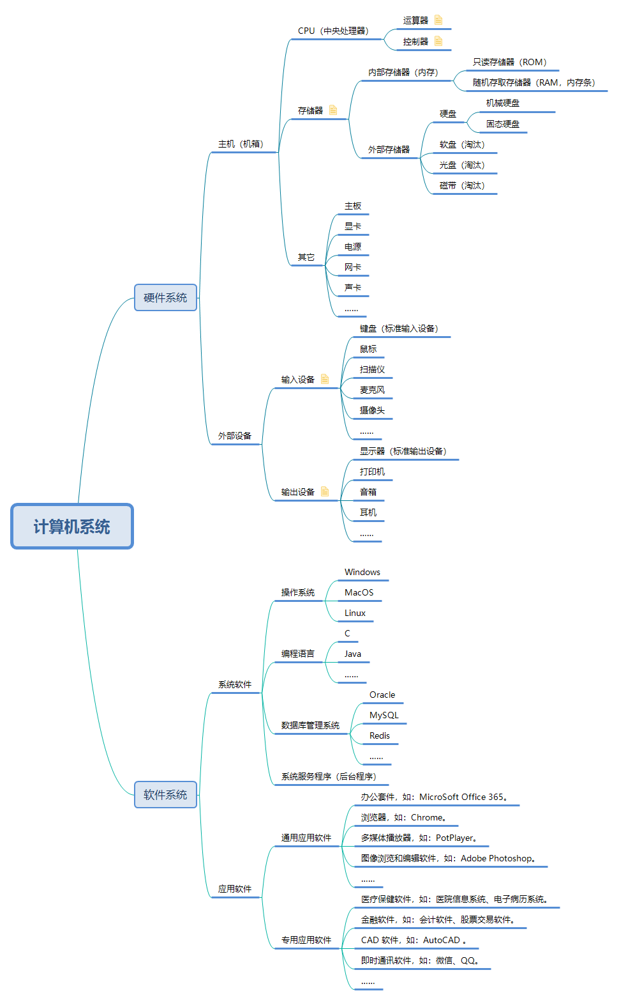

## 1.2 冯·诺依曼体系结构

* `冯·诺依曼`是一位多才多艺的科学家，他在数学、物理学、计算机科学、经济学等领域都有杰出的贡献。


* `冯·诺依曼`的主要成就：
  - 在计算机科学领域的最著名贡献是提出了`冯·诺依曼`体系结构（1946 年），这是`现代计算机设计的基础`。
  - 促进了计算机的可编程性和通用性，使得计算机能够执行各种复杂的任务。
  - 对核武器设计、自动化控制系统、人工智能等领域的发展产生了重要影响。
  - ……

> [!IMPORTANT]
>
> `冯·诺依曼体系结构`是现代计算机（量子计算机除外）设计的`基础`。

* `冯·诺依曼`体系结构的理论要点如下：

  - ① **存储程序**：`程序指令`和`数据`都存储在计算机的内存中，这使得程序可以在运行时修改。
  - ② **二进制逻辑**：所有`数据`和`指令`都以`二进制`形式表示。
  - ③ **顺序执行**：指令按照它们在内存中的顺序执行，但可以有条件地改变执行顺序。
  - ④ **五大部件**：计算机由`运算器`、`控制器`、`存储器`、`输入设备`和`输出设备`组成。
  - ⑤ **指令结构**：指令由操作码和地址码组成，操作码指示要执行的操作，地址码指示操作数的位置。
  - ⑥ **中心化控制**：计算机的控制单元（CPU）负责解释和执行指令，控制数据流。


> [!NOTE]
>
> 上述的组件协同工作，构成了一个完整的计算机系统：
>
> * `运算器`和`控制器`通常被集成在一起，组成中央处理器（CPU），负责数据处理和指令执行。
> * `存储器`（内存）保存数据和程序，是计算机运作的基础。
> * `输入设备`和`输出设备`负责与外界的交互，确保用户能够输入信息并接收计算机的处理结果。

## 1.3 各种硬件处理速度和性能优化

* 计算机的性能短板：如果 CPU 有每秒处理 1000 个服务请求的能力，各种总线的负载能力能达到 500 个， 但网卡只能接受 200个请求，而硬盘只能负担 150 个的话，那这台服务器得处理能力只能是 150 个请求/秒，有 85% 的处理器计算能力浪费了，在计算机系统当中，`硬盘`的读写速率已经成为影响系统性能进一步提高的瓶颈。


* 计算机的各个设备部件的延迟从高到低的排列，依次是机械硬盘（HDD）、固态硬盘（SSD）、内存、CPU 。


* 从上图中，我们可以知道，CPU 是最快的，一个时钟周期是 0.3 ns ，内存访问需要 120 ns ，固态硬盘访问需要 50-150 us，传统的硬盘访问需要 1-10 ms，而网络访问是最慢，需要 40 ms 以上。

> [!NOTE]
>
> 时间的单位换算如下：
>
> * ① 1 秒 = 1000 毫秒，即 1 s = 1000 ms。
> * ② 1 毫秒 = 1000 微妙，即 1 ms = 1000 us 。
> * ③ 1 微妙 = 1000 纳秒，即 1 us = 1000 ns。

* 按照上图，将计算机世界的时间和人类世界的时间进行对比，即：

```txt
如果 CPU 的时钟周期按照 1 秒计算，
那么，内存访问就需要 6 分钟；
那么，固态硬盘就需要 2-6 天；
那么，传统硬盘就需要 1-12 个月；
那么，网络访问就需要 4 年以上。
```

> [!NOTE]
>
> * ① 这和中国古典修仙小说中的“天上一天，地上一年”是多么的相似！！！
> * ② 对于 CPU 来说，这个世界真的是太慢了！！！

* 其实，中国古代中的文人，通常以`蜉蝣`来表示时间的短暂（和其他生物的寿命比），也是类似的道理，即：

```txt
鹤寿千岁，以极其游，蜉蝣朝生而暮死，尽其乐，盖其旦暮为期，远不过三日尔。
	                                        --- 出自 西汉淮南王刘安《淮南子》
```

```txt
寄蜉蝣于天地，渺沧海之一粟。 哀吾生之须臾，羡长江之无穷。 
挟飞仙以遨游，抱明月而长终。 知不可乎骤得，托遗响于悲风。
	                                        --- 出自 苏轼《赤壁赋》
```

>[!NOTE]
>
>* ① 从`蜉蝣`的角度来说，从早到晚就是一生；但是，从`人类`角度来说，从早到晚却仅仅只是一天。
>* ② 这和“天上一天，地上一年”是多么的相似，即：如果`蜉蝣`是`人类`的话，那`我们`就是`仙人`了。

* 存储器的层次结构（CPU 中也有存储器，即：寄存器、高速缓存 L1、L2 和 L3），如下所示：


>[!NOTE]
>
>上图以层次化的方式，展示了价格信息，揭示了一个真理，即：鱼和熊掌不可兼得。
>
>- ① 存储器越往上速度越快，但是价格越来越贵， 越往下速度越慢，但是价格越来越便宜。
>- ② 正是由于计算机各个部件的速度不同，容量不同，价格不同，导致了计算机系统/编程中的各种问题以及相应的解决方案。
>

> [!IMPORTANT]
>
> * ① CPU 都是直接和内存打交道的，即：CPU 会直接从内存中读取数据，待数据处理完毕之后，会将结果再次写入到内存中。
> * ② 如果需要将数据持久化（永久）保存（内存是易失性存储器，内存中的数据是以电荷形式存储在存储单元中的。
> * ③ 当计算机关闭或断电时，这些电荷很快消散，导致存储在内存中的数据丢失），那么就需要将内存中的数据刷新到磁盘或硬盘上，即：落盘。

## 1.4 计算机软件

### 1.4.1 操作系统的来源

* 在上古时期，硬件资源不够丰富，计算机设计的也非常简陋。那个时候，很多应用程序都是直接跑在硬件上的，即：一个计算机只能跑一个应用程序。

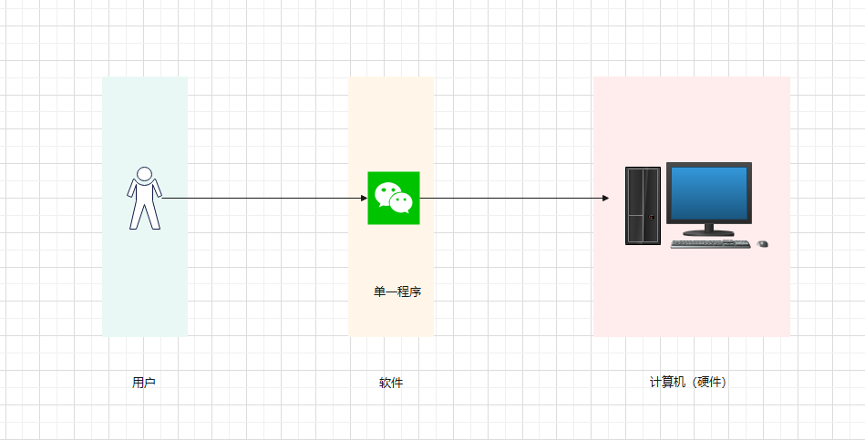

* 随着技术的发展，硬件越来越丰富，功能也越来越强大，性能也越来越好。这种情况下，如果一台计算机只能跑一个程序，实在是太浪费了。而且，底层硬件不断丰富，应用程序需要对接的硬件也将越来越多，如果每个应用程序都这么干，不显示工作很重复吗？于是，操作系统应运而生了。


- 操作系统的功能：
  - 硬件驱动。
  - 进程管理。
  - 内存管理。
  - 网络管理。
  - 安全管理。
  - 文件管理。

* 那么，操作系统的作用，就是这样的，即：
  * 对下，管理计算机的硬件资源。
  * 对上，提供使用计算机资源的操作方式，有：
    * `系统调用`：是一套已经写好的代码接口，应用程序通过调用这些接口来请求操作系统执行特定的硬件操作。它们直接与硬件交互，提供底层功能支持，如：文件操作、进程管理、内存管理等。`开发者`通过系统调用可以实现对底层资源的直接控制，确保程序能够高效、安全地运行。
    * `终端命令`：是一种文本命令接口，通过命令行输入各种指令来控制操作系统和软件的行为。终端命令可以执行文件操作、系统配置、网络管理等各种任务。主要针对`开发人员`和`高级用户`，他们通过命令行可以快速、精确地完成各种操作，提高工作效率。
    * `图形用户界面`（GUI）是通过图形元素（如：窗口、图标、按钮等）与用户进行交互的界面。供直观、易用的操作方式，使用户能够通过鼠标点击、拖拽等简单操作完成复杂任务。主要面向`普通用户`，降低了计算机操作的门槛，提高了用户体验和工作效率。

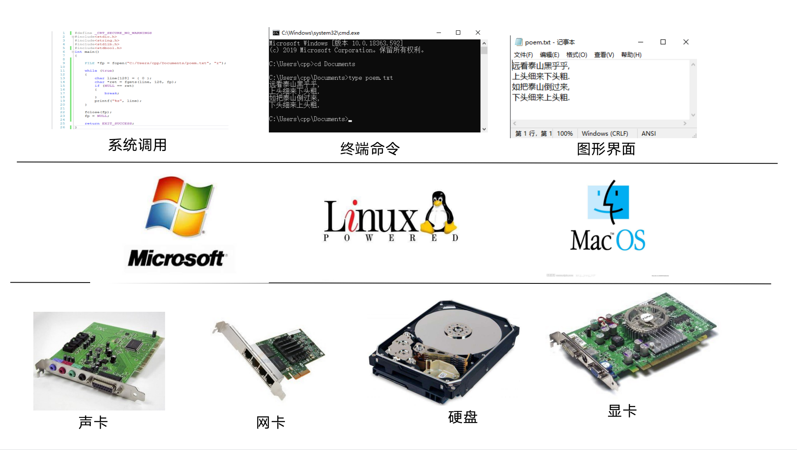

### 1.4.2 用户态和内核态

* 在现代操作系统中，`用户态（User Mode）`和`内核态（Kernel Mode）`是两种不同的执行模式，它们对系统资源的访问权限有着本质的区别。这种区分是为了提供一个稳定和安全的运行环境，防止用户程序直接操作硬件设备和关键的系统资源，从而可能引起系统的不稳定或安全问题。


- 内核态（Kernel Mode） VS 用户态（User Mode）：

| 类型   | 内核态（Kernel Mode）                                        | 用户态（User Mode）                                          |
| :----- | :----------------------------------------------------------- | :----------------------------------------------------------- |
| 权限   | 内核态是操作系统代码运行的模式，拥有访问系统全部资源和执行硬件操作的`最高权限`。在这种模式下，操作系统的核心部分可以直接访问内存、硬件设备控制、管理文件系统和网络通信等。 | 用户态是普通应用程序运行的模式，具有`较低`的系统资源访问权限。在用户态，程序不能直接执行硬件操作，必须通过操作系统提供的接口（即系统调用）来请求服务。 |
| 安全性 | 由于内核态具有如此高的权限，因此只有可信的、经过严格审查的操作系统核心组件才被允许在此模式下运行。这样可以保护系统不被恶意软件破坏。 | 用户态为系统提供了一层保护，确保用户程序不能直接访问关键的系统资源，防止系统崩溃和数据泄露。 |
| 功能   | 内核态提供了`系统调用`的接口，允许用户态程序安全地请求使用操作系统提供的服务，比如：文件操作、网络通信、内存管理等。 | 用户态保证了操作系统的稳定性和安全性，同时也使得多个程序可以在相互隔离的环境中同时运行，避免相互干扰。 |

> [!NOTE]
>
> - ① 操作系统通过用户态和内核态的分离，实现了对系统资源的保护和控制。
> - ② 当用户程序需要进行文件读写、网络通信或其他需要操作系统介入的操作时，会发生从用户态到内核态的切换。这通过系统调用（System Call）实现，系统调用是用户程序与操作系统内核通信的桥梁。
> - ③ 执行完毕后，系统从内核态返回用户态，继续执行用户程序。
> - ④ 用户态和内核态的这种分离设计是现代操作系统中实现安全、稳定运行的关键机制之一。


* 示例：

```java {25}
import java.io.IOException;
import java.nio.file.Files;
import java.nio.file.Path;
import java.nio.file.Paths;
import java.util.List;

public class Demo {
    public static void writeFile(String filePath, String content) {
        Path path = Paths.get(filePath);
        try {
            Files.write(path, content.getBytes());
        } catch (IOException e) {
            e.printStackTrace();
        }
    }
    public static void main(String[] args){
        // 用户态
        int a = 10;                                 
        int b = 20;                                 
        int c = a + b;                              
        string filePath = "c:/demo.txt";           
        string txt = a + b + c;                    
        
        // 从用户态切换到内核态完成文件写入
        writeFile(filePath, a);                     
        
        // 从内核态切换回用户态
        System.out.println(a);                      
        System.out.println(b);                      
        System.out.println(c);                     
    }
}
```

### 1.4.3 ISA、ABI 和 API

- ISA 、ABI 和 API 的参考模型如下：


* 在底层，硬件模型以指令集架构 （ISA） 表示，该架构定义了处理器、寄存器、存储器和中断管理的指令集。ISA 是硬件和软件之间的接口，对于操作系统 （OS） 开发人员 （System ISA） 和直接管理底层硬件的应用程序 （User ISA） 的开发人员来说非常重要。

> [!NOTE]
>
> - ① ISA 是计算机体系结构中定义的一组指令，它规定了处理器能够执行的操作。ISA 包括指令的编码、寄存器的使用、内存访问模式等。不同的处理器可能有不同的 ISA，例如：x86、ARM、MIPS 等。
> - ② 在设计一个新的操作系统时，开发者需要确保操作系统能够支持特定的 ISA ，以便在特定的硬件上运行。例如：如果操作系统旨在运行在 ARM 架构的处理器上，那么它必须能够理解和执行 ARM ISA 定义的指令集。

- 应用程序二进制接口 （ABI） 将`操作系统层`与由操作系统管理的`应用程序`和`库`分开。ABI 涵盖了低级数据类型、对齐方式和调用约定等详细信息，并定义了可执行程序的格式。系统调用在此级别定义。此接口允许应用程序和库在实现相同 ABI 的操作系统之间移植。

> [!NOTE]
>
> - ① ABI 是指在二进制级别上，应用程序与操作系统、库或应用程序的不同部分之间的接口。它定义了数据类型的大小、布局、对齐方式，以及函数调用的约定（如参数如何传递、返回值如何处理等）。ABI 确保了编译后的二进制文件能够在特定的操作系统和硬件平台上正确地运行。
> - ② 在 windows 上的应用程序的运行格式是：`PE`（portable executable）格式、`.dll` （dynamic link library）格式和 `.lib` 格式；而在 Linux 上的应用程序的运行格式是：`ELF`（executable and linking format）格式、`.so` （shared object）格式和 `.a` 格式。
> - ③ 在 Linux 中可以通过 `file /bin/ls` 命令查看指定可执行应用程序的 ABI 格式；从而也可以论证，在 Windows 上可以运行的程序，在 Linux 上运行不了。
> - ④ 当开发者在 Linux 系统上编写 C 语言程序，并使用特定的编译器（如：GCC）编译时，编译器会遵循 Linux 平台的 ABI 规范来生成二进制文件。这样，生成的可执行文件就可以在任何遵循相同 ABI 规范的 Linux 系统上运行。
> - ⑤ 如果一个应用程序需要跨平台（操作系统）运行，就需要使用`一套代码，多平台编译`的方式（针对 C 或 C++ 等），即：相同的源代码，在不同平台（操作系统）上使用特定平台的编译器（如：GCC）来分别编译成符合自己平台的 ABI 规范的二进制文件。

- 最高级别的抽象由应用程序编程接口 （API） 表示，它将`应用程序`连接到`库`或`底层操作系统`。

> [!NOTE]
>
> - ① API 是一组预定义的函数、协议和工具，用于构建软件和应用程序。API 允许不同的软件系统相互交互，它定义了软件组件之间如何相互通信。API 可以是库、框架、协议或服务。
> - ② 在 Web 开发中，开发者可能会使用 JavaScript 的 Fetch API 来与服务器进行通信，获取数据或提交表单。这个 API 提供了一种标准化的方式来发送 HTTP 请求和处理响应，而不需要开发者关心底层的网络协议细节。

### 1.4.4 系统调用（System Call）和函数库（Library Call）

* 在现代操作系统中，应用程序都不能直接作用于硬件，而是运行在操作系统之上。

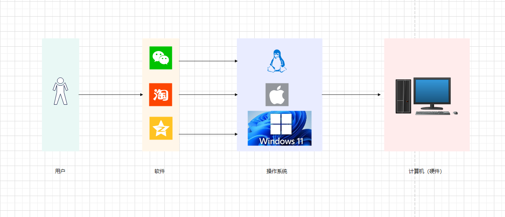

- 并且，在上文的图示中，我们也会看到`系统调用（System Call）`和`函数库（Library Call）`的身影，如下：

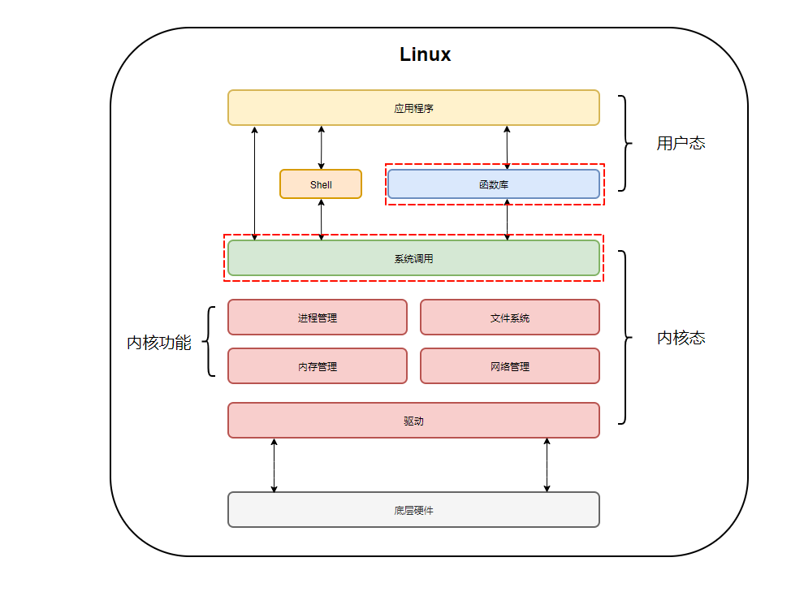

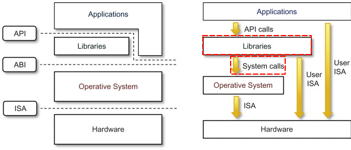


* 其实，`系统调用（System Call）`和`函数库（Library Call）`的区别如下：

| 类型     | 系统调用（System Call）                                      | 函数库（Library Call）                                       |
| :------- | :----------------------------------------------------------- | :----------------------------------------------------------- |
| 定义     | 系统调用是操作系统提供给程序员的一组接口，这些接口允许用户空间的程序请求操作系统内核提供的服务，比如文件操作、进程控制、通信和内存管理等。 | 函数库调用是指使用高级语言编写的一组预先编译好的函数，这些函数实现了一些常用的功能，比如：字符串处理、数学计算等。程序员可以在自己的程序中直接调用这些函数，而无需重新实现它们。 |
| 权限     | 执行系统调用时，会从用户态切换到内核态。这是因为系统调用涉及到访问受保护的系统资源，这些操作必须由操作系统控制以确保系统的稳定性和安全性。 | 函数库调用通常在用户态执行，不涉及到用户态与内核态之间的切换。它们直接使用操作系统通过系统调用提供的服务，或者完全在用户空间内完成计算，不需要操作系统介入。 |
| 性能开销 | 由于涉及到用户态与内核态之间的切换，系统调用的执行成本相对较高。因此，频繁的系统调用可能会影响程序的性能。 | 相对于系统调用，函数库调用的性能开销较小。因为它们通常不涉及到模式切换，且执行的操作多在用户空间完成。 |
| 示例     | open()，read()，write()，fork()，exec() 等 UNIX/Linux 系统调用。 | C 标准库中的 printf() 等函数；数学库中的 sin()，cos() 等函数。 |

> [!NOTE]
>
> - ① **执行层级**：系统调用直接与操作系统内核交互，执行更底层的操作；而函数库调用运行在用户空间，通常使用系统调用来实现其功能。
> - ② **性能开销**：系统调用由于涉及到用户态与内核态的切换，性能开销相对较大；函数库调用则因为主要在用户态执行，性能开销较小。
> - ③ **使用目的**：系统调用提供了访问操作系统资源和服务的能力；函数库调用则提供了方便、高效执行常见任务的手段。


# 第二章：初识计算机语言

## 2.1 计算机语言是什么？

* `人类语言`是人和人之间用于沟通的一种方式，例如：中国人和中国人之间使用普通话沟通，而中国人和美国人交流，则可以使用英语。

> [!NOTE]
>
> * ① 中文有自己的`固定格式`和`固定词汇`（即：`语法规则`），英文也是自己的`固定格式`和`固定词汇`（即：`语法规则`）；同样的道理，法语、韩国等各种`人类语言`都有自己的`固定格式`和`固定词汇`（即：`语法规则`）。
> * ② 在和别的国家的人进行交流的时候，我们必须正确的表达，对方才会理解我们；否则，如果不熟悉对方国家的语言的语法规则，乱用语法规则，可能会贻笑大方，如：中文中的`望其项背`原指看见对方的背影，形容差距不大，能赶上；但是，很多人却认为这是形容遥不可及或难以企及的目标。
> * ③ 就算和本国家的人进行交流的时候，我们也必须正确的表达，对方才会理解我们；否则，如果乱用语法规则，可能也会让对方感觉奇怪，听不懂我们的意思，如：`借我 5000 RMB 买 iphone` 或者 `5000 RMB 我买 iphone 借`。

* `计算机编程语言`是人和计算机交流的方式。人们可以使用`编程语言`对计算机下达`命令（指令）`，让计算机完成人们需要的功能。

> [!NOTE]
>
> * ① 计算机语言也有自己`固定格式`和`固定词汇`（即：`语法规则`），我们必须学习其语法规则，才能控制计算机，让计算机完成我们所需要的功能。
> * ② 计算机语言有很多种，如：C、C++、Java、Go、JavaScript、Python、Scala 等。

## 2.2 为什么要学习计算机语言？

* 编程语言到底是什么？编程语言就是由文字和符号组成的，如：

```c
#include <stdio.h> // 这是编译预处理指令

int main() { // 定义主函数

    printf("你好，世界！！！"); // 输出所指定的一行信息

    return 0;  // 函数执行完毕时返回函数值0
}
```

* 编程语言就是用于控制计算机，让其完成我们需要的功能。而我们学习编程语言，其实就是学习这些文字和符号编写的规则。
* 因为 `CPU` 只能识别二进制的指令，而我们`编写`的程序叫做`源代码`，是人类能看懂；但是，计算机却不能识别。那么，我们就需要让计算机能识别我们编写的源程序，就需要将我们编写的源代码交给编译器程序，其会帮助我们将所编写的源代码转换为计算机能够识别的二进制指令。

> [!NOTE]
>
> 编译器就是运行在操作系统之上的程序，其作用就是用来将程序员编写的源代码转换为计算机能够识别的二进制指令。

* 如果我们用 `Java` 语言编写了程序（源代码），那么编写的程序也是不能直接运行的，需要通过 `Java` 语言的编译器将 `Java` 程序编译为计算机能够识别的二进制指令。
* 如果我们用 `Python` 语言编写了程序（源代码），那么编写的程序也是不能直接运行的，需要通过 `Python` 语言的编译器将 `Python` 程序编译为计算机能够识别的二进制指令。
* ……

> [!NOTE]
>
> 总结：无论我们学习任何一门编程语言，想要将程序运行起来，都必须做如下的两件事情：
>
> * ① 学习该语言的文字和符号编写的规则，即：`语法规则`。
> * ② 需要在操作系统上安装对应编程语言的`编译器`程序，将源程序编译为计算机能够识别的二进制指令。

## 2.3 计算机语言简史

### 2.3.1 机器语言（相当于人类的石器时代）

* 1946 年 2 月 14 日，世界上第一台计算机 `ENIAC` 诞生，使用的是最原始的`穿透卡片`。


* 这种卡片使用的是用`二进制代码`表示的语言，和人类语言差别极大，这种语言就称为`机器语言`，如：

```txt
0000,0000,000000010000 代表 LOAD A, 16
0000,0001,000000000001 代表 LOAD B, 1
0001,0001,000000010000 代表 STORE B, 16
```

* 这种语言本质上是计算机能识别的`唯一语言`，人类很难理解；换言之，当时的程序员 99.9% 都是异类！！！

> [!WARNING]
>
> * ① 不同类型（CPU 架构，如：x86_64、arm 等）的处理器有不同的机器语言指令集，指令集架构（ISA）决定了机器语言的具体形式。
> * ② 换言之，机器语言与特定硬件架构紧密相关，机器语言程序几乎没有可移植性。

### 2.3.2 汇编语言（相当于人类的青铜&铁器时代）

* `汇编语言`使用`助记符`（如：MOV、ADD、SUB）代替二进制操作码，使程序更易于人类编写和理解；因此，`汇编语言`也被称为`符号语言`。


* 汇编语言的`优点`是能编写`高效率`的程序；但是，`缺点`和机器语言没什么不同，汇编语言同样`依赖于具体的计算机架构（面向机器）`，程序不具备跨平台的可移植性。

> [!WARNING]
>
> * ① 汇编语言，目前仍然应用于工业电子编程领域、软件的加密解密、计算机病毒分析等。
> * ② 汇编语言是编程语言的拓荒年代，它非常底层，直接和计算机硬件打交道，开发效率低，学习成本高。

### 2.3.3 高级语言（相当于人类的信息时代）

* `高级语言`是一种`接近于人们使用习惯`的程序设计语言。`它允许程序员使用接近日常英语的指令来编写程序`，程序中的符号和算式也和`日常使用的数学公式`差不多，接近于自然语言和数学语言，容易被人们掌握。

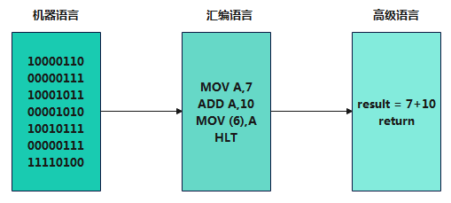

* 高级语言`独立于计算机硬件`，有一定的通用性；计算机不能直接识别和执行用高级语言编写的程序，需要使用`编译器`或`解释器`转换为机器语言，才能被计算机识别和执行。

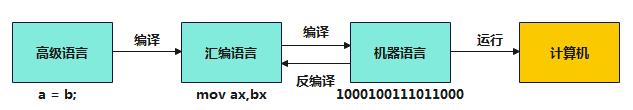

> [!NOTE]
>
> * ① 普遍使用的高级编程语言，有：C、C++、Java、Python、C#、JavaScript、Go、SQL 等。
> * ② C 语言是“[面向过程](https://zh.wikipedia.org/wiki/%E8%BF%87%E7%A8%8B%E5%BC%8F%E7%BC%96%E7%A8%8B)”的编程语言，已经脱离了计算机硬件，可以用来设计和开发`中等`规模的程序。
> * ③ Java、C++、Python、C# 等都是“[面向对象](https://zh.wikipedia.org/wiki/%E9%9D%A2%E5%90%91%E5%AF%B9%E8%B1%A1%E7%A8%8B%E5%BA%8F%E8%AE%BE%E8%AE%A1)”的编程语言（它们在“[面向过程](https://zh.wikipedia.org/wiki/%E8%BF%87%E7%A8%8B%E5%BC%8F%E7%BC%96%E7%A8%8B)”的基础上又增加了很多概念），可以用来设计和开发`中大型`规模的程序。
>

> [!IMPORTANT]
>
> * ① C 语言出现的时候，已经度过了编程语言的拓荒年代，具备了现代编程语言的特性，但是这个时候还没有出现“[软件危机](https://zh.wikipedia.org/wiki/%E8%BD%AF%E4%BB%B6%E5%8D%B1%E6%9C%BA)”，人们没有动力去开发更加高级的语言，所以也没有太复杂的编程思想。
> * ② 之后出现的“[面向对象](https://zh.wikipedia.org/wiki/%E9%9D%A2%E5%90%91%E5%AF%B9%E8%B1%A1%E7%A8%8B%E5%BA%8F%E8%AE%BE%E8%AE%A1)”的编程思想解决了一部分在“[软件危机](https://zh.wikipedia.org/wiki/%E8%BD%AF%E4%BB%B6%E5%8D%B1%E6%9C%BA)”上的窘境。

### 2.3.4 总结

* 编写语言的对比，如下所示：

| 类别         | 特征                               | 优点                                             | 缺点                                                         | 示例                |
| :----------- | :--------------------------------- | :----------------------------------------------- | :----------------------------------------------------------- | :------------------ |
| **机器语言** | 直接由计算机执行的二进制代码       | 执行速度快                                       | 编写困难，可读性差，与具体硬件强绑定                         | 二进制代码          |
| **汇编语言** | 用助记符代替二进制代码的低级语言   | 相对机器语言更易编写和理解，允许直接控制硬件资源 | 依然需要了解硬件，不够抽象，与具体硬件或平台相关             | MOV，ADD 等助记符   |
| **高级语言** | 接近人类语言，提供了更高层次的抽象 | 易于编写和维护，可移植性好，支持多种编程范式     | 需要通过编译器或解释器转换为机器语言，可能存在一定的性能损失 | C，Java， Python 等 |

> [!IMPORTANT]
>
> - ① 使用机器语言进行编程，对于程序员来说，简直就是噩梦，尤其当功能比较多，程序比较大的时候，不但编写麻烦，需要频繁查询指令手册，而且排查错误非常麻烦，要直接面对一堆二进制数据，想想都令人崩溃（上古程序员，可能真的不是“人”，而是“异类”）。此外，使用二进制指令编程，步骤非常繁琐，要考虑各种边界情况和底层问题，开发效率十分低下。
> - ② 这就倒逼程序员开发出了编程语言，提供自己的生产力，如：汇编语言、C 语言、C++ 语言、Java 语言、Go 语言等等，都是在逐步`提高开发效率`。至此，编程终于不再是只有极客才能做的事情，不怎么了解计算机的初学者在经过一定时间的训练后也可以编写出有模有样的程序。
> - ③ 在实际开发中，随着计算机科学的发展，现代化的高级编程语言，如：C++ 语言、Java 语言、Go 语言等，因其强大的表达能力、良好的可移植性和易用性，成为了日常软件开发的主流选择。


# 第三章：初识 C 语言

## 3.1 C 语言究竟是一门怎样的编程语言？

* 对于绝大多数程序员而言，C 语言是学习编程的第一门语言，很少有不了解 C 语言的程序员。

> [!NOTE]
>
> 许多著名编程语言的创造者和计算机科学领域的大佬都有学习和使用过 C 语言，如：詹姆斯·高斯林（James Gosling，Java 之父），比雅尼·斯特劳斯特鲁普（Bjarne Stroustrup，C++ 之父），吉多·范罗苏姆（Guido van Rossum，Python 之父），林纳斯·托瓦兹（Linus Torvalds，Linux 之父）等。

* C 语言除了能让我们了解编程的相关概念，带领我们走进编程的大门，还能让我们明白程序的运行原理，如：
  * ① 计算机的各个部件是如何协同工作的？
  * ② 程序在内存中是一种怎样的状态？
  * ③ 程序在计算机中到底是如何执行的，以及它的生命周期是什么？
  * ④ 操作系统和应用程序之间，又有着怎样的爱恨情仇？
  * ⑤ ...

* 这些底层知识决定了我们的发展高度，也决定了我们的职业生涯。如果我们希望能在计算机行业中长远的发展，就必须学习这些相关的底层知识。

> [!IMPORTANT]
>
> 这些底层知识，包括不限于：`数据结构和算法`、`计算机组成原理`、`操作系统`、`计算机网络`、`设计模式`以及`编译原理`。
>
> ::: details 点我查看 具体细节
>
> * 数据结构和算法：主要研究数据的组织方式和处理方法，包括：线性表、树、图等数据结构，以及基本的算法思想和分析方法。
>
> * 计算机组成原理：主要研究计算机系统的硬件组成和工作原理，包括：数字电路、存储器、中央处理器等内容。
> * 操作系统：主要研究计算机系统的软件组成和工作原理，包括：进程/线程/并发（重点）、内存布局和内存管理（重点）、文件系统和磁盘 IO 等内容，以及基本的操作系统概念和设计思路。
> * 计算机网络：主要研究计算机之间的通信原理和协议，包括：网络体系结构（OSI 模型）、传输协议、网络安全等内容，以及基本的网络概念和技术。重点学习 TCP/IP 协议栈、socket 通信（三/四次握手、select、poll、epoll）、HTTPS/HTTP、长链接等内容。
> * 设计模式：是软件设计中常见问题的通用解决方案。不过，在 C 语言中通常是没有的，因为其是面向过程的编程语言，而 C++ 和 Java 等面向对象的编程语言是有设计模式的。
> * 编译原理（了解即可）：主要研究如何将高级编程语言转换为机器语言，有词法分析、语法分析、语义分析、中间代码生成、优化、代码生成等步骤，了解即可。
>
> :::

* C 语言的概念少，词汇少，只包含了基本的编程元素，相对比较简单。对于初学者来说，学习 C 语言的时间短，成本小。

> [!NOTE]
>
> * ① 很多人之所以觉得 C 语言难，就是因为栽倒在 C 语言的指针那边（相对比其他的现代化编程语言而言，C 语言的指针确实足够底层和麻烦，需要掌握的细节很多）。
> * ② 但是，一旦有所突破，学习之路就会一马平川。

## 3.2 为什么要学习 C 语言？

* ① `C 语言具有可移植好、跨平台的特点`：用 C 语言编写的代码可以在不同的操作系统和硬件平台上编译和运行。

> [!NOTE]
>
> * ① C 语言的最原始的设计目的，就是为了将 Unix 操作系统移植到其他的计算机架构上，这使得它从一开始就非常注重可移植性。
> * ② 这边所说的 C 语言的可移植性，是和汇编语言相比的；如果 C 语言和现代化的高级编程语言相比，可移植性还是很差的，如：Java 的口号是“一次编译，到处运行”，Go 的口号是“一次编译，到处执行”。

* ② `C 语言在许多领域应用广泛`。
  * `操作系统`：C 广泛用于开发操作系统，如：Unix、Linux 和 Windows。
  * `嵌入式系统`：C 是一种用于开发嵌入式系统（如：微控制器、微处理器和其它电子设备）的流程语言。
  * `系统软件`：C 用于开发设备驱动程序、编译器和汇编器等系统软件。
  * `网络`：C 语言广泛用于开发网络应用程序，例如：Web 服务器、网络协议和网络驱动程序。
  * `数据库系统`：C 用于开发数据库系统，例如：Oracle、MySQL 和 PostgreSQL 。
  * `游戏`：由于 C 能够处理低级硬件交互，因此经常用于开发计算机游戏。
  * `人工智能`：C 用于开发人工智能和机器学习的应用程序，例如：神经网络和深度学习算法。
  * `科学应用`：C 用于开发科学应用程序，例如：仿真软件和数值分析工具。
  * `金融应用`：C 用于开发股票市场分析和交易系统等金融应用。
* ③ C 语言能够直接对硬件进行操作、管理内存以及和操作系统对话，这使得它是一种非常接近底层的语言，非常适合`写需要和硬件交互、有极高性能要求`的程序。

> [!NOTe]
>
> * C 语言毕竟诞生的时间非常早（20 世纪 70 年代），属于 70 后了，有点落后于现在的时代，虽然执行效率高（仅次于汇编语言），但是开发效率低。
> * 随着时间的推移，人们在 C 语言的基础上增加了面向对象的机制（[软件危机](https://zh.wikipedia.org/wiki/%E8%BD%AF%E4%BB%B6%E5%8D%B1%E6%9C%BA)），形成了一门新的编程语言，它的名字是 C++ 。
> * 但是，C++ 的特性实在是太多了（因为 C++ 兼容 C，并增加了很多自己独有的特性，可以是当今最复杂的编程语言，没有之一），于是人们在 C++ 的基础上，删减了一些非必要的特性，就形成了 Java 和 C# ，也可以认为 Java 和 C# 是 C++--。
> * 当然，近年来，Go 语言也很火，它的设计者之一就是  `Unix` 操作系统的的开发者`肯·汤姆森`（Ken Thompson），Go 诞生的背景据说是`肯·汤姆森`（Ken Thompson）在 C++ 委员会在为其演讲 C++ 新特性的时候，觉得 C++ 新特性太多太复杂，于是就开发了 Go 语言；所以，Go 语言中有很多 C 语言的身影（含有 GC 的 C 语言）。
> * 其实，在 C 语言之后的许多编程语言，或多或少都参考了 C 语言；所以，编程界流传了一句话：汇编生 C ，C 生万物。

* ④ `学习 C 语言有助于快速上手其他编程语言`，如：C++（原先是 C 语言的一个扩展，在 C 语言的基础上嫁接了面向对象编程思想）、C#、Java 等，这些语言都继承或深受 C 语言的影响和启发。
* ⑤ C 语言长盛不衰。`C 语言至今，依然是最广泛使用、最流行的编程语言之一`，包括很多大学将 C 语言作为计算机教学的入门语言，拥有庞大而活跃的用户社区，这意味着有许多资源和库可供开发人员使用。
* ⑥ C 语言`容易学习`，适合入门。和 Java、C++、Python 等更加现代化的高级编程语言相比，C 语言涉及的概念少，附带的标准库小，整体比较简单，容易学习，非常适合初学者入门。

## 3.3 计算机语言排行榜

* [TIOBE](https://www.tiobe.com/tiobe-index/) 是一个流行编程语言排行，每月更新。排名权重基于世界范围内工程师数量，Google、Bing、Yahoo! 、Wikipedia、Amazon、Youtube 和百度这些主流的搜索引擎，也将作为排名权重的参考指标。

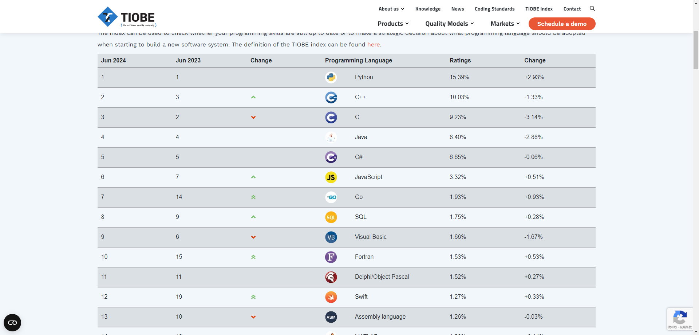

* 计算机语言走势图：

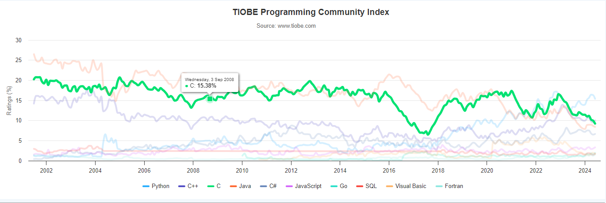

## 3.4 C 语言到底能做什么？

### 3.4.1 概述

* 我们知道，这个世界上的编程语言太多太多。其中，最流行的编程语言就是 [TOBIE](https://www.tiobe.com/tiobe-index/) 榜单上的前 50 名。
* 从应用的范围上来讲，编程语言大致可以分为以下两类，如下所示：
  * ① `通用型编程语言`：这些语言设计的目的是能够用于开发多种类型的应用程序，不局限于某个特定领域。它们通常拥有丰富的库和框架支持，可以应用于系统编程、应用开发、Web开发、数据分析等多个领域。
  * ② `专用型编程语言`：这些语言是为了解决特定领域的问题而设计的，通常在该领域中表现出色。虽然它们可以在一定程度上用于其他领域，但其核心设计和优化是针对某个特定应用场景的。

* 常见的`专用型编程语言`，如下所示：

| 专用型编程语言 | 描述                                                         |
| -------------- | ------------------------------------------------------------ |
| SQL            | 专门用于数据库查询和管理，尽管可以嵌入其他编程语言中，但其主要应用是数据库操作。 |
| R              | 主要用于统计分析和数据可视化，广泛应用于数据科学和研究领域。 |
| MATLAB         | 主要用于数值计算、算法开发和数据可视化，广泛应用于工程和科学领域。 |
| VHDL/Verilog   | 用于硬件描述和数字电路设计，主要应用于电子工程领域。         |

* 常见的`通用型编程语言`，如下所示：

| 通用型编程语言 | 描述                                                         |
| -------------- | ------------------------------------------------------------ |
| Python         | 广泛应用于Web开发、数据科学、自动化脚本、人工智能等。        |
| Java           | 用于企业级应用、移动应用开发（Android）、Web 开发等。        |
| C++            | 可用于系统编程、游戏开发、嵌入式系统等多个领域。             |
| JavaScript     | 最初用于 Web 前端开发，现在也广泛用于服务器端（Node.js）、桌面应用开发（Electron）等。 |

> [!NOTE]
>
> C 语言是一门通用型的编程语言，并没有针对某个领域进行优化。但是，C 语言也有很多常见的应用领域。

### 3.4.2 C 语言的常见应用领域

* C 语言的常见应用领域，如下所示：
  * ① 单片机或嵌入式开发：单片机通常是一个集成度较高的微控制器，资源有限，如：家电控制、自动化设备、传感器数据采集、智能玩具、汽车电子。嵌入式系统是一个计算机系统，嵌入在更大设备中，用来执行专门的任务。它通常包含硬件和软件两部分，具有专用性、实时性、资源受限等特点，如：消费电子（智能手机、智能手表等）、医疗设备、工业控制系统、汽车电子系统（ECU、ABS）、物联网设备等。
  * ② ~~上位机开发（桌面软件开发）~~：其实，这部分的市场已经被其它编程语言蚕食了，如：C++ 的 QT、GTK，Java 的 Swing 、JavaFx，Dart 的 Flutter ，因为 C 语言太过于底层，本身不直接支持跨平台，而且没有丰富的库和框架支持。
  * ③ 系统组件开发：
    * 基础组件，如：文件系统、进程管理、用户界面（CLI + GUI）等。
    * 核心算法，如：加密/安全算法（MD5、SHA、AES、RSA、SSL）、调度算法（进程和线程调度、内存页面置换）、LZ 压缩算法、CRC 等数据校验算法、随机数生成算法等。
    * 硬件驱动，如：声卡驱动、显卡驱动、网卡驱动、蓝牙驱动、键盘和鼠标驱动、扫描仪驱动、打印机驱动、USB 驱动等。
    * 通信协议，如：TCP/IP 协议族（UDP、DNS、路由选择）、HTTP/HTTPS 、SMTP/POP3/IMAP、FTP、NFC 等。
  * ④ 开发操作系统：这是 C 语言的初衷，它就是为开发操作系统而生的，如：UNIX 内核、Linux 内核以及 Windows 内核，主要就是使用 C 语言开发。
  * ⑤ 开发其它编程语言：
    * 有些编程语言的编译器（解释器）和标准库就使用 C 语言开发，如： Python、PHP、Rust、Perl。
    * 有些编程语言是在 C 语言的基础上进行的扩展，如： C++、Objective-C、Swift。
  * ⑥ 信号处理：C 语言在电气工程领域也有很多用途，它可以使用信号处理算法来管理微处理器、微控制器等集成电路。
  * ⑦ 音视频处理：C 语言的速度非常快，能够快速地对音频和视频数据进行处理。音频和视频数据通常比较大，需要高效的算法和数据结构来处理，而 C 语言运行速度非常快，能够及时处理这些数据。C 语言提供了丰富的底层库和工具，如：FFmpeg、OpenCV 等，这些库和工具可以方便地对音频和视频数据进行编码、解码、剪辑、处理和转换等操作。
  * ⑧ 数据库开发：数据库是软件领域的基础设施，它的性能直接影响整个应用程序的运行效率，所以必须使用一种高效的语言进行开发。使用 C 语言开发的数据库有：MySQL、SQLite、PostgreSQL 等。
  * ⑨ ...

> [!IMPORTANT]
>
> 虽然 C 语言的开发场景貌似看起来很多；但是，使用 C 语言的场景几乎就是：底层/系统开发 + 关键组件/模块的开发 + 贴近硬件的开发，这些开发场景非常关注运行效率，或者响应时间，或者硬件资源。

## 3.5 不学 C 语言，行吗？

* C 语言相比于其它的现代化高级编程语言而言，如：Java、Go 等，实在是太老了；如果不打算搞嵌入式开发，即便学了，一时半会也用不上。但是，几乎所有大学的计算机/软件专业都将 C 语言作为必修课，这又是为什么呢？
* 其实，是因为 C 语言是一门基础语言，很多其它的课程都依赖 C 语言。如果你不了解 C 语言，很多课程你是理解不了的，如下所示：
  * ① 编译原理课程通常是以 C 语言为例进行讲解，因为 C 语言的编译过程相对简单、规范和透明，适合教学。
  * ② 数据结构课程通常也是使用 C 语言进行编程，因为 C 语言比较底层，能够让大家看到数据结构的各种细节。另外，数据结构是一种被频繁调用的组件，必须要追求效率，C 语言再合适不过了。
  * ③ 学习操作系统原理（内存、进程、线程、通信等）也要具备 C 语言基础，否则是学不明白的。
  * ...
* C 语言是一门面向计算机的语言，它能帮助我们快速了解底层；而其它的高级语言（Python、Java、C# 等）是面向用户的，它能让我们快速上手，搞出点实用的工具来，比如：桌面软件、网站、APP 等。

> [!NOTE]
>
> * ① 借助 C 语言学习原理，相当于修炼内功；使用其它语言开发程序，相当于精通招式。
> * ② 一个既有扎实“内功”又精通“招式”的程序员，无疑能够更好地应对各种编程挑战。

* 从整体上讲，计算机软件大概可以分为两种：
  - 一种是基础设施，如：操作系统、数据库、浏览器、云计算系统、大数据系统、编译器/编程语言、通信协议、区块链、标准库/运行库、算法实现等。
  - 一种是应用软件，如：桌面软件、APP、网站、小程序等。

> [!IMPORTANT]
>
> * ① 内功不扎实的话，开发一般的应用软件可能没什么问题。但是，如果想要开发高性能的软件，或者开发基础设施，那是绝对是不行的。
> * ② 万丈高楼平地起，勿在浮沙筑高台！！！


# 第四章：C 语言的历史

## 4.1 起源

* C 语言是贝尔实验室的 `肯·汤姆森`（Ken Thompson）和`丹尼斯·里奇`（Dennis Ritchie） 等人开发的 UNIX 操作系统的“副产品”。 `肯·汤姆森`独自编写出 UNIX 操作系统的最初版本，这套系统运行在 `DEC PDP-7` 计算机上。这款早期的小型计算机仅有 8KB 内存（毕竟那是在 1969 年）。

> [!NOTE]
>
> ::: details 点我查看 `肯·汤姆森`、`丹尼斯·里奇`以及 `PDP-7 计算机`
>
> * ① `肯·汤姆森`（Ken Thompson）和`丹尼斯·里奇`（Dennis Ritchie）：
>
> 
>
> * ② PDP-7 计算机：
>
> 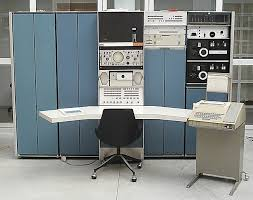
>
> :::

* 与同时代的其他操作系统一样， UNIX 系统最初也是用`汇编语言`编写的。用汇编语言编写的程序往往难以调试和改进， UNIX 系统也不例外。 `肯·汤姆森`（Ken Thompson）意识到需要用一种更加高级的编程语言来完成 UNIX 系统未来的开发，于是他设计了一种小型的 `B` 语言。 `肯·汤姆森`（Ken Thompson）的 `B` 语言是在 `BCPL` 语言（ 20 世纪 60 年代中期产生的一种系统编程语言）的基础上开发的，而 `BCPL`语言又可以追溯到最早（且影响最深远）的语言之一 `Algol 60` 语言。
* 不久， `丹尼斯·里奇`（Dennis Ritchie）也加入到 UNIX 项目中，并且开始着手用 `B` 语言编写程序。 1970 年，贝尔实验室为 UNIX 项目争取到一台 PDP-11 计算机。

> [!NOTE]
>
> ::: details 点我查看 `PDP-11 计算机`
>
> 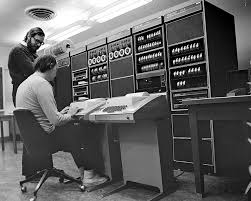
>
> :::

* 当 `B` 语言经过改进并能够在 PDP-11 计算机上成功运行后， `肯·汤姆森`（Ken Thompson）用 `B` 语言重新编写了部分 UNIX 代码。
* 到了 1971 年， `B` 语言已经明显不适合 PDP-11 计算机了，于是  `丹尼斯·里奇`（Dennis Ritchie）着手开发 `B` 语言的升级版。
* 最初，他将新开发的语言命名为 `NB` 语言（意为“New B”），但是后来新语言越来越偏离 `B` 语言，于是他将其改名为 `C` 语言。
* 到了 1973 年， C 语言已经足够稳定，可以用来重新编写 UNIX 系统了。

> [!NOTE]
>
> * ① 改用 C 语言编写程序有一个非常重要的好处：可移植性。
> * ② 只要为贝尔实验室的其他计算机编写 C 语言编译器，他们的团队就能让 UNIX 系统也运行在那些机器上。换言之，C 语言最初是作为 Unix 系统的开发工具而发明的，它的初衷非常简单，就是被设计成一种非常高效的、可以操作硬件的系统级编程语言，然后帮助团队开发 Unix 操作系统。

## 4.2 标准化

* C 语言在 20 世纪 70 年代（特别是 1977 年到 1979 年之间）持续发展。这一时期出现了第一本有关 C 语言的书。 `布莱恩·克尼汉`（Brian Kernighan） 和 `丹尼斯·里奇`（Dennis Ritchie） 合作编写的《 C 程序设计语言》一书于1978 年出版，并迅速成为 C 程序员必读的“圣经”。因为当时没有 C 语言的正式标准，所以这本书就成了事实上的标准，编程爱好者把它称为 `K&R` 或者“白皮书”。

> [!NOTE]
>
> ::: details 点我查看 `布莱恩·克尼汉`和 `丹尼斯·里奇`
>
> 
>
> :::

* 在 20 世纪 70 年代， C 程序员相对较少，而且他们中的大多数人是 UNIX 系统的用户。然而，到了 20 世纪 80 年代， C 语言已不再局限于 UNIX 领域。运行在不同操作系统下的多种类型的计算机都开始使用 C 语言编译器，特别是迅速壮大的 IBM PC 平台也开始使用 C 语言。  

> [!NOTE]
>
> ::: details 点我查看 Unix、Windows、Linux
>
> 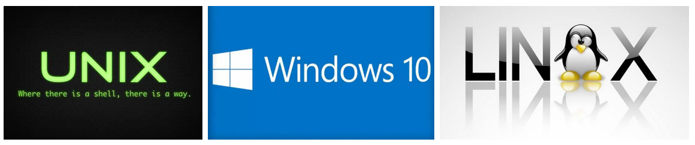
>
> :::

* 随着 C 语言的迅速普及，一系列问题接踵而至。编写新的 C 语言编译器的程序员都用 `K&R` 作为参考。但遗憾的是， `K&R` 对一些语言特性的描述非常模糊，以至于不同的编译器常常会对这些特性做出不同的处理。而且， `K&R` 也没有对属于 C 语言的特性和属于 UNIX 系统的特性进行明确的区分。更糟糕的是， `K&R` 出版以后 C 语言仍在不断变化，增加了新特性并且去除了一些旧的特性。很快， C 语言需要一个全面、准确的最新描述开始成为共识。如果没有这样一种标准，就会出现各种“方言”，这势必威胁到 C 语言的主要优势——程序的可移植性。  

> [!NOTE]
>
> K&R C 的主要特性是：
>
> * ① 引入了基本的 C 语法和语义。
> * ② 没有标准库，I/O 操作依赖操作系统实现。
> * ③ 函数原型不强制参数类型检查，可以省略`void`关键字。

* 1983 年，在美国国家标准学会（ ANSI）的推动下，美国开始制订本国的 C 语言标准。经过多次修订， C语言标准于 1988 年完成并在 1989 年 12月正式通过，成为 ANSI 标准 X3.159-1989。1990 年，国际标准化组织（ ISO）通过了此项标准，将其作为 ISO/IEC 9899:1990 国际标准。我们把这一 C 语言版本称为 C89 或 C90，以区别于原始的 C 语言版本（经典 C）。

> [!NOTE]
>
> ANSI C / C89 / C90 的主要特性是：
>
> * ① **函数原型**：引入了函数原型，允许在函数声明中指定参数类型，增强了类型检查。
> * ② **标准库**：提供了`<stdio.h>`、`<stdlib.h>`、`<string.h>`等标准库，标准化了 I/O、字符串处理等常用功能。 
> * ③ **预处理指令**：增加了`#include`、`#define`等预处理指令。
> * ④ **const 和 volatile**：引入了`const`和`volatile`类型修饰符。

* 1995 年，C 语言发生了一些改变。

> [!NOTE]
>
> C95 的主要特性是：
>
> * ① **宽字符支持**：增加了对宽字符和多字节字符的支持，如：`<wchar.h>`、`<wctype.h>`。
> * ② **标准库增强**：增加了`wcsncpy`、`wprintf`等宽字符操作函数。
> * ③ **限制性修改**：修正了一些边缘情况的规范，没有对语言的语法作出大的改动。

* 1999 年通过的 ISO/IEC 9899:1999 新标准中包含了一些更重要的改变，这一标准所描述的语言通常称为 C99。由于存在两种标准，以前用于描述 C89 的 ANSI C、 ANSI/ISO C 和 ISO C 等术语现在就有了二义性。  

> [!NOTE]
>
> C99 的主要特性是：
>
> * ① **新数据类型**：引入了`long long int`（至少64位）和布尔类型`_Bool`。
> * ② **复合字面量**：允许在表达式中使用复合字面量，如`(int[]){1, 2, 3}`。
> * ③ **可变长数组**：函数内部可以定义长度为变量的数组，如`int arr[n];`。
> * ④ **单行注释**：支持`//`单行注释。
> * ⑤ **内联函数**：引入`inline`关键字，用于性能优化。
> * ⑥ **数学函数增强**：增加了`<complex.h>`，用于处理复数，以及`<tgmath.h>`模板化的数学函数。
> * ⑦ **可选的标识符限制**：引入`restrict`关键字，用于优化指针访问。

* 国际标准化组织在 2011 年通过的 C 语言标准是 ISO/IEC 9899:2011，这一标准所描述的 C 语言通常称为 C11。

> [!NOTE]
>
> C11 的主要特性是：
>
> * ① **多线程支持**：增加了`<threads.h>`库，提供线程、互斥锁、条件变量等多线程支持。
> * ② **原子操作**：引入`<stdatomic.h>`，支持原子操作，便于编写并发程序。
> * ③ **静态断言**：`_Static_assert`关键字用于在编译时进行断言检查。
> * ④ **匿名结构和联合**：支持匿名结构体和联合体，增强了结构的灵活性。
> * ⑤ **内存对齐**：`_Alignas`、`_Alignof`用于指定变量的内存对齐方式。
> * ⑥ **改进的 Unicode 支持**：增加了`char16_t`和`char32_t`类型，以支持UTF-16和UTF-32字符。
> * ⑦ **泛型选择**：`_Generic`关键字实现了有限的泛型编程。

* 国际标准化组织在 2017 年通过，并在 2018 年修正的 C 语言标准是 ISO/IEC 9899:2018，这一标准所描述的 C 语言通常称为 C17/C18。  

> [!NOTE]
>
> C17/C18 的主要特性是：
>
> * ① **修正和维护**：主要是一些错误修正，并没有引入新的语法或特性。
> * ② **稳定性提升**：进一步提升了 C 语言的稳定性，确保在不同编译器之间的兼容性。

* 国际标准化组织在 2023 年通过的 C 语言标准是 ISO/IEC 9899:2023，这一标准所描述的 C 语言通常称为 C23。  

> [!NOTE]
>
> C23 的主要特性是：
>
> * ① **部分保留字转换关键字**：C11 标准中的保留字：`_Alignas`、`_Alignof`、`_Bool`、`_Static_assert`、`_Thread_local` ，在 C23 标准中转为关键字：`alignas` 、`alignof`、`bool` 、`static_assert` 、`thread_local`。
> * ② **真正的布尔值**：`true` 和 `false` ；并且，`<stdbool.h>` 头文件也被废除了。
> * ③ **增强的数值类型支持**：引入了二进制浮点数类型，增加对较大整数和精确小数的支持。
> * ④ **改进的 Unicode 支持**：加强了对 Unicode 字符和字符串的支持，进一步提升跨平台兼容性。
> * ⑤ **改进的内存管理**：引入新的内存管理函数，如：`memccpy_s`、`memcpy_s`等安全版本。
> * ⑥ **简化代码编写**：增加了新的语法糖和库函数，减少代码的复杂性，例如：引入`typeof`关键字，增强类型推导。
> * ⑦ **新的库和工具支持**：包括更现代的 I/O 函数、环境信息访问函数等。
> * ⑧ **auto 关键字语义的更改**：在之前的 C 标准中，auto 关键字作为`自动存储`类，即：`auto int num`，`num` 在局部变量中是随机值（auto 是默认的，在实际开发中使用较少）；在 C23 标准中，auto 的语义更改为`自动类型推断`，即：`auto num = 10;`，可以自动推断出 num 是 int 类型。
> * ⑨ ...

## 4.3 C 语言的优缺点

### 4.3.1 概述

* 当今繁荣昌盛的网络世界是建立在 C 语言基础之上的，如：
  * ① 操作系统：C 语言设计的初衷就是用来编写操作系统。目前所有的主流操作系统内核，所采用的编程语言都是 C 语言。
  * ② 网络协议栈：一般和内核采用相同的语言实现，也就是 C 语言。
  * ③ WEB 服务器和 HTTP 服务器：Apahce、NGINX 是采用 C 语言编写的，Tomcat 是采用 Java 语言编写的，只能运行 Java 应用程序。
  * ④ 关系型数据库：MySQL 是采用 C/C++ 语言编写的，而 PostgreSQL 和 SQLite 主要由 C 语言编写的。
  * ⑤ 非关系型数据库：Redis 主要由 C 语言编写的，MongoDB 是由 C++ 语言编写的，而 Elasticsearch 由 Java 语言编写的。
  * ...

> [!NOTE]
>
> * ① C/C++ 非常适合做基建开发，而 Java 和 Go 等非常适合做业务开发。
> * ② 近几年，Rust 语言很火，有望替代 C/C++ 做基建开发，因为其是内存安全的，并且没有 GC（垃圾收集器） 。

* C 语言是一门接近“低级语言”的“中级语言”，如下所示：


### 4.3.2 C 语言的优点

* ① C 语言是一门接近硬件层面的编程语言，提供了接近硬件的操作能力。

> [!NOTE]
>
> * ① C 语言通过提供直接内存访问、指针操作和系统调用等功能，允许程序员以接近硬件的方式编写代码。
> * ② 这种能力使得 C 语言特别适合用于嵌入式系统开发以及系统编程。

* ② C 语言拥有在所有编程语言中几乎独一档的高运行效率。

> [!NOTE]
>
> * ① C 语言提供了接近硬件的操作能力，这意味着 C 程序可以更好的利用硬件资源。
> * ② C 语言编译器将源代码直接编译成机器代码（或非常接近的汇编语言），而非解释执行或编译为中间代码。
> * ③ C 语言还提供了各种特性使得程序员可以控制优化 C 程序的几乎每一个细节。如：C 语言的手动内存分配控制，这意味着可以精确地管理资源使用，从而提高效率。
> * ④ 在平均一般情况下，如果一个C程序的执行速度是 100%，那么：
>   * C++ 可能由于复杂性的影响，性能会轻微下降，一般是 95% 左右。
>   * Java 由于JVM等特性的影响，运行效率一般低于 C/C++，大概在 50%-80% 范围内。
>   * Python 是一种脚本语言，需要解释执行，效率很差，可能在 5%-30% 之间。

* ③ C 语言的语法非常简洁，没有太多复杂的特性。

> [!NOTE]
>
> * ① 作为一门接近硬件的编程语言，C 语言的抽象层次很低，没有很多高级的抽象特性。
> * ② 这使得 C 语言简单易学，同时对于想要深入理解计算机原理的人来说，C 语言的低抽象性也可以使得学习者可以更好的忽略语言特性，关注具体原理。

* ④ C 语言作为一门"中级语言"，市面上流行的编程语言基本都可以找到它的影子（C-like 语言），所以学习 C 语言对于学习其他编程语言也有很大的帮助。

> [!NOTE]
>
> 很多类 C 的编程语言都有 C 语言的身影，如：C++、Java 等。

* ⑤ C 语言的生命力旺盛，从诞生到如今始终都是最流行的开发语言之一。

### 4.3.3 C 语言的缺点

* ① C 语言是一门非常容易出错，却非常不容易发现错误的编程语言。

> [!NOTE]
>
> * ① C 语言的语法相对`非常宽松`和`灵活`，给予了程序员很大的自由度，但出错的概率也大大增加了。
> * ② C 语言给程序员很大的自主性和控制权限，但即便是熟练的 C 程序员也无法保证能够完美的控制程序，如：内存管理，手动的内存管理不仅增加了编程的复杂性，而且非常容易出错，非常容易造成内存泄漏和使用未初始化的内存导致未定义行为。
> * ③ C 语言追求效率，所以没有专门的异常机制来指示程序出现的问题。C 程序甚至不会去检查数组下标越界的问题。
> * ...

* ② C 语言缺少一些必要的高级特性，使得 C 程序的可维护性很差。

> [!NOTE]
>
> 一个复杂的 C 程序，如果在设计之初没有考虑到维护问题，那么将很难对它做出修改或扩展（这也是 C++ 出现的目的）。

* ③ 相比较现代的高级语言，C 语言经常可以写出可读性十分差的代码。

> [!NOTE]
>
> * ① 一方面是由于 C 语言作为一门小型语言，它缺乏一些现代高级语言中的特性，并且其标准库相对较小。因此，程序员往往需要自行编写复杂的代码实现，这些代码对于其他人可能难以理解。
> * ② 另一方面，C 语言诞生于编程发展的初期，那时的编程哲学倾向于代码的极致简洁性。这种风格有时会导致代码过于晦涩难懂，尤其是当程序员过分追求聪明的技巧时，可能会编写出只有自己能理解的代码。
> * ③ 在现代编程中，尤其是团队协作环境下，高度重视代码的可读性和维护性。因此，强调编写清晰易读的 C 代码，而不是单纯追求代码的简洁。

* ④ C 语言的核心语法特性在不同编译器和平台之间是保持一致的，这是因为不同平台的编译器实现都必须遵循 C 语言的标准（如：ISO C标准）。这确保了无论在 Windows 还是 Linux 平台上，基本的语法、控制结构和数据类型等基础元素都是相同的。

> [!NOTE]
>
> * ① 由于 C 语言提供了接近操作系统层面的编程能力，当涉及到与操作系统直接交互的特定功能，如：系统调用或使用特定平台的库函数时，就会出现不同平台间的实现差异。
> * ② `这些差异并不是由 C 语言本身的语法差异引起的，而是由不同操作系统平台的不同特点所引起的`。
> * ③ 这种差异性一方面影响了 C 语言的跨平台性，也增加了 C 语言的学习成本，例如：尽管 Windows 和 Linux 平台上的 C 语言核心编程逻辑相似，但在实现平台特定功能时所需的 API 调用和编程细节可能大不相同。
> * ④ 需要注意的是，尽管存在平台间的差异，但这并不意味着 Windows 和 Linux 下的 C 语言是两种截然不同的语言。适应不同的平台环境和编程接口对程序员而言，不算什么特别困难的事情。

