# 第一章：变量（⭐）

## 1.1 程序中变化的数据

- 在生活中，我们使用最多的不是固定的数据，而是会变化的数据：
  - ① 购物车商品的`数量`、`价格`等。
  - ② 一首歌`播放的时间`、`进度条`、`歌词的展示`等。
  - ③ 微信聊天中`消息条数`、`时间`、`语音的长度`、`头像`、`名称`等。
  - ④ 游戏中技能的`冷却时间`、`血量`、`蓝量`、`buff 时间`、`金币的数量`等。
  - ……

* 下图是一个`购物车`中`变化`的`数据`，即：


* 那么，在实际开发中，我们就会使用`变量`来`保存`和`操作`这些`变化`的`数据`。

## 1.2 变量

* 变量的定义：变量是程序中不可或缺的组成单位，最基本的存储单元。其实，变量就是一个存储数据的临时空间，可以向其中存储不同类型的数据，如：整数、小数、字符、字符串等，并且变量中的数据在程序运行的时候可以动态改变。

> [!NOTE]
>
> * `变量`：用来`存储数据`的`容器`。
> * `数据`：可以是一个用来计算的`数字`，如：上文购物车中的`价格`等；也可以是一句话中的`关键词`或`其它任意格式的数据`。
> * 变量的`特别`之处就在于`它存放的数据是可以改变`的。

* 我们可以将`变量`想象为一个`容器`，盒子中`装的`就是我们想要的`数据`，并且我们需要`给`盒子`取`一个`特别的名称`；通过这个`特别的名称`，我们可以`给`盒子`添加数据`或`移除数据`，这个`特别的名称`就是`变量名`。

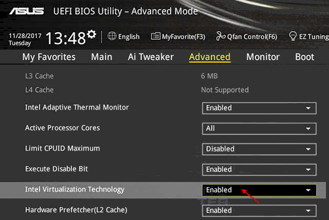

> [!NOTE]
>
> * ① `变量`是内存中的一个`存储区域`，该区域的数据可以在`同一类型`范围内`不断变化`。
> * ② 通过`变量名`，可以`操作`这块内存区域，向其中`存储数据`或`获取数据`以及`移除数据`。
> * ③ 变量的构成包含三个要素：`数据类型`、`变量名`、`需要存储的数据`。
> * ④ 在生活中，我们会经常说：这件衣服的价格是 `100（整型）` 元，这双鞋子的价格是 `250.5（小数，浮点类型）` 元，`今天天气真好（字符串类型）`之类的话；在计算机科学中，这些都是数据，并且它们是有类型，即：数据类型。（数据类型用于定义变量所能存储的数据的种类以及可以对这些数据进行的操作的一种分类，每种数据类型都有特定的属性和用途，它们决定了变量在内存中如何表示和存储，以及变量可以执行哪些操作）

## 1.3 变量的声明和使用

* 语法：

```c
数据类型 变量名; // 声明
```

```c
数据类型 变量名 = 值; // 初始化
```

```c
数据类型 变量名; // 声明
变量名 = 值; // 赋值
```

>[!NOTE]
>
>* ① 在实际开发中，我们通常都会在声明变量的同时，给其赋值，这被称为初始化。
>* ② 如果不在声明变量的同时，进行初始化，默认情况下，系统会赋予的随机值，我们也称为垃圾值。
>* ③ 其实，变量既可以声明在 `main()` 函数的外面，称为`全局变量`；也可以声明在 `main()` 函数的立马，称为`局部变量`。使用未初始化的局部变量有很多风险，很多编译器会给出警告，提醒程序员注意。


* 示例：先声明、赋值，再使用

```c
#include <stdio.h>

int main() {
    
    // 禁用 stdout 缓冲区
    setbuf(stdout, nullptr);

    // 声明一个整型变量，取名为 a
    int a;

    // 给变量赋值
    a = 10;

    printf("a = %d\n", a);

    return 0;
}
```


* 示例：初始化（声明变量的同时给其赋值）

```c
#include <stdio.h>

int main() {
    
    // 禁用 stdout 缓冲区
    setbuf(stdout, nullptr);

    // 声明一个整型变量，取名为 b ，并直接赋值（初始化，实际开发中最为常用）
    int b = 200;

    // 修改变量 b 的值，将变量 a 的值赋值给变量 b
    b = 300;

    printf("b= %d\n", b);

    return 0;
}
```


* 示例：同时声明多个变量并赋值

```c
#include <stdio.h>

int main() {
    
    // 禁用 stdout 缓冲区
    setbuf(stdout, nullptr);
    
    // 同时声明多个整型的变量并赋值
    int c1 = 10, c2 = 20, c3 = 30;
    printf("c1 = %d\n", c1);
    printf("c2 = %d\n", c2);
    printf("c3 = %d\n", c3);

    return 0;
}
```

## 1.4 从内存的角度来理解变量的声明

* ① 在一个 C 程序的编译阶段（程序没有执行），当编译器编译到变量声明的语句的时候，编译器会识别变量的类型、变量名等属性。等到程序运行的时候，就可以根据这些确定的信息，在虚拟内存空间中为变量分配实际的内存空间（并不是所有的变量声明都会分配内存空间，即：使用了 `extern` 关键字修饰的变量）。
* ② 对于一个局部变量而言，它是没有默认值的，其实它默认隐藏的关键字是 `auto` ，即：它的值是随机值、未定义的。换言之，它的值到底是多少，谁也不知道。
* ③ 所以在 C 语言中，一个局部变量如果仅有声明，是不可用的。使用一个仅声明的局部变量，就是使用随机的、未定义的值，将会产生随机的、`未定义的行为`。

> [!NOTE]
>
> 在 C 和 C++ 标准中，“未定义行为”是指程序的行为无法由标准定义的情况。当程序访问未初始化的内存时，标准不会规定程序将如何处理这些数据，这意味着程序可能：
>
> - `正常运行`：如果你很幸运，随机值不会导致问题。
> - `崩溃`：使用随机数据可能导致非法内存访问，可能会导致程序崩溃。
> - `产生不可预测的结果`：程序的输出可能与预期完全不同。
> - `行为不一致`：在不同的编译器、操作系统或运行时环境中，程序表现可能完全不同。
>
> 由于行为没有标准的定义，程序员无法预测程序将如何响应，这正是“未定义行为”产生的根本原因。

* ④ 在实际开发中，声明局部变量的时候，必须进行初始化操作，以便能够减少潜在的错误并提高代码的稳定性。
* ⑤ 在很多编程语言，如：Java 等，如果局部变量没有进行初始化操作，将会在编译阶段报错。

## 1.5 浅谈变量周边概念

### 1.5.1 数据类型

* 数据是放在内存中的，变量是给这块内存起的名字，有了变量就可以找到并使用这份数据。但是，该如何使用？
* 我们知道，对于数字、文字、符号、图形、音频、视频等数据都是以二进制的形式被加载进内存中，进而被计算机中的 CPU 所识别，它们本质上没有任何区别。那么，对于 `00010000` 这个二进制数字，我们是理解为数字 16 ？还是理解为图像中的某个像素的颜色？如果没有特别指明，我们并不清楚。
* 换言之，内存中的数据有多种解释方式；那么，我们在存储之前就必须明确指定，如： `int num = 10;` 中的 `int` 就是数据类型，用来限定 `num` （内存中的某个区域）中存储的是整数，而不是图像中某个像素的颜色。

> [!NOTE]
>
> 总结：
>
> * ① 数据类型用来说明数据的类型，确定了数据的解释方式，让计算机和程序员不会产生歧义。
> * ② C 语言中很多基本的数据类型，如：char、short、int、long 等；如果需要，也可以组成更加复杂的数据类型（后续讲解）。

### 1.5.2 连续定义多个变量

* 为了让程序的书写更加简洁，C 语言支持多个变量的连续定义，如下所示：

```c
int a,b,c;
```

```c
float m=3.14,n=4.14;
```

> [!NOTE]
>
> * ① 连续定义的多个变量以逗号`,`分隔，并且要拥有相同的数据类型。变量可以初始化，也可以不初始化。
> * ② 很多 C 语言程序员喜欢这么写；但是，本人不是很喜欢，因为连续定义可能会导致代码的可读性降低，特别是在声明时变量之间用逗号分隔，容易导致混淆。

### 1.5.3 数据的长度

* 所谓数据长度，就是指的是数据占用多少个字节。占用的字节越多，能存储的数据就越多；对于数字而言，值就会越大。反之，能存储的数字就有限。
* 多个数据在内存中是连续存储的，彼此之间是没有明显的界限的。如果不指明数据的长度，那么计算机就不知道何时才能存取结束。假设我们保存了一个整数 1000 ，它占用 4 个字节的内存，而读取它的时候却读取了 3 个字节或 5 个字节；那么，显示是不正确的。
* 所以，在定义变量的时候还要指明数据的长度，而这恰恰是数据类型的另外一个作用，即：`数据类型除了指明数据的解释方式，还指明了数据的长度`。

> [!NOTE]
>
> 总结：在 C 语言中，每一种数据类型所占用的字节数都是固定的，知道了数据类型，也就知道了数据的长度。

* 在 32 位环境中，各种数据类型的长度，如下所示：

| 数据类型          | 长度（字节） |
| ----------------- | ------------ |
| `char`            | 1            |
| `short`           | 2            |
| `int`             | 4            |
| `long`            | 4            |
| `long long`       | 8            |
| `float`           | 4            |
| `double`          | 8            |
| `long double`     | 8            |
| `pointer`（指针） | 4            |

> [!NOTE]
>
> * ① C 语言有多少种数据类型，每种数据类型长度是多少、该如何使用，这是每一位 C 程序员都必须要掌握的。
> * ② 当然，不必担心，后续还会一一讲解的。

> [!IMPORTANT]
>
> * ① 数据类型只需要在定义变量时指明，而且必须指明。
> * ② 使用变量时无需再指明，因为此时的数据类型已经确定了。

## 1.6 从计算机底层看变量

### 1.6.1 内存条的内部结构

* 如果只看内存条的外观，无非就是一些集成电路和颗粒而已，如下所示：

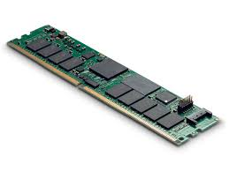

* 并且，我们只需要将内存条插入到计算机主板对应的内存条插槽上，就可以正常工作，如下所示：

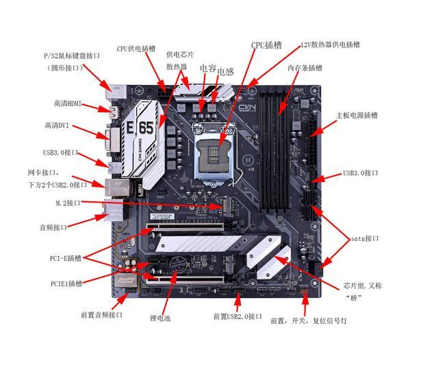

* 在家用的台式机主板上，通常有 4 个插槽或 2 个插槽，例如：本人的计算机就支持  4 个插槽，如下所示：

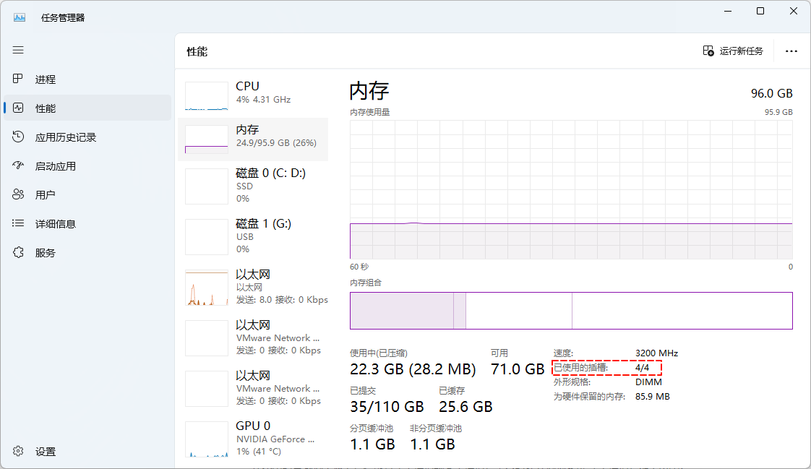

>[!NOTE]
>
>* ① 上图中的外形规格是 DIMM，所以我们通常也以 DIMM 也表示内存条。
>* ②  DIMM 是内存条的物理形式，安装在主板的内存插槽中。
>* ③ 常见的 DIMM 类型包括 UDIMM（非缓冲 DIMM）、RDIMM（缓冲 DIMM）和 LRDIMM（负载减少DIMM）。

* 我们可以通过 [CPU-Z](https://www.cpuid.com/) 这个软件，查看 CPU 的一些指标信息，如下所示：

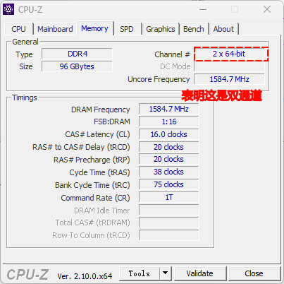

> [!NOTE]
>
> * ① 通过 CPU-Z 表明本人的台式机是支持双通道的，`channel` 在`计算机`中可以`翻译`为`信道`或`通道`。
> * ② 通道是内存控制器与内存模块之间的通信路径。
> * ③ 多通道内存可以提高数据传输带宽。例如：双通道内存系统同时使用两个通道来传输数据，从而提高性能。
> * ④ 现代主板通常支持双通道（Dual Channel）、四通道（Quad Channel）甚至八通道（Octa Channel）。

* 对于家用台式机而言，如果将内存条的插槽从左到右依次编号，如下所示：

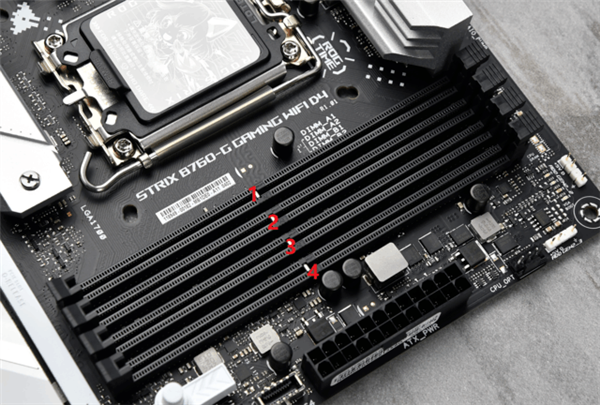

* 其中，`槽1` 和 `槽2` 是一个通道，`槽3` 和 `槽4` 是一个通道；所以，通常是这么建议的：
  * 如果只有 1 根内存条，就插到 `槽2` 中。
  * 如果有 2 根内存条，就分别插入到 `槽2` 和 `槽4` 中。
  * 如果有 4 根内存条，就全插满即可。

> [!NOTE]
>
> 组成双通道配置的内存条需要遵循一些基本要求来确保它们能够正常以双通道模式运行。
>
> ::: details 点我查看
>
> - ① **相同容量**：理想情况下，组成双通道的内存条应该具有相同的容量。这样可以确保它们在处理数据时的一致性和兼容性。
> - ② **匹配的速度规格**：内存条应该具有相同的速度规格，即它们的频率（如：DDR4-2400、DDR4-3200等）应该相同。不同速度的内存条可以一起工作，但系统会以所有内存条中最慢的那个的速度运行。
> - ③ **相同的时序**：内存条的时序（如：CL16-18-18-38）应该匹配。时序参数影响内存的响应速度和稳定性，不匹配的时序可能会降低性能或导致系统不稳定。
> - ④ **相同的制造商和型号**（推荐）：虽然不是强制性要求，但选择相同制造商和型号的内存条可以最大限度地减少兼容性问题。不同制造商的内存条可能在微小的规格和性能上有差异，这有可能影响双通道配置的效能。
>
> :::


* 内存条表面会有内存颗粒，如下所示：

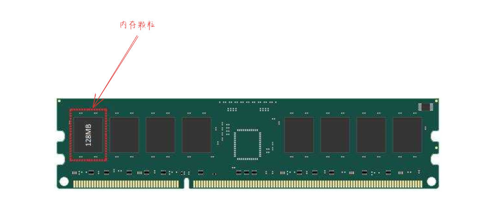

> [!NOTE]
>
> * ① 上图中的内存条有 8 个内存颗粒。
> * ② 但是，高端服务器上的内存条通常会存在 9 个内存颗粒，最后 1 个内存颗粒专门用来做 ECC 校验。

* 一个内存条有两面，高端的内存条两面都有内存颗粒，我们将每个面称为 Rank 。那么，如果内存条有两个面，就是存在 Rank0 和 Rank1 ，即：

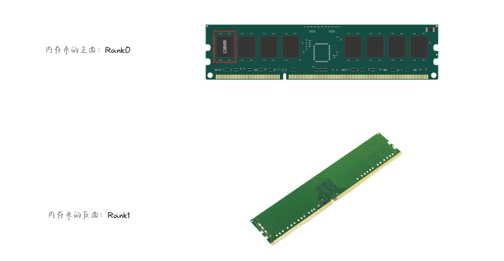

* 内存条表面的黑色颗粒，我们称为 chip（芯片） ，即：

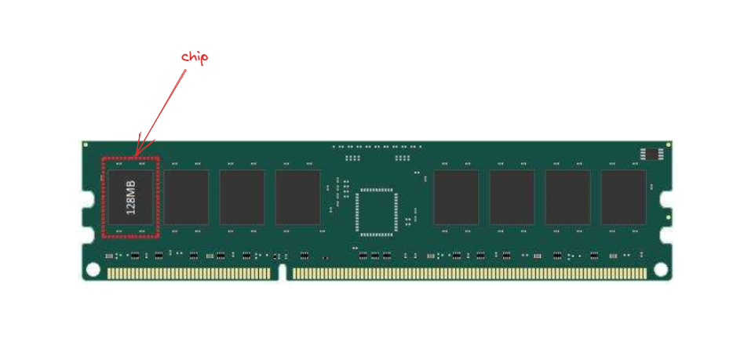

> [!NOTE]
>
> * ① 内存颗粒是内存条上的 DRAM 芯片，每个芯片包含多个存储单元。
> * ② 内存颗粒存储数据并与内存控制器进行数据交换。

* 在 chip 中还有 8 个 bank，每个 bank 就是数据存储的实体，这些 bank 组成了一个二维矩阵，只要声明了 column 和 row 就可以从每个 bank 中取出 8bit （1 Bytes）的数据，如下所示：

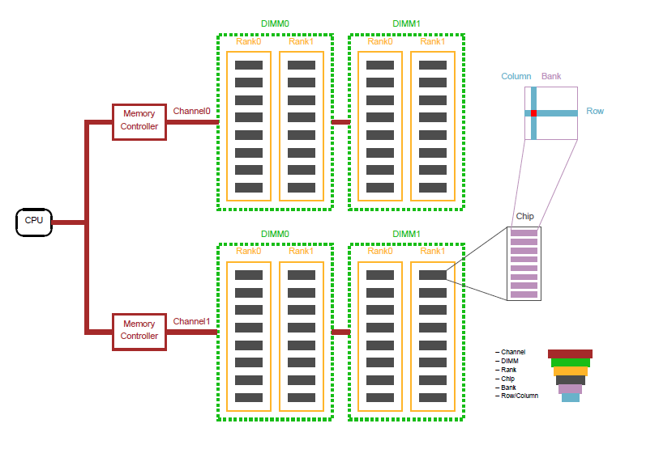

* 综上所示，内存条的分层结构就是 `Channel > DIMM > Rank -> Chip -> Bank -> Row/Column`。

### 1.6.2 变量的作用

* 如果我们希望计算 10 和 20 的和；那么，在计算机中需要怎么做？

  * ① 首先，计算 10 和 20 的运算，一定在 CPU 中进行，因为在计算机中的各个部件中，只有 CPU 有运算器（ALU）。
  * ② 其次，我们需要将 10 和 20 交给 CPU ；由于 CPU 只能和内存进行交互，那么我们必须将 10 和 20 存储到内存中。

  > [!NOTE]
  >
  > 即使 10 和 20 是存储在文件中的，也需要先加载进内存，然后再交给 CPU 进行运算。

  * ③ 最后，只需要告诉 CPU 做何种运算，如：加、减、乘、除等。

* 其中，最为重要的问题就是如何将数据存储到内存中？答案就是通过`变量`。

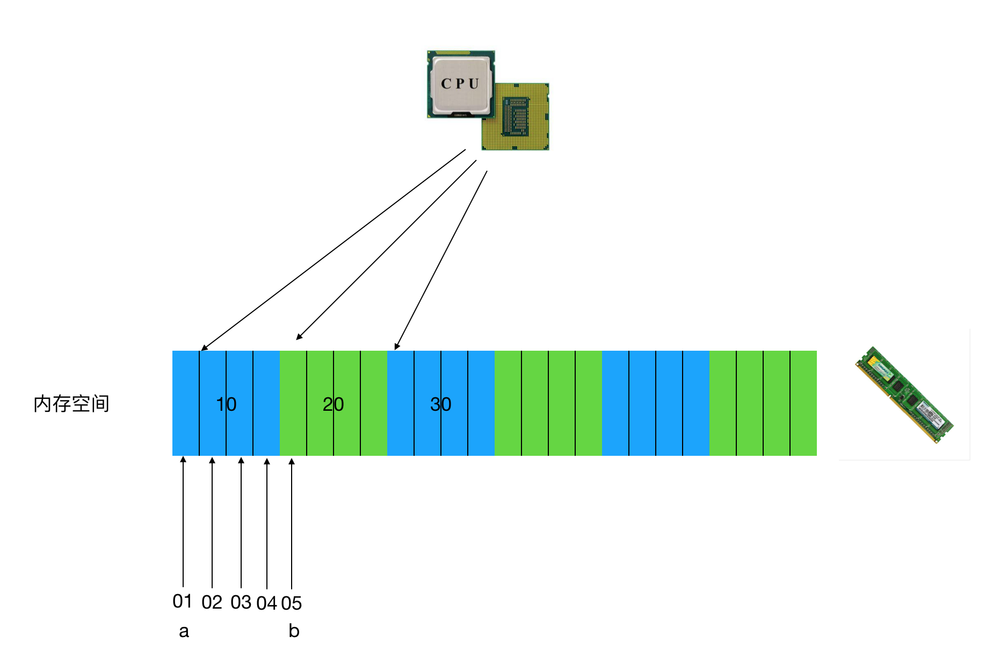

* 我们知道，计算机底层是使用二进制来表示指令和数据的；但是，如果我们的代码都是这样的，即：

```txt
0000,0000,000000010000 代表 LOAD A, 16
0000,0001,000000000001 代表 LOAD B, 1
0001,0001,000000010000 代表 STORE B, 16
```

* 这样，直接使用`内存地址`来编写代码（机器语言）实现是太难阅读、修改和维护了；于是，我们就使用了汇编语言来编写代码，并通过编译器来将汇编语言翻译为机器语言，即：

```txt
LOAD A, 16   -- 编译 -->   0000,0000,000000010000
LOAD B, 1    -- 编译 -->   0000,0001,000000000001
STORE B, 16  -- 编译 -->   0001,0001,000000010000
```

* 但是，这样的汇编语言还是面向机器的，编程时仍然需要记住和管理大量内存地址，不具备程序的移植性；于是，我们就是使用了高级语言来编写代码，并引入了变量的概念，即：

```c
int num = 10;
```

* 我们使用`变量名`来`关联`内存`地址`，这样我们在编写代码的时候，就可以不用直接操作内存地址，极大地提高了代码的可读性和开发效率。并且，当程序运行完毕之后，程序所占用的内存还会交还给操作系统，以便其它程序使用。
* 综上所述，高级语言编译器的作用就是：
  * ① 编写源代码时使用变量名。
  * ② 程序在经过编译器的编译之后，所有变量名被替换为具体地址。
  * ③ ……

* 此时，我们就可以知道，`变量`就是内存中用于`存储数据`的`临时空间`，并且变量中的值是可以变化的。
* `内存`中空间的`最小单位`是`字节`（Bytes），即 8 个 0 或 1 ，如下所示：

```txt
00011001 00100110 00100110 00100110 00100110 ...
```

> [!NOTE]
>
> 计算机中存储单位的换算，如下所示：
>
> * 1 B = 8 bit。
> * 1 KB = 1024 B。
> * 1 MB = 1024 KB。
> * 1 GB = 1024 MB。
> * 1 TB = 1024 GB 。
> * ……

* 在内存中，每一个字节都有一个编号，这个编号我们称之为地址。一个变量至少占用 1 个字节（1 个或多个字节），我们将变量的第一个字节所占用的地址（变量的首地址），就称之为该变量的地址。CPU 就可以通过变量地址找到某个变量的值，然后拿到具体的数据进行计算了。

> [!NOTE]
>
> 变量就是保存程序运行过程中临时产生的值。

* 其实，到这里还是有疑惑的？我们说过，一个变量至少会占用 1 个字节，如果一个变量占用了 4 个字节，而 CPU 只会通过变量的地址（首地址）获取数据，那么 CPU 是如何获取完整的数据的？答案就是通过`数据类型`，数据类型除了限制数据的种类，还限制了数据在内存中所占空间的大小，如上图所示：
  * ① 假设变量 `a` 的首地址是 `01` ，变量的数据类型是 `4` 个字节。
  * ② 那么，CPU 就会依次，从 `01 ~ 04` 中获取数据。


* 再次，剖析下变量的语法格式：

```txt
数据类型 变量名 = 值;
```

* `变量名`的`作用`，如下所示：
  * ① 当我们`编写`代码的时候，使用`变量名`来`关联`某块内存的`地址`。
  * ② 当 CPU `执行`的时候，会将变量名`替换`为具体的地址，再进行具体的操作。


> [!IMPORTANT]
>
> 变量名（标识符）需要符合命名规则和命名规范！！！

* `数据类型`的`作用`，如下所示：
  * ① 变量的数据类型`决定了`变量所占空间的大小。当我们在声明变量的时候写了数据数据类型，CPU 就知道从变量的首地址位置开始取多少字节。
  * ② 变量的数据类型`决定了`两个变量是否能够运行，以及能够做何种运算。例如：JavaScript 就没有 char 类型的变量，都是 string 类型，可以和任意数据类型的数据拼接，并转换为 string 类型；Java 中有 char 类型的变量，底层都会转换 unicode 编码，然后再计算。


* `值`的`作用`，如下所示：
  * ① `值`就是`内存`中`实际存储`的`数据`。
  * ② `=` 是赋值操作符，就是将等号右侧的数据存储到等号左侧的变量名所代表的内存空间。


* 那么，如下代码的含义就是：

```c
// int 数据类型，4 个字节
// num 变量名 -- 关联内存中的一块存储空间
// = 10 将 10 存储到 num 所代表的 4 个字节的存储空间中
int num = 10;
```

## 1.7 变量的重要操作

### 1.7.1 变量的输出

* 在计算机中，所谓的`输入`和`输出`都是以计算机（CPU 和内存）为主体而言的，即：

>[!NOTE]
>
>* ① 输入：从输入设备(键盘、鼠标、扫描仪)向计算机输入数据。
>
>* ② 输出：从计算机向外部输出设备(显示器、打印机)输出数据。


* 在 C 语言中，提供了 `printf()` 函数用于输出信息，其函数声明是：

```c
int printf (const char *__format, ...) {
    ...
}
```

* `printf` 的标准含义是格式化输出文本，来源于 `print formatted（格式化打印）`的缩写，其语法规则，如下所示：


> [!NOTE]
>
> * ① 格式化字符串：是使用双引号括起来的字符串，里面包含了普通的字符串和格式占位符。
> * ② 格式占位符（格式声明符）：由 `%` 和`格式字符`组成，作用是将输出的数据转换为指定的格式后输出，这里的 `%d` 表示整数。
> * ③ 输出列表：是程序要输出的一些数据，可以是常量、变量或表达式，需要和格式占位符一一对应。

* 在计算机中，二进制、八进制、十进制以及十六进制的英文名称和缩写，如下所示：
  * 二进制（binary），缩写是 bin。
  * 八进制（octal），缩写是 oct。
  * 十进制（decimal），缩写是 dec。
  * 十六进制（Hexadecimal），缩写是 hex。

* 其实，我们也可以在 Windows 系统中的计算器中来看到，即：

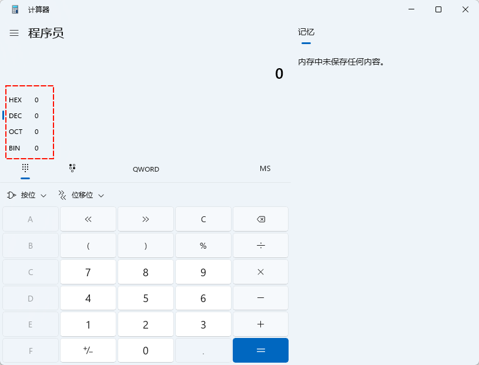

> [!IMPORTANT]
>
> * ① 在生活中的 decimal 是小数的意思。
> * ② 但是，在计算机中，decimal 的完整含义是 decimal integer ，即十进制整数。


* 示例：

```c
#include <stdio.h>

int main() {
    
    // 禁用 stdout 缓冲区
    setbuf(stdout, nullptr);
    
    // 声明变量并赋值
    int num = 18;

    // 使用输出语句，将变量 num 的值输出，其中 %d 表示输出的是整数
    printf("我今年%d岁\n", num);

    return 0;
}
```

### 1.7.2 计算变量的大小

* 我们可以使用 `sizeof`关键字（运算符）来计算变量或类型所占内存空间的大小。


* 示例：

```c
#include <stdio.h>

int main() {

    // 禁用 stdout 缓冲区
    setbuf(stdout, nullptr);
    
    int num = 10;

    printf("变量所占内存空间的大小：%zd字节\n", sizeof(num));

    // 数据类型所占内存空间的大小
    printf("数据类型所占内存空间的大小：%zd字节\n", sizeof(int));

    return 0;
}
```

### 1.7.3 获取变量的地址

* 在 C 语言中，我们可以使用`取地址运算符 &` 来获取变量的地址。


* 示例：

```c
#include <stdio.h>

int main() {

    // 禁用 stdout 缓冲区
    setbuf(stdout, nullptr);
    
    int num = 10;

    printf("变量 num 的值是：%d\n", num);
    printf("变量 num 的地址(指针)是：%#p\n", &num);

    return 0;
}
```

### 1.7.4 变量的输入

* 在 C 语言中，提供了 `scanf()` 函数用于从标准输入（通常是键盘）中读取数据并根据变量的地址赋值给变量（变量需要提前声明），其函数声明是：

```c
int scanf(const char *__format, ...) {
    ...
}
```

* 其语法规则，如下所示：


> [!NOTE]
>
> * ① `&age`、`&num` 中的 `&`是寻址运算符（取址运算符）。
> * ② `&age` 表示变量 `age` 在内存中的地址。
> * ③ `&num` 表示变量 `num` 在内存中的地址。

> [!CAUTION]
>
> * ① scanf() 函数中的 `%d`，如果是连着写，即：`%d%d`，那么在输入数据的时候，数据之间不可以使用逗号`,`分隔，只能使用空白字符（空格、tab 键或回车键），即：`2空格3tab`或`2tab3回车`等。
>
> * ② 如果是 `%d,%d`，则输入的时候需要加上逗号`,`，即：`2,3`。
> * ③ 如果是  `%d %d`，则输入的时候需要加上空格，即：`2空格3`。


* 示例：计算圆的面积，半径由用户指定

```c
#include <stdio.h>

int main() {

    // 禁用 stdout 缓冲区
    setbuf(stdout, nullptr);
    
    // 禁用 stdout 缓冲区
    // CLion debug 独有，后文不再提及，如果 debug 有问题，就添加如下代码
    setbuf(stdout, NULL);
    
    float radius;

    printf("请输入一个半径：");
    scanf("%f", &radius);

    double area = 3.1415926 * radius * radius;

    printf("半径是%f的圆的面积是%.2lf", radius, area);

    return 0;
}
```


* 示例：输入一个整数值，求其绝对值

```c
#include <stdio.h>

int main() {

    // 禁用 stdout 缓冲区
    setbuf(stdout, nullptr);    
    
    int num;

    printf("请输入一个整数：");
    scanf("%d", &num);

    int absNum;

    if (num < 0) {
        absNum = -num;
    } else {
        absNum = num;
    }

    printf("%d的绝对值是：%d", num, absNum);

    return 0;
}
```


* 示例：输入多个变量的值，求其乘积

```c
#include <stdio.h>

int main() {

    // 禁用 stdout 缓冲区
    setbuf(stdout, nullptr);    
    
    int a, b, c;
    printf("请输入整数 a 、b 和 c 的值：");
    scanf("%d %d %d", &a, &b, &c);

    int result = a * b * c;

    printf("%d × %d × %d = %d", a, b, c, result);

    return 0;
}
```

## 1.8 标识符

### 1.8.1 概述

* 在 C 语言中，变量、函数、数组名、结构体等要素命名的时候使用的字符序列，称为标识符。

> [!NOTE]
>
> * ① 在上世纪 60 - 70 年代的时候，因为国家贫穷，人民生活不富裕等原因，家长虽然会给孩子取名为：`张建国`、`李华强`等。
> * ② 但是，也会给孩子取小名，如：`二狗子`、`狗剩`等，目的是希望孩子能健康成长（养活），像 `张建国`、`李华强`、`二狗子`、`狗剩`都是名字（标识符），伴随人的一生。

### 1.8.2 标识符的命名规范

* 强制规范：
  * ① 只能由`小写`或`大写英文字母`，`0-9` 或 `_` 组成。
  * ② 不能以`数字`开头。
  * ③ 不可以是`关键字`。
  * ④ 标识符具有`长度`限制，不同编译器和平台会有所不同，一般限制在 63 个字符内。
  * ⑤ 严格`区分大小写字母`，如：Hello、hello 是不同的标识符。
* 建议规范：
  * ① 为了提高阅读性，使用有意义的单词，见名知意，如：sum，name，max，year 等。
  * ② 使用下划线连接多个单词组成的标识符，如：max_classes_per_student 等。
  * ③ 多个单词组成的标识符，除了使用下划线连接，也可以使用小驼峰命名法，除第一个单词外，后续单词的首字母大写，如： studentId、student_name 等。
  * ④ 不要出现仅靠大小写区分不同的标识符，如：name、Name 容易混淆。
  * ⑤ 系统内部使用了一些下划线开头的标识符，如：C99 标准添加的类型 `_Bool`，为防止冲突，建议开发者尽量避免使用下划线开头的标识符。


* 示例：合法（不一定建议）的标识符

```txt
a、BOOK_sun、MAX_SIZE、Mouse、student23、
Football、FOOTBALL、max、_add、num_1、sum_of_numbers
```


* 示例：非法的标识符

```txt
$zj、3sum、ab#cd、23student、Foot-baii、
s.com、b＆c、j**p、book-1、tax rate、don't
```

### 1.8.3 关键字

* C 语言中的关键字是编译器`预定义`的`保留字`，它们有`特定`的`含义`和`用途`，用于控制程序的结构和执行。
* C80 和 C90 （ANSI C）定义的关键字，如下所示：

| 类型（功能）               | 具体关键字                                                   |
| -------------------------- | ------------------------------------------------------------ |
| 数据类型关键字             | `char`、`double`、`float`、`int`、`long`、`short`、`signed`、`unsigned`、`void` |
| 存储类说明符关键字         | `auto`、`extern`、`register`、`static`、`typedef`、`volatile`、`const` |
| 控制语句关键字             | `break`、`case`、`continue`、`default`、`do`、`else`、`for`、`goto`、`if`、`return`、`switch`、`while` |
| 结构体、联合体和枚举关键字 | `enum`、`struct`、`union`                                    |
| 其他关键字                 | `sizeof`                                                     |

* C99 新增的关键字，如下所示：

| 类型（功能）       | 具体关键字                        |
| ------------------ | --------------------------------- |
| 数据类型关键字     | `_Bool`、`_Complex`、`_Imaginary` |
| 存储类说明符关键字 | `inline`、`restrict`              |
| 其他关键字         | `_Complex`、 `_Imaginary`         |

* C11 新增的关键字，如下所示：

| 类型（功能）       | 具体关键字                                                   |
| ------------------ | ------------------------------------------------------------ |
| 存储类说明符关键字 | `_Atomic`                                                    |
| 其他关键字         | `_Alignas`、 `_Alignof`、 `_Generic`、 `_Noreturn`、 `_Static_assert`、 `_Thread_local` |

> [!IMPORTANT]
>
> * ① 关键字不能用作标识符（如：变量名、函数名等）。
> * ② 不要死记硬背这些关键字，在实际开发中，并不一定全部使用到；而且，在学到后面的时候，会自动记住这些关键字以及对应的含义。


# 第二章：常量（⭐）

## 2.1 概述

* 在程序运行过程中，不能改变的量就是常量。

>[!NOTE]
>
>* ① 在数学中的 `π`，就是一个常量，其值为 3.1415926 。
>* ② 在生活中，人类的性别只有`男`和`女`；其中，`男`和`女`也是常量。
>* ③ ...

## 2.2 常量的分类

* 在 C 语言中的变量的分类，如下所示：
  * ① 字面量常量。
  * ② 标识符常量：
    *  `#define` 宏定义的标识符常量。
    * `const` 关键字修饰的标识符常量。
    * 枚举常量。

>[!NOTE]
>
>* ① 所谓的`字面量常量`，就是可以直接使用的常量，不需要声明或定义，包括：整数常量、浮点数常量以及字符常量。
>* ② 所谓的`标识符常量`，就是使用标识符来作为常量名，包括： `#define` 宏定义的标识符常量、`const` 关键字修饰的标识符常量、枚举常量。


* 示例：字面量常量

```c
#include <stdio.h>

int main() {

    1;
    'A';
    12.3;
    "你好";

    return 0;
}
```


* 示例：字面量常量

```c
#include <stdio.h>

int main() {

    // 禁用 stdout 缓冲区
    setbuf(stdout, nullptr);    
    
    printf("整数常量 = %d\n", 1);
    printf("字符常量 = %c\n", 'A');
    printf("浮点数常量 = %f\n", 12.3);
    printf("字符串常量 = %s\n", "你好");

    return 0;
}
```

## 2.3 使用 #define 定义常量

* `#define` 来定义常量，也叫作宏定义，就是用一个标识符来表示一个常量值，如果在后面的代码中出现了该标识符，那么编译时就全部替换成指定的常量值，即用宏体替换所有宏名，简称`宏替换`。
* 格式是：

```c
#define 常量名 常量值
```

> [!IMPORTANT]
>
> * ① 其实`宏定义`的常量的`执行时机`是在`预处理`阶段，将所有`宏常量`替换完毕，才会继续编译代码。
> * ② 不要以 `;` 结尾，如果有 `;` ，分号也会成为常量值的一部分。
> * ③ `# define` 必须写在 `main` 函数的外面！！！
> * ④ `常量名`习惯用`大写字母`表示，如果多个单词，使用 `_` 来分隔，以便和变量区分。


* 示例：

```c
#include <stdio.h>

#define PI 3.1415926

int main() {

    // 禁用 stdout 缓冲区
    setbuf(stdout, nullptr);    
    
    double radius = 2.5;

    double area = PI * radius * radius;

    printf("半径为%lf的圆的面积是%.2lf", radius, area);

    return 0;
}
```

## 2.4 const 关键字

* C99 标准新增，这种方式跟定义一个变量是类似的；只不过，需要在变量的数据类型前加上 `const` 关键字。
* 和使用 `#define定义宏常量`相比，const 定义的常量有详细的数据类型，而且会在编译阶段进行安全检查，在运行时才完成替换，所以会更加安全和方便。
* 格式是：

```c
const 数据类型 常量名 = 常量值;
```


* 示例：

```c
#include <stdio.h>

const double PI = 3.1415926;

int main() {

    // 禁用 stdout 缓冲区
    setbuf(stdout, nullptr);    
    
    double radius = 2.5;

    double area = PI * radius * radius;

    printf("半径为%lf的圆的面积是%.2lf", radius, area);

    return 0;
}
```

## 2.5 枚举常量

* 格式：

```c
enum 枚举常量 {
    xxx = 1;
    yyy;
    ...
}
```

> [!NOTE]
>
> * ① 默认情况下，枚举常量是从 0 开始递增的。
> * ② 也可以在定义枚举常量的时候，自定义它们的值。


* 示例：

```c
#include <stdio.h>

enum sex {
    MALE = 1,
    FEMALE = 2,
};

int main() {
    
    // 禁用 stdout 缓冲区
    setbuf(stdout, nullptr);
    
    printf("%d\n", MALE);
    printf("%d\n", FEMALE);

    return 0;
}
```


* 示例：

```c
#include <stdio.h>

enum Sex {
    MALE = 1,
    FEMALE = 2,
};

int main() {
    
    // 禁用 stdout 缓冲区
    setbuf(stdout, nullptr);
    
    enum Sex sex;

    printf("请输入性别(1 表示男性, 2 表示女性)：");
    scanf("%d", &sex);
    printf("您的性别是：%d\n", sex);

    return 0;
}
```

## 2.6 `#define` 定义常量 VS `const` 定义常量

### 2.6.1 概述

* `#define` 和 `const` 都可以用来定义常量，但它们的工作方式和应用场景有所不同。

### 2.6.2 语法和定义方式

* `#define` 是一个预处理指令，用来定义宏。在编译时，所有的宏会被预处理器展开为它们定义的值，类似于文本替换。

```c
#define PI 3.14159
```

* `const`是一个编译时常量，用来定义具有类型的常量变量。它是由编译器处理的，并且在运行时仍然可以保留类型信息。

```c
const float PI = 3.14159;
```

### 2.6.3 类型检查

* `#define`没有类型，它只是简单的文本替换，不会进行类型检查。因此，如果在宏中定义了错误的类型，可能导致编译错误或运行时错误。

```c
#define MAX 10 + 20 // 实际展开后可能是 MAX = 10 + 20，而不是 30
```

* `const`具有类型，编译器会进行类型检查。如果定义时类型不匹配，会报编译错误。

```c
const int MAX = 30; // 定义时指定了类型，类型检查严格
```

### 2.6.4 作用域

* `#define`宏没有作用域的概念，它是在预处理时进行全局替换的。因此，可能会引发意外的替换问题，尤其是在复杂项目中。

```c
#define SIZE 10  // SIZE 可能在其他文件中也被不小心替换
```

* `const`具有作用域，它遵循 C 语言的作用域规则（比如局部作用域、全局作用域）。这使得 `const` 定义的常量更安全，因为它们只能在指定的范围内使用。

```c
const int SIZE = 10; // 可以局部或全局定义，不会引发冲突
```

### 2.6.5 调试

* `#define`在调试时，宏常量被替换为字面值，因此调试工具中无法看到它的原始名称，只能看到被替换后的值。
* `const`常量在编译后依然存在，因此在调试时可以直接看到常量的名称和它的值，调试体验更好。

### 2.6.6 内存分配

* `#define`宏在预处理阶段替换，不占用内存。
* `const` 常量会被分配内存，特别是在全局或静态情况下，但它也可以被优化为编译时常量，有时也不会占用额外的内存。

### 2.6.7 适用场景

* `#define`通常用于定义简单的常量值、条件编译或宏函数（用于文本替换）。适合不需要类型、安全性检查的场合。
* `const`用于定义类型安全的常量，适合需要进行类型检查或确保作用域的场合。

### 2.6.8 总结

* `const` 更加安全，尤其是在需要类型检查和局部作用域的时候；而 `#define` 常用于需要简洁的文本替换或宏定义。`const` 和 `#define` 对比的表格，如下所示：

| 特性     | `#define`          | `const`               |
| -------- | ------------------ | --------------------- |
| 类型检查 | 无类型检查         | 有类型检查            |
| 作用域   | 无（全局替换）     | 有作用域（局部/全局） |
| 调试支持 | 差（替换为字面值） | 好（保留名称）        |
| 内存开销 | 无                 | 可能会有              |
| 使用场景 | 宏、条件编译       | 类型安全的常量        |

