# 第一章：CLion 高级配置（⭐）

## 1.1 安装和配置 WSL2

### 1.1.1 概述

* WSL2，全称为 Windows Subsystem for Linux 2，是微软提供的一种技术，允许用户在 Windows 操作系统上运行 Linux 内核。WSL2  是 WSL1 的升级版，它引入了一个真正的 Linux 内核来代替 WSL1 中使用的兼容层，从而提供更高的性能和更广泛的系统调用支持。
* 和传统的虚拟化技术的对比，如下所示：


> [!NOTE]
>
> ::: details 点我查看 WSL2 的功能和用途
>
> * WSL2 的功能：
>
>   * ① **真实的 Linux 内核**：WSL2 使用了微软开发的轻量级虚拟机，它包含了一个完整的 Linux 内核。这意味着 WSL2 能够运行更多的 Linux 应用程序，并且支持更多的系统调用。
>
>   * ② **文件系统性能提升**：WSL2 的文件系统性能比 WSL1 有显著提升。对于 I/O 密集型的操作，如：编译代码或数据库操作，WSL2 能够提供更快的速度。
>
>   * ③ **兼容性增强**：由于使用了真实的 Linux 内核，WSL2 对 Linux 应用程序的兼容性大幅提高。许多在 WSL1 上不能运行或需要调整的应用程序，可以在 WSL2 上直接运行。
>
>   * ④ **网络功能改进**：WSL2 提供了更好的网络集成，能够更容易地与 Windows 上的其他网络资源进行交互。
>
>   * ⑤ **资源使用优化**：WSL2 使用轻量级虚拟机，比传统的虚拟机占用更少的资源，同时提供了类似的隔离和安全性。
>
>
> * WSL2 的用途：
>   * ① **开发环境**：WSL2 为开发者提供了一个原生的 Linux 开发环境，而无需离开 Windows 。这对于需要在 Linux 上开发、测试或运行应用程序的开发者非常有帮助。
>   * ② **学习和实验**：用户可以使用 WSL2 在 Windows 上学习和实验 Linux 命令行工具和应用程序，而无需设置双重引导系统或安装虚拟机。
>   * ③ **多平台开发**：对于跨平台开发者来说，WSL2 允许他们在一个操作系统上同时进行 Windows 和 Linux 平台的开发和测试，提高工作效率。
>   * ④ **运行 Linux 工具和应用程序**：WSL2 支持在 Windows 上直接运行各种 Linux 工具和应用程序，如：Docker、数据库、编程语言环境等。
>
> :::

### 1.1.2 WSL2 的安装

* ① BIOS 或 UEFI 中，开启虚拟化：步骤略。


* ② 查看是否开启了虚拟化：

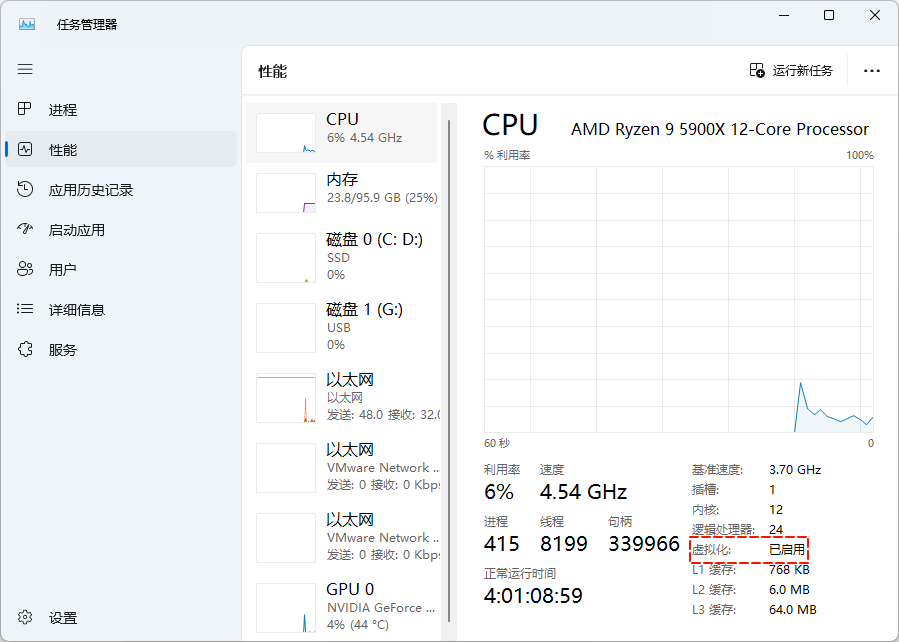

* ③ 启用适用于 Linux 的 Windows 子系统：

> [!IMPORTANT]
>
> 以管理员身份打开 PowerShell 并运行，执行完下面命令之后，如果提示需要重启计算机，那就重启计算机！！！

```powershell
dism.exe /online /enable-feature /featurename:Microsoft-Windows-Subsystem-Linux /all /norestart
```


* ④ 启用虚拟机功能：

> [!IMPORTANT]
>
> 以管理员身份打开 PowerShell 并运行，执行完下面命令之后，如果提示需要重启计算机，那就重启计算机！！！

```powershell
dism.exe /online /enable-feature /featurename:VirtualMachinePlatform /all /norestart
```

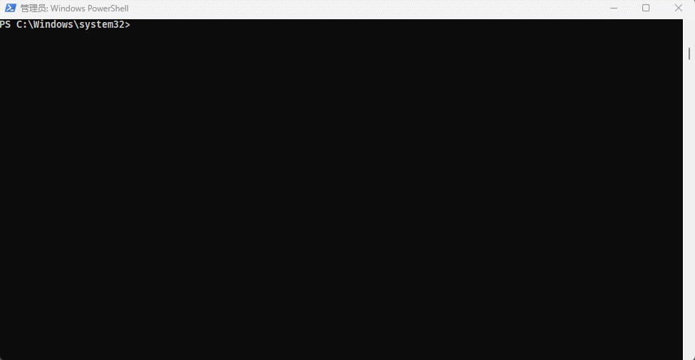

* ⑤ 更新 Linux 内核包：

> [!IMPORTANT]
>
> WSL2 的最新 Linux 内核包托管在 GitHub 上，某些国家可能会污染 Github 相关的域名，那么就需要手动下载，然后安装即可，下载地址在[这里](https://wslstorestorage.blob.core.windows.net/wslblob/wsl_update_x64.msi)。

```powershell
wsl --update
```

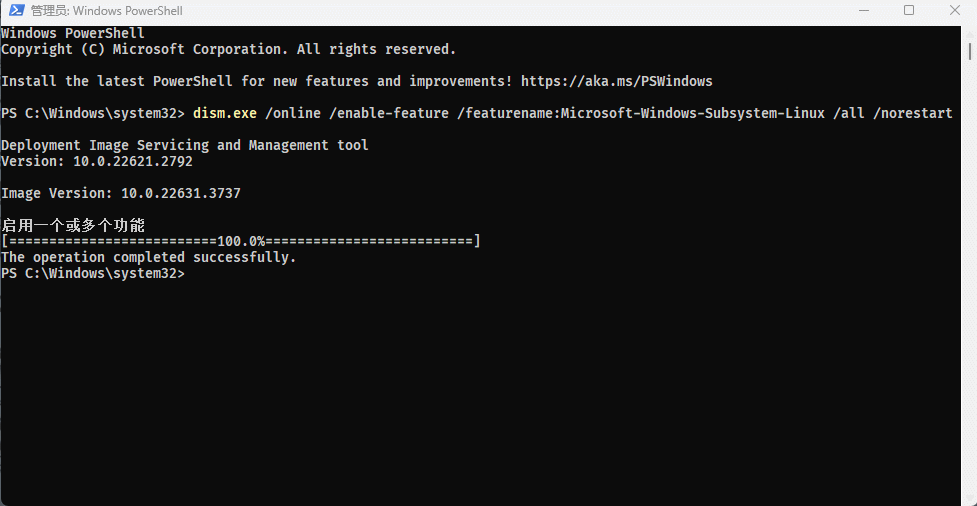

* ⑥ 将 wsl2 设置为默认版本：

```powershell
wsl --set-default-version 2
```

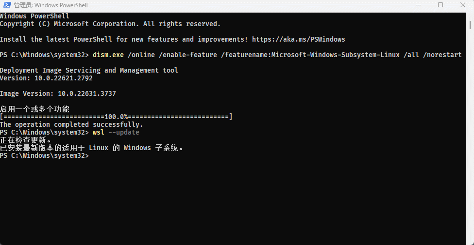

* ⑦ 查看官方在线支持的 Linux 版本：

```powershell
wsl --list --online
```


* ⑧ 安装指定版本的 Linux ：

> [!CAUTION]
>
> 官方支持的 Linux 版本，托管在 Github 上，某些国家可能会污染 Github 的域名，有如下两种解决方案：
>
> * ① 科学上网。
> * ② 在 `Microsoft Store` 中搜索并安装。

```powershell
wsl --install Ubuntu-24.04
```

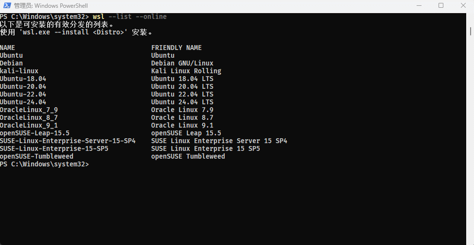

* ⑨ 在 Microsoft Store 中搜索并安装（可选）：


* ⑩ 查询本地安装的 Linux 版本：

```powershell
wsl --list
```

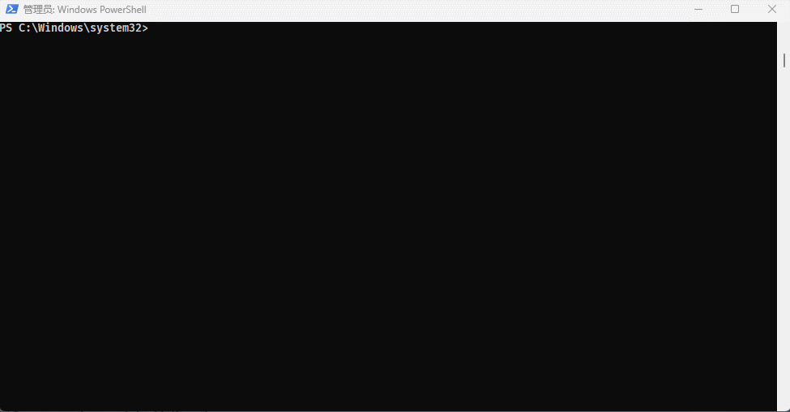

### 1.1.3 配置 WSL2

* 本人的安装的是 AlmaLinux9 ，所以需要执行如下命令，以便安装 cmake 相关工具链：

```shell
sudo dnf update -y # 更新包管理器 
sudo dnf groupinstall "Development Tools" -y # 安装开发工具包
sudo dnf install gcc gcc-c++ -y # 安装GCC相关工具链
sudo dnf install cmake -y # 安装 cmake
sudo dnf install make -y # 安装 make
sudo dnf install gdb -y # 安装 gdb
```

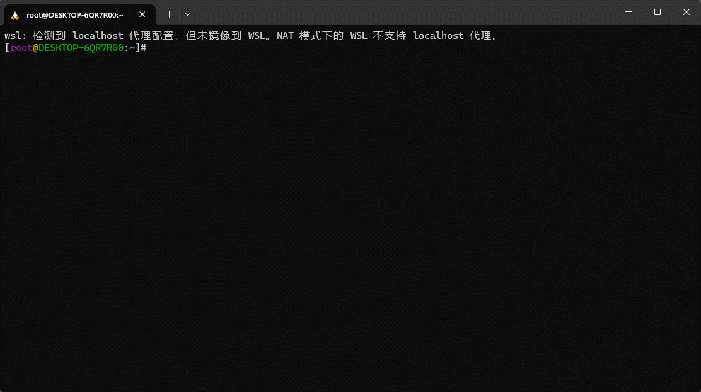

* 可以通过 CLion 测试是否安装成功：

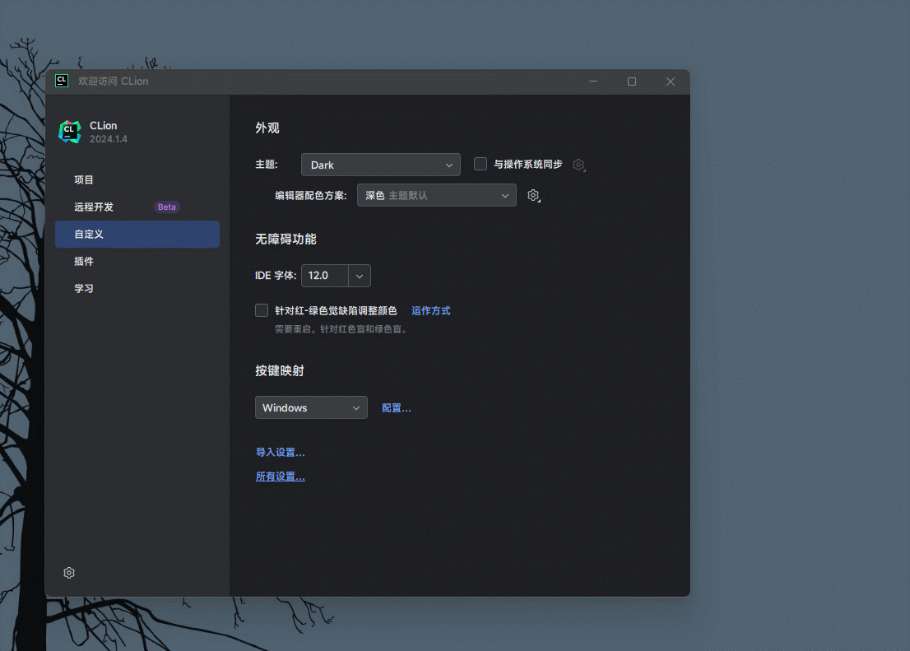

### 1.1.4 配置 WSL2

* 本人的安装的是 Ubuntu 24.04，所以需要执行如下命令，以便安装 cmake 相关工具链：

```shell
sudo apt update && sudo apt upgrade -y # 更新包管理器
sudo apt install build-essential -y # 安装开发工具包
sudo apt install gcc g++ -y # 安装 GCC 相关工具链
sudo apt install cmake -y # 安装 cmake
sudo apt install gdb -y # 安装 gdb
```

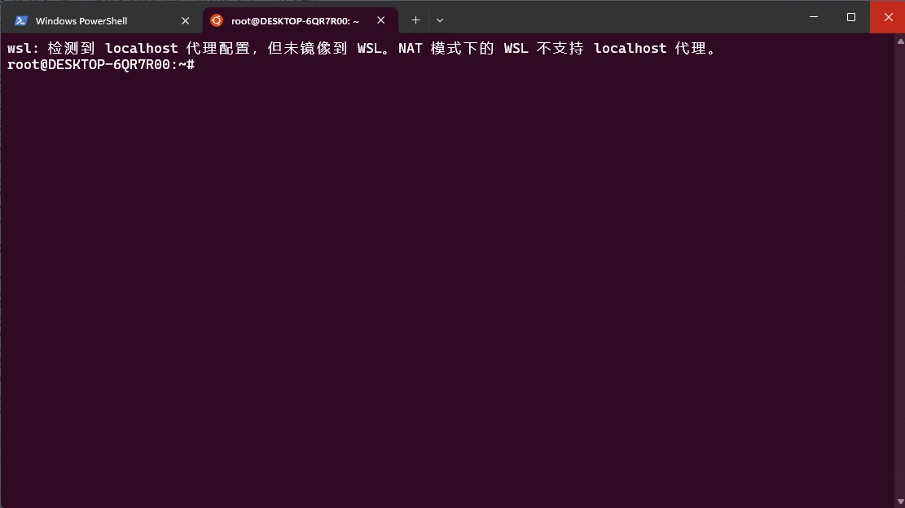

* 可以通过 CLion 测试是否安装成功：

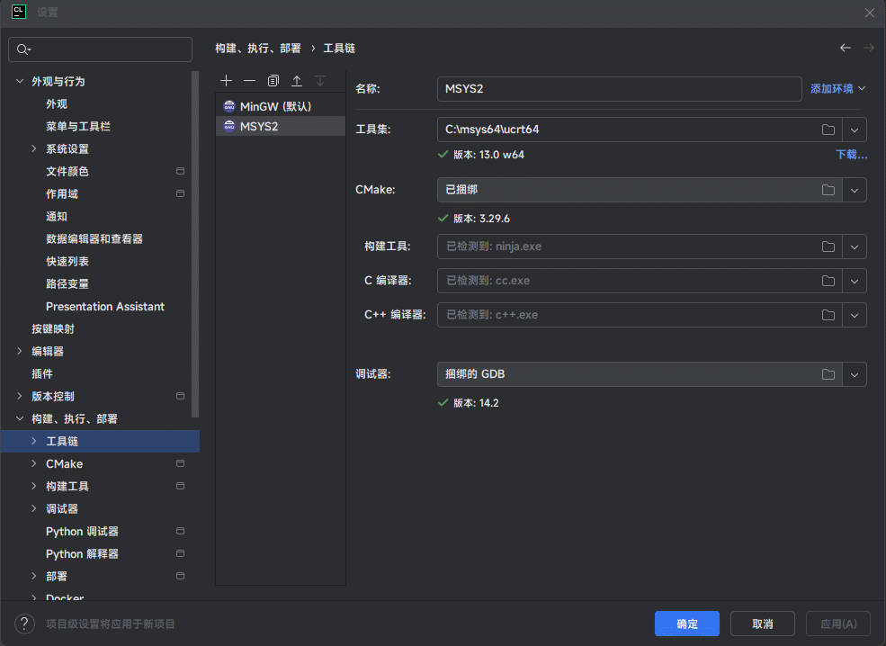

## 1.2 切换 CLion 中的 cmake 的工具链

* 可以在 CLoin 中切换 cmake 的工具链，以便支持不同平台的 cmake ，即：

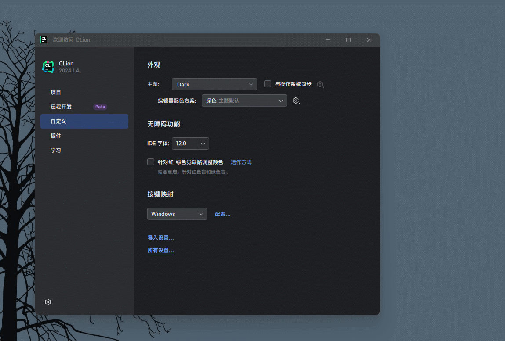

## 1.3 修改 CMakeLists.txt 文件

* 前文也提到了，在一个 C 语言项目中，只能有一个 main() 函数；但是，我们可以修改 `CMakeLists.txt` 文件的内容，以便其支持在一个 C 语言项目中，可以同时运行多个包含 main() 函数的文件。

> [!NOTE]
>
> * ① 其实，这样设置的目的：就是为了让每个 `.c` 文件都可以编译为一个独立的可执行文件，而不是所有的 `.c` 文件编译为一个可执行文件。
> * ② 在实际开发中，对于 C 语言项目而言，当然必须只能有一个 `main()` 函数（只有一个 `.c` 文件包含 `main()` 函数，其余的 `.c` 文件中包含函数声明或函数实现），因为程序有且仅有一个入口。

* `CMakeLists.txt` 文件的位置，如下所示：

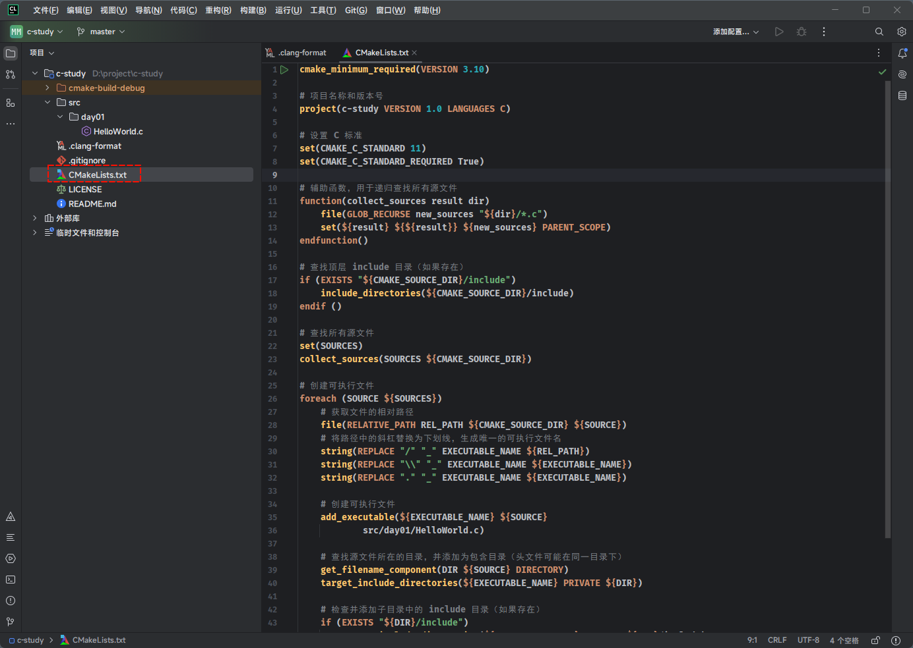

* `CMakeLists.txt` 文件的内容，如下所示：

```txt
cmake_minimum_required(VERSION 3.22.1)

# 项目名称和版本号
project(c-study VERSION 1.0 LANGUAGES C)

# 设置 C 标准
set(CMAKE_C_STANDARD 23)
set(CMAKE_C_STANDARD_REQUIRED True)
set(CMAKE_C_EXTENSIONS OFF)

set(CMAKE_CXX_FLAGS "${CMAKE_CXX_FLAGS} -g")

if (CMAKE_BUILD_TYPE STREQUAL "Debug")
    add_definitions(-D_DEBUG)
elseif (CMAKE_BUILD_TYPE STREQUAL "Release")
    add_definitions(-DNDEBUG)
elseif (CMAKE_BUILD_TYPE STREQUAL "RelWithDebInfo")
    add_definitions(-DRELWITHDEBINFO)
elseif (CMAKE_BUILD_TYPE STREQUAL "MinSizeRel")
    add_definitions(-DMINSIZEREL)
endif ()

# 辅助函数，用于递归查找所有源文件
function(collect_sources result dir)
    file(GLOB_RECURSE new_sources "${dir}/*.c")
    set(${result} ${${result}} ${new_sources} PARENT_SCOPE)
endfunction()

# 查找顶层 include 目录（如果存在）
if (EXISTS "${CMAKE_SOURCE_DIR}/include")
    include_directories(${CMAKE_SOURCE_DIR}/include)
endif ()

# 查找所有源文件
set(SOURCES)
collect_sources(SOURCES ${CMAKE_SOURCE_DIR})

# 用于存储已经处理过的可执行文件名，防止重复
set(EXECUTABLE_NAMES)

# 创建可执行文件
foreach (SOURCE ${SOURCES})
    # 获取文件的相对路径
    file(RELATIVE_PATH REL_PATH ${CMAKE_SOURCE_DIR} ${SOURCE})
    # 将路径中的斜杠替换为下划线，生成唯一的可执行文件名
    string(REPLACE "/" "_" EXECUTABLE_NAME ${REL_PATH})
    string(REPLACE "\\" "_" EXECUTABLE_NAME ${EXECUTABLE_NAME})
    string(REPLACE "." "_" EXECUTABLE_NAME ${EXECUTABLE_NAME})

    # 处理与 CMakeLists.txt 文件同名的问题
    if (${EXECUTABLE_NAME} STREQUAL "CMakeLists_txt")
        set(EXECUTABLE_NAME "${EXECUTABLE_NAME}_exec")
    endif ()

    # 检查是否已经创建过同名的可执行文件
    if (NOT EXECUTABLE_NAME IN_LIST EXECUTABLE_NAMES)
        list(APPEND EXECUTABLE_NAMES ${EXECUTABLE_NAME})
        # 链接 math 库
        LINK_LIBRARIES(m)
        # 创建可执行文件
        add_executable(${EXECUTABLE_NAME} ${SOURCE})

        # 查找源文件所在的目录，并添加为包含目录（头文件可能在同一目录下）
        get_filename_component(DIR ${SOURCE} DIRECTORY)
        target_include_directories(${EXECUTABLE_NAME} PRIVATE ${DIR})

        # 检查并添加子目录中的 include 目录（如果存在）
        if (EXISTS "${DIR}/include")
            target_include_directories(${EXECUTABLE_NAME} PRIVATE ${DIR}/include)
        endif ()

        # 检查并添加 module 目录中的所有 C 文件（如果存在）
        if (EXISTS "${DIR}/module")
            file(GLOB_RECURSE MODULE_SOURCES "${DIR}/module/*.c")
            target_sources(${EXECUTABLE_NAME} PRIVATE ${MODULE_SOURCES})
        endif ()
    endif ()
endforeach ()
```

## 1.4 配置 .clang-format 文件

* 配置 `.clang-format` 格式化文件，以便写代码的时候，可以自动保存并格式化 C 程序代码，如下所示：

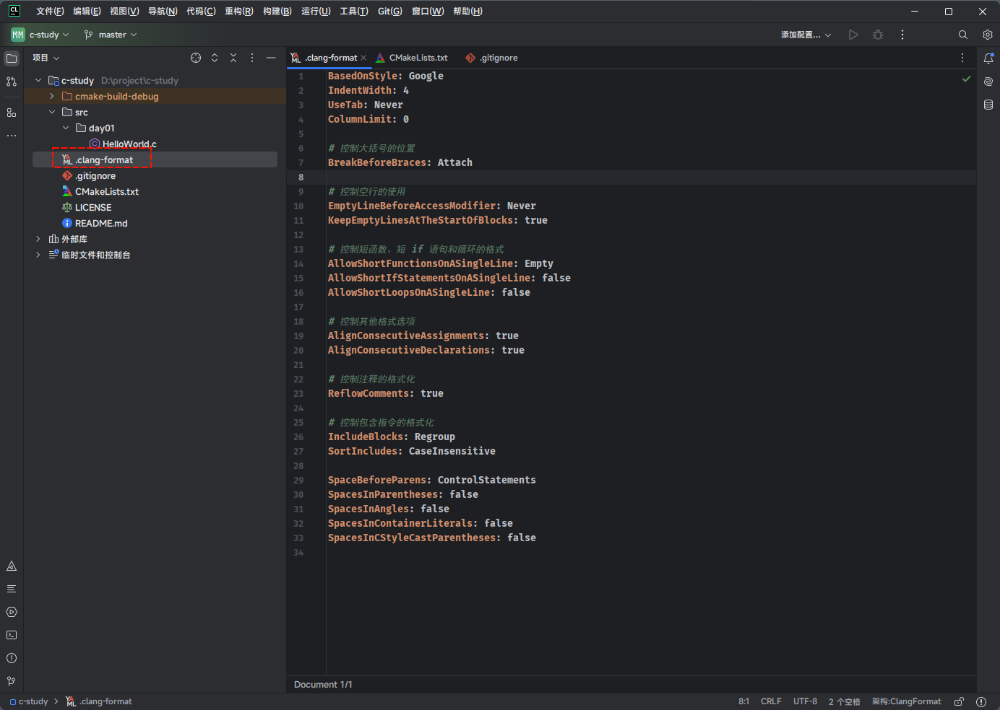

* `.clang-format` 的内容，如下所示：

```txt
BasedOnStyle: LLVM
IndentWidth: 4
UseTab: Never
ColumnLimit: 0

# 控制大括号的位置
BreakBeforeBraces: Attach

# 控制空行的使用
EmptyLineBeforeAccessModifier: Never
KeepEmptyLinesAtTheStartOfBlocks: true

# 控制短函数、短 if 语句和循环的格式
AllowShortFunctionsOnASingleLine: Empty
AllowShortIfStatementsOnASingleLine: false
AllowShortLoopsOnASingleLine: false

# 控制其他格式选项
AlignConsecutiveAssignments: false
AlignConsecutiveDeclarations: false

# 控制注释的格式化
ReflowComments: true

# 控制包含指令的格式化
IncludeBlocks: Regroup
SortIncludes: CaseInsensitive

SpaceBeforeParens: ControlStatements
SpacesInParentheses: false
SpacesInAngles: false
SpacesInContainerLiterals: false
SpacesInCStyleCastParentheses: false

# 控制 switch-case 格式
IndentCaseLabels: true
```

* CLion 中配置`保存`的时候`自动格式化`，即：

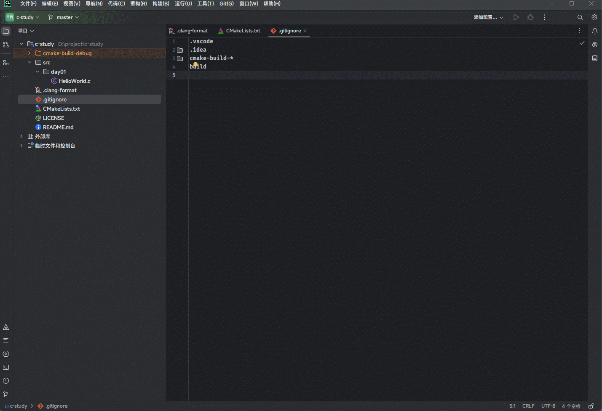

## 1.5 配置 .gitignore 文件

* 需要在项目中，配置 `.gitignore` 文件，以便在提交代码到 Git 仓库的时候，忽略某些文件或目录，如下所示：

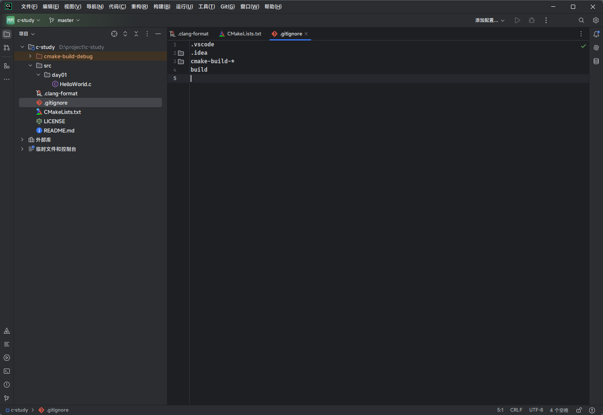

* `.gitignore` 文件的内容，如下所示：

```txt
.vscode
.idea
cmake-build-*
build
```

## 1.6 演示

* 我们可以在项目中，临时创建或复制一个文件，看上述配置是否生效，即：

> [!NOTE]
>
> 如果是复制并粘贴一个文件到项目中，请点击`重新加载 CMake 项目`！！！

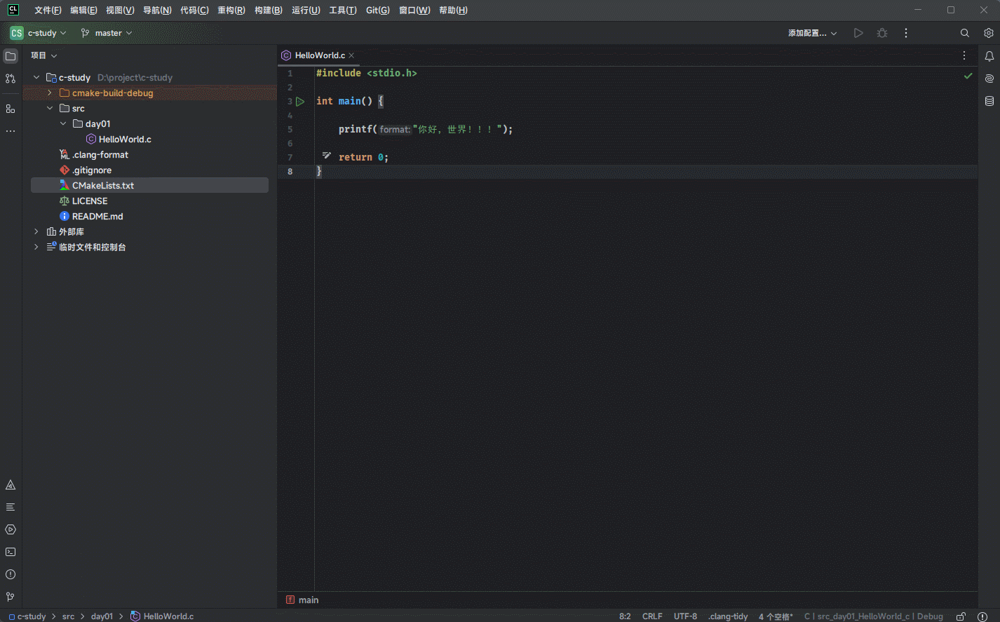


# 第二章：C 语言的编译过程（⭐）

## 2.1 概述

* C 程序的编译过程，如下所示：

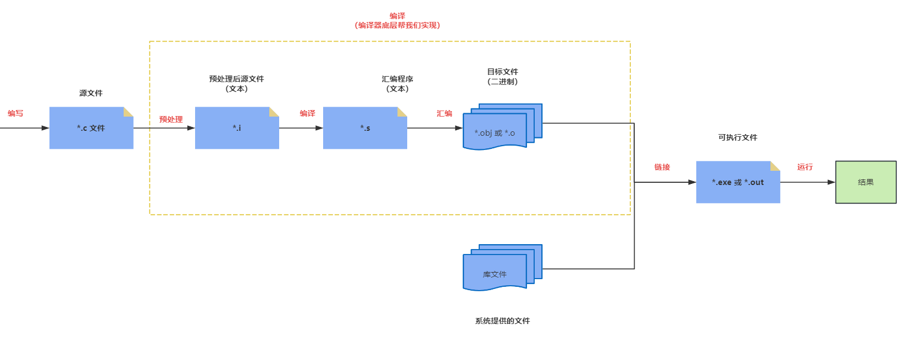

> [!IMPORTANT]
>
> * ① C 程序源文件，经过一系列的步骤（编写或编辑源代码、编译、链接）形成一个可执行文件。
> * ② C 程序（可执行文件）在内存中执行会形成虚拟地址空间。

* 过程 ① ：编写（编辑）源代码，即：编写 C 语言源程序代码，并以文件的形式存储在磁盘中。

> [!NOTE]
>
> 源程序需要以 `.c` 作为扩展名。

* 过程 ② ：编译，即：将 C 语言源程序转换为`目标程序（或目标文件）`。如果程序没有错误，没有任何提示，就会生成一个扩展名为 `.obj`或 `.o` 的二进制文件。C 语言中的每条可执行语句经过编译之后，最终都会转换为二进制的机器指令。

> [!NOTE]
>
> ::: details 点我查看 `编译阶段`的具体细节
>
> `编译阶段`包含了`预处理`、`编译`和`汇编`
>
> * ① `预处理`（Preprocess）是编译过程的第一个阶段。
>
>   * 在这个阶段，预处理器处理源代码中的指令（例如：`#include`、`#define`等），主要任务包括：
>
>     * 头文件包含：将头文件的内容插入到源文件中。例如：`#include <stdio.h>`会被替换为`stdio.h`文件的内容。
>     * 宏展开：替换宏定义。例如：`#define PI 3.14`会将代码中的`PI`替换为`3.14`。
>     * 条件编译：根据条件指令（如：`#ifdef`、`#ifndef`）有选择地编译代码。
>  
>   * 删除代码中的注释，但是不会进行语法检查。
>   * 预处理完成后，生成一个扩展名为`.i`的中间文件。
>  
>* ② `编译`（Compile）是将预处理后的源代码转换为汇编代码的过程。在这个阶段，编译器会检查代码的语法和语义，将其转换为目标机器的汇编语言，生成一个扩展名为`.s`的汇编文件。
> 
>* ③ `汇编`（Assemble）是将汇编代码转换为机器代码（也称为目标代码或目标文件）的过程。在这个阶段，汇编器将汇编指令转换为二进制机器指令，生成一个扩展名为`.o`或 `.obj`的目标文件。
> 
>:::

* 过程 ③ ：链接（Link），即：将编译形成的目标文件 `*.obj` 或 `*.o`和库函数以及其他目录文件`链接`，形成一个统一的二进制文件 `*.exe`。

>[!NOTE]
>
>* 为什么需要链接库文件？
>* 因为我们的 C 程序会使用 C 程序库中的内容，如：`<stdio.h>` 中的 `printf()` 函数，这些函数不是程序员自己写的，而是 C 程序库中提供的，因此需要链接。其实，在链接过程中，还会加入启动代码，这个启动代码（和系统相关，Linux 下主要有 crt0.c、crti.c 等，它们设置堆栈后，再调用 main() 函数）负责初始化程序运行时的环境。

* 过程 ④ ：执行，即：有了可执行的 `*.exe`文件，我们就可以在控制台上运行此 `*.exe` 文件。

> [!NOTE]
>
> 如果`修改`了源代码，还需要重新`编译`、`链接`，并生成新的 `*.exe`文件，再执行，方能生效。

## 2.2 GCC 编译器的介绍

* 编辑器，如：vim 、vscode 等，是指我们用它来编写源程序的（编辑代码），而我们写的代码语句，电脑是不懂的，我们需要把它转成电脑能懂的语句，编译器就是这样的转化工具。换言之，我们用编辑器编写程序，由编译器编译后才可以运行！
* 编译器是将易于编写、阅读和维护的高级计算机语言翻译为计算机能解读、运行的低级机器语言的程序。
* gcc（GNU Compiler Collection，GNU 编译器套件），是由 GNU 开发的编程语言编译器。gcc 原本作为 GNU 操作系统的官方编译器，现已被大多数类 Unix 操作系统（如：Linux、BSD、Mac OS X 等）采纳为标准的编译器，gcc 同样适用于微软的 Windows 。
* gcc 最初用于编译 C 语言，随着项目的发展， gcc 已经成为了能够编译 C、C++、Java、Ada、fortran、Object C、Object C++、Go 语言的编译器大家族。

## 2.3 通过 gcc 直接生成可执行文件

* 示例：预处理、编译、汇编和链接

```shell
gcc HelloWorld.c -o HelloWorld.exe
```

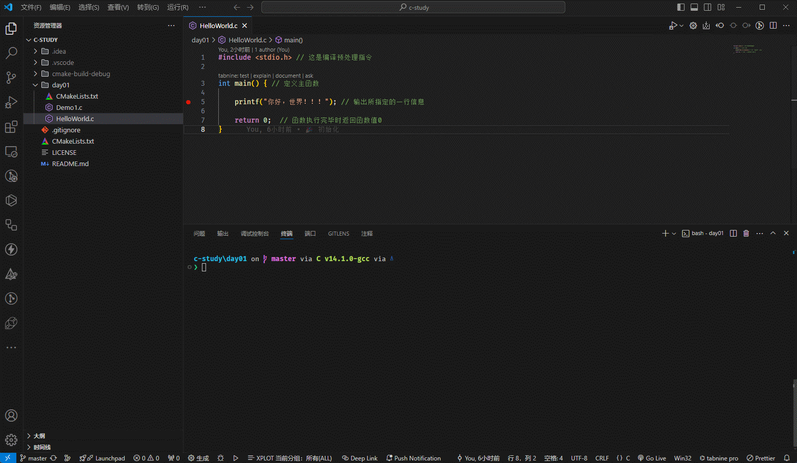

## 2.4 通过 gcc 分步编译

### 2.4.1 概述

* 预处理命令：

```shell
# 通常以 .i 结尾表示这个文件是一个中间状态
gcc -E 源文件.c -o 源文件.i 
```

* 编译（预处理和编译）命令：

```shell
# 在 Linux 中，通常以 .s 结尾；在 Windows 中，通常以 .asm 结尾
gcc -S 源文件.i -o 源文件.s 
```

* 汇编（预处理、编译和汇编）命令：

```shell
# 在 Linux 中，通常以 .o 结尾；在 Windows 中，通常以 .obj 结尾
gcc -c 源文件.s -o 源文件.o 
```

* 链接（预处理、编译、汇编和链接）命令：

```shell
# 在 Linux 中，通常以 .out 结尾；在 Windows 中，通常以 .exe 结尾
gcc 源文件.o -o 源文件.exe 
```

### 2.4.2 应用示例

* 示例：只进行预处理

```shell
gcc -E HelloWorld.c -o HelloWorld.i
```

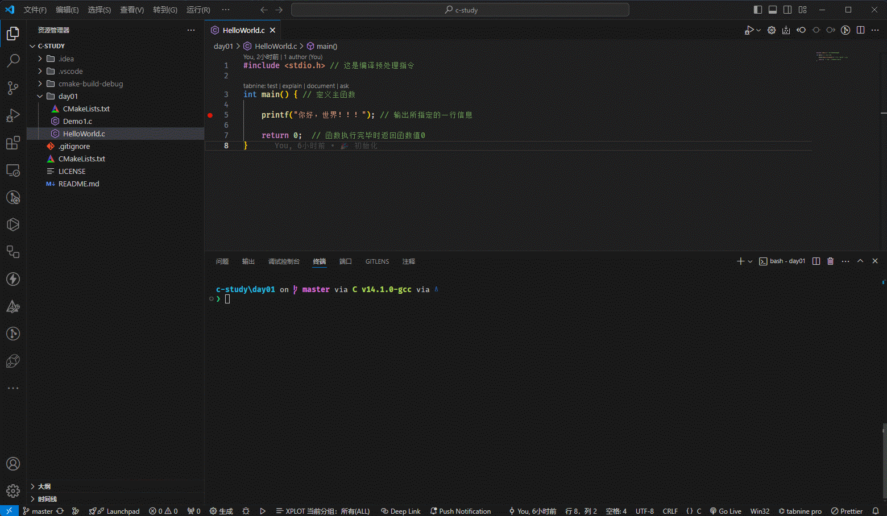


* 示例：只进行预处理和编译

```shell
gcc -S HelloWorld.i -o HelloWorld.s
```

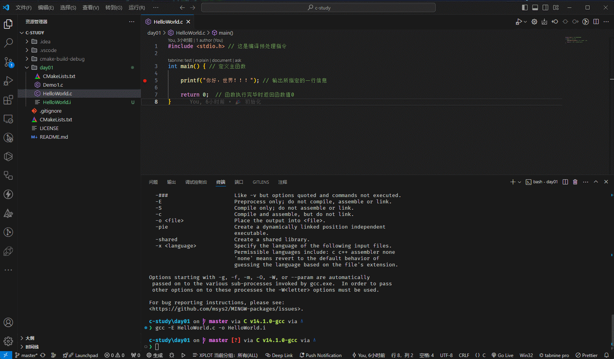


* 示例：只进行预处理、编译和汇编

```shell
gcc -c HelloWorld.s -o HelloWorld.o
```

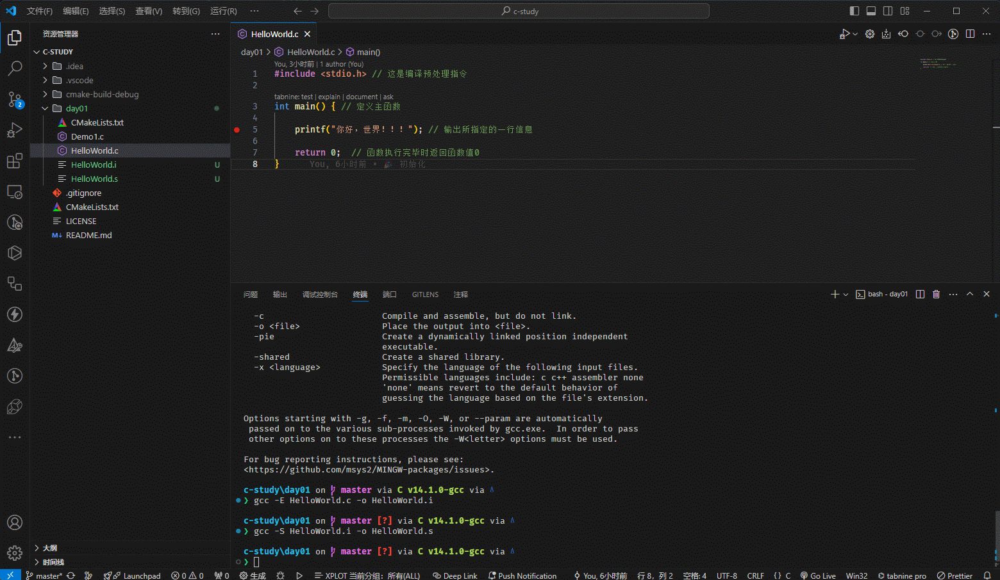


* 示例：进行预处理、编译、汇编和链接

```shell
gcc HelloWorld.o -o HelloWorld.exe
```

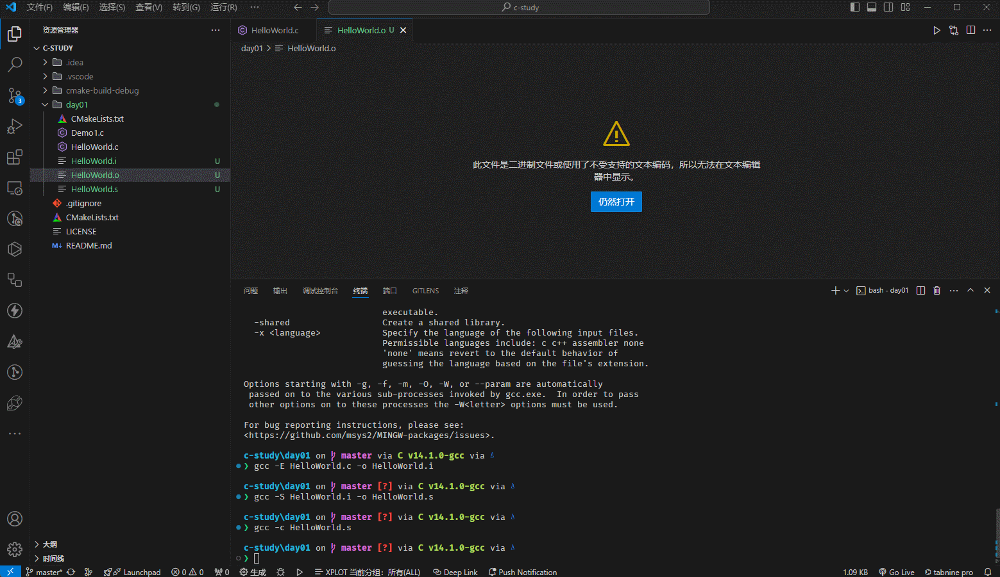

# 第三章：WSL2 和 CLion 进阶

## 3.1 WSL2 代理问题

* 在安装和配置 WSL2 之后，可能会出现如下的提示，如下所示：

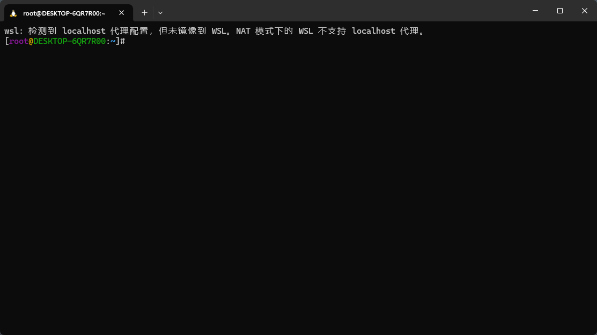

* 那么，只需要修改 `%USERPROFILE%\.wslconfig`文件，内容如下：

> [!NOTE]
>
> 如果没有该文件，则需要自己新建该文件！！！

```txt
[wsl2]
networkingMode=mirrored
dnsTunneling=true
firewall=true
autoProxy=true

[experimental]
# requires dnsTunneling but are also OPTIONAL
bestEffortDnsParsing=true
useWindowsDnsCache=true
```


* 在命令行中，执行如下的命令：

```shell
wsl --shutdown
```

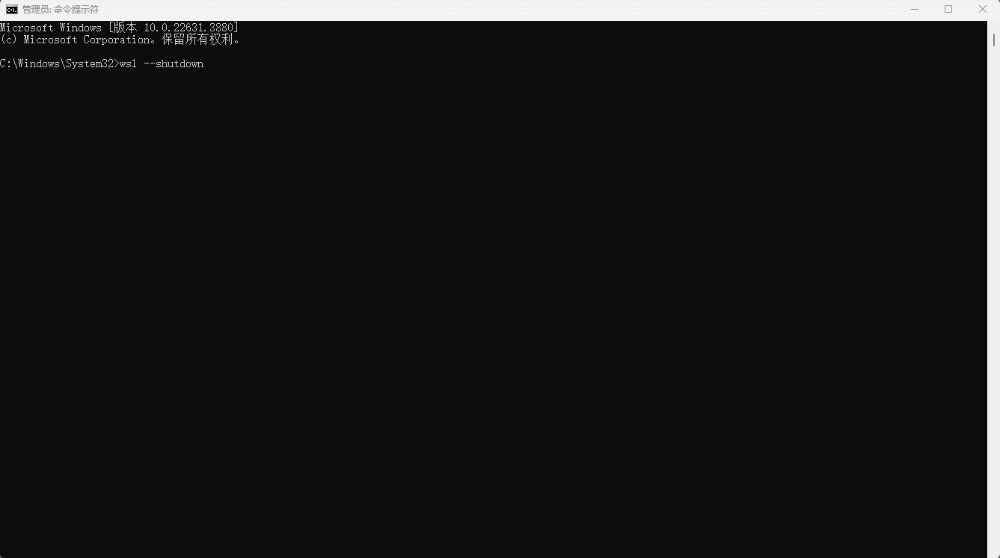

* 此时，再打开终端，就没有这种提示了：


## 3.2 CLion 调试问题

* 在 CLion 中进行 run（运行）程序的时候，对于 `printf` 函数或 `scanf` 函数很正常，如下所示：

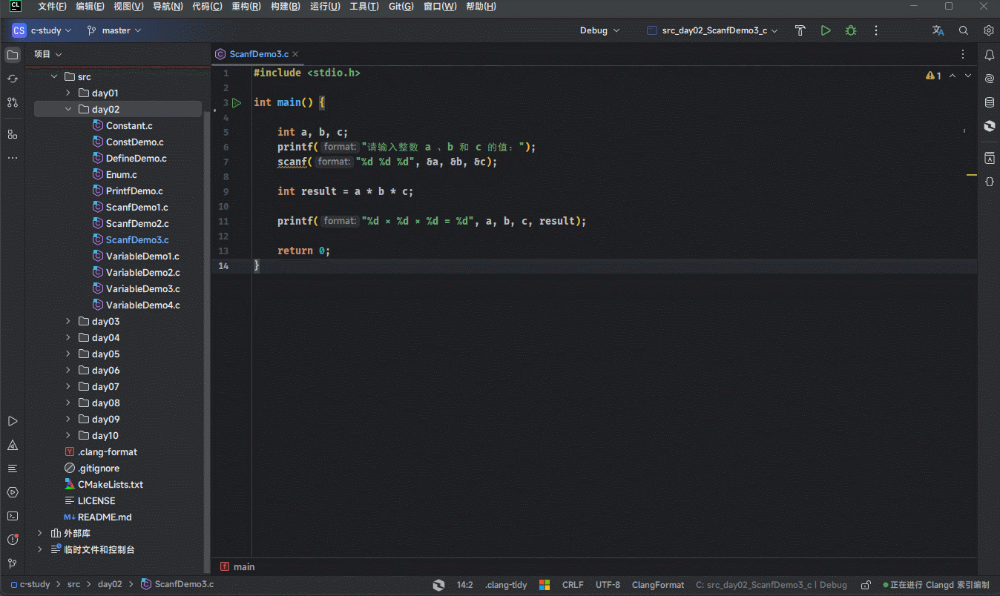

* 但是，当我们 debug（调试） 的时候，对于 `printf` 函数或 `scanf` 函数会一直没有输出，如下所示：

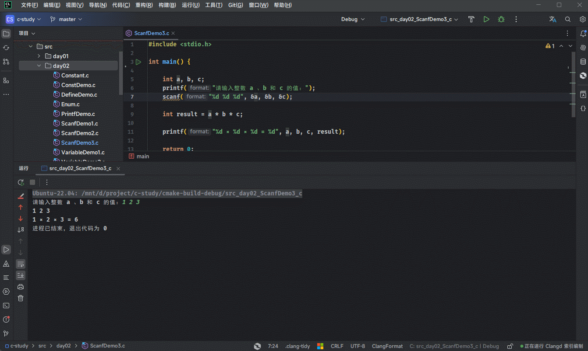

* 原因是 `scanf` 函数并不是直接让用户从键盘输入数据，而是先检查缓冲区，处理缓冲区中的数据；当遇到 `scanf` 函数时，程序会先检查输入缓冲区中是否有数据，所以解决方案就是`禁用缓冲区`，如下所示：

```c {5}
#include <stdio.h>

int main() {
    // 禁用 stdout 缓冲区
    setbuf(stdout, NULL);

    int a, b, c;
    printf("请输入整数 a 、b 和 c 的值：");
    scanf("%d %d %d", &a, &b, &c);

    int result = a * b * c;

    printf("%d × %d × %d = %d", a, b, c, result);

    return 0;
}
```

* 那么，就会达到我们想要的效果了，如下所示：

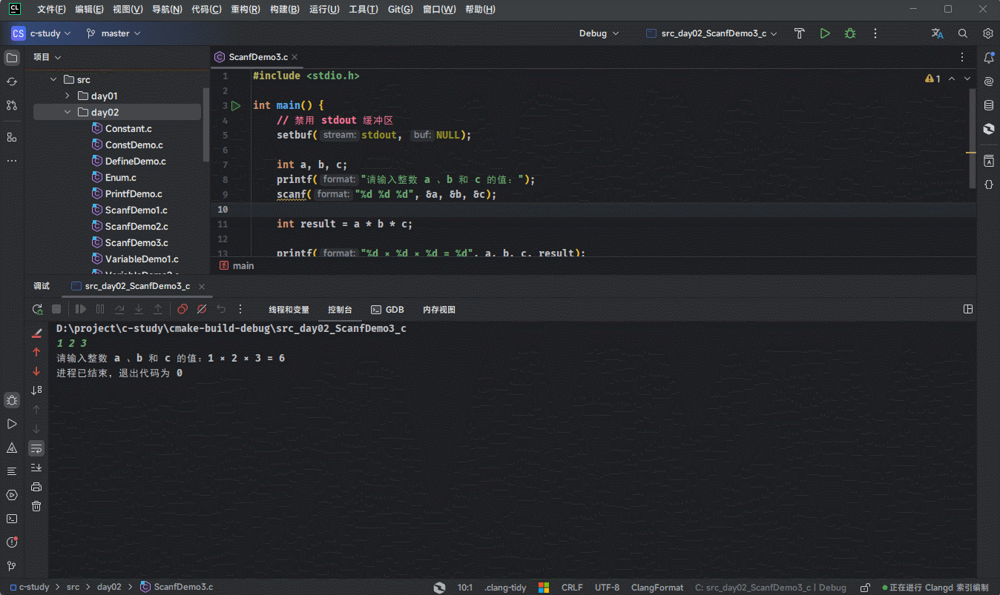

## 3.3 Win 中文乱码问题

* 之前，我们提及到，在 Win 中，如果出现`中文乱码`问题，就需要去`语言和区别`设置`系统区域`的编码为 UTF-8 ；但是，这样可能会造成其它的软件出现中文乱码问题，如：Xshell 等。

> [!NOTE]
>
> * ① 之所以，修改系统的编码为 UTF-8 会出现问题，是因为早期的 Win 系统的中文默认编码是 GBK（目前也是，Win 并没有强制第三方软件使用 UTF-8 编码） ，而 Xshell 等也使用的这些编码，一旦我们修改为 UTF-8 之后，可能会造成这些第三方软件出现中文乱码问题（第三方软件适配问题，相信将来应该都会切换为 UTF-8 编码），体验较差！！！
> * ② 在 Linux 或 MacOS 之所以不会出现中文乱码的问题，是因为这些系统默认的编码就是 UTF-8 。

* 其实，还有一种解决方案，如下所示：

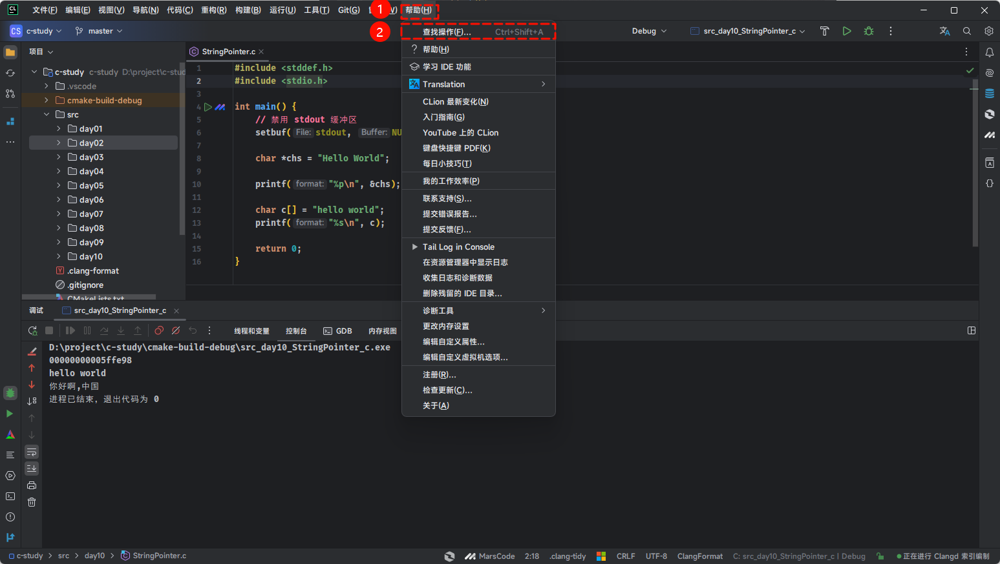

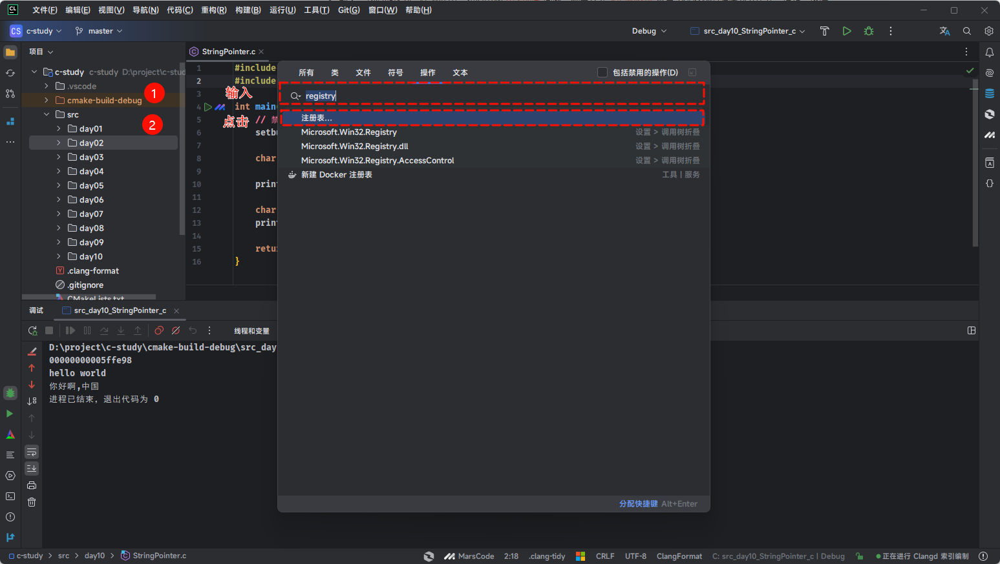

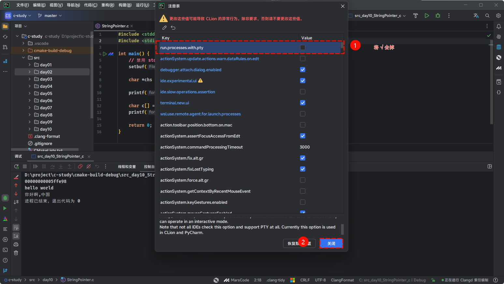

* 测试一下，是否配置成功：

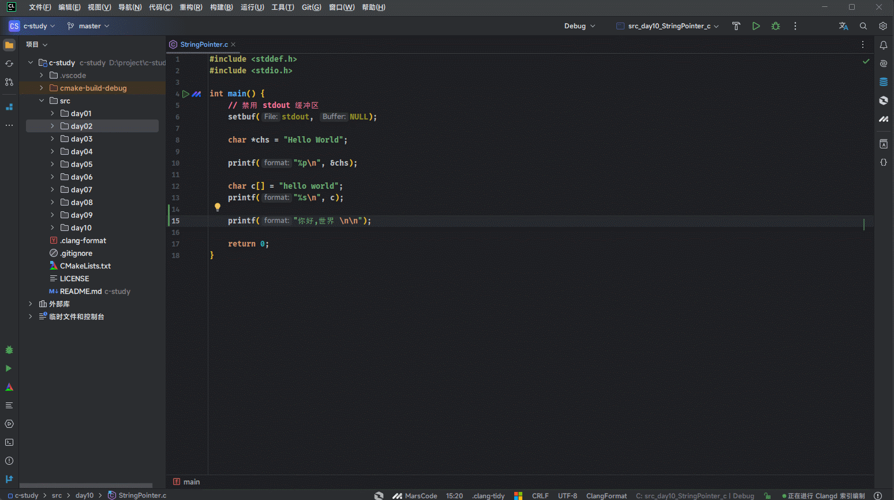

## 3.4 CLion 中自动导入头文件

* 在 CLion 中，最为强大的功能就是直接输入函数，然后让 IDE 帮我们自动导入头文件，包括自定义的头文件，相当实用。

> [!NOTE]
>
> * ① CLion 中的`自动导入头文件`的`快捷键`是 `Alt + Enter` 。
> * ② CLion 中的`自动提取变量的类型`的`快捷键`是 `Ctrl + Alt + V` 。

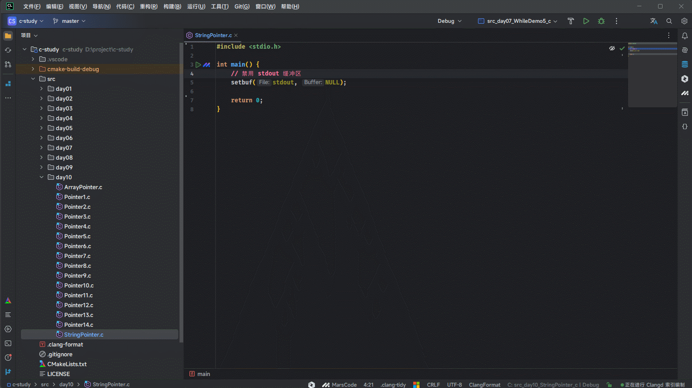

* 开启自动导入头文件的步骤，如下所示：

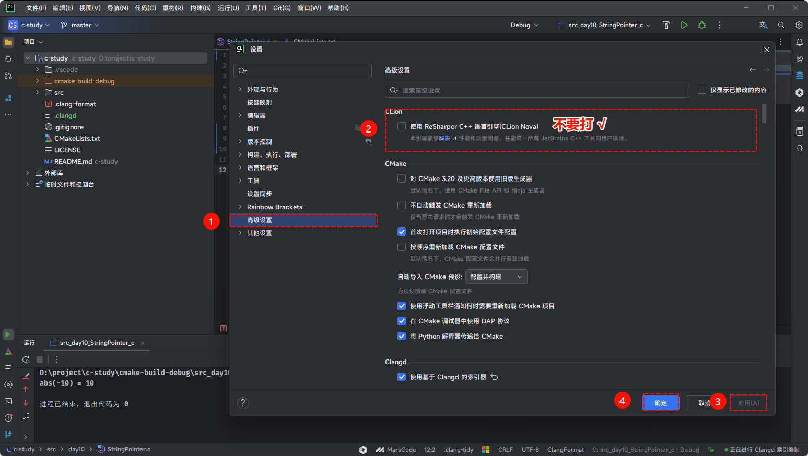

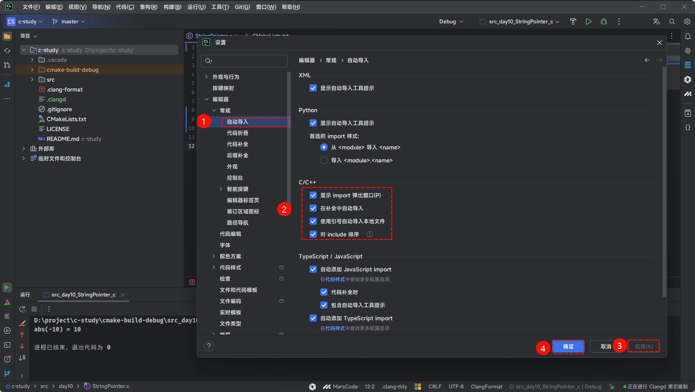

## 3.5 WSL2 启用 systemd

### 3.5.1 概述

* 根据 [systemd.io](https://systemd.io/)：“systemd 是 Linux 系统的基本构建基块套件。 它提供一个系统和服务管理器，该管理器作为 PID 1 运行并启动系统的其余部分。”
* Systemd 主要是一个 init 系统和服务管理器，它包括按需启动守护程序、装载和自动装载点维护、快照支持以及使用 Linux 控制组进行跟踪等功能。
* 大多数主要的 Linux 发行版现在都运行 systemd，因此在 WSL2 上启用它可使体验更接近于使用裸机 Linux。

> [!CAUTION]
>
> * ① 默认情况下，在 WSL2 中，只有 Ubuntu 才会将 systemd 作为 pid-1 的守护进程（微软维护和定制的 Ubuntu 版本，在 GitHub 的 Codespace 中默认的 Linux  环境就是 Ubuntu）。而其余基于 WSL2 为内核的 Linux 发行版本并不会将 systemd 作为 pid-1 的守护进程，而是会使用 init 作为 pid-1 的守护进程。
> * ② 需要注意的是，很多 Linux 软件都需要 systemd 来进行管理，如：Docker 。
> * ③ 本次以 AlmaLinux9 作为演示！！！

* 检查进程树，判断 systemd 是否正在运行：

```shell
ps -p 1 -o comm= # 如果显示 systemd ，则表示 systemd 正在运行
```

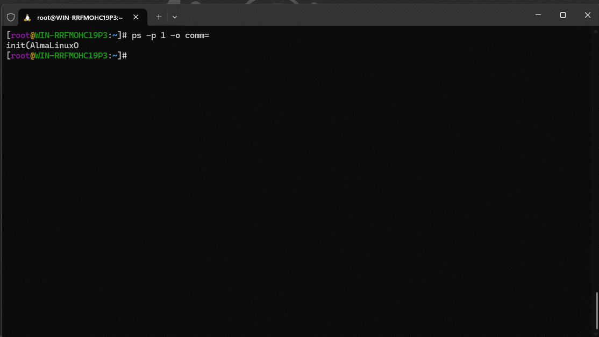

### 3.5.2 操作步骤

* ① 查询 WSL2 的版本，确保 WSL2 的版本为 `0.67.6` 或更高版本：

```shell
# 如果未满足要求，则使用 wsl --update 更新 WSL2 版本
wsl --version # 在 win 中的 cmd 或 PowerShell 执行该命令
```


* ② 向 `/etc/wsl.conf` 配置文件中写入以下内容：

```shell
cat <<EOF | tee /etc/wsl.conf 
[boot]
systemd=true
EOF
```


* ③ 重启 WSL 实例：

```shell
wsl --shutdown # 在 win 中的 cmd 或 PowerShell 执行该命令
```

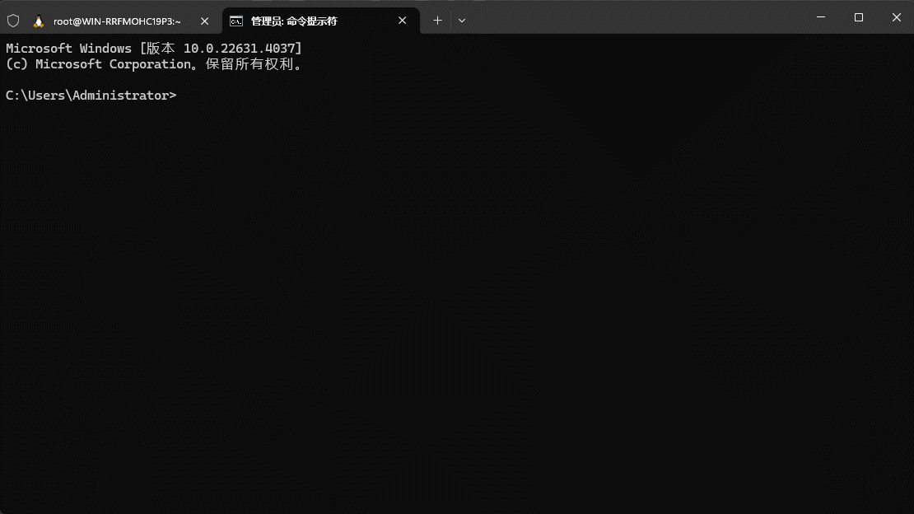

* ④ 查看是否启用成功：

```shell
ps -p 1 -o comm=
```

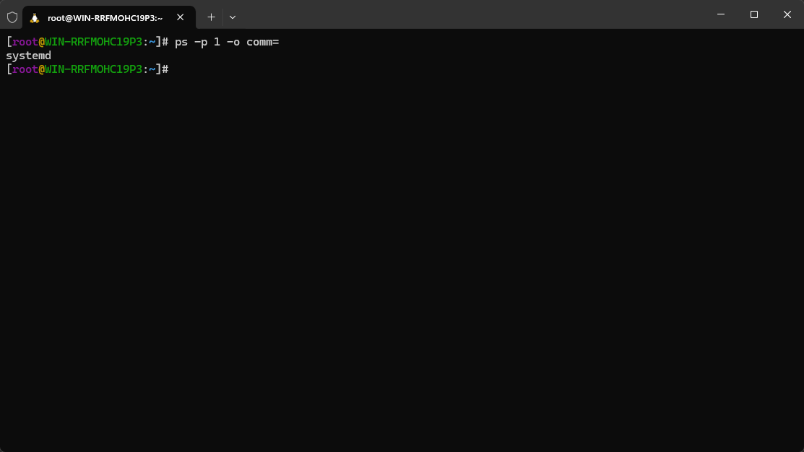

## 3.6 GCC 查看支持的 C 语言标准版本

### 3.6.1 概述

* GCC 是个跨平台的项目，支持 Windows、Linux 和 MacOS ，那么查看它支持的 C 语言标准版本就非常重要，以防止我们使用了新的 C 语言语法，本地却还是旧的 GCC 支持的 C 语言标准。

### 3.6.2 查看支持 C 语言标准版本的方法

* 可以执行如下的命令，查看 GCC 支持的 C 语言标准的版本：

```c
gcc -E -dM - </dev/null | grep "STDC_VERSION"
```

> [!NOTE]
>
> 其实就是通过 `__STDC_VERSION__` 的值，来查看支持的版本：
>
> * 如果没有查到，则默认是 c89 的标准。
> * 如果是 `#define __STDC_VERSION__ 199901L`，则默认支持的是 C99 标准。
> * 如果是 `#define __STDC_VERSION__ 201112L`，则默认支持是的 C11 标准。
> * 如果是 `#define __STDC_VERSION__ 201710L`，则默认支持的是 C17 标准。
> * 如果是 `#define __STDC_VERSION__ 2023xxL`，则默认支持的是 C23 标准。
>
> 需要说明的是，在本文撰写之前，C23 标准目前还是草案，并没有完全确定下来。

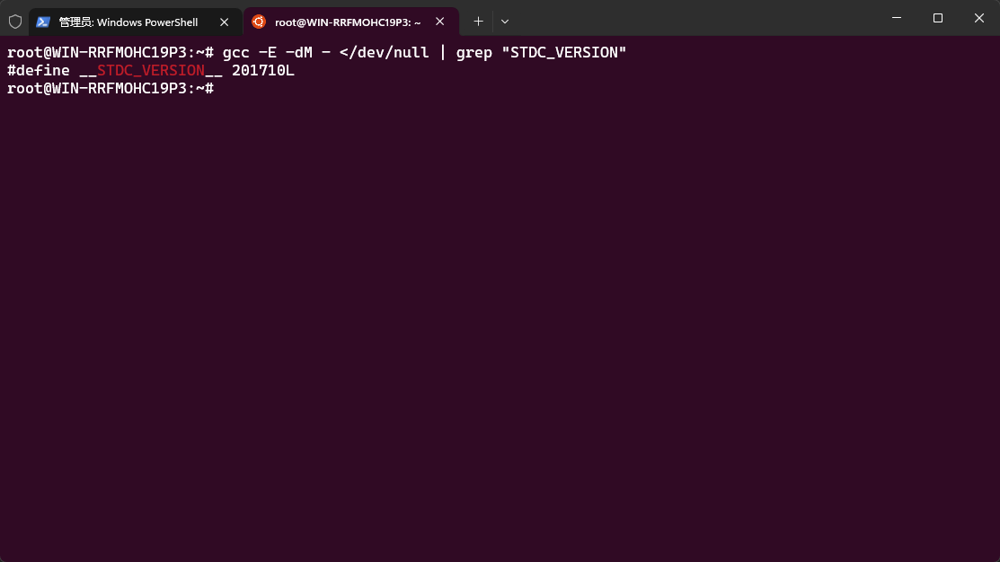

### 3.6.3 切换 GCC 默认支持的 C 语言标准版本

#### 3.6.3.1 环境变量方式

* 可以通过设置一个环境变量，来更改默认的 C 语言的标准版本：

```shell
echo 'export CFLAGS="-std=c11"' >> ~/.bashrc
```

```shell
source ~/.bashrc
```

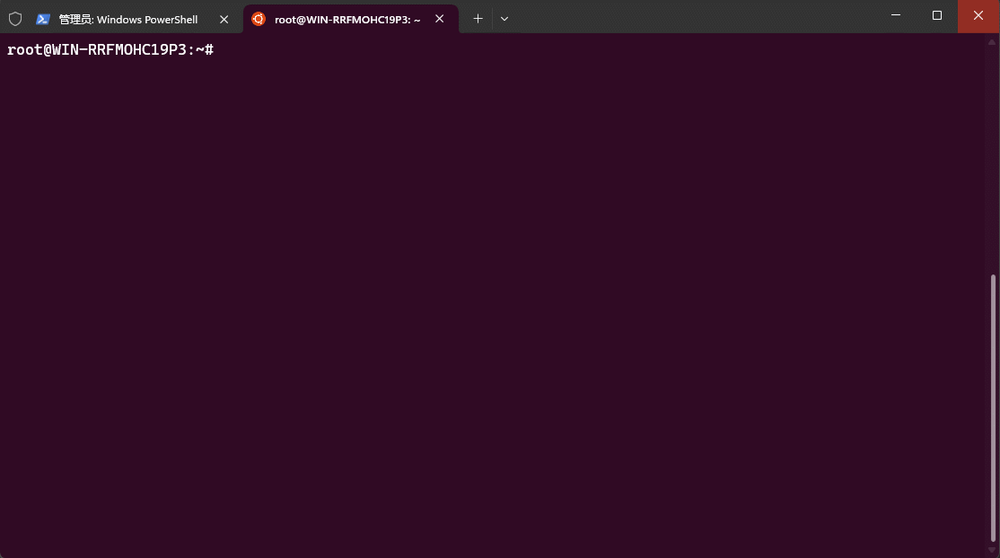

* 验证是否有效：

```shell
echo $CFLAGS
```

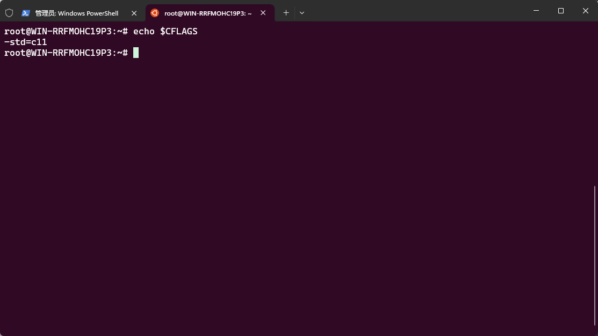

#### 3.6.3.2 CMake 方式

* CMake 方式最简单了，只需要修改配置文件 CMakeLists.txt 文件，如下所示：

```txt {6}
cmake_minimum_required(VERSION 3.22.1)

project(c-study VERSION 1.0 LANGUAGES C)

# 设置 C 标准
set(CMAKE_C_STANDARD 23)

...
```

#### 3.6.3.3 命令行方式

* 有的时候，我们临时想验证某个版本的新特性，就可以只用在命令行中添加参数，来改变支持的 C 语言标准版本，如下所示：

```shell
gcc -std=c89 ...
```

```shell
gcc -std=c99 ...
```

```shell
gcc -std=c11 ...
```

```shell
gcc -std=c17 ...
```

## 3.7 CLion 如何集成 MSYS2?

### 3.7.1 概述

* CLion 在 Windows 中默认集成的是 `MinGW`，可能无法满足我们的需求，我们需要使用 `MSYS2` ，因为其提供的包管理器太好用了。

> [!NOTE]
>
> `MSYS2` 包含了 `MinGW`，这也是为什么推荐在 `Windows` 上使用 `MSYS2` 的其中一个原因。

### 3.7.2 集成方法

* ① 所有设置：

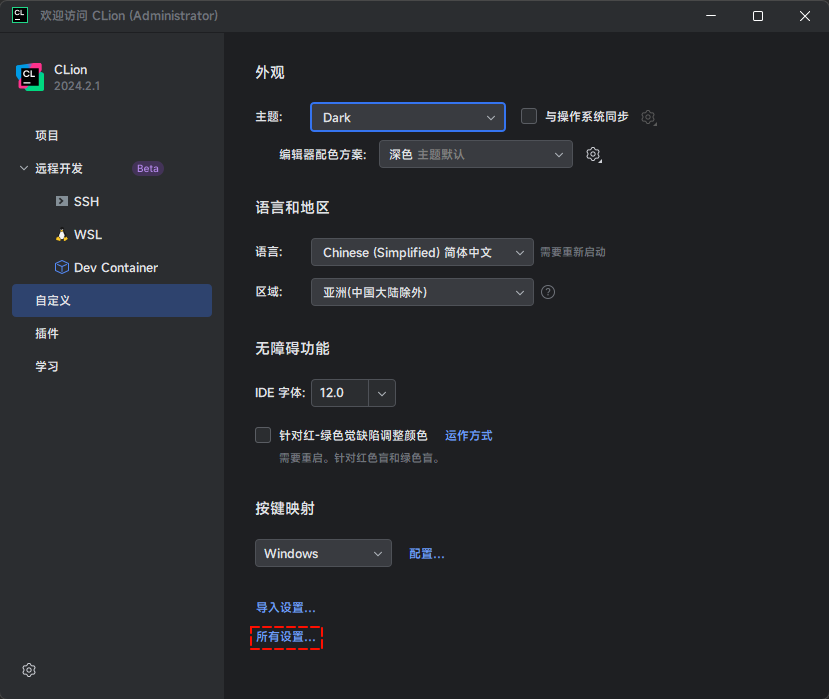

* ② 工具链：

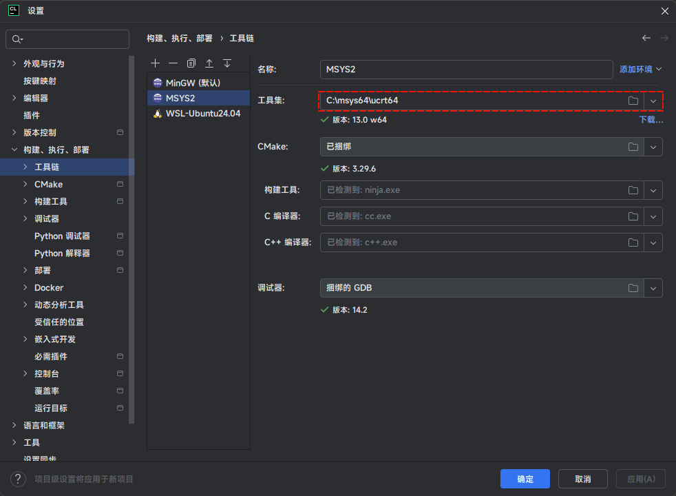

## 3.8 CLion 中代码模板的使用

### 3.8.1 概述

* 在学习 C 语言的过程中，可能会不停的写这样的模板代码，如下所示：

```c
#include <stdio.h>

int main() {

    // 禁用 stdout 缓冲区
    setbuf(stdout, nullptr);
    
    return 0;
}
```

* 刚开始写，还感觉比较新鲜，非常好玩。但是，随着时间的深入，我们会感觉特别繁琐，又很无聊。那么，能否在 CLion 中配置一下，让其为我们自动生成呢？

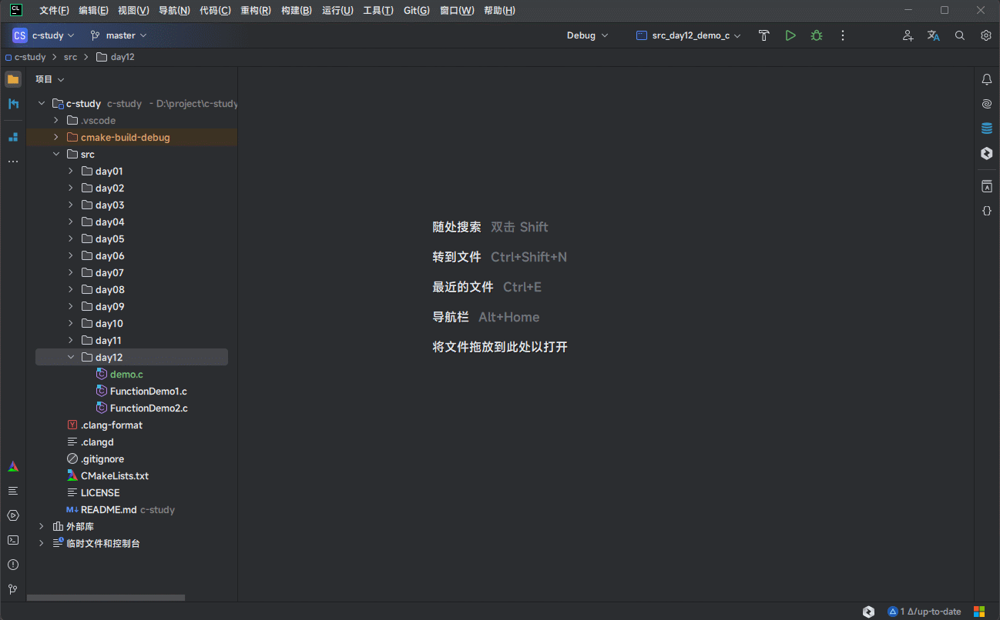

### 3.8.2 配置方法

* ① 点击`设置`：


* ② `编辑器` --> `文件和代码模板`：


* ③ 点击`+`，配置对应的内容：

> [!NOTE]
>
> ::: details 点我查看 模板的内容
>
> ```c
>#[[#include]]# <stdio.h>
> 
> int main() {
> 
> // 禁用 stdout 缓冲区
> setbuf(stdout, nullptr);
>  
>  
> 
> return 0;
> }
>  ```
> :::


# 第四章：Visual Studio 解析

## 4.1 概述

* 微软在官网上，是这么评价自己的 IDE 的，如下所示：


> [!NOTE]
>
> * ① 虽然之后的文章都是以 CLion 为基础的。
> * ② 但是，有很多开发 C/C++ 的程序员，喜欢微软的 Visual Studio，毕竟号称“宇宙第一 IDE” 。

## 4.2 创建项目

* ① 打开 Visual Studio，选择`继续但无需代码`：


* ② 进入主界面：

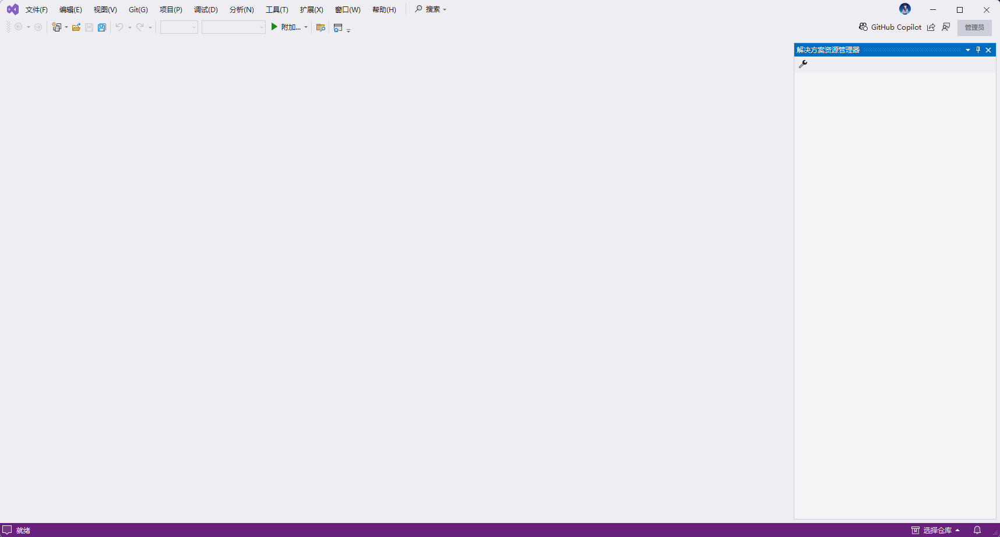

* ③ 点击 VS 菜单栏的`文件-->新建-->项目`，进行项目创建：


* ④ 选择`项目模板`（控制台项目）：

> [!NOTE]
>
> * ① 也可以选择空项目或 CMake 项目。
> * ② 不过，本次以`控制台`项目作为演示！！！


* ⑤ 进入项目配置页面：

> [!NOTE]
>
> 需要填写项目配置相关的信息，如下所示：
>
> * ① 项目的名称。
> * ② 位置。
> * ③ 解决方案名称。


## 4.3 项目配置

### 4.3.1 概述

* 在上述的`项目配置`页面，我们不难发现需要我们填写`项目的名称`、`位置`以及`解决方案名称`；那么，解决方案是什么？和项目名称又有什么关系？

### 4.3.2 解决方案 VS 项目

* `解决方案是 VS 中进行代码开发的顶层结构，它是一个或多个项目的容器。`用于协调多个项目之间的关系和依赖性，尤其是在大型应用程序开发中。解决方案不仅仅是项目的简单列表，它还包括项目之间的依赖关系、编译顺序以及其他元数据。

> [!NOTE]
>
> 解决方案的文件夹下通常会自动生成一个扩展名为 `xxx.sln`  的文件，来保存这些项目之间关系的信息。

* `项目是一个 C 程序构建过程中的基本组织单元。`目中会包含：源代码文件、资源文件（如图片或数据文件）、配置信息文件等。

> [!NOTE]
>
> * ① VS 中的项目是一个进行开发的基本单元，一个解决方案至少有一个项目，也可以包含多个项目，这些项目之间是可以相互依赖的。
>* ② 解决方案是项目的集合。

* 那么，`解决方案`和`项目`在逻辑上，就是这样的：


> [!NOTE]
>
> 如果你使用 CLion 进行项目开发；那么，CLion 和 VS 还是有点差别的，如下所示：
>
> * CLion 中的`模块`对应 VS 中的`项目`。
> * CLion 中的`项目`对应 VS 中的`解决方案`。

* 其实，从`位置`中，我们也可以看出 VS 中的`解决方案`和`项目`的关系，如下所示：


## 4.4 创建源文件

* 当项目创建完成后，会显示如下的界面：

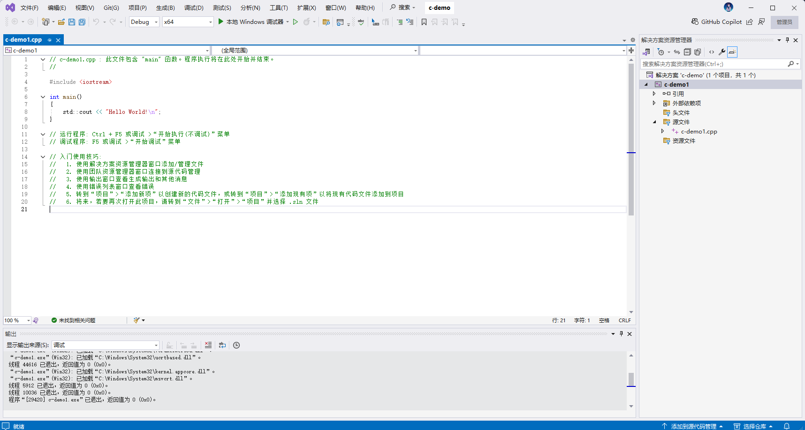

* 但是，项目默认创建的不是 C 源文件，而是 C++ 源文件；此时，我们需要将其删掉，再创建 C 源文件，如下所示：

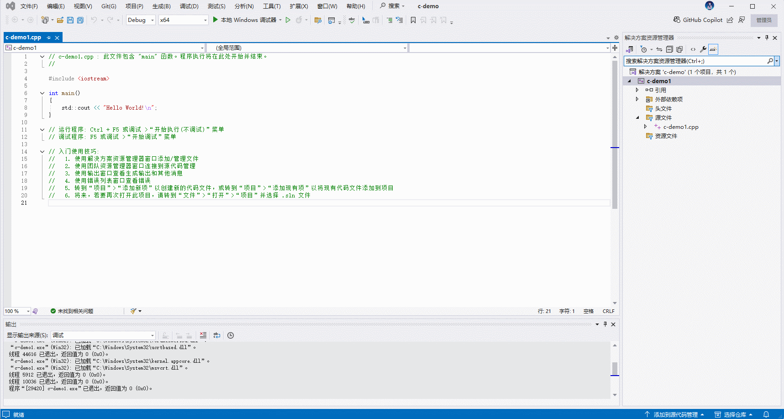

## 4.5 编写 C 代码

* 创建好了 C 源文件之后，就可以编写 C 代码了，如下所示：

> [!NOTE]
>
> 演示的 C 语言代码，如下所示：
>
> ::: details 点我查看
>
> ```c
> #include <stdio.h>
> 
> int main(){
> 
>  printf("Hello World!!!");
> 
>  return 0;
> }
> ```
>
> :::
>
> 编写完毕之后，记住需要通过 Ctrl + S 快捷键来保存！！！

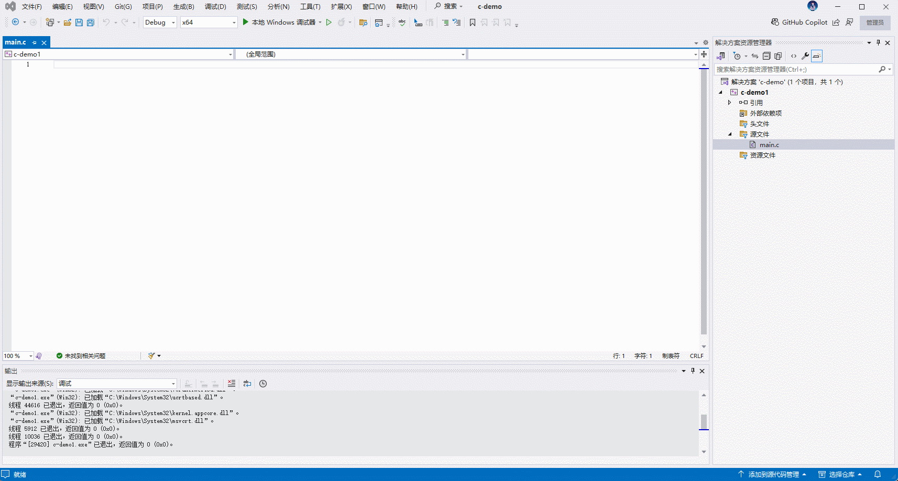

* 代码编写完毕之后，就可以通过 VS 菜单栏上的按钮来启动程序，如下所示：

> [!NOTE]
>
> * ① 如果点击的是`本地 Windows 调试器`按钮来启动程序，此时程序将以`Debug`的模式来启动。
> * ② 如果点击的是`开始执行（不调试）`按钮来启动程序，此时程序将以`正常`的模式来启动。

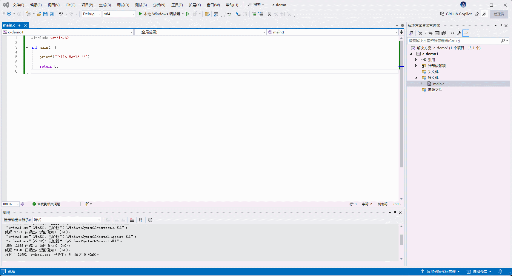

## 4.6 VS 中项目目录说明

* 在 VS 中的解决方案管理器中，我们可以看到项目下面分为了好几个层级，如下所示：

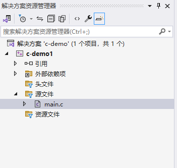

* 我们可以在`解决方案管理`中选择一个`项目`，通过`鼠标右键`点击`在文件资源管理器中打开文件夹`来查看，解决方案在硬盘上的实际文件目录，如下所示：

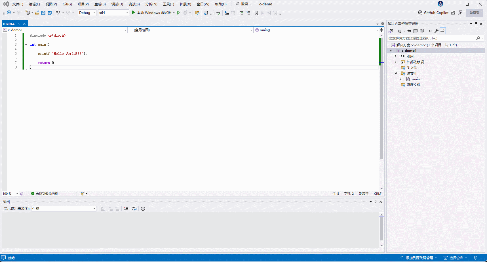

* 但是，我们却发现并没有我们想要的`头文件目录夹`、`源文件目录夹`等，如下所示：

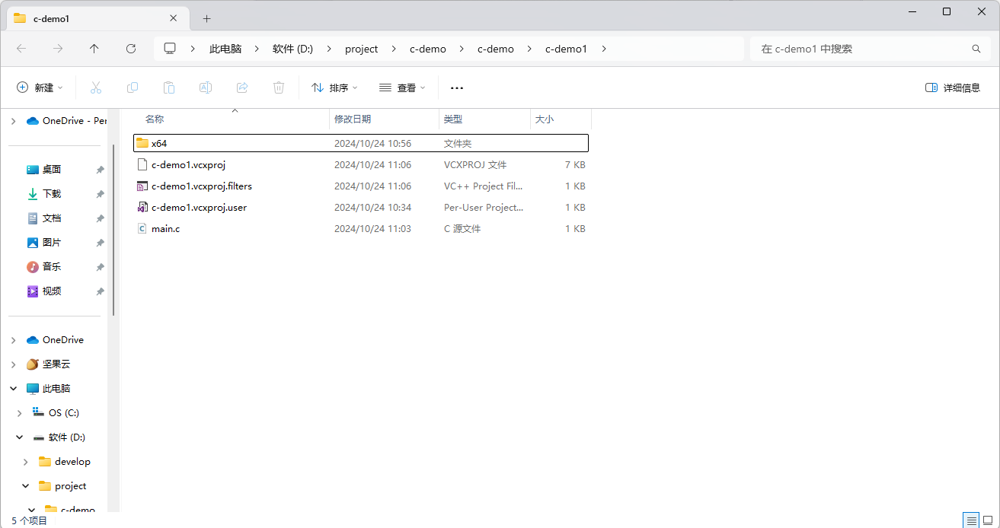

* 其实，是因为 VS 项目中的`头文件目录夹`、`源文件目录夹`等并不是物理上的目录，而是一个逻辑上的目录而言，是虚拟的，它们是存储在 `xxx.vcxproj` 文件中，该文件用来存储同一个项目中的各个文件之间的关系。那么，VS 中的解决方案、项目以及项目中的文件就是这样的，如下所示：


> [!CAUTION]
>
> * ① 对于 VS 中的项目而言，一个项目只能有一个 main 函数；如果有多个 main 函数，VS 将不清楚项目的入口到底在哪里？
> * ② 如果希望写两个以上的 main 函数，那么请创建多个项目！！！

## 4.7 多项目启动

* 在解决方案中再创建一个项目，形成多项目，如下所示：

> [!NOTE]
>
> 如果解决方案中有多个项目，VS 会为每个项目都生成可执行文件！！！

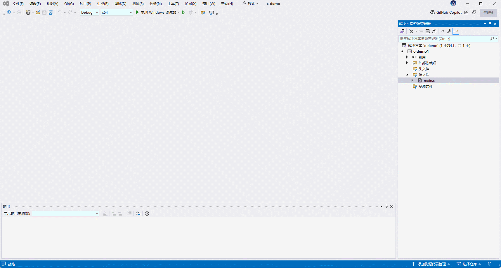

* 其实，不管我们怎么启动程序，都会发现默认启动的只是 VS 中的第一个项目，如下所示：

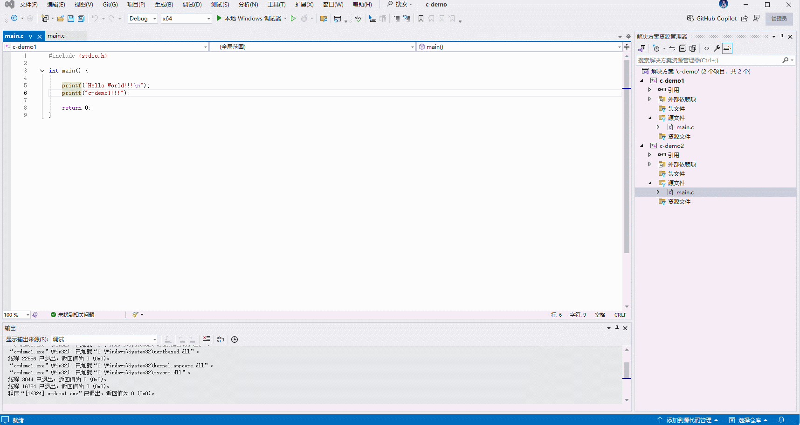

* 其实，当前正在启动的项目，项目名称是加粗的，如下所示：

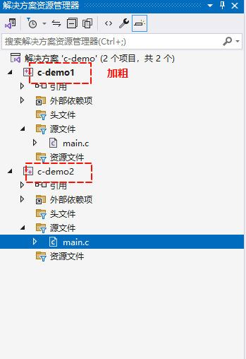

* 对于多项目，我们可以在`解决方案资源管理器`中的`项目名`，通过`鼠标右键`设置该项目为`启动项目`，如下所示：


* 当然，VS 除了可以设置固定的启动项目外，还可以将`启动项目`设置为`当前选定的内容`，如下所示：


## 4.8 更好用的代码提示功能

* 之前，在写代码的时候，遇到代码提示，总需要先按 Tab 键再回车，实现麻烦，如下所示：

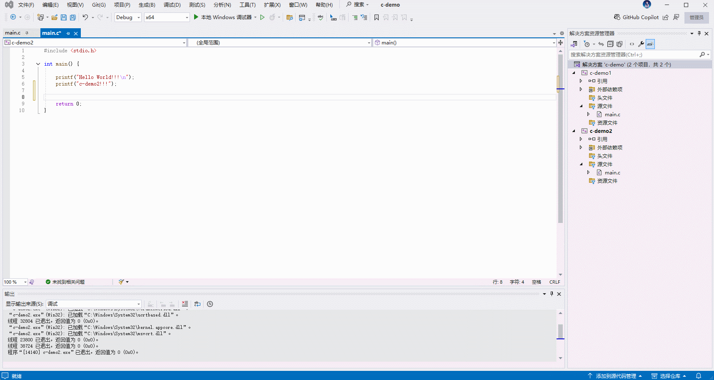

* 其实，也可以设置为直接按回车就可以选择代码，如下所示：

> [!NOTE]
>
> 步骤：
>
> * ① VS 的菜单栏中的`工具 --> 选项`。
> * ② 在左侧的导航树中，选择`文本编辑器-->C/C++-->高级`。
> * ③ 在右侧的设置列表中，将`主动提交成员列`表改为 `True` 。

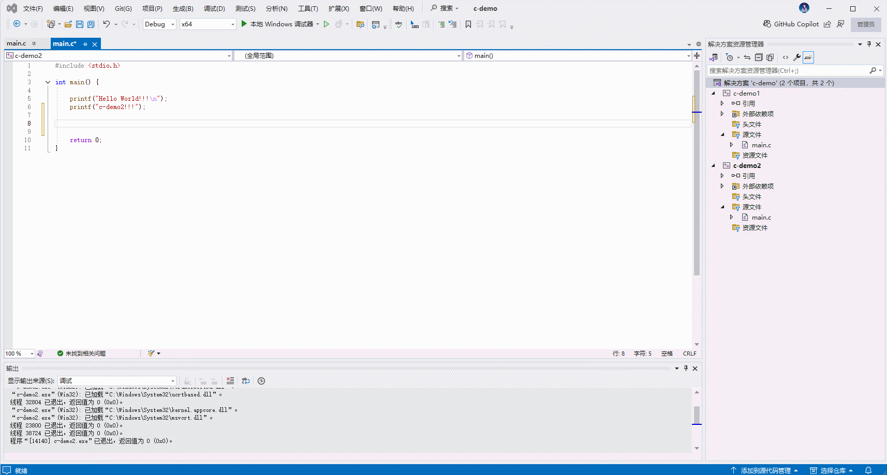

## 4.9 查看或修改项目中 C 语言的版本

* 我们可以查看或修改项目中的 C 语言的版本，如下所示：

> [!NOTE]
>
> 步骤：
>
> * ① 选择`项目`，`鼠标右键`。
> * ② 找到`属性`，`鼠标左键`并`点击`。
> * ③ 在`配置属性`中的`常规`中，就可以查看或修改项目中 C 语言的版本。

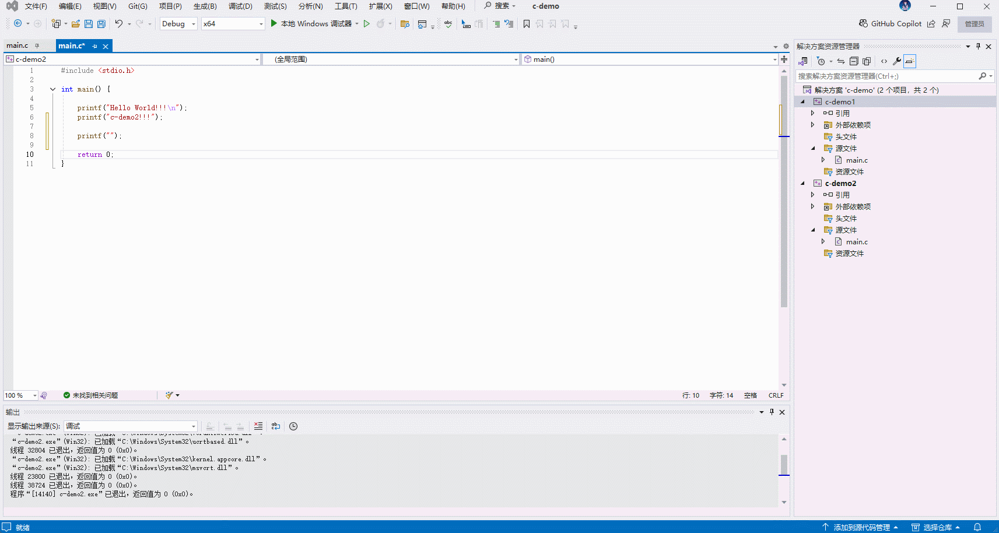

## 4.10 多项目启动插件

* 在使用 VS 学习 C 语言中的过程中，不可避免要创建多个项目，如果像上面的方式进行多项目的启动，实在太麻烦了，其实我们可以安装`可视化`的`启动项目`的插件（`SwitchStartupProject`），如下所示：

> [!NOTE]
>
> 步骤：
>
> * ① VS 的菜单栏中的`扩展--> 管理扩展`中，搜索该插件。
> * ② 安装并重启 VS。

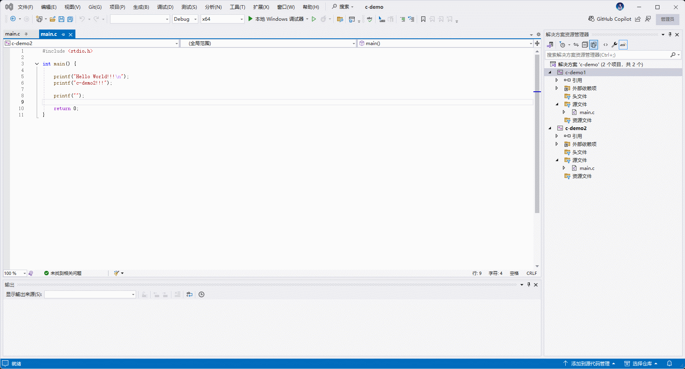

* 此时，就可以很方便的进行项目的切换了，如下所示：

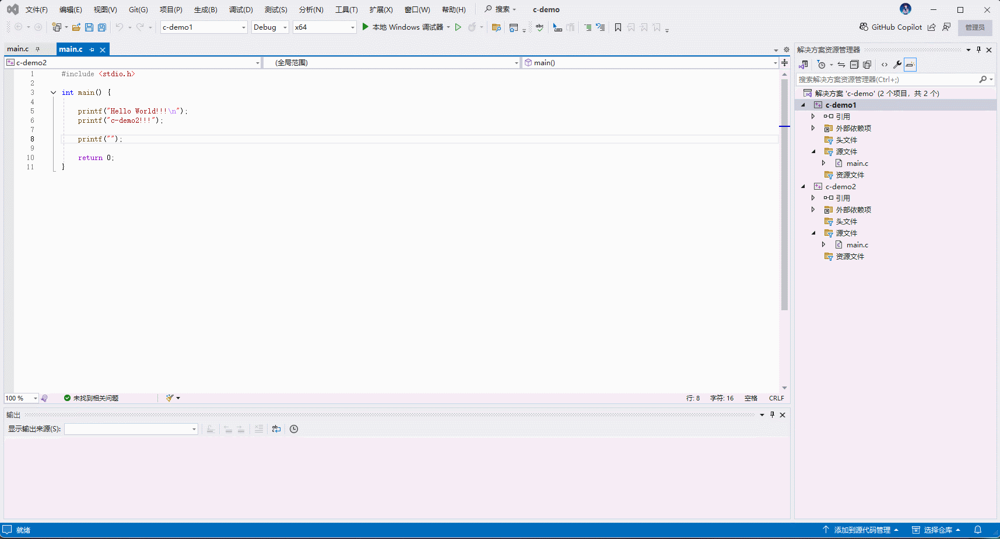

## 4.11 固定当前项目为启动项目

* 安装了上述的插件，虽然切换项目很方便；但是，还需要每次都点击选择启动项，如下所示：


* 我们希望点击那个项目中的 `main.c` 文件，那个项目就是启动项目；此时，我们就可以这么设置，如下所示：

> [!NOTE]
>
> 步骤：
>
> * ① VS 的菜单栏中的`工具--> 选项`。
> * ② 在左侧的导航树中，选择`项目和生成方案`。
> * ③ 在右侧的设置列表中，选中`对于新解决方案，使用当前选定的项目作为启动项目`。

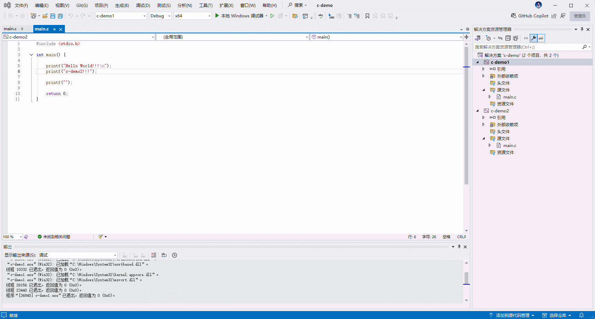

* 此时，就可以实现我们上述的目标了，如下所示：

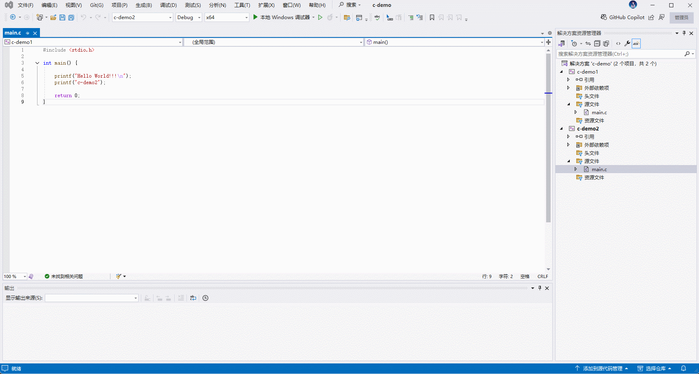


# 第五章：XShell 连接 WSL2

## 5.1 概述

* 有的时候，我们会觉得，微软自带的命令行工具并不是很好用，而希望使用自己熟悉的 Linux 远程连接工具，如：XShell 等。

## 5.2 XShell 连接 Ubuntu24.04

### 5.2.1 关闭防火墙

* 安装防火墙：

```shell
sudo apt update -y && apt -y upgrade
```

```shell
sudo apt install ufw -y
```

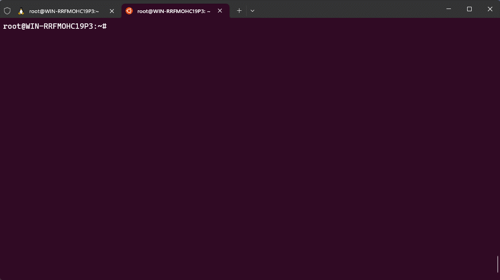

* 关闭防火墙：

```shell
sudo ufw disable
```

```shell
sudo systemctl disable --now ufw
```

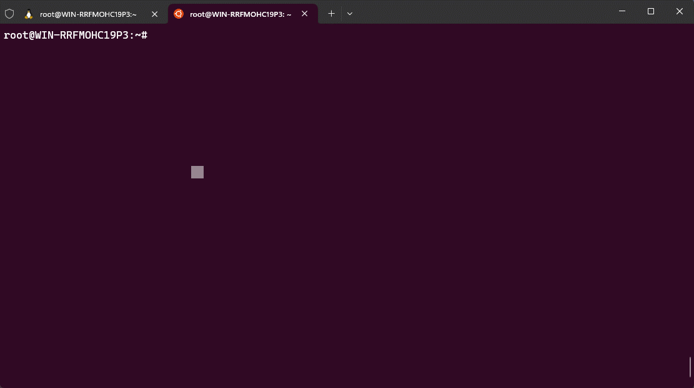

* 查询防火墙状态：

```shell
sudo ufw status
```

```shell
sudo systemctl status ufw
```

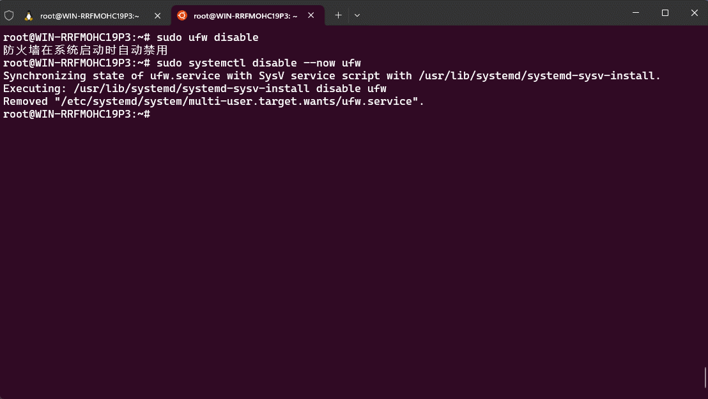

### 5.2.2 配置 sshd 服务

* 安装 sshd 服务器：

```shell
sudo apt update -y && apt -y upgrade
```

```shell
sudo apt install -y openssh-server
```

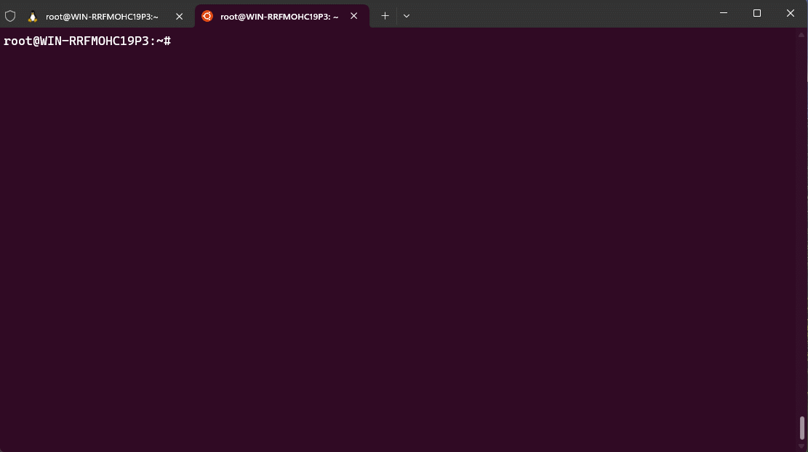

* 编辑 `sshd_config` 配置文件：

```shell
sudo vim /etc/ssh/sshd_config
```

```shell
Port 2404 # 修改，第 14 行
ListenAddress 0.0.0.0 # 修改，第 16 行
PermitRootLogin yes # 修改，第 33 行
PasswordAuthentication yes # 修改，第 57 行
KbdInteractiveAuthentication no # 修改，第 62 行
```


* 重启 ssh 服务：

```shell
sudo service ssh restart
```

```shell
sudo systemctl enable --now ssh
```

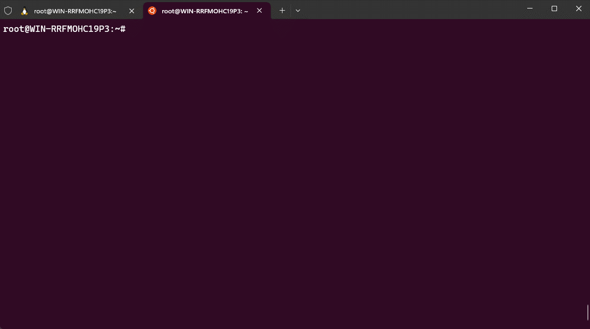

* 查看 ssh 服务：

```shell
sudo service ssh status
```


### 5.2.3 修改 root 密码

* 修改 root 密码：

```shell
sudo passwd root
```

> [!NOTE]
>
> * ① 密码是 `123456` 。
> * ② 本地环境弱密码没什么关系；但是，在生产环境中，密码必须复杂且定时更新！！！

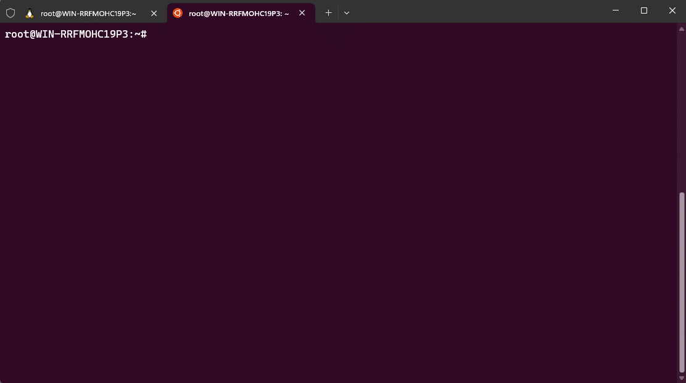

### 5.2.4 Xshell 连接 Ubuntu24.04

* 在 Xshell 中配置 Ubuntu 的 IP 和端口，并建立连接：

> [!NOTE]
>
> * IP 是 `127.0.0.1` 。
> * 端口是 `2404` 。
> * 用户名是 `root` 。
> * 密码是 `123456` 。

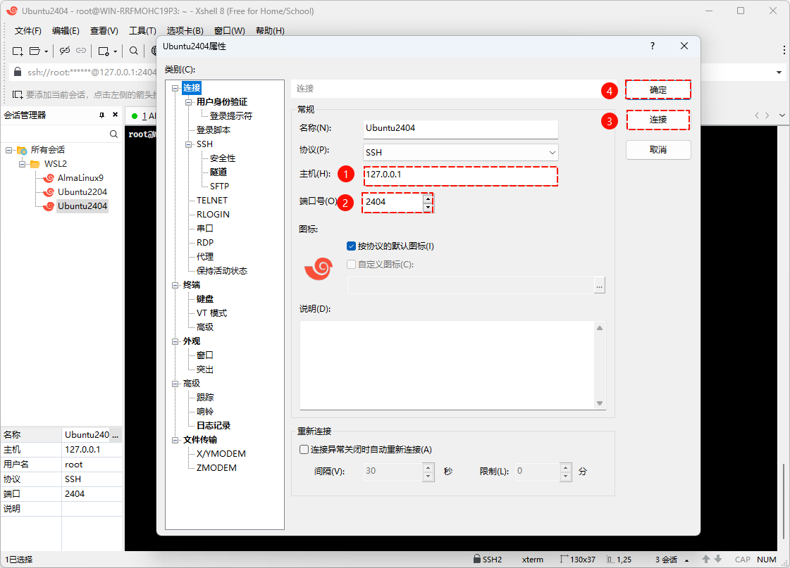

## 5.3 XShell 连接 AlmaLinux9

### 5.3.1 关闭防火墙

* 安装防火墙：

```shell
sudo dnf -y update && dnf -y upgrade
```

```shell
sudo dnf -y install firewalld
```

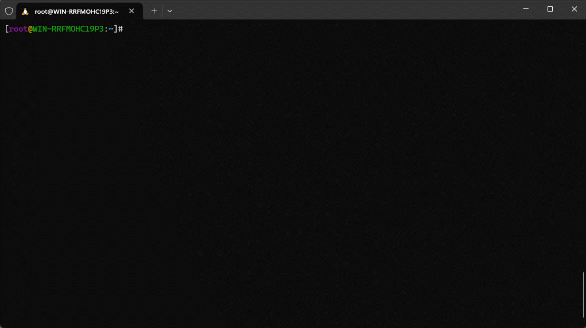

* 关闭防火墙：

```shell
sudo systemctl stop firewalld
```

```shell
sudo systemctl disable --now firewalld
```

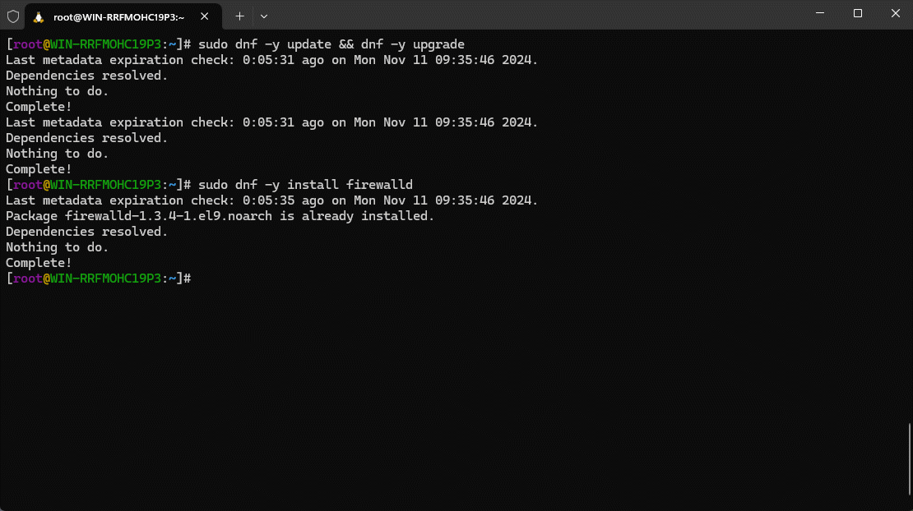

* 查看防火墙的状态：

```shell
sudo systemctl status firewalld
```

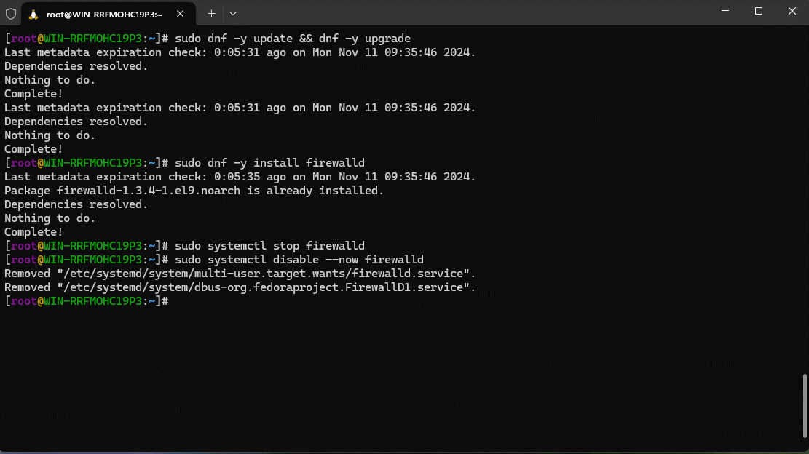

### 5.3.2 配置 sshd 服务

* 安装 sshd 服务器：

```shell
sudo dnf update -y && dnf -y upgrade
```

```shell
sudo dnf -y install openssh-server
```

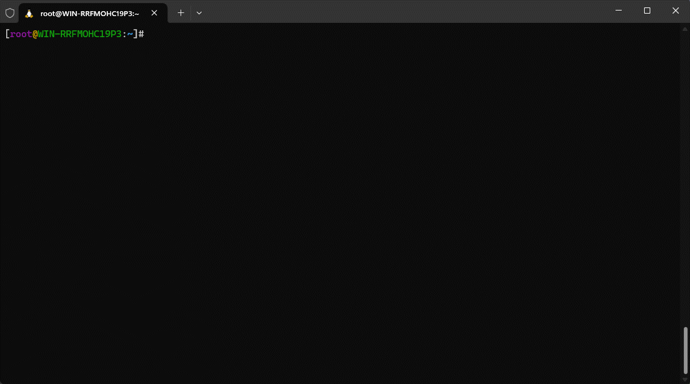

* 编辑 `sshd_config` 配置文件：

```shell
sudo vim /etc/ssh/sshd_config
```

```shell
Port 9 # 修改，第 21 行
ListenAddress 0.0.0.0 # 修改，第 23 行
PermitRootLogin yes # 修改，第 40 行
PasswordAuthentication yes # 修改，第 65 行
KbdInteractiveAuthentication no # 修改，第 69 行
```


* 重启 sshd 服务：

```shell
sudo systemctl restart sshd
```

```shell
sudo systemctl enable --now sshd
```

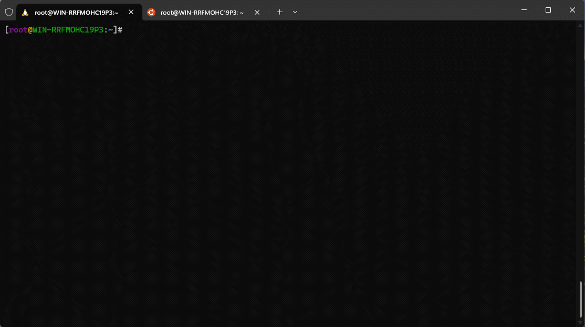

* 查看 sshd 服务：

```shell
sudo systemctl status sshd
```

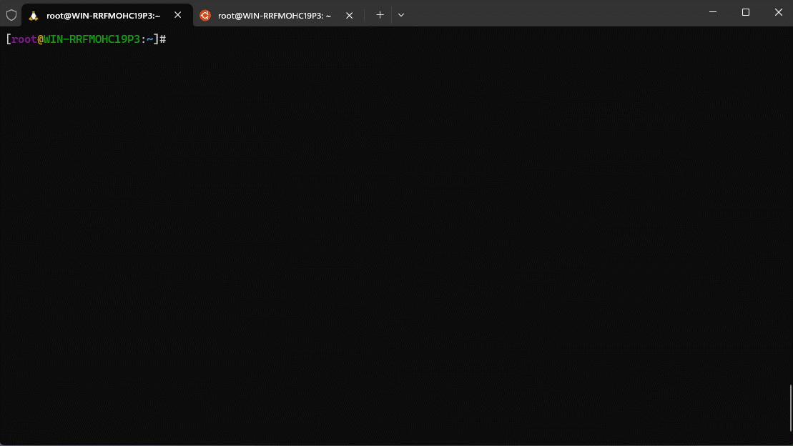

### 5.3.3 修改 root 密码

* 修改 root 密码：

```shell
sudo passwd root
```

> [!NOTE]
>
> * ① 密码是 `123456` 。
> * ② 本地环境弱密码没什么关系；但是，在生产环境中，密码必须复杂且定时更新！！！

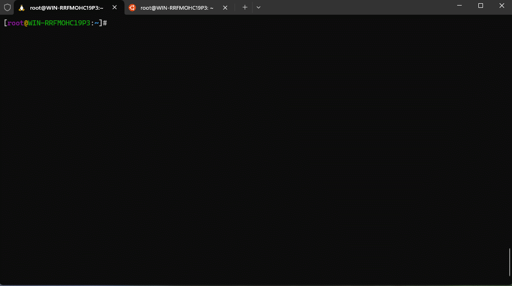

### 5.3.4 Xshell 连接 AlmaLinux9

* 在 Xshell 中配置 AlmaLinux9的 IP 和端口，并建立连接：

> [!NOTE]
>
> * IP 是 `127.0.0.1` 。
> * 端口是 `9` 。
> * 用户名是 `root` 。
> * 密码是 `123456` 。

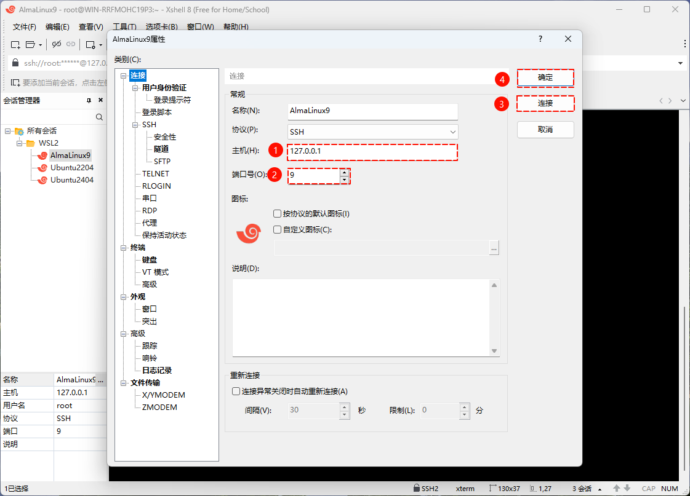
