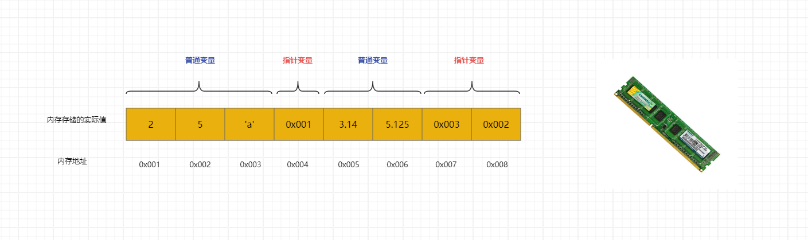
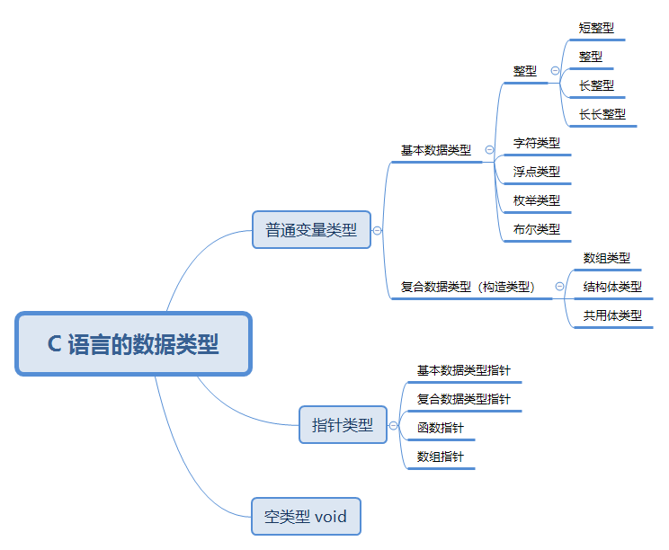
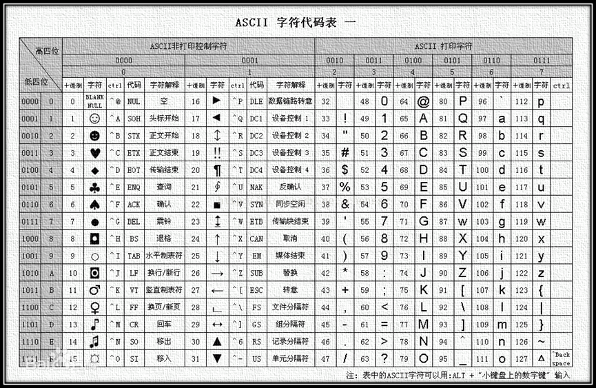
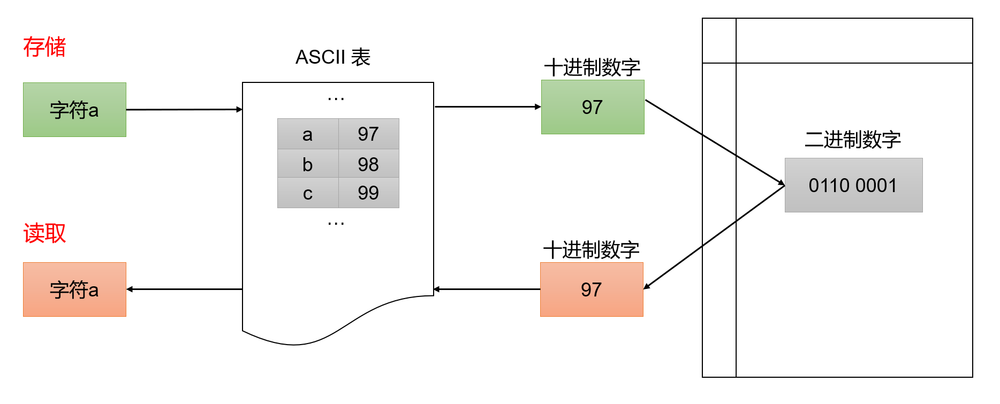
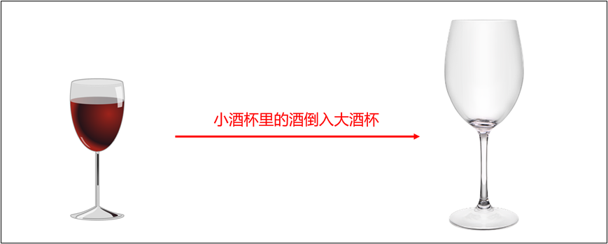
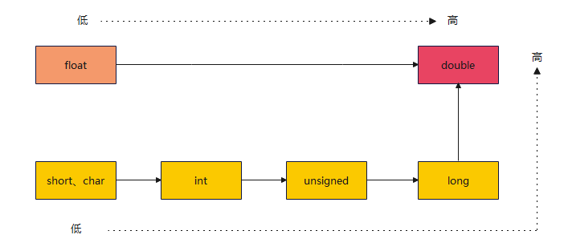

# 第一章：前言

## 1.1 普通变量和指针变量

* 根据`变量`中`存储`的`值`的`不同`，我们可以将`变量`分为两类：
  * `普通变量`：变量所对应的内存中存储的是`普通值`。
  * `指针变量`：变量所对应的内存中存储的是`另一个变量的地址`。

* 如下图所示：



## 1.2 普通变量和指针变量的异同点

* 普通变量和指针变量的相同点：

  * 普通变量有内存空间，指针变量也有内存空间。
  * 普通变量有内存地址，指针变量也有内存地址。
  * 普通变量所对应的内存空间中有值，指针变量所对应的内存空间中也有值。

  普通变量和指针变量的不同点：

  * 普通变量所对应的内存空间存储的是普通的值，如：整数、小数、字符等；指针变量所对应的内存空间存储的是另外一个变量的地址。
  * 普通变量有普通变量的运算方式，而指针变量有指针变量的运算方式（后续讲解）。

## 1.3 C 语言中变量的分类

* 在 C 语言中变量的数据类型就可以这么划分，如下所示：



> [!NOTE]
>
> * 根据`普通变量`中`存储`的`值`的类型不同，可以将`普通变量类型`划分为`基本数据类型`（整型、字符类型、浮点类型、布尔类型）和`复合数据类型`（数组类型、结构体类型、共用体类型、枚举类型）。
> * 根据`指针变量`所`指向空间`中`存储`的`值`的类型不同，可以将`指针类型`分为`基本数据类型指针`、`复合数据类型指针`、`函数指针`、`数组指针`等，例如：如果指针所指向的空间保存的是 int 类型，那么该指针就是 int 类型的指针。


# 第二章：整数类型（⭐）

## 2.1 概述

* 整数类型简称整型，用于存储整数值，如：12、20、50 等。
* 根据所占`内存空间`大小的不同，可以将整数类型划分为：
* ① 短整型：

| 类型                                 | 存储空间（内存空间） | 取值范围                            |
| ------------------------------------ | -------------------- | ----------------------------------- |
| unsigned short （无符号短整型）      | 2 字节               | 0 ~ 65,535 (2^16 - 1)               |
| [signed] short（有符号短整型，默认） | 2 字节               | -32,768 (- 2^15) ~ 32,767 (2^15 -1) |

* ② 整型：

| 类型                             | 存储空间（内存空间） | 取值范围                                    |
| -------------------------------- | -------------------- | ------------------------------------------- |
| unsigned int（无符号整型）       | 4 字节（通常）       | 0 ~ 4294967295 (0 ~2^32 -1)                 |
| [signed] int（有符号整型，默认） | 4 字节（通常）       | -2147483648（- 2^31） ~ 2147483647 (2^31-1) |

* ③ 长整型：

| 类型                                | 存储空间（内存空间） | 取值范围        |
| ----------------------------------- | -------------------- | --------------- |
| unsigned long（无符号长整型）       | 4 字节（通常）       | 0 ~2^32 -1      |
| [signed] long（有符号长整型，默认） | 4 字节（通常）       | - 2^31 ~ 2^31-1 |

* ④ 长长整型：

| 类型                                     | 存储空间（内存空间） | 取值范围        |
| ---------------------------------------- | -------------------- | --------------- |
| unsigned long long（无符号长整型）       | 8 字节（通常）       | 0 ~2^64 -1      |
| [signed] long long（有符号长整型，默认） | 8 字节（通常）       | - 2^63 ~ 2^63-1 |

> [!NOTE]
>
> * ① 数据类型在内存中占用的存储单元（字节数），就称为该数据类型的长度（步长），如：short 占用 2 个字节的内存，就称 short 的长度（步长）是 2。 
>
> * ② C 语言并没有严格规定各种整数数据类型在内存中所占存储单元的长度，只做了宽泛的限制：
>
>   * short 至少占用 2 个字节的存储单元。
>   * int 建议为一个机器字长（指计算机的处理器在一次操作中能够处理的二进制数据的位数，机器字长是处理器的“字”长度，它决定了处理器在一个时钟周期内能够处理的数据量，如：早期的计算机的处理器通常是 8 位的机器字长，意味着处理器一次只能处理 8 位（二进制）数据；之后的计算机的处理器有 16 位的机器字长，意味着处理器一次可以处理 16 位的数据；再之后计算机的处理器有 32 位或 64 位的机器字长，意味着处理器一次可以处理 32 位或 64位的数据）。即：32 位环境下 int 占用 4 个字节的存储单元，64 位环境下 int 占用 8 个字节的存储单元。
>   * short 的长度（步长）不能大于 int，long 的长度（步长）不能小于 int，long long 不能小于 long。
>
> * ③ 那么，各种整数数据类型在内存中所占存储单元的长度的公式就是 `2 ≤ sizeof(short) ≤ sizeof(int) ≤ sizeof(long) ≤ sizeof(long long)`，具体的存储空间由编译系统自行决定。其中，`sizeof` 是测量类型或变量、常量长度的`运算符`。

> [!IMPORTANT]
>
> * ① 之所以这么规定，是为了可以让 C 语言长久使用，因为目前主流的 CPU 都是 64 位，但是在 C 语言刚刚出现的时候，CPU 还是以 8 位和 16 位为主。如果当时就将整型定死为 8 位或 16 位，那么现在我们肯定不会再学习 C 语言了。
> * ② 整型分为有符号 signed 和无符号 unsigned 两种，默认是 signed。
> * ③ 在实际开发中，`最常用的整数类型`就是 `int` 类型了，如果取值范围不够，就使用 long 或 long long 。
> * ④ C 语言中的`格式占位符`非常多，只需要大致了解即可；因为，我们在实际开发中，一般都会使用 C++ 或 Rust 以及其它的高级编程语言，如：Java 等，早已经解决了必须通过`格式占位符`来才能将变量进行输入和输出。

## 2.2 短整型（了解）

* 语法：

```c
unsigned short x = 10 ; // 无符号短整型
```

```c
short x = -10; // 有符号短整型
```

> [!NOTE]
>
> * ① 有符号表示的是正数、负数和 0 ，即有正负号。无符号表示的是 0 和正数，即正整数，没有符号。
> * ② 在 `printf` 中`无符号短整型（unsigned short）`的`格式占位符`是 `%hu` ，`有符号短整型（signed short）`的`格式占位符`是 `%hd` 。
> * ③ 可以通过 `sizeof` 运算符获取`无符号短整型（unsigned short）` 和 `有符号短整型（signed short）` 的`存储空间（所占内存空间）`。
> * ③ 可以通过 `#include <limits.h>` 来获取 `无符号短整型（unsigned short）` 和`有符号短整型（signed short）`的`取值范围`。


* 示例：定义和打印短整型变量

```c
#include <stdio.h>

int main() {

    // 禁用 stdout 缓冲区
    setbuf(stdout, nullptr);
    
    // 定义有符号 short 类型
    signed short s1 = -100;

    printf("s1 = %hd \n", s1); // s1 = -100

    // 定义无符号 short 类型
    unsigned short s2 = 100;
    printf("s2 = %hu \n", s2); // s2 = 100

    // 定义 short 类型，默认是有符号
    short s3 = -200;
    printf("s3 = %hd \n", s3); // s3 = -200

    return 0;
}
```


* 示例：获取类型占用的内存大小（存储空间）

```c
#include <stdio.h>

int main() {
    
    // 禁用 stdout 缓冲区
    setbuf(stdout, nullptr);

    size_t s1 = sizeof(unsigned short);
    printf("unsigned short 的存储空间是 %zu 字节 \n", s1); // 2

    size_t s2 = sizeof(signed short);
    printf("signed short 的存储空间是 %zu 字节 \n", s2); // 2

    size_t s3 = sizeof(short);
    printf("short 的存储空间是 %zu 字节 \n", s3); // 2

    return 0;
}
```


* 示例：获取类型的取值范围

```c
#include <limits.h>
#include <stdio.h>

int main() {
    
    // 禁用 stdout 缓冲区
    setbuf(stdout, nullptr);

    // [0,65535]
    printf("unsigned short 类型的范围是[0,%hu]\n", USHRT_MAX); 
    // [-32768,32767]
    printf("short 类型的范围是[%hd,%hd]\n", SHRT_MIN,SHRT_MAX); 

    return 0;
}
```

## 2.3 整型

* 语法：

```c
unsigned int x = 10 ; // 无符号整型
```

```c
int x = -10; // 有符号整型
```

> [!NOTE]
>
> * ① 有符号表示的是正数、负数和 0 ，即有正负号。无符号表示的是 0 和正数，即正整数，没有符号。
> * ② 在 `printf` 中`无符号整型（unsigned int）`的`格式占位符`是 `%u` ，`有符号整型（signed int）`的`格式占位符`是 `%d` 。
> * ③ 可以通过 `sizeof` 运算符获取`无符号整型（unsigned int）` 和 `有符号整型（signed int）` 的`存储空间（所占内存空间）`。
> * ③ 可以通过 `#include <limits.h>` 来获取 `无符号整型（unsigned int）` 和`有符号整型（signed int）`的`取值范围`。


* 示例：定义和打印整型变量

```c
#include <stdio.h>

int main() {
    
    // 禁用 stdout 缓冲区
    setbuf(stdout, nullptr);

    // 定义有符号 int 类型
    signed int i1 = -100;
    printf("i1 = %d \n", i1); // i1 = -100

    // 定义无符号 int 类型
    unsigned int i2 = 100;
    printf("i2 = %u \n", i2); // i2 = 100

    // 定义 int 类型，默认是有符号
    short i3 = -200;
    printf("i3 = %d \n", i3); // i3 = -200

    return 0;
}
```


* 示例：获取类型占用的内存大小（存储空间）

```c
#include <stdio.h>

int main() {
    
    // 禁用 stdout 缓冲区
    setbuf(stdout, nullptr);

    size_t i1 = sizeof(unsigned int);
    printf("unsigned int 的存储空间是 %zu 字节 \n", i1); // 4

    size_t i2 = sizeof(signed int);
    printf("signed int 的存储空间是 %zu 字节 \n", i2); // 4

    size_t i3 = sizeof(int);
    printf("int 的存储空间是 %zu 字节 \n", i3); // 4

    return 0;
}
```


* 示例：获取类型的取值范围

```c
#include <limits.h>
#include <stdio.h>

int main() {
    
    // 禁用 stdout 缓冲区
    setbuf(stdout, nullptr);

    // [0,4294967295]
    printf("unsigned int 类型的范围是[0,%u]\n", UINT_MAX);
    // [-2147483648,2147483647]
    printf("int 类型的范围是[%d,%d]\n", INT_MIN,INT_MAX); 

    return 0;
}
```

## 2.4 长整型（了解）

* 语法：

```c
unsigned long x = 10 ; // 无符号长整型
```

```c
long x = -10; // 有符号长整型
```

> [!NOTE]
>
> * ① 有符号表示的是正数、负数和 0 ，即有正负号。无符号表示的是 0 和正数，即正整数，没有符号。
> * ② 在 `printf` 中`无符号长整型（unsigned long）`的`格式占位符`是 `%lu` ，`有符号长整型（signed long）`的`格式占位符`是 `%ld` 。
> * ③ 可以通过 `sizeof` 运算符获取`无符号长整型（unsigned long）` 和 `有符号长整型（signed long）` 的`存储空间（所占内存空间）`。
> * ③ 可以通过 `#include <limits.h>` 来获取 `无符号长整型（unsigned long）` 和`有符号长整型（signed long）`的`取值范围`。


* 示例：定义和打印长整型变量

```c
#include <stdio.h>

int main() {
    
    // 禁用 stdout 缓冲区
    setbuf(stdout, nullptr);

    // 定义有符号 long 类型
    signed long l1 = -100;
    printf("l1 = %ld \n", l1); // l1 = -100

    // 定义无符号 long 类型
    unsigned long l2 = 100;
    printf("l2 = %lu \n", l2); // l2 = 100

    // 定义 long 类型，默认是有符号
    long l3 = -200;
    printf("l3 = %ld \n", l3); // l3 = -200

    return 0;
}
```


* 示例：获取类型占用的内存大小（存储空间）

```c
#include <stdio.h>

int main() {
    
    // 禁用 stdout 缓冲区
    setbuf(stdout, nullptr);

    size_t l1 = sizeof(unsigned long);
    printf("unsigned long 的存储空间是 %zu 字节 \n", l1); // 4

    size_t l2 = sizeof(signed long);
    printf("signed long 的存储空间是 %zu 字节 \n", l2); // 4

    size_t l3 = sizeof(long);
    printf("long 的存储空间是 %zu 字节 \n", l3); // 4

    return 0;
}
```


* 示例：获取类型的取值范围

```c
#include <limits.h>
#include <stdio.h>

int main() {
    
    // 禁用 stdout 缓冲区
    setbuf(stdout, nullptr);

    // [0,4294967295]
    printf("unsigned long 类型的范围是[0,%lu]\n", ULONG_MAX);
    // [-2147483648,2147483647]
    printf("long 类型的范围是[%ld,%ld]\n", LONG_MIN,LONG_MAX);

    return 0;
}
```

## 2.5 长长整型（了解）

* 语法：

```c
unsigned long long x = 10 ; // 无符号长长整型
```

```c
long long x = -10; // 有符号长长整型
```

> [!NOTE]
>
> * ① 有符号表示的是正数、负数和 0 ，即有正负号。无符号表示的是 0 和正数，即正整数，没有符号。
> * ② 在 `printf` 中`无符号长长整型（unsigned long long）`的`格式占位符`是 `%llu` ，`有符号长长整型（signed long long）`的`格式占位符`是 `%lld` 。
> * ③ 可以通过 `sizeof` 运算符获取`无符号长长整型（unsigned long long）` 和 `有符号长长整型（signed long long）` 的`存储空间（所占内存空间）`。
> * ③ 可以通过 `#include <limits.h>` 来获取 `无符号长长整型（unsigned long long）` 和`有符号长长整型（signed long long）`的`取值范围`。


* 示例：定义和打印长长整型变量

```c
#include <stdio.h>

int main() {
    
    // 禁用 stdout 缓冲区
    setbuf(stdout, nullptr);

    // 定义有符号 long long 类型
    signed long long ll1 = -100;
    printf("ll1 = %lld \n", ll1); // ll1 = -100

    // 定义无符号 long long 类型
    unsigned long long ll2 = 100;
    printf("ll2 = %llu \n", ll2); // ll2 = 100

    // 定义 long long 类型，默认是有符号
    long long ll3 = -200;
    printf("ll3 = %lld \n", ll3); // ll3 = -200

    return 0;
}
```


* 示例：获取类型占用的内存大小（存储空间）

```c
#include <stdio.h>

int main() {
    
    // 禁用 stdout 缓冲区
    setbuf(stdout, nullptr);

    size_t ll1 = sizeof(unsigned long long);
    printf("unsigned long long 的存储空间是 %zu 字节 \n", ll1); // 8

    size_t ll2 = sizeof(signed long long);
    printf("signed long long 的存储空间是 %zu 字节 \n", ll2); // 8

    size_t ll3 = sizeof(long long);
    printf("long long 的存储空间是 %zu 字节 \n", ll3); // 8

    return 0;
}
```


* 示例：获取类型的取值范围

```c
#include <limits.h>
#include <stdio.h>

int main() {
    
    // 禁用 stdout 缓冲区
    setbuf(stdout, nullptr);

     // [0,18446744073709551615]
    printf("unsigned long long 类型的范围是[0,%llu]\n", ULLONG_MAX);
    // [-9223372036854775808,9223372036854775807]
    printf("long long 类型的范围是[%lld,%lld]\n", LLONG_MIN,LLONG_MAX); 

    return 0;
}
```

## 2.6 字面量后缀

* `字面量`是`源代码`中一个`固定值`的`表示方法`，用于直接表示数据，即：

```c
int num1 = 100; // 100 就是字面量
```

```c
long num2 = 100L; // 100L 就是字面量
```

```c
long long num3 = 100LL; // 100LL 就是字面量
```

> [!NOTE]
>
> * ① 默认情况下的，整数字面量的类型是 int 类型。
> * ② 如果需要表示 `long` 类型的字面量，需要添加后缀 `l` 或 `L` ，建议 `L`。
> * ③ 如果需要表示 `long long` 类型的字面量，需要添加后缀 `ll` 或 `LL`，建议 `LL` 。
> * ④ 如果需要表示`无符号`整数类型的字面量，需要添加 `u` 或 `U`，建议 `U` 。


* 示例：

```c
#include <stdio.h>

int main() {
    
    // 禁用 stdout 缓冲区
    setbuf(stdout, nullptr);

    int num = 100;
    printf("num = %d\n", num); // num = 100

    long num2 = 100L;
    printf("num2 = %ld\n", num2); // num2 = 100

    long long num3 = 100LL;
    printf("num3 = %lld\n", num3); // num3 = 100

    unsigned int num4 = 100U;
    printf("num4 = %u\n", num4); // num4 = 100

    unsigned long num5 = 100LU;
    printf("num5 = %lu\n", num5); // num5 = 100

    unsigned long long num6 = 100ULL;
    printf("num6 = %llu\n", num6); // num6 = 100

    return 0;
}
```

## 2.7 精确宽度类型

* 在前文，我们了解到 C 语言的整数类型（short 、int、long、long long）在不同计算机上，占用的字节宽度可能不一样。但是，有的时候，我们希望整数类型的存储空间（字节宽度）是精确的，即：在任意平台（计算机）上都能一致，以提高程序的可移植性。

> [!NOTE]
>
> * Java 语言中的数据类型的存储空间（字节宽度）是一致的，这也是 Java 语言能够跨平台的原因之一（最主要的原因还是 JVM）。
> * 在嵌入式开发中，使用精确宽度类型可以确保代码在各个平台上的一致性。

* 在 C 语言的标准头文件 `<stdint.h>` 中定义了一些新的类型别名，如下所示：

| 类型名称 | 含义            |
| -------- | --------------- |
| int8_t   | 8 位有符号整数  |
| int16_t  | 16 位有符号整数 |
| int32_t  | 32 位有符号整数 |
| int64_t  | 64 位有符号整数 |
| uint8_t  | 8 位无符号整数  |
| uint16_t | 16 位无符号整数 |
| uint32_t | 32 位无符号整数 |
| uint64_t | 64 位无符号整数 |

> [!NOTE]
>
> 上面的这些类型都是类型别名，编译器会指定它们指向的底层类型，如：在某个系统中，如果 int 类型是 32 位，那么 int32_t 就会指向 int ；如果 long 类型是 32 位，那么 int32_t 就会指向 long。


* 示例：

```c
#include <stdio.h>
#include <stdint.h>

int main() {
    
    // 禁用 stdout 缓冲区
    setbuf(stdout, nullptr);

    // 变量 x32 声明为 int32_t 类型，可以保证是 32 位(4个字节)的宽度。
    int32_t x32 = 45933945;
    printf("x32 = %d \n", x32); // x32 = 45933945

    return 0;
}
```

## 2.8 sizeof 运算符

* 语法：

```c
sizeof(表达式)
```

> [!NOTE]
>
> * ① sizeof 是运算符，不是内置函数。
>
> * ② 表达式可以是任何类型的数据类型、变量或常量。
> * ③ 用来获取某种数据类型、变量或常量占用的字节数量（内存中的存储单元），并且 `sizeof(...)` 的`返回值类型`是 `size_t` ；并且，如果是变量名称，可以省略 `()`；如果是数据类型，则不能省略 `()`。
> * ④ 在 `printf` 中使用占位符 `%zu` 来处理 `size_t` 类型的值。
> *  ⑤ 之前，也提过，C 语言没有一个统一的官方机构来制定或强制执行其标准，而是由一个标准委员会负责制定标准。不同的编译器可以选择部分或完全遵循这些标准。因此，C 语言的编译器实现可能会有所不同，这就要求程序员在编写跨平台代码时特别注意数据类型的大小和布局。
> * ⑥ 与 C 语言不同，Java 和 JavaScript 等语言的标准是强制性的。在 Java 语言中，`int` 类型在所有平台上都是 4 个字节，无论是在 Linux、MacOS 还是 Windows 上。因此，这些语言不需要像 C 语言那样依赖 `sizeof` 来处理不同平台上的数据类型大小差异，因为编译器已经在底层处理了这些差异。换言之，`sizeof` 运算符在 C 语言中的重要性在于它为程序员提供了一个处理不同平台上数据类型大小差异的工具。当然，如果你在 C 语言中，使用精确宽度类型，如：`int8_t`、`int16_t`、`int32_t`、`uint8_t`、 `uint16_t`、`uint32_t` 等，也可以确保代码在各个平台上的一致性。


* 示例：参数是数据类型

```c
#include <stdio.h>
#include <stddef.h>

int main() {
    
    // 禁用 stdout 缓冲区
    setbuf(stdout, nullptr);

    size_t s = sizeof(int);
    printf("%zu \n", s); // 4

    return 0;
}
```


* 示例：参数是变量

```c
#include <stdio.h>
#include <stddef.h>

int main() {
    
    // 禁用 stdout 缓冲区
    setbuf(stdout, nullptr);

    int num = 10;
    size_t s = sizeof(num);
    printf("%zu \n", s); // 4

    return 0;
}
```


* 示例：参数是常量

```c
#include <stdio.h>
#include <stddef.h>

int main() {
    
    // 禁用 stdout 缓冲区
    setbuf(stdout, nullptr);
    
    size_t s = sizeof(10);
    printf("%zu \n", s); // 4

    return 0;
}
```


# 第三章：数值溢出（⭐）

## 3.1 概述

* 在生活中，如果一个容器的容量是固定的，我们不停的向其中注入水，那么当容器中充满水之后，再继续注入，水就会从杯子中溢出来，如下所示：


* 在程序中也是一样的，各种整数类型在内存中占用的存储单元是不同的，如：short 在内存中占用 2 个字节的存储单元，int 在内存中占用 4 个字节的存储单元。这也就意味着，各种整数类型只能存储有限的数值，当数值过大或多小的时候，超出的部分就会被直接截掉，那么数值就不能被正确的存储，我们就将这种现象就称为`溢出`（overflow）。

> [!NOTE]
>
> * 如果这个数目前是`最大值`，再进行`加法`计算，数据就会超过该类型能够表示的最大值，叫做`上溢出`（如果最大值 + 1 会“绕回”到最小值）。
> * 如果这个数目前是`最小值`，再进行`减法`计算，数据就会超过该类型能够表示的最小值， 叫做`下溢出`（如果最小值 - 1 会“绕回”到最大值）。
>

> [!IMPORTANT]
>
> * ① 在 C 语言中，程序产生数值溢出的时候，并不会引发错误而使程序自动停止，这是因为计算机底层是采用二进制补码的运算规则进行处理的（很多编程语言也是这样处理的，如：Java 等）。
> * ② 但是，这可能会导致不可预料的后果，如：1996 年的亚利安 5 号运载火箭爆炸、2004 年的 Comair 航空公司航班停飞事故。
> * ③ 在实际开发中，编程时要特别注意，以避免数值溢出问题，特别是在涉及大数或小数的运算（特指整数）。

## 3.2 无符号数的取值范围

* 在 C 语言中，`无符号数`（unsigned 类型）的取值范围（最大值和最小值）的计算是很容易的，即：将内存中的所有位，设置为 `0` 就是`最小值`，设置为 `1` 就是`最大值`。

> [!IMPORTANT]
>
> 在 C 语言中，无符号整数，最高位不是符号位，它是数值的一部分。

* 以 `unsigned char` 类型为例，它在内存中占用的存储单元是 1 个字节，即 8 位。如果所有位都设置为 `0` ，它的最小值就是 `0` ；如果所有位设置为 `1` ，它的最大值就是 `2⁸ - 1 = 255` ，如下所示：


* 那么，`unsigned char` 的最大值是如何计算出来的？最简单的方法就是这样的，如下所示：

```txt
  1 × 2⁰ + 1 × 2¹ + 1 × 2² + 1 × 2³ + 1 × 2⁴ + 1 × 2⁵ + 1 × 2⁶ + 1 × 2⁷ 
= 1 + 2 + 4 + 8 + 16 + 32 + 64 + 128 
= 255
```

* 但是，这种计算方法虽然有效，但是非常麻烦，如果是 8 个字节的 long ，那么计算就非常麻烦了（可能要计算半天）。当然，我们也知道，这就是等比数列（高中知识），等比数列的公式，如下所示：

$S_n = a_1 \times \frac{1 - r^n}{1 - r}$

* 那么，结果就是：$S_8 = 1 \times \frac{1 - 2^8}{1 - 2} = \frac{1 - 256}{-1} = 255$

* 但是，貌似还是很复杂，我们可以换个思路，就是让 `1111 1111` 先 `+1` ，然后再 `-1`，这样一增一减正好抵消掉，并且不会影响最终的结果，如下所示：

```txt 
  1111 1111 + 1 - 1
= 10000 0000 - 1
= 2⁹⁻¹ - 1
= 2⁸ - 1 
= 255
```

* 其对应的换算过程，如下所示：


> [!IMPORTANT]
>
> * ① 当内存中所有的位都是 1 的时候，这种“凑整”的技巧非常实用！！！
> * ② 按照上述的技巧，我们可以很容易得计算出：
>   * `unsinged char`（1 个字节） 的取值范围是：`[0, 2⁸ - 1]`。
>   * `unsinged short`（2 个字节）的取值范围是：`[0, 2¹⁶ - 1]`。
>   * `unsinged int`（4 个字节）的取值范围是：`[0, 2³² - 1]`。
>   * `unsinged long`（8 个字节）的取值范围是：`[0, 2⁶⁴ - 1]`。

## 3.3 有符号数的取值范围

* 在 C 语言中，`有符号数`（signed 类型）在计算机底层是以`补码`的形式存储的（计算的时候，也是以补码的形式进行计算的，并且符号位参与计算）；但是，在读取的时候，需要采用`逆向`的转换，即：将补码转换为原码。

> [!IMPORTANT]
>
> 在 C 语言中，有符号整数，最高位是符号位，用于表示正负数。

* 以 `char` 类型为例，它的取值范围，如下所示：

| 补码          | 反码      | 原码      | 值       |
| ------------- | --------- | --------- | -------- |
| 1111 1111     | 1111 1110 | 1000 0001 | -1       |
| 1111 1110     | 1111 1101 | 1000 0010 | -2       |
| 1111 1101     | 1111 1100 | 1000 0011 | -3       |
| ...           | ...       | ...       | ...      |
| 1000 0011     | 1000 0010 | 1111 1101 | -125     |
| 1000 0010     | 1000 0001 | 1111 1110 | -126     |
| 1000 0001     | 1000 0000 | 1111 1111 | -127     |
| **1000 0000** | **---**   | **---**   | **-128** |
| 0111 1111     | 0111 1111 | 0111 1111 | 127      |
| 0111 1110     | 0111 1110 | 0111 1110 | 126      |
| 0111 1101     | 0111 1101 | 0111 1101 | 125      |
| ...           | ...       | ...       | ...      |
| 0000 0010     | 0000 0010 | 0000 0010 | 2        |
| 0000 0001     | 0000 0001 | 0000 0001 | 1        |
| 0000 0000     | 0000 0000 | 0000 0000 | 0        |

* 从上面的列表中，我们可以得知，`char` 类型的取值范围是：`[-2⁸, 2⁸ - 1]`，即：`[-128, 127]`。
* 对于 `-128` 而言，它的补码是 `1000 0000`，是无法按照传统的补码表示法来计算原码的，因为在补码转换到反码的时候需要 `-1` ，而 `1000 0000 - 1`需要向高位借 `1` ，而最高位是符号位是不能借的，这就非常矛盾。

> [!IMPORTANT]
>
> 计算机规定，`1000 0000` 这个特殊的补码就表示 `-128` 。

* 但是，为什么偏偏是 `-128` ，而不是其它数字？是因为 `-128` 使得 `char` 类型的取值范围保持连贯，中间没有“空隙”。如果我们按照传统的方式来计算 `-128` 的补码，如下所示：
  * ① 原码：在原码表示法中，-128 的数据位是 `1000 0000`，但是 char 的数据位只有 `7` 位，那么最高位 `1` 就变为了符号位，剩下的数据位就是 `000 0000`；所以，`-128` 的原码就是 `1000 0000`。
  * ② 反码：对数据位取反，-128 的反码就是：`1111 1111` 。
  * ③ 补码：在反码的基础上 `+1`，得到 `1000 0000`，是因为符号位被覆盖了，补码最终依然是 `1000 0000`。

> [!NOTE]
>
> `-128` 从原码转换到补码的过程中，符号位被 `1` 覆盖了两次，而负数的符号位本来就是 `1`，被 `1` 覆盖多少次也不会影响到数字的符号。

* 虽然从 `1000 0000` 这个补码推算不出 `-128`，但是从 `-128` 却能推算出 `1000 0000` 这个补码，即：有符号数在存储之前先要转换为补码。

> [!IMPORTANT]
>
> * ① 通过这种方式，`-128` 就成为了补码的最小值 `1000 0000`，而这个值不会与其他任何正数或负数的补码冲突。
>   * 如果采用`原码`存储，那么将会出现 `+0` 和 `-0` 的情况，即：`0000 0000`、`1000 0000`，这样在取值范围内，就存在两个相同的值，多此一举。
>   * 如果采用`原码`存储，最大值不变是 `127` ，但是最小值只能存储到 `-127` ，不能存储到 `-128`，因为 `-128` 的原码是 `1000 0000`，和 `-0` 的原码冲突。
> * ② 这就是补码系统的强大之处，它能让整数的范围连贯，并且实现了加法和减法的统一处理。
> * ③ 按照上述的方法，我们可以很容易得计算出：
>   * `char`（1 个字节） 的取值范围是：`[-2⁸, 2⁸ - 1]`。
>   * `short`（2 个字节）的取值范围是：`[-2¹⁶, 2¹⁶ - 1]`。
>   * `int`（4 个字节）的取值范围是：`[-2³², 2³² - 1]`。
>   * `long`（8 个字节）的取值范围是：`[-2⁶⁴, 2⁶⁴ - 1]`。

## 3.4 数值溢出

* 对于`无符号`的数值溢出：
  * 当数据到达最大值的时候，再 `+1` 就会回到无符号数的最小值。
  * 当数据达到最小值的时候，再 `-1` 就会回到无符号数的最大值。

> [!IMPORTANT]
>
> * ① 对于无符号整数的运算，如：加、减、乘、除、取余等，其最小值是 0 ，最大值是 `2^n - 1` 。如果某个计算结果超出了这个范围，计算机会自动将结果对 `2^N` 取余（模），从而丢失高位，只保留低位。
> * ② 以 `8` 位无符号整数而言，最大值是 `255`（1111 1111）；那么， `255 + 1` 的结果就是 `(2^8 -1 + 1) % 2^8 = 0`，商是 `256`。
> * ③ 以 `8` 位无符号整数而言，最小值是 `0`（0000 0000），那么， `0 - 1` 的结果就是 `(0 - 1) % 2^8 = 255`，商是 `-1`。

* 那么，`无符号`的`上溢出`，原理就是这样的：


* 那么，`无符号`的`下溢出`，原理就是这样的：


* 对于`有符号`的数值溢出：
  * 当数据到达最大值的时候，再 `+1` 就会回到有符号数的最小值。
  * 当数据达到最小值的时候，再 `-1` 就会回到有符号数的最大值。

* 那么，`有符号`的`上溢出`，原理就是这样的：


* 那么，`有符号`的`下溢出`，原理就是这样的：


* 示例：无符号的上溢出和下溢出

```c
#include <limits.h>
#include <stdio.h>

int main() {
    
    // 禁用 stdout 缓冲区
    setbuf(stdout, nullptr);

    unsigned short s1 = USHRT_MAX + 1;
    printf("无符号的上溢出 = %hu \n", s1); // 0

    unsigned short s2 = 0 - 1;
    printf("无符号的下溢出 = %hu \n", s2); // 65535

    return 0;
}
```


* 示例：有符号的上溢出和下溢出

```c
#include <limits.h>
#include <stdio.h>

int main() {
    
    // 禁用 stdout 缓冲区
    setbuf(stdout, nullptr);

    short s1 = SHRT_MAX + 1;
    printf("有符号的上溢出 = %hd \n", s1); // -32768

    short s2 = SHRT_MIN - 1;
    printf("有符号的下溢出 = %hd \n", s2); // 32767

    return 0;
}
```


# 第四章：浮点类型（⭐）

## 4.1 概述

* 在生活中，我们除了使用`整数`，如：18、25 之外，还会使用到`小数`，如：3.1415926、6.18 等，`小数`在计算机中也被称为`浮点数`（和底层存储有关）。
* `整数`在计算机底层的存储被称为`定点存储`，如下所示：


* `小数`在计算机底层的存储被称为`浮点存储`，如下所示：


> [!NOTE]
>
> * ① 计算机底层就是采取类似科学计数法的形式来存储小数的，而科学计数法的表现就是这样的，如：3.12 * 10^-2 ；其中，10 是基数，-2 是指数，而 3.12 是尾数。
> * ② 因为尾数区的内存空间的宽度不同，导致了小数的精度也不相同，所以小数在计算机中也称为浮点数。

* 在 C 语言中，变量的浮点类型，如下所示：

| 类型                    | 存储大小 | 值的范围              | 有效小数位数 |
| ----------------------- | -------- | --------------------- | ------------ |
| float（单精度）         | 4 字节   | 1.2E-38 ~ 3.4E+38     | 6 ~ 9        |
| double（双精度）        | 8 字节   | 2.3E-308 ~ 1.7E+308   | 15 ~ 18      |
| long double（长双精度） | 16 字节  | 3.4E-4932 ~ 1.2E+4932 | 18 或更多    |

> [!NOTE]
>
> * ① 各类型的存储大小和精度受到操作系统、编译器、硬件平台的影响。
> * ② 浮点型数据有两种表现形式：
>   * 十进制数形式：3.12、512.0f、0.512（.512，可以省略 0 ）
>   * 科学计数法形式：5.12e2（e 表示基数 10）、5.12E-2（E 表示基数 10）。
> * ③ 在实际开发中，对于浮点类型，建议使用 `double` 类型；如果范围不够，就使用 `long double` 类型。

## 4.2 格式占位符

* 对于 `float` 类型的格式占位符，是 `%f` ，默认会保留 `6` 位小数，不足 `6` 位以 `0` 补充；可以指定小数位，如：`%.2f` 表示保留 `2` 位小数。
* 对于 `double` 类型的格式占位符，是 `%lf` ，默认会保留 `6` 位小数，不足 `6` 位以 `0` 补充；可以指定小数位，如：`%.2lf` 表示保留 `2` 位小数。
* 对于 `long double` 类型的格式占位符，是 `%Lf` ，默认会保留 `6` 位小数，不足 `6` 位以 `0` 补充；可以指定小数位，如：`%.2Lf` 表示保留 `2` 位小数。

> [!NOTE]
>
> * ① 如果想输出`科学计数法`形式的 `float` 类型的浮点数，则使用 `%e`。
> * ② 如果想输出`科学计数法`形式的 `double` 类型的浮点数，则使用 `%le`。
> * ③ 如果想输出`科学计数法`形式的 `long double` 类型的浮点数，则使用 `%Le`。

> [!NOTE]
>
> * ① 浮点数还有一种更加智能的输出方式，就是使用 `%g`（`g` 是 `general format` 的缩写，即：通用格式），`%g` 会根据数值的大小自动判断，选择使用普通的浮点数格式（`%f`）进行输出，还是使用科学计数法（`%e`）进行输出，即：`float` 类型的两种输出形式。
> * ② 同理，`%lg` 会根据数值的大小自动判断，选择使用普通的浮点数格式（`%lf`）进行输出，还是使用科学计数法（`%le`）进行输出，即：`double` 类型的两种输出形式。
> * ③ 同理，`%Lg` 会根据数值的大小自动判断，选择使用普通的浮点数格式（`%Lf`）进行输出，还是使用科学计数法（`%Le`）进行输出，即：`long double` 类型的两种输出形式。


* 示例：

```c
#include <stdio.h>

int main() {
    
    // 禁用 stdout 缓冲区
    setbuf(stdout, nullptr);

    float f1 = 10.0;

    printf("f1 = %f \n", f1); // f1 = 10.000000
    printf("f1 = %.2f \n", f1); // f1 = 10.00

    return 0;
}
```


* 示例：

```c
#include <stdio.h>

int main() {
    
    // 禁用 stdout 缓冲区
    setbuf(stdout, nullptr);

    double d1 = 13.14159265354;

    printf("d1 = %lf \n", d1); // d1 = 13.141593
    printf("d1 = %.2lf \n", d1); // d1 = 13.14

    return 0;
}
```


* 示例：

```c
#include <stdio.h>

int main() {
    
    // 禁用 stdout 缓冲区
    setbuf(stdout, nullptr);

    long double d1 = 13.14159265354;

    printf("d1 = %LF \n", d1); // d1 = 13.141593
    printf("d1 = %.2LF \n", d1); // d1 = 13.14

    return 0;
}
```


* 示例：

```c
#include <stdio.h>

int main() {
    
    // 禁用 stdout 缓冲区
    setbuf(stdout, nullptr);

    float f1 = 3.1415926;
    double d2 = 3.14e2;

    printf("f1 = %.2f \n", f1); // f1 = 3.14
    printf("f1 = %.2e \n", f1); // f1 = 3.14e+00
    printf("d2 = %.2lf \n", d2); // d2 = 314.00
    printf("d2 = %.2e \n", d2); // d2 = 3.14e+02

    return 0;
}
```

## 4.3 字面量后缀

* 浮点数字面量默认是 double 类型。
* 如果需要表示 `float` 类型的字面量，需要后面添加后缀 `f` 或 `F`，建议 `F`。
* 如果需要表示 `long double` 类型的字面量，需要后面添加后缀 `l` 或 `L`，建议 `L`。


* 示例：

```c
#include <stdio.h>

int main() {
    
    // 禁用 stdout 缓冲区
    setbuf(stdout, nullptr);

    float f1 = 3.1415926f;
    double d2 = 3.1415926;
    long double d3 = 3.1415926L;

    printf("f1 = %.2f \n", f1); // f1 = 3.14
    printf("d2 = %.3lf \n", d2); // d2 = 3.142
    printf("d3 = %.4Lf \n", d3); // d3 = 3.1416

    return 0;
}
```

## 4.4 类型占用的内存大小（存储空间）

* 可以通过 `sizeof` 运算符来获取 float、double 以及 long double 类型占用的内存大小（存储空间）。


* 示例：

```c
#include <stdio.h>

int main() {
    
     // 禁用 stdout 缓冲区
    setbuf(stdout, nullptr);

    printf("float 的存储空间是 %zu 字节 \n", sizeof(float)); // 4
    printf("double 的存储空间是 %zu 字节 \n", sizeof(double)); // 8
    printf("long double 的存储空间是 %zu 字节 \n", sizeof(long double)); // 16

    return 0;
}
```

## 4.5 类型的取值范围

* 可以通过 `#include <float.h>` 来获取类型的取值范围。


* 示例：

```c
#include <float.h>
#include <stdio.h>

int main() {
    
     // 禁用 stdout 缓冲区
    setbuf(stdout, nullptr);

    printf("float 的取值范围是：[%.38f, %f] \n", FLT_MIN, FLT_MAX);
    printf("double 的取值范围是：[%lf, %lf] \n", DBL_MIN, DBL_MAX);
    printf("double 的取值范围是：[%Lf, %Lf] \n", LDBL_MIN, LDBL_MAX);

    return 0;
}
```

## 4.6 整数和浮点数的相互赋值

* 在 C 语言中，整数和浮点数是可以相互赋值的，即：
  * 将一个整数赋值给小数类型，只需要在小数点后面加 0 就可以了。
  * 将一个浮点数赋值给整数类型，就会将小数部分丢掉，只会取整数部分，会改变数字本身的值。

> [!WARNING]
>
> * ① 在 C 语言中，浮点数赋值给整数类型，会直接截断小数点后面的数，编译器一般只会给出警告，让我们注意一下（C 语言在检查类型匹配方面不太严格，最好不要养成这样的习惯）。
> * ② 但是，在 Java 等编程语言中，这样的写法是不可以的，会在编译阶段直接报错。


* 示例：

```c
#include <stdio.h>

int main() {

    // 禁用 stdout 缓冲区
    setbuf(stdout, NULL);

    float a = 123;        // 整数赋值给浮点类型，只需要在小数点，后面加 0 即可
    printf("a=%f \n", a); // a=123.000000

    int b = 123.00;       // 浮点赋值给整数类型，会直接截断小数点后面的数
    printf("b=%d \n", b); // b=123
    return 0;
}
```


# 第五章：字符类型（⭐）

## 5.1 概述

* 在生活中，我们会经常说：今天天气真 `好`，我的性别是 `女`，我今年 `10` 岁等。像这类数据，在 C 语言中就可以用`字符类型`（char）来表示。`字符类型`表示`单`个字符，使用单引号（`''`）括起来，如：`'1'`、`'A'`、`'&'`。
* 但是，在生活中，也许会听到：`你是好人，只是现阶段，我想学习`、`好的啊，我们在一起`等。像这类数据，在 C 语言中就可以用`字符串`（String）来表示。`字符串类型`表示`多`个字符的集合，使用双引号（`""`）括起来，如：`"1"`、`"A"`、`"&"`、`"我们"`。

> [!NOTE]
>
> * ① C 语言的出现在 1972 年，由美国人丹尼斯·里奇设计出来；那个时候，只需要 1 个字节的内存空间，就可以完美的表示拉丁体系（英文）文字，如：a-z、A-Z、0-9 以及一些特殊符号；所以，C 语言中不支持多个字节的字符，如：中文、日文等。
> * ② 像拉丁体系（英文）文字，如：a-z、A-Z、0-9 以及一些特殊符号，只需要单个字节的内存存储空间就能存储的，我们就称为窄类型；而像中文、日文等单个字节的内存空间存储不了的，我们就称为宽类型。
> * ③ 在 C 语言中，是没有字符串类型，是使用字符数组（char 数组）来模拟字符串的。字符串中的字符在内存中按照次序、紧挨着排列，整个字符串占用一块连续的内存。
> * ④ 在 C 语言中，如果想要输出中文、日文等多字节字符，就需要使用字符数组（char 数组）。
> * ⑤ 在 C++、Java 等高级编程语言中，已经提供了 String （字符串）类型，原生支持 Unicode，可以方便地处理多语言和特殊字符。

* 在 C 语言中，可以使用`转义字符 \`来表示特殊含义的字符。

| **转义字符** | **说明** |
| ------------ | -------- |
| `\b`         | 退格     |
| `\n`         | 换行符   |
| `\r`         | 回车符   |
| `\t`         | 制表符   |
| `\"`         | 双引号   |
| `\'`         | 单引号   |
| `\\`         | 反斜杠   |
| ...          |          |

## 5.2 格式占位符

* 在 C 语言中，使用 `%c` 来表示 char 类型。


* 示例：

```c
#include <stdio.h>

int main() {

    // 禁用 stdout 缓冲区
    setbuf(stdout, nullptr);
    
    char c = '&';
    printf("c = %c \n", c); // c = &

    char c2 = 'a';
    printf("c2 = %c \n", c2); // c2 = a

    char c3 = 'A';
    printf("c3 = %c \n", c3); // c3 = A

    return 0;
}
```

## 5.3 类型占用的内存大小（存储空间）

* 可以通过 `sizeof` 运算符来获取 char 类型占用的内存大小（存储空间）。


* 示例：

```c
#include <stdio.h>

int main() {
    
    // 禁用 stdout 缓冲区
    setbuf(stdout, nullptr);

    printf("char 的存储空间是 %d 字节\n", sizeof(char)); // 1 
    printf("unsigned char 的存储空间是 %d 字节\n", sizeof(unsigned char)); // 1

    return 0;
}
```

## 5.4 类型的取值范围

* 可以通过 `#include <limits.h>` 来获取类型的取值范围。


* 示例：

```c
#include <limits.h>
#include <stdio.h>

int main() {
    
    // 禁用 stdout 缓冲区
    setbuf(stdout, nullptr);

    printf("char 范围是[%d,%d] \n", CHAR_MIN,CHAR_MAX); // [-128,127]
    printf("unsigned char 范围是[0,%d]\n", UCHAR_MAX); // [0,255]

    return 0;
}
```

## 5.5 字符类型的本质

* 在 C 语言中，char 本质上就是一个整数，是 ASCII 码中对应的数字，占用的内存大小是 1 个字节（存储空间），所以 char 类型也可以进行数学运算。



* char 类型同样分为 signed char（有符号）和 unsigned char（无符号），其中 signed char 取值范围 -128 ~ 127，unsigned char 取值范围 0 ~ 255，默认是否带符号取决于当前运行环境。
* `字符类型的数据`在计算机中`存储`和`读取`的过程，如下所示：




* 示例：

```c
#include <limits.h>
#include <stdio.h>

int main() {
    
    // 禁用 stdout 缓冲区
    setbuf(stdout, nullptr);
    
    // char 类型字面量需要使用单引号包裹
    char a1 = 'A';
    char a2 = '9';
    char a3 = '\t';
    printf("c1=%c, c3=%c, c2=%c \n", a1, a3, a2);

    // char 类型本质上整数可以进行运算
    char b1 = 'b';
    char b2 = 101;
    printf("%c->%d \n", b1, b1);
    printf("%c->%d \n", b2, b2);
    printf("%c+%c=%d \n", b1, b2, b1 + b2);

    // char 类型取值范围
    unsigned char c1 = 200; // 无符号 char 取值范围 0 ~255
    signed char c2 = 200; // 有符号 char 取值范围 -128~127，c2会超出范围
    char c3 = 200; // 当前系统，char 默认是 signed char
    printf("c1=%d, c2=%d, c3=%d", c1, c2, c3);

    return 0;
}
```

## 5.6 输出字符方式二（了解）

* 在 C 语言中，除了可以使用 `printf()` 函数输出字符之外，还可以使用 `putchar()`函数输出字符。

> [!NOTE]
>
> * ① `putchar()` 函数每次只能输出一个字符，如果需要输出多个字符需要调用多次；而 `printf()` 函数一次可以输出多个字符，并且 `char` 类型对应的格式占位符是 `%c`。
> * ② 在实际开发中，使用 `printf()` 函数居多。


* 示例：

```c
#include <stdio.h>

int main() {
    
    // 禁用 stdout 缓冲区
    setbuf(stdout, nullptr);

    char a = '1';
    char b = '2';
    char c = '&';

    /* 12& */
    putchar(a);
    putchar(b);
    putchar(c);

    return 0;
}
```

## 5.7 初谈字符串（了解）

* 在 C 语言中没有专门的字符串类型，是使用`字符数组`来模拟字符串的，即：可以使用字符数组来存储字符串。

> [!NOTE]
>
> * ① 在 C 语言中，`数组`和`指针`通常会一起出现，所以当`字符数组`可以保存字符串，也就意味着可以使用`指针`来间接存储字符串。
> * ② 在 C 语言中，可以使用 `puts()` 函数输出字符串，每调用一次 `puts()` 函数，除了输出字符串之外，还会在字符串后面加上换行，即：`\n` 。
> * ③ 在 C 语言中，可以使用 `printf()` 函数输出字符串，并且字符串对应的格式占位符是 `%s`。和 `puts()` 函数不同的是，`printf()` 函数不会在字符串后面加上换行，即：`\n`。
> * ④ 在实际开发中，使用 `printf()` 函数居多。


* 示例：

```c
#include <stdio.h>

int main() {
    
    // 禁用 stdout 缓冲区
    setbuf(stdout, nullptr);

    // 存储字符串
    char str[] = "我";
    char *str2  = "爱你";

    puts(str); // 我
    puts(str2); // 爱你

    return 0;
}
```


* 示例：

```c
#include <stdio.h>

int main() {
    
    // 禁用 stdout 缓冲区
    setbuf(stdout, nullptr);

    // 存储字符串
    char str[] = "你";
    char *str2  = "是好人";

    printf("%s\n", str); // 你
    printf("%s\n", str2); // 是好人

    return 0;
}
```


# 第六章：布尔类型（⭐）

## 6.1 概述

* 布尔值用于表示 true（真）、false（假）两种状态，通常用于逻辑运算和条件判断。

## 6.2 早期的布尔类型

* 在 C 语言标准（C89）中，并没有为布尔值单独设置一个数据类型，所以在判断真、假的时候，使用 `0` 表示 `false`（假），`非 0` 表示 `true`（真）。


* 示例：

```c
#include <stdio.h>

int main() {
    
	// 禁用 stdout 缓冲区
    setbuf(stdout, NULL);
    
    // 使用整型来表示真和假两种状态
    int handsome = 0; 
    printf("帅不帅[0 丑，1 帅]： ");
    scanf("%d", &handsome);

    if (handsome) {
        printf("你真的很帅！！！");
    } else {
        printf("你真的很丑！！！");
    }

    return 0;
}
```

## 6.3 宏定义的布尔类型

* 判断真假的时候，以 `0` 为 `false`（假）、`1` 为 `true`（真），并不直观；所以，我们可以借助 C 语言的宏定义。


* 示例：

```c
#include <stdio.h>

// 宏定义
#define BOOL int
#define TRUE 1
#define FALSE 0

int main() {
    
    // 禁用 stdout 缓冲区
    setbuf(stdout, NULL);
    
    BOOL handsome = 0;
    printf("帅不帅[FALSE 丑，TRUE 帅]： ");
    scanf("%d", &handsome);

    if (handsome) {
        printf("你真的很帅！！！");
    } else {
        printf("你真的很丑！！！");
    }

    return 0;
}
```

## 6.4 C99 标准中的布尔类型

* 在 C99 中提供了 `_Bool` 关键字，用于表示布尔类型；其实，`_Bool`类型的值是整数类型的别名，和一般整型不同的是，`_Bool`类型的值只能赋值为 `0` 或 `1` （0 表示假、1 表示真），其它`非 0` 的值都会被存储为 `1` 。


* 示例：

```c
#include <stdio.h>

int main() {
    
    // 禁用 stdout 缓冲区
    setbuf(stdout, NULL);

    int temp; // 使用 int 类型的变量临时存储输入
    _Bool handsome = 0;
    printf("帅不帅[0 丑，1 帅]： ");
    scanf("%d", &temp);

    // 将输入值转换为 _Bool 类型
    handsome = (temp != 0);

    if (handsome) {
        printf("你真的很帅！！！");
    } else {
        printf("你真的很丑！！！");
    }

    return 0;
}
```

## 6.5 C99 标准头文件中的布尔类型（推荐）

* 在 C99 中提供了一个头文件 `<stdbool.h>`，定义了 `bool` 代表 `_Bool`，`false` 代表 `0` ，`true` 代表 `1` 。


* 示例：

```c
#include <stdbool.h>
#include <stdio.h>
#include <string.h>

int main() {

    // 禁用 stdout 缓冲区
    setbuf(stdout, NULL);

    char input[10];
    bool handsome = false;

    printf("帅不帅[false 丑，true 帅]： ");
    scanf("%s", input); // 使用 %s 读取字符串

    // 将输入字符串转换为布尔值
    if (strcmp(input, "true") == 0) {
        handsome = true;
    } else if (strcmp(input, "false") == 0) {
        handsome = false;
    } else {
        printf("无效输入！\n");
        return 1;
    }

    if (handsome) {
        printf("你真的很帅！！！");
    } else {
        printf("你真的很丑！！！");
    }

    return 0;
}
```

## 6.6 C23 标准中的布尔类型

* 在 C23 标准中，将一些 C11 存在的关键字改为小写并去掉前置下划线，如：`_Bool` 改为 `bool`，以前的写法主要是为了避免与旧的代码发生冲突。
* 在 C23 标准中，加入了布尔值的关键字：`true` 和 `false`。

> [!NOTE]
>
> * ① 在 C++、Java 等高级编程语言中是内置有 `bool` 或 `boolean` 类型的关键字来表示布尔类型。
> * ② 在 C23 标准中，C 语言也引入了 `bool` 类型的关键字来表示布尔类型。


* 示例：

```c
#include <stdio.h>
#include <string.h>

int main() {

    // 禁用 stdout 缓冲区
    setbuf(stdout, NULL);

    char input[10];
    bool handsome = false;

    printf("帅不帅[false 丑，true 帅]： ");
    scanf("%s", input); // 使用 %s 读取字符串

    // 将输入字符串转换为布尔值
    if (strcmp(input, "true") == 0) {
        handsome = true;
    } else if (strcmp(input, "false") == 0) {
        handsome = false;
    } else {
        printf("无效输入！\n");
        return 1;
    }

    if (handsome) {
        printf("你真的很帅！！！");
    } else {
        printf("你真的很丑！！！");
    }

    return 0;
}
```


# 第七章：数据类型转换（⭐）

## 7.1 概述

* 在 C 语言编程中，经常需要对不同类型的数据进行运算，运算前需要先转换为同一类型，再运算。为了解决数据类型不一致的问题，需要对数据的类型进行转换。

## 7.2 自动类型转换（隐式转换）

### 7.2.1 运算过程中的自动类型转换

* 不同类型的数据进行混合运算的时候，会发生数据类型转换，`窄类型会自动转换为宽类型`，这样就不会造成精度损失。



* 转换规则：
  * ① 不同类型的整数进行运算的时候，窄类型整数会自动转换为宽类型整数。
  * ② 不同类型的浮点数进行运算的时候，精度小的类型会自动转换为精度大的类型。
  * ③ 整数和浮点数进行运算的时候，整数会自动转换为浮点数。

> [!NOTE]
>
> 转换规则详解：
>
> ::: details 点我查看
>
> * ① 整数提升：比 int 小的类型（char + char、char + short 、short + short 、short + int ）进行算术运算的时候，会自动提升到 int 类型，目的是为了确保算术运算的精度和避免溢出。
>   * **平台一致性**：`int` 类型通常与 CPU 的寄存器大小匹配，能够保证运算速度和效率。
>   * **避免溢出**：`char` 和 `short` 的取值范围较小，容易在运算中发生溢出。通过将其提升为 `int`，可以避免运算过程中数据的丢失或错误。
>   * **标准规定**：根据 C 语言标准，在涉及到算术运算时，较小的数据类型会被提升到 `int` 类型，以确保运算的准确性。
> * ② 从`小范围类型`转换到`大范围类型`：值的范围小的类型转换到值的范围大的类型（int --> long --> long long --> float --> double --> long double），目的是为了确保算术运算的精度和避免溢出。
> * ③ `同一转换等级`的`有符号整数`和`无符号整数`一起参与运算时：有符号整数会转换成对应的无符号整数（signed int --> unsigned int）。
>
> :::

* 转换方向：



> [!CAUTION]
>
> * ① 避免无符号整数与有符号整数的混合运算，因为 C 语言会自动将 signed int 转为 unsigned int ，可能不会得到预期的结果（为了避免这种问题，很多编程语言，压根不提供有无符号整数，如：Java；换言之，在 Java 中整数类型就是有符号整数）！！！
>
> ::: details 点我查看
>
> ```c
> #include <stdio.h>
> 
> int main() {
> 
>     // 禁用 stdout 缓冲区
>     setbuf(stdout, nullptr);
> 
>     int i = -1;
>     unsigned int u = 100;
> 
>     if (i < u) {
>         // -1 >= 100
>         printf("%d < %u\n", i, u); // [!code warning]
>     } else {
>         printf("%d >= %u\n", i, u);
>     }
> 
>     return 0;
> }
> ```
>
> :::
>
> * ② 无符号整数一般用于底层开发（MySQL 数据库中字段的类型就提供有 UNSIGNED），在应用层使用较少！！！
>
> ::: details 点我查看
>
> ```sql {2}
> CREATE TABLE `students`(
>     student_id INT UNSIGNED AUTO_INCREMENT PRIMARY KEY,-- 学生ID，自动增长，主键
>     first_name VARCHAR(50) NOT NULL,  -- 名字，最多50个字符，不允许为空
>     last_name VARCHAR(50) NOT NULL, -- 姓氏，最多50个字符，不允许为空
>     gender ENUM('Male', 'Female', 'Other') NOT NULL, -- 性别（可以是男、女或其他）
>     birth_date DATE NOT NULL, -- 出生日期（日期类型）
>     class VARCHAR(20), -- 班级（最多20个字符）
>     enrollment_date DATE DEFAULT CURRENT_DATE,-- 入学日期（默认为当前日期）
>     gpa DECIMAL(3, 2) UNSIGNED,-- 平均成绩（最多3位数字，2位小数，UNSIGNED）
>     email VARCHAR(100), -- 电子邮箱（最多100个字符）
>     phone_number VARCHAR(15),-- 电话号码（最多15个字符）
>     address TEXT -- 地址（可变长度，适合存储较长的文本）
> );
> ```
> :::


* 示例：

```c
#include <stdio.h>

/**
 * 不同的整数类型混合运算时，宽度较小的类型会提升为宽度较大的类型。
 * 比如 short 转为 int ，int 转为 long 等。
 */
int main() {
    
    // 禁用 stdout 缓冲区
    setbuf(stdout, nullptr);

    short s1 = 10;

    int i = 20;

    // s1 是 short 类型，i 是 int 类型。
    // 当 s1 和 i 运算的时候，会自动转为 int 类型后，然后再计算。
    int result = s1 + i;

    printf("result = %d \n", result);

    return 0;
}
```


* 示例：

```c
#include <stdio.h>


int main() {
    
    // 禁用 stdout 缓冲区
    setbuf(stdout, nullptr);

    int n2 = -100;
    unsigned int n3 = 20;

    // n2 是有符号，n3 是无符号。
    // 当 n2 和 n3 运算的时候，会自动转为无符号类型后，然后再计算。
    int result = n2 + n3;

    printf("result = %d \n", result);

    return 0;
}
```


* 示例：

```c
#include <stdio.h>

/**
* 不同的浮点数类型混合运算时，宽度较小的类型转为宽度较大的类型。
* 比如 float 转为 double ，double 转为 long double 。
*/
int main() {
    
    // 禁用 stdout 缓冲区
    setbuf(stdout, nullptr);

    float f1 = 1.25f;
    double d2 = 4.58667435;

    // f1 是 float 类型，d2 是 double 类型。
    // 当 f1 和 d2 运算的时候，会自动转为 double 类型后，然后再计算。
    double result = f1 + d2;

    printf("result = %.8lf \n", result);

    return 0;
}
```


* 示例：

```c
#include <stdio.h>

/**
 * 整型与浮点型运算，整型转为浮点型
 */
int main() {
    
    // 禁用 stdout 缓冲区
    setbuf(stdout, nullptr);
    
    int n4 = 10;
    double d3 = 1.67;

    // n4 是 int 类型，d3 是 double 类型。
    // 当 n4 和 d3 运算的时候，会自动转为 double 类型后，然后再计算。
    double result = n4 + d3;

    printf("%.2lf", result);

    return 0;
}
```

### 7.2.2 赋值时的自动类型转换

* 在赋值运算中，赋值号两边量的数据类型不同时，等号右边的类型将转换为左边的类型。 
* 如果窄类型赋值给宽类型，不会造成精度损失；如果宽类型赋值给窄类型，可能会造成精度损失。


> [!CAUTION]
>
> * ① C 语言在检查类型匹配方面不太严格，最好不要养成这样的习惯。
> * ② 在 Java 中，为了数据的安全，如果是窄类型赋值给宽类型，不会造成精度损失，Java 会编译通过；但是，如果宽类型赋值给窄类型，可能会造成精度损失，如果不采用强制类型转换，Java 将会编译失败！！！


* 示例：

```c
#include <stdio.h>

int main() {
    
    // 禁用 stdout 缓冲区
    setbuf(stdout, nullptr);

    // 赋值：窄类型赋值给宽类型
    int a1 = 10;
    double a2 = a1;
    printf("a2: %.2f\n", a2); // a2: 10.00

    // 转换：将宽类型转换为窄类型
    double b1 = 10.5;
    int b2 = b1;
    printf("b2: %d\n", b2); // b2: 10

    return 0;
}
```

## 7.3 强制类型转换

### 7.3.1 概述

* 隐式类型转换中的宽类型赋值给窄类型，编译器是会产生警告的，提示程序存在潜在的隐患，如果非常明确地希望转换数据类型，就需要用到强制（或显式）类型转换。
* 语法：

```c
数据类型 变量名 = (类型名)变量、常量或表达式;
```

> [!CAUTION]
>
> 强制类型转换可能会导致精度损失！！！


* 示例：

```c
#include <stdio.h>

int main(){
    
    // 禁用 stdout 缓冲区
    setbuf(stdout, nullptr);
    
    double d1 = 1.934;
    double d2 = 4.2;
    int num1 = (int)d1 + (int)d2;         // d1 转为 1，d2 转为 4，结果是 5
    int num2 = (int)(d1 + d2);            // d1+d2 = 6.134，6.134 转为 6
    int num3 = (int)(3.5 * 10 + 6 * 1.5); // 35.0 + 9.0 = 44.0 -> int = 44

    printf("num1=%d \n", num1);
    printf("num2=%d \n", num2);
    printf("num3=%d \n", num3);

    return 0;
}
```

### 7.3.2 应用场景

#### 7.3.2.1 概述

* ① `从浮点数到整数的转换`：在一些数学或算法应用中，可能需要将浮点数转换为整数，通常会丢失小数部分，此时需要使用强制类型转换。 
* ② `计算浮点数的小数部分`。
* ③ `类型不匹配的运算操作`（常用）：当进行运算时，操作数的类型可能不匹配，强制类型转换可以确保所有操作数的类型兼容，从而避免类型错误。
* ④ `避免数据溢出`：使用强制类型转换来避免数据溢出。

#### 7.3.2.2 应用示例

* 示例：从浮点数到整数的转换

```c {10}
#include <stdio.h>

int main() {

    // 禁用 stdout 缓冲区
    setbuf(stdout, nullptr);

    float f = 3.14f;

    int num = (int)f;

    printf("%d\n", num);

    return 0;
}
```


* 示例：计算浮点数的小数部分

```c {10}
#include <stdio.h>

int main() {

    // 禁用 stdout 缓冲区
    setbuf(stdout, nullptr);

    float f = 3.14f;
    
    float fracPart = f - (int)f; 

    printf("%.2f\n", fracPart);

    return 0;
}
```


* 示例： 类型不匹配的运算操作

```c {12}
#include <stdio.h>

int main() {

    // 禁用 stdout 缓冲区
    setbuf(stdout, nullptr);

    int i = 10;

    int j = 3;

    double d = (double)i / j;

    printf("%.2lf\n", d);

    return 0;
}
```


* 示例：使用强制类型转换来避免数据溢出

```c {9}
#include <stdio.h>

int main() {

    // 禁用 stdout 缓冲区
    setbuf(stdout, nullptr);

    long long millisPerDay = 24 * 60 * 60 * 1000;
    long long nanosPerDay  = (long long)24 * 60 * 60 * 1000 * 1000 * 1000;

    printf("nanosPerDay/millisPerDay = %lld\n", nanosPerDay / millisPerDay);

    return 0;
}
```

## 7.4 数据类型转换只是临时性的

* 无论是自动类型转换还是强制类型转换，都是为了本次运算而进行的临时性转换，其转换的结果只会保存在临时的内存空间，并不会改变数据原先的类型或值，如下所示：

```c {8}
#include <stdio.h>

int main() {

    // 禁用 stdout 缓冲区
    setbuf(stdout, nullptr);
    
    double total = 100.12; // 总价
    int count = 2;      // 总数
    double price = 0.0;    // 单价

    int totalInt = (int)total; // 强制类型转换

    price = total / count; // 计算单价

    printf("total = %.2lf\n", total); // total = 100.12
    printf("totalInt = %d\n", totalInt); // totalInt = 100
    printf("price = %.2lf\n", price); // price = 50.06

    return 0;
}
```

* 虽然 `total` 变量，通过强制类型转换变为了 `int` 类型，才可以赋值给 `totalInt`变量；但是，这种转换并没有影响 `total` 变量本身的`类型`和`值`。

> [!NOTE]
>
> * ① 如果 `total` 变量的`值`或`类型`变化了，那么 `total` 的显示结果，就应该是 `100.00` ，而不是 `100.12` 。
> * ② 那么，`price` 的结果，显而易见就应该是 `50.00` ，而不是 `50.06` 了。

## 7.5 自动类型转换 VS 强制类型转换

* 在 C 语言中，有些数据类型即可以自动类型转换，也可以强制类型转换，如：`int --> double`、`double --> int` 等。但是，有些数据类型只能强制类型转换，不能自动类型转换，如：`void* --> int*` 。
* 可以自动类型转换的类型一定可以强制类型转换；但是，可以强制类型转换的类型却不一定能够自动类型转换。

> [!NOTE]
>
> * ① 目前学习到的数据类型，既可以自动类型转换，也可以强制类型转换。
> * ② 后面，如果学到指针，就会发生指针有的时候，只能强制类型转换却不能自动类型转换；需要说明的是，并非所有的指针都可以强制类型转换，是有条件的，后文讲解。

* 可以自动类型转换的类型，在发生类型转换的时候，一般风险较低，不会给程序带来严重的后果，如：`int --> double` 就没什么毛病，而 `double --> int` 无非丢失精度而已。但是 ，只能强制类型转换的类型，在发生类型转换的时候，通常风险较高，如：`char* --> int*` 就非常奇怪，会导致取得的值也很奇怪，进而导致程序崩溃。

> [!IMPORTANT]
>
> * ① 在实际开发中，如果使用 C 语言进行开发，在进行强制类型转换的时候，需要小心谨慎，防止出现一些奇怪的问题，进而导致程序崩溃！！！
> * ② 现代化的高级编程语言，如：Java 等，直接屏蔽了指针。所以，在使用这些编程语言的时候，无需担心进行强制类型转换时，会出现一些奇怪的问题，进而导致程序崩溃！！！


# 第八章：再谈数据类型（⭐）

## 8.1 内存和内存地址

* 通过之前的知识，我们知道，CPU 是直接和内存打交道的，CPU 在处理数据的时候，会将数据临时存放到内存中。内存那么大，CPU 是怎么找到对应的数据的？

* 首先，CPU 会将内存按照字节（1 Bytes = 8 bit，我们也称为存储单元）进行划分，如下所示：

> [!NOTE]
>
> * ① 操作系统其实并不会直接操作实际的内存，而是会通过内存管理单元（MMU）来操作内存，并通过虚拟地址映射（Virtual Address Mapping）将程序使用的虚拟地址转换为物理地址。虚拟地址映射可以实现内存保护、内存共享和虚拟内存等功能，使得程序能够使用比实际物理内存更大的内存空间，同时确保程序间不会相互干扰。
> * ② 为了方便初学者学习，后文一律会描述 CPU 直接操作内存（这种说法不严谨，但足够简单和方便理解）。
> * ③ 这些存储单元中，存储的都是 0 和 1 这样的数据，因为计算机只能识别二进制数。


* 并且，为了方便管理，每个独立的小单元格，即：存储单元，都有自己唯一的编号（内存地址），如下所示：

> [!NOTE]
>
> 之所以，要给每个存储单元加上内存地址，就是为了`加快`数据的`存取速度`，可以类比生活中的`字典`以及`快递单号`。


## 8.2 变量的三要素

* 我们知道，变量定义的语法是这样的：

```c
数据类型 变量名 = 值;
```

* 那么，变量的三要素就是`数据类型`、`变量名`和`值`。
* 其中，`变量名`就是`引用`绑定的`值`：在程序中，变量名是程序员用来引用和操作存储在该变量中的数据的标识符。

> [!NOTE]
>
> * ① 变量名通常应该具有描述性，符合一定的命名规范（见名知意）。
> * ②  数据类型只在定义变量的时候声明，而且必须声明；在使用变量的时候，就无需再声明，因为此时的数据类型已经确定的。

* 其中，`值`就是变量存储的`实际数据`。

> [!NOTE]
>
> * ① 整型变量的值可能是`10`。
> * ② 字符型变量的值可能是`'A'`。
> * ③ 布尔型变量的值可能是`true`或者`false`。

* 其中，`数据类型`是编程语言中用于规范变量或表达式的性质的一个抽象概念。它确定了所存储数据的形式、大小和布局，并定义了可对该类型数据执行的操作集合。

> [!NOTE]
>
> 剥离本质，`数据类型`的定义就是：规定了一组合法的数据集合以及针对这组数据集合的合法操作，即：数据类型 = 数据 + 操作。
>
> ::: details 点我查看
>
> * ① `数据的种类`（编码）：数据类型首先定义了变量能存储什么类型的数据，不同的类型代表着不同的“数据种类”，即：不同的数据类型让我们能够存储和处理不同种类的值，如下所示：
>   * **整型（int）**：用于存储整数，例如 `-1`、`0`、`100` 等。
>   * **浮点型（float 或 double）**：用于存储有小数点的数字，如： `3.14`、`-0.5` 等。
>   * **字符型（char）**：用于存储单个字符，例如 `'A'`、`'b'` 等。
>   * **布尔型（bool）**：用于存储真（true）或假（false）值，通常用于逻辑判断。
>   * **字符串类型（string）**：用于存储字符的序列，如：`"Hello, World!"`。
> * ② `数据的存储空间`（内存大小）：数据类型还决定了计算机如何在内存中存储这些数据，不同的数据类型占用的内存空间不同，即：数据类型不仅决定了能存储的数据种类，还影响数据在内存中的存储方式和空间，如下所示：
>   * **整型（int）**：通常占用 4 字节（具体大小取决于系统架构），表示整数。
>   * **字符型（char）**：只占 1 字节，表示一个字符。
>   * **浮点型（float）**：占 4 字节，表示带小数的浮动数。
>   * **浮点型（double）**：占 8 字节，表示高精度的浮动数。
> * ③ `操作方式`：数据类型决定了可以对变量执行哪些操作，每种数据类型都有自己的运算规则和支持的操作，即：不同的数据类型有不同的操作规则，操作方式取决于数据类型的定义，如下所示：
>   * **整型（int）**：支持加法、减法、乘法、除法等常规算术运算。
>   * **浮动型（float 或 double）**：支持加减乘除运算，但会有浮动精度的考虑，还可以进行一些特有的数学运算，如求平方根、对数等。
>   * **字符型（char）**：支持字符的比较（`'A' == 'B'`），可以进行字符的转换（从字符到 ASCII 值的转换）。
>   * **布尔型（bool）**：常用于逻辑运算，如：与（AND）、或（OR）、非（NOT）等。
>
> :::
>
> `数据类型`决定了变量可以存储哪类数据（种类），以及计算机如何在内存中存储这些数据（空间）；同时，`数据类型`也决定了我们可以如何操作这些数据（方法和运算规则）。

> [!IMPORTANT]
>
> 当然，我们可以对数据类型进行更进一步的抽象，数据类型主要有`限定变量的取值范围`和`限定变量能够执行的操作`的作用。
>
> ::: details 点我查看
>
> * ① 限定变量的取值范围（编码+内存大小）。
>   * `编码`：是指数据如何在计算中表示。不同的数据类型采用不同的编码方式来表示值，如：整数类型（int ）通常采用补码来表示整数（正整数、0 和负整数），浮点类型（float 或 double）采用 IEEE 754 标准进行编码，字符类型（char）在 C 语言中采用 ASCII 进行编码，这些数据类型的编码方式不同，导致它们能表示的值的范围和精度不同（32 位的 int 的范围是 `[-2^31,2^31-1]`；而 float 类型则能表示更广泛的数值范围，但是精度和有效位是有限的 ）。
>   * `内存大小`：数据类型的大小决定了在内存中占用的空间，这直接影响到它能够存储的值的大小，如：32 位的 int 占用 4 个字节大小，最多可以表示 `2^32` 个整数，其取值范围是 `[-2^31,2^31-1]`，而 char 类型只占 1 个字节大小，并且由于采用 ASCII 进行编码，只需要 7 位，所以其取值范围是 `[0,127]`。
> * ② 限定变量能够执行的操作。
>   * 普通数据类型的变量，可以进行`赋值操作`、`算术运算`、`关系运算`、`逻辑运算`、`位运算`、`自增自减运算`。
>   * 指针数据类型的变量，只能进行`赋值操作`、`解引用操作`、`指针运算`（指针和整数加减运算、指针的自增自减运算、指针和指针的关系运算）、`数组访问`、`多级指针`。
>
> :::

* 之前，我们给变量进行初始化，都是这样的，如下所示：

```c
int num = 10;
```

> [!NOTE]
>
> 上述的代码其实透露了三个重要的信息：
>
> * ① 数据存储在哪里？
> * ② 数据的长度（范围）是多少？
> * ③ 数据的处理方式？

* 其实，在编译器对程序进行编译的时候，是这样做的，如下所示：

> [!NOTE]
>
> * ① 编译器在编译的时候，就将变量替换为内存中存储单元的内存地址（知道了你家的门牌号），这样就可以方便的进行存取数据了（解答了上述的问题 ① ）。
> * ② 变量中其实存储的是初始化值 10 在内存中存储单元的首地址，我们也知道，数据类型 int 的存储空间是 4 个字节，那么根据首地址 + 4 个字节就可以完整的将数据从内存空间中取出来或存进去（解答了上述的问题 ② ）。
> * ③ 我们知道，数据在计算机底层的存储方式是不一样的，如：整数在计算机底层的存储就是计算机补码的方式，浮点数在计算机底层的存储类似于科学计数法；但是，字符类型在计算机底层的存储和整数以及浮点数完全不同，需要查码表，即：在存储的时候，需要先查询码表，转换为二进制进行存储；在读取的时候，也需要先查询码表，将二进制转换为对应的字符（解答了上述的问题 ③ ）。

* 所以，程序中的变量在内存中就是这样的，如下所示：


