# 第一章： 字符集和字符集编码

## 1.1 概述

* 字符集和字符集编码（简称编码）计算机系统中处理文本数据的两个基本概念，它们密切相关但又有区别。
* 字符集（Character Set）是一组字符的集合，其中每个字符都被分配了一个`唯一的编号`（通常是数字）。字符可以是字母、数字、符号、控制代码（如换行符）等。`字符集定义了可以表示的字符的范围`，但它并不直接定义如何将这些字符存储在计算机中。

> [!NOTE]
>
> ASCII（美国信息交换标准代码）是最早期和最简单的字符集之一，它只包括了英文字母、数字和一些特殊字符，共 128 个字符。每个字符都分配给了一个从 0 到 127 的数字。

* 字符集编码（Character Encoding，简称编码）是一种方案或方法，`它定义了如何将字符集中的字符转换为计算机存储和传输的数据（通常是一串二进制数字）`。简而言之，编码是字符到二进制数据之间的映射规则。

> [!NOTE]
>
> ASCII 编码方案定义了如何将 ASCII 字符集中的每个字符表示为 7 位的二进制数字。例如：大写字母`'A'`在 ASCII 编码中表示为二进制的`1000001`，十进制的 `65` 。

* `字符集`和`字符集编码`之间的关系如下：

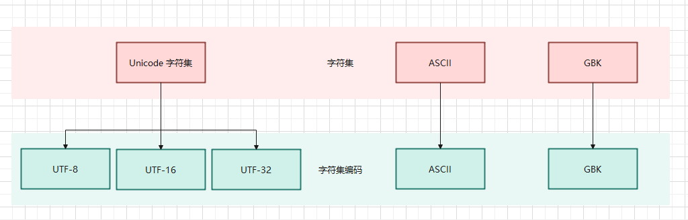

* Linux 中安装帮助手册：

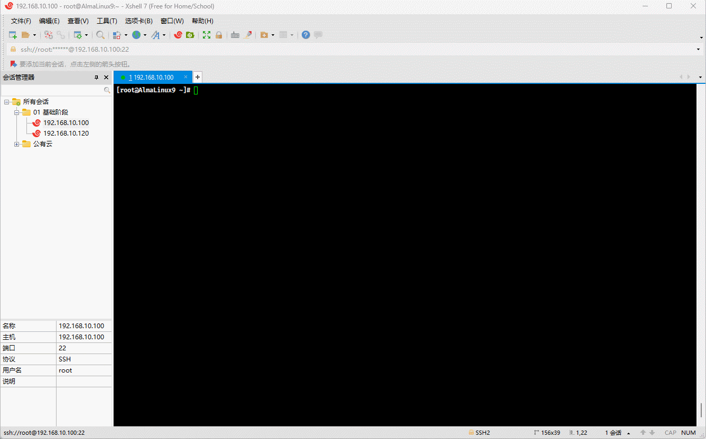

## 1.2 ASCII 编码

* 从`冯·诺依曼`体系结构中，我们知道，计算机中所有的`数据`和`指令`都是以`二进制`的形式表示的；所以，计算机中对于文本数据的数据也是以二进制来存储的，那么对应的流程如下：

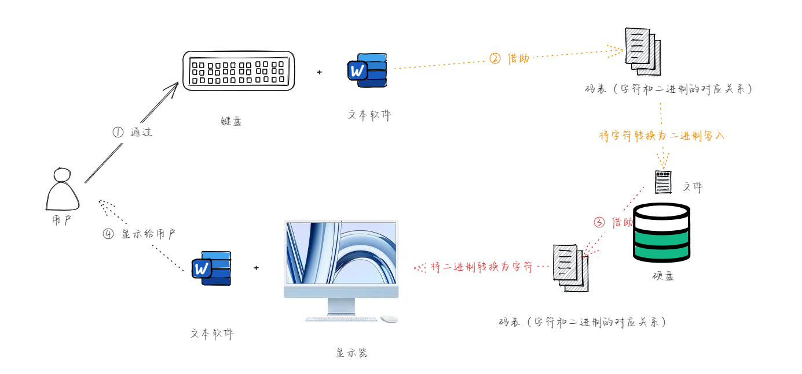

* 我们知道，计算机是上个世纪 60 年代在美国研制成功的，为了实现字符和二进制的转换，美国就制定了一套字符编码，即英语字符和二进制位之间的关系，即 ASCII （American Standard Code for Information Interchange）编码：
  - ASCII 编码只包括了英文字符、数字和一些特殊字符，一共 128 个字符，并且每个字符都分配了唯一的数字，范围是 0 - 127。
  - ASCII 编码中的每个字符都使用 7 位的二进制数字表示；但是，计算机中的存储的最小单位是 1 B = 8 位，那么最高位统一规定为 0 。

> [!NOTE]
>
> - ① 其实，早期是没有字符集的概念的，只是后来为了解决乱码问题，而产生了字符集的概念。
> - ② 对于英文体系来说，`a-zA-Z0-9`以及一些`特殊字符`一共 `128` 就可以满足实际存储需求；所以，在也是为什么 ASCII 码使用 7 位二进制（2^7 = 128 ）来存储的。

* 在操作系统中，就内置了对应的编码表，Linux 也不例外；可以使用如下的命令查看：

```shell
man ascii
```


* 其对应的 ASCII 编码表，如下所示：


* 但是，随着计算机的发展，计算机开始了东征之路，由美国传播到东方：


- 先是传播到了欧洲，欧洲在兼容 ASCII 编码的基础上，推出了 ISO8859-1 编码，即：
  - ISO8859-1 编码包括基本的拉丁字母表、数字、标点符号，以及西欧语言中特有的一些字符，如：法语中的 `è`、德语中的 `ü` 等。
  - ISO 8859-1 为每个字符分配一个单字节（8 位）编码，意味着它可以表示最多 256 （2^8）个不同的字符（编号从 0 到 255）。
  - ISO 8859-1 的前 128 个字符与 ASCII 编码完全一致，这使得 ASCII 编码的文本可以无缝转换为 ISO 8859-1 编码。


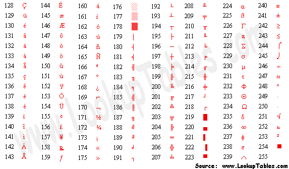

- 计算机继续传播到了亚洲，亚洲（双字节）各个国家分别给出了自己国家对应的字符集编码，如：
  - 日本推出了 Shift-JIS 编码：
    - 单字节 ASCII 范围：0 - 127。
    - 双字节范围：
      - 第一个字节：129 - 159 和 224 - 239 。
      - 第二个字节：64 - 126 和 128 - 252 。
  - 韩国推出了 EUC-KR 编码：
    - 单字节 ASCII 范围：0 - 127。
    - 双字节范围：从 41281 - 65278。
  - 中国推出了 GBK 编码：
    - 单字节 ASCII 范围：0 - 127。
    - 双字节范围：33088 - 65278 。

> [!NOTE]
>
> - ① 通过上面日本、韩国、中国的编码十进制范围，我们可以看到，虽然这些编码系统在技术上的编码范围存在重叠（特别是在高位字节区域），但因为它们各自支持的字符集完全不同，所以实际上它们并不直接冲突。
> - ② 但是，如果一个中国人通过 GBK 编码写的文章，通过邮件发送给韩国人，因为韩国和中国在字符集编码上的高位字节有重叠部分，必然会造成歧义。

## 1.3 Unicode 编码

- 在 Unicode 之前，世界上存在着数百种不同的编码系统，每一种编码系统都是为了支持特定语言或一组语言的字符集。这些编码系统，包括：ASCII、ISO 8859 系列、GBK、Shift-JIS、EUC-KR 等，它们各自有不同的字符范围和编码方式。这种多样性虽然在局部范围内解决了字符表示的问题，但也带来了以下几个方面的挑战：
  - `编码冲突`：由于不同的编码系统可以为相同的字节值分配不同的字符，因此在不同编码之间转换文本时，如果没有正确处理编码信息，就很容易产生乱码。这种编码冲突在尝试处理多种语言的文本时尤为突出。
  - `编码的复杂性`：随着全球化的发展，软件和系统需要支持越来越多的语言，这就要求开发者和系统同时处理多种不同的编码系统。这不仅增加了开发和维护的复杂性，而且也增加了出错的风险。
  - `资源限制`：在早期计算机技术中，内存和存储资源相对有限。不同的编码标准要求系统存储多套字符集数据，这无疑增加了对有限资源的消耗。
  - ……
- 针对上述的种种问题，为了推行全球化，Unicode 应运而生，Unicode 的核心规则和设计原则是建立一个全球统一的字符集，使得世界上所有的文字和符号都能被唯一地识别和使用，无论使用者位于何地或使用何种语言。这套规则包括了字符的编码、表示、处理和转换机制，旨在确保不同系统和软件间能够无缝交换和处理文本数据。
  - `通用字符集 (UCS)`：Unicode 为每一个字符分配一个唯一的编号（称为`“码点”`）。这些码点被组织在一个统一的字符集中，官方称之为 “通用字符集”（Universal Character Set，UCS）。码点通常表示为 `U+` 后跟一个十六进制数，例如：`U+0041` 代表大写的英文字母 `“A”`。
  - `编码平面和区段`：Unicode 码点被划分为多个 “平面（Planes）”，每个平面包含 65536（16^4）个码点。目前，Unicode定义了 17 个平面（从 0 到16），每个平面被分配了一个编号，从 “基本多文种平面（BMP）” 的 0 开始，到 16 号平面结束。这意味着 Unicode 理论上可以支持超过 110万（17*65536）个码点。

- Unicode 仅仅只是字符集，给每个字符设置了唯一的数字编号而已，却没有给出这些数字编号实际如何存储，可以通过如下命令查看：


- 为了在计算机系统中表示 Unicode 字符，定义了几种编码方案，这些方案包括 UTF-8、UTF-16 和 UTF-32 等。
  - **UTF-8**：使用 1 - 4 个字节表示每个 Unicode 字符，兼容 ASCII，是网络上最常用的编码。
  - **UTF-16**：使用 2 - 4 个字节表示每个 Unicode 字符，适合于需要经常处理基本多文种平面之外字符的应用。
  - **UTF-32**：使用固定的 4 个字节表示每个 Unicode 字符，简化了字符处理，但增加了存储空间的需求。

> [!NOTE]
>
> * ① 只有 UTF-8 兼容 ASCII，UTF-32 和 UTF-16 都不兼容 ASCII，因为它们没有单字节编码。
>
> ::: details 点我查看
>
> * UTF-8 使用尽量少的字节来存储一个字符，不但能够节省存储空间，而且在网络传输时也能节省流量，所以很多纯文本类型的文件，如：各种编程语言的源文件、各种日志文件和配置文件等以及绝大多数的网页，如：百度、新浪、163 等都采用 UTF-8 编码。但是，UTF-8 的缺点是效率低，不但在存储和读取时都要经过转换，而且在处理字符串时也非常麻烦。例如：要在一个 UTF-8 编码的字符串中找到第 10 个字符，就得从头开始一个一个地检索字符，这是一个很耗时的过程，因为 UTF-8 编码的字符串中每个字符占用的字节数不一样，如果不从头遍历每个字符，就不知道第 10 个字符位于第几个字节处，就无法定位。不过，随着算法的逐年精进，UTF-8 字符串的定位效率也越来越高了，往往不再是槽点了。
> * UTF-32 是“以空间换效率”，正好弥补了 UTF-8 的缺点，UTF-32 的优势就是效率高：UTF-32 在存储和读取字符时不需要任何转换，在处理字符串时也能最快速地定位字符。例如：在一个 UTF-32 编码的字符串中查找第 10 个字符，很容易计算出它位于第 37 个字节处，直接获取就行，不用再逐个遍历字符了，没有比这更快的定位字符的方法了。但是，UTF-32 的缺点也很明显，就是太占用存储空间了，在网络传输时也会消耗很多流量。我们平常使用的字符编码值一般都比较小，用一两个字节存储足以，用四个字节简直是暴殄天物，甚至说是不能容忍的，所以 UTF-32 在应用上不如 UTF-8 和 UTF-16 广泛。
>
> * UTF-16 可以看做是 UTF-8 和 UTF-32 的折中方案，它平衡了存储空间和处理效率的矛盾。对于常用的字符，用两个字节存储足以，这个时候 UTF-16 是不需要转换的，直接存储字符的编码值即可。
>
> :::
>
> * ② 总而言之，**UTF-8** 编码兼容性强，适合大多数应用，特别是英文文本处理。**UTF-16** 编码适合处理大量亚洲字符，但在处理英文或其他拉丁字符时相对浪费空间。**UTF-32**编码简单直接，但非常浪费空间，适合需要固定字符宽度的特殊场景。
> * ③ 在实际应用中，UTF-8 通常是最常用的编码方式，因为它在兼容性和空间效率之间提供了良好的平衡。

> [!IMPORTANT]
>
> * ① Windows 内核、.NET Framework、Java String 内部采用的都是 `UTF-16` 编码，主要原因是为了在兼顾字符处理效率的同时，能够有效处理多种语言的字符集，即：历史遗留问题、兼容性要求和多语言支持的需要。
> * ② 不过，UNIX 家族的操作系统（Linux、Mac OS、iOS 等）内核都采用 `UTF-8` 编码，主要是为了兼容性和灵活性，因为 UTF-8 编码可以无缝处理 ASCII 字符，同时也能够支持多字节的 Unicode 字符，即：为了最大限度地兼容 ASCII，同时保持系统的简单性、灵活性和效率。


- `Unicode 字符集`和对应的`UTF-8 字符编码`之间的关系，如下所示：

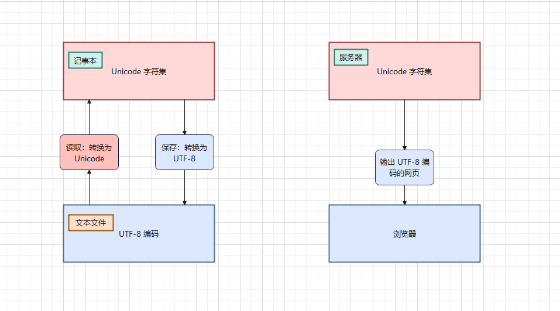

>[!NOTE]
>
>`宽字符`和`窄字符`是编程和计算机系统中对字符类型的一种分类，主要用于描述字符在内存中的表示形式及其与编码方式的关系。
>
>* ① `窄字符`通常指使用单个字节（8 位）来表示的字符。在许多传统的编码系统中，窄字符通常代表 ASCII 字符或其它单字节字符集中的字符。换言之，`窄字符`适合处理简单的单字节字符集，如：ASCII，适用于处理西方语言的应用。
>* ② `宽字符`指使用多个字节（通常是两个或更多）来表示的字符。这些字符通常用于表示比 ASCII 范围更广的字符集，如 Unicode 字符。换言之，`宽字符`适合处理多字节字符集，如：UTF-32、UTF-16 等，适用于需要处理多种语言和符号的国际化应用。
>
>在现代编程中，`窄字符`通常与 `UTF-8` 编码关联，特别是在处理文本输入、输出和网络传输时。尽管 `UTF-8` 是变长编码，由于其高效的空间利用和对 `ASCII` 的优化，通常与`窄字符`概念关联。而`宽字符`通常与 `UTF-16` 编码或 `UTF-32`编码关联，这些编码使用更大的固定或半固定长度来表示字符，适合处理更大的字符集。


# 第二章： WSL2 中设置默认编码为中文

## 2.1 概述

* 查看 WSL2 的 Linux 发行版的默认编码：

```shell
echo $LANG
```

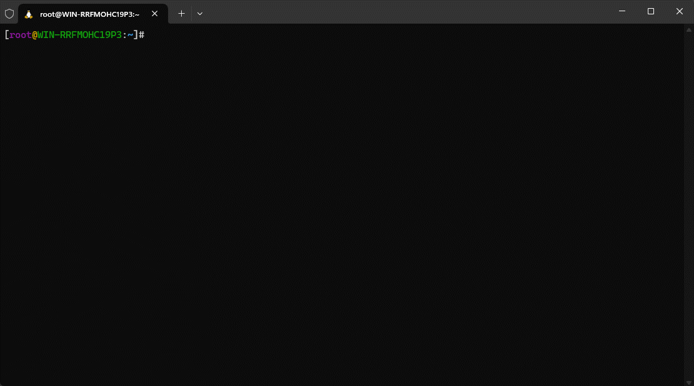

> [!NOTE]
>
> `C.UTF-8` 是一种字符编码设置，结合了 `C` 区域设定和 `UTF-8` 字符编码。
>
> * ① **C 区域设定**：这是一个标准的、最小化的区域设置，通常用于系统默认的语言环境。`C` 区域设定下，所有字符都被认为是 ASCII 字符集的一部分，这意味着仅支持基本的英文字符和符号。在 `C` 区域设定中，字符串的排序和比较是基于简单的二进制值比较，这与本地化的语言设置相比相对简单。
> * ② **UTF-8 编码**：UTF-8 是一种变长的字符编码方式，可以编码所有的 Unicode 字符。它是一种广泛使用的字符编码，能够支持多种语言和符号。每个 UTF-8 字符可以由1到4个字节表示，这使得它兼容 ASCII（对于标准 ASCII 字符，UTF-8 只使用一个字节）。
>
> 因此，`C.UTF-8` 结合了 `C` 区域设定和 UTF-8 字符编码的优势。使用 `C.UTF-8` 时，系统默认语言环境保持简单和高效，同时支持更广泛的字符集，特别是多语言和非英语字符。这样可以在需要兼容性的同时，提供对全球化字符的支持。

## 2.2 AlmaLinux9 设置默认编码

* ① 搜索中文语言包：

```shell
dnf search locale zh
```

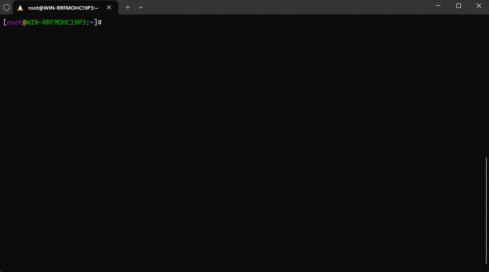

* ② 安装中文语言包：

```shell
dnf -y install glibc-langpack-zh
```

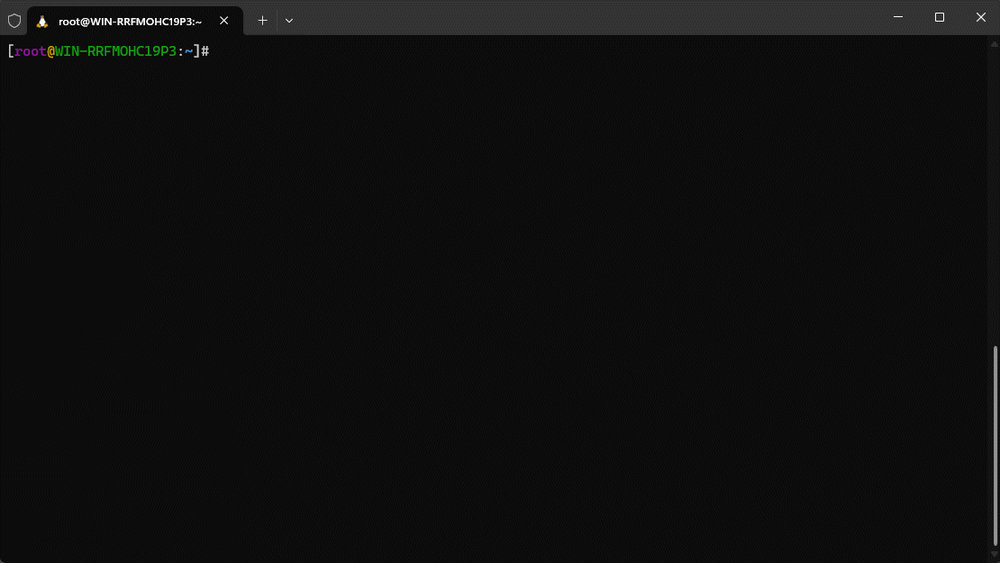

* ③ 切换语言环境为中文：

```shell
localectl set-locale LANG=zh_CN.UTF-8
```

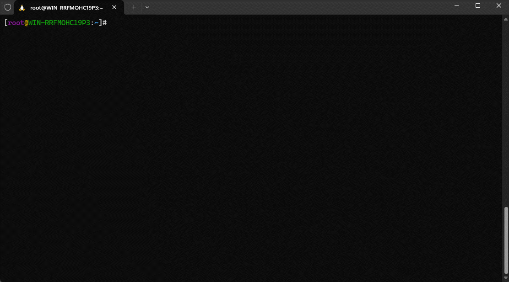

* ④ 手动加载配置文件，使其生效：

```shell
source /etc/locale.conf
```


## 2.3 Ubuntu 22.04 设置默认编码

* ① 安装中文语言包：

```shell
apt update -y && apt install language-pack-zh-hans -y
```

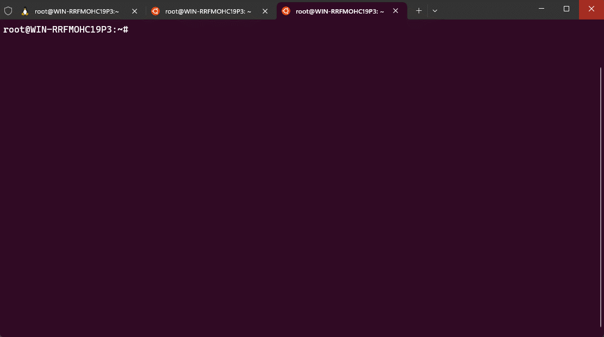

* ② 切换环境为中文：

```shell
update-locale LANG=zh_CN.UTF-8 LANGUAGE=zh_CN:zh
```

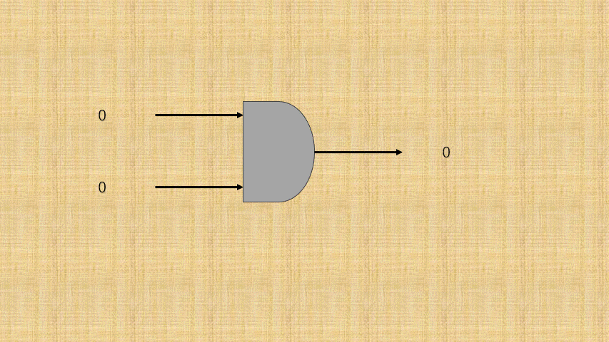

* ③ 手动加载配置文件，使其生效：

```shell
source /etc/default/locale
```

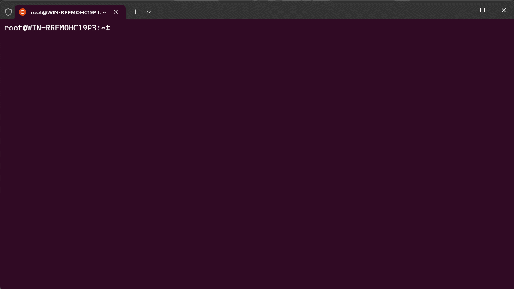

# 第三章：在 C 语言中使用中文字符

## 3.1 概述

* 大部分 C 语言文章或教材对中文字符的处理讳莫如深，甚至只字不提，导致很多初学者认为 C 语言只能处理英文，而不支持中文。
* 其实，这是不对的。C 语言作为一门系统级别的编程语言，理应支持世界上任何一个国家的文字，如：中文、日文、韩文等。

> [!NOTE]
>
> 如果 C 语言不支持中文，那么简体中文 Windows 操作系统将无从谈起，我们只能被迫使用英文 Windows 操作系统，这对计算机的传播而言将会是一种巨大的阻碍。

## 3.2 中文字符的存储

* 要想正确的存储中文字符，需要解决如下的两个问题：
  * ① 足够长的数据类型：char 的长度是 1 个字节，只能存储拉丁体系的问题，并不能存储中文字符，所以至少需要 2 个字节的内存空间。
  * ② 包含中文的字符集：C 语言规定，对于中文、日文、韩文等非 ASCII 编码之外的单个字符，需要有专门的字符类型，也就是需要使用宽字符的编码方式。而常见的宽字符的编码有 UTF-16 和 UTF-32，它们都是基于 Unicode 字符集的，都能够支持全球的文字。

> [!NOTE]
>
> 上文提及过，在现代编程中，`窄字符`通常与 `UTF-8` 编码关联，特别是在处理文本输入、输出和网络传输时。尽管 `UTF-8` 是变长编码，由于其高效的空间利用和对 `ASCII` 的优化，通常与`窄字符`概念关联。而`宽字符`通常与 `UTF-16` 编码或 `UTF-32`编码关联，这些编码使用更大的固定或半固定长度来表示字符，适合处理更大的字符集。

* 在真正实现的时候，微软的 MSVC 编译器采用 UTF-16 编码，即：使用 2 个字节来存储一个字符，使用 unsigned short 类型就可以容纳。而 GCC、LLVM/Clang 采用 UTF-32 编码，使用 4 个字节存储字符，用 unsigned int 类型就可以容纳。

> [!NOTE]
>
> 不同的编译器可以使用不同的整数类型，来存储宽字符，这对于跨平台开发来说，非常不友好。

* 为了解决上述的问题，C 语言推出了一种全新的类型 `wchar_t` 类型，用来存储宽字符类型。
  * 在微软的 MSVC 编译器中，它的长度是 2 个字节。
  * 在 GCC、LLVM/Clang 中，它的长度是 4 个字节。

> [!NOTE]
>
> * ① `wchar_t` 中的 `w`是 wide 的首字母，`t` 是 type 的首字母，所以 `wchar_t` 就是宽字符类型，足够见名知意。
> * ② `wchar_t` 是用 typedef 关键字定义的一个别名，后文讲解，`wchar_t` 在不同的编译器下长度不一样。
> * ③ `wchar_t` 类型位于 `<wchar.h>` 头文件中，它使得代码在具有良好移植性的同时，也节省了不少内存，以后我们就用它来存储宽字符。

* 对于普通的拉丁体系的字符，我们使用 `''` 括起来，来表示字符，如：`'A'`、`'&'` 等。但是，如果要想表示宽字符，就需要加上 `L` 前缀了，如：`L'A'`、`L'中'`。

> [!NOTE]
>
> 宽字符字面量中的 `L` 是 `Long` 的缩写，意思是比普通的字符（char）要长。


* 示例：

```c
#include <stddef.h>

int main() {
    
	// 禁用 stdout 缓冲区
    setbuf(stdout, nullptr);
    
    /* 存储宽字符，如：中文 */
    wchar_t a = L'中';
    wchar_t b = L'中';
    wchar_t c = L'中';
    wchar_t d = L'中';
    wchar_t e = L'中';

    return 0;
}
```

## 3.3 中文字符的输出

* 对于宽字符，就不能使用 `putchar` 函数和 `printf` 函数来进行输出了，需要使用 `putwchar` 函数和 `wprintf` 函数。

> [!NOTE]
>
> * ① `putchar` 函数和 `printf` 函数，只能输出窄字符，即：`char` 类型表示的字符。
> * ② `putwchar` 函数可以用来输出宽字符，用法和 `putchar` 函数类似。
> * ③ `wprintf`函数可以用来输出宽字符，用法和 `printf` 函数类型，只不过格式占位符是 `%lc` 。
> * ④ 在输出宽字符之前，还需要使用 `setlocale` 函数进行本地化设置，告诉程序如何才能正确地处理各个国家的语言文化。


* 示例：

```c
#include <locale.h>
#include <stddef.h>
#include <wchar.h>

int main() {
	
    // 禁用 stdout 缓冲区
    setbuf(stdout, nullptr);
    
    /* 存储宽字符，如：中文 */
    wchar_t a = L'中';
    wchar_t b = L'国';
    wchar_t c = L'人';
    wchar_t d = L'你';
    wchar_t e = L'好';

    // 将本地环境设置为简体中文
    setlocale(LC_ALL, "zh_CN.UTF-8");

    // 使用专门的 putwchar 输出宽字符
    putwchar(a);
    putwchar(b);
    putwchar(c);
    putwchar(d);
    putwchar(e);
    putwchar(L'\n'); // 只能使用宽字符

    // 使用通用的 wprintf 输出宽字符
    wprintf(L"%lc %lc %lc %lc %lc\n", a, b, c, d, e);
    
    return 0;
}
```

## 3.4 宽字符串

* 如果给字符串加上 `L` 前缀，就变成了宽字符串，即：它包含的每个字符都是宽字符，一律采用 UTF-16 或者 UTF-32 编码。

> [!NOTE]
>
> * ① 输出宽字符串可以使用 <wchar.h> 头文件中的 wprintf 函数，对应的格式控制符是`%ls`。
> * ② 不加`L`前缀的窄字符串也可以处理中文，我们之前就在 `printf` 函数中，使用格式占位符 `%s` 输出含有中文的字符串，至于为什么，看下文讲解。


* 示例：

```c
#include <locale.h>
#include <stddef.h>
#include <wchar.h>

int main() {
    
    // 禁用 stdout 缓冲区
    setbuf(stdout, nullptr);

    /* 存储宽字符，如：中文 */
    wchar_t  a[] = L"中国人";
    wchar_t *b   = L"你好";

    // 将本地环境设置为简体中文
    setlocale(LC_ALL, "zh_CN.UTF-8");

    // 使用通用的 wprintf 输出字符串
    wprintf(L"%ls %ls\n", a, b);

    return 0;
}
```


# 第四章：C 语言到底使用什么编码？

## 4.1 概述

* 在 C 语言中，只有 `char` 类型的`窄字符`才会使用 ASCII 编码。而 `char` 类型的`窄字符串`、`wchar_t` 类型的`宽字符`和`宽字符串`都不使用 ASCII 编码。
* `wchar_t` 类型的`宽字符`和`宽字符串`使用 UTF-16 或者 UTF-32 编码，这个在上文已经讲解了，现在只剩下 `char` 类型的`窄字符串`没有讲解了，这也是下文的重点。

> [!NOTE]
>
> * ① 其实，对于`char` 类型的窄字符串，C 语言并没有规定使用哪一种特定的编码，只要选用的编码能够适应当前的环境即可。换言之，`char` 类型的窄字符串的编码与操作系统以及编译器有关。
> * ② 但是，`char` 类型的窄字符串一定不是 ASCII 编码，因为 ASCII 编码只能显示拉丁体系的文字，而不能输出中文、日文、韩文等。
> * ③ 讨论窄字符串的编码要从以下两个方面下手。

## 4.2 源文件使用什么编码？

* 源文件用来保存我们编写的代码，它最终会被存储到本地硬盘，或者远程服务器，这个时候就要尽量压缩文件体积，以节省硬盘空间或者网络流量，而代码中大部分的字符都是 ASCII 编码中的字符，用一个字节足以容纳，所以 UTF-8 编码是一个不错的选择。
* UTF-8 兼容 ASCII，代码中的大部分字符可以用一个字节保存。另外，UTF-8 基于 Unicode，支持全世界的字符，我们编写的代码可以给全球的程序员使用，真正做到技术无国界。
* 常见的 IDE 或者编辑器，如：Sublime Text、Vim 等，在创建源文件的时候一般默认就是 UTF-8 编码。就算不是，我们也会推荐设置为 UTF-8 编码，如下所示：

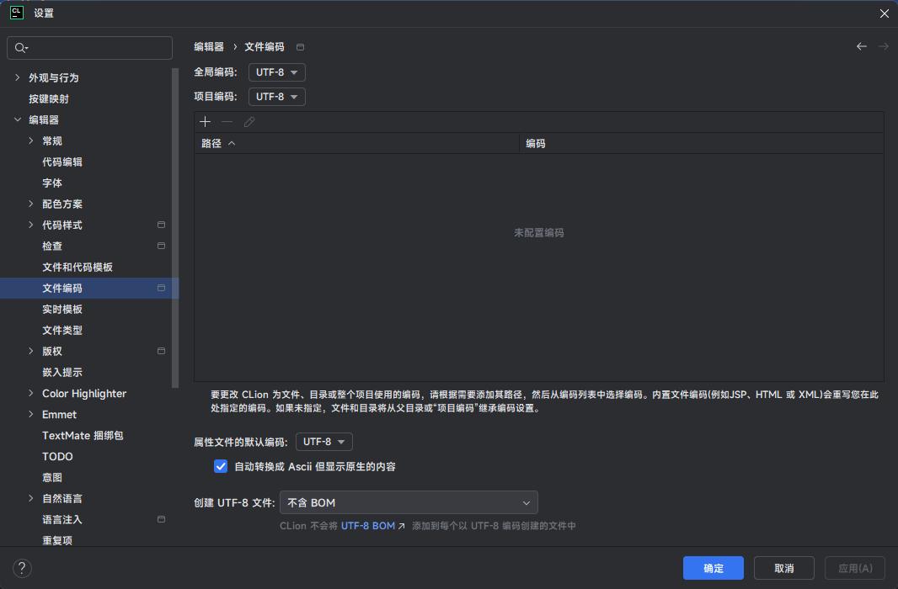

* 对于 C 语言编译器来说，它往往支持多种编码格式的源文件。微软的 MSVC 、GCC 和 LLVM/Clang 都支持 UTF-8 和本地编码的源文件。

## 4.3 窄字符串使用什么编码？

* 前文提到，可以使用 `puts` 函数或 `printf` 函数来输出窄字符串，如下所示：

```c
#include <stdio.h>

int main() {

    // 禁用 stdout 缓冲区
    setbuf(stdout, nullptr);
    
    // 存储字符串
    char  str[] = "我";
    char *str2  = "爱你";

    puts(str); // 我
    puts(str2); // 爱你
    
    // 存储字符串
    char  str3[] = "你";
    char *str4  = "是好人";

    printf("%s\n", str3); // 你
    printf("%s\n", str4); // 是好人

    return 0;
}
```

* 像 `"我"`、`"爱你"`、`"你"`、`"是好人"`就是需要被处理的窄字符串，当程序运行的时候，它们会被加载进内存。并且，这些字符串中是包含中文的，所以一定不会使用 ASCII 编码。

> [!NOTE]
>
> 其实，对于代码中需要被处理的窄字符串，不同的编译器差别还是挺大的：
>
> * 微软的 MSVC 编译器使用本地编码来保存这些字符。对于简体中文版的 Windows，使用的是 GBK 编码。
> * GCC、LLVM/Clang 编译器使用和源文件相同的编码来保存这些字符：如果源文件使用的是 UTF-8 编码，那么这些字符也使用 UTF-8 编码；如果源文件使用的是 GBK 编码，那么这些字符也使用 GBK 编码。

## 4.4 总结

* ① 对于 `char` 类型的窄字符，在 C 语言中，使用的是  `ASCII` 编码。
* ② 对于 `wchar_t` 类型的`宽字符`和`宽字符串`，在 C 语言中，使用的 `UTF-16` 编码或者 `UTF-32` 编码，它们都是基于 Unicode 字符集的。
* ③ 对于 `char` 类型的`窄字符串`，微软的 MSVC 编译器使用本地编码，GCC、LLVM/Clang 使用和源文件编码相同的编码。
* ④ 处理窄字符和处理宽字符使用的函数也不一样，如下所示：
  * `<stdio.h>` 头文件中的 `putchar`、`puts`、`printf` 函数只能用来处理窄字符。
  * `<wchar.h>` 头文件中的 `putwchar`、`wprintf` 函数只能用来处理宽字符。

> [!IMPORTANT]
>
> * ① C 语言作为一门较为底层和古老的语言，对于字符的处理，之所以有这么多种方式，是因为历史遗留的原因和早期计算机资源有限的背景密切相关。	
> * ② 现代化的编程语言，如：C++ 、Java、Python 等都对字符串处理进行了改进和抽象，如：C++ 中的 `std::string` 和 Java 中的 `String`。并且，现代编程语言通常会自动管理内存，这样开发者就不需要手动处理字符串的内存分配和释放，从而减少了内存泄漏和缓冲区溢出等问题。当然，现代编程语言通常内置了对各种字符编码的支持，能够方便地处理不同语言的字符，如：Java 的 `String` 类和 Python 的 `str` 类型都默认支持 Unicode，可以轻松处理中文等多字节字符。

## 4.5 编码字符集和运行字符集

* 源文件使用的字符集，通常称为`编码字符集`，即：写代码的时候所使用的字符集。

> [!NOTE]
>
> 源文件需要保存到硬盘，或者在网络上传输，使用的编码要尽量节省存储空间，同时要方便跨国交流，所以一般使用 UTF-8，这就是选择编码字符集的标准。

* 程序中的字符或者字符串使用的字符集，通常称为`运行字符集`，即：程序运行时所使用的字符集。

> [!NOTE]
>
> 程序中的字符或者字符串，在程序运行后必须被载入到内存，才能进行后续的处理，对于这些字符来说，要尽量选用能够提高处理速度的编码，如：UTF-16 和 UTF-32 编码就能够快速定位（查找）字符。

* `编码字符集`是站在`存储`和`传输`的角度，而`运行字符集`是站在`处理`或者`操作`的角度，所以它们并不一定相同。
