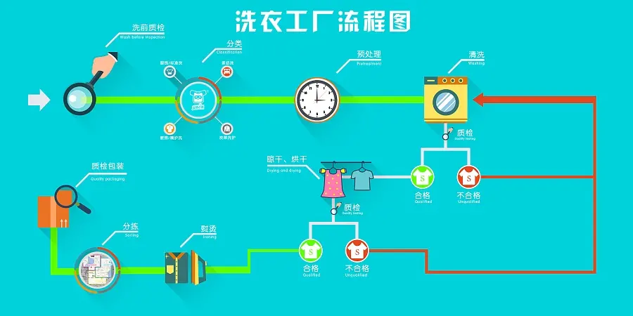

# 第一章：概述

## 1.1 定义

* `流程控制结构`是用来控制程序中`各语句执行顺序`的语句，并且可以将语句组合成能`完成一定功能`的`小逻辑模块`。

* 在程序设计中规定了`三种`流程结构，如下所示：
  * `顺序结构`：程序从上到下逐行执行，中间没有任何判断和跳转。
  * `分支结构`：根据条件，有选择的执行某段代码。在 C 语言中，有 `if...else` 和 `switch...case` 两种分支语句。
  * `循环结构`：根据循环条件，重复性的执行某段代码。在 C 语言中，有 `for`、`while`、`do...while` 三种循环结构。

## 1.2 类似生活

* 在生活中的`洗衣工厂`，就包含了上述的三种流程结构，如下所示：




# 第二章：顺序结构

## 2.1 概述

* 程序从上到下逐行地执行，表达式语句都是顺序执行的，并且上一行对某个变量的修改对下一行会产生影响。


## 2.2 应用示例

* 示例：

```c
#include <stdio.h>

int main() {

    // 禁用 stdout 缓冲区
    setbuf(stdout, nullptr);
    
    int x = 1;
    int y = 2;
    printf("x = %d \n", x); // x = 1
    printf("y = %d \n", y); // y = 2

    // 对 x 和 y 的值进行修改
    x++;
    y = 2 * x + y;
    x = x * 10;

    printf("x = %d \n", x); // x = 20
    printf("y = %d \n", y); // y = 6

    return 0;
}
```


# 第三章：分支结构（⭐）

## 3.1 概述

* 根据特定条件执行不同的代码块，从而实现灵活的程序控制和更复杂的逻辑。

## 3.2 单分支结构

### 3.2.1 概述

* 语法：

```c
if(条件表达式){
    语句;
}
```

> [!NOTE]
>
> * ① 在 C 语言中，严格意义上是没有 boolean 类型的，使用`非0` 表示`真（true）`，`0` 表示`假（false）`。
> * ② 当条件表达式为真（`非0` ），就会执行代码块中的语句；否则，就不会执行代码块中的语句。

* 流程图，如下所示：


### 3.2.2 应用示例

* 需求：成年人心率的正常范围是每分钟 60~100 次。体检时，如果心率不在此范围内，则提示需要做进一步的检查。


* 示例：

```c
#include <stdio.h>

int main() {
   
    // 禁用 stdout 缓冲区
    setbuf(stdout, nullptr);
    
    int heartBeats = 0;
    printf("请输入您的心率：");
    scanf("%d", &heartBeats);

    if (heartBeats < 60 || heartBeats > 100) {
        printf("您的心率不在正常范围内，请做进一步的检查。\n");
    }

    printf("体检结束！！！");

    return 0;
}
```

### 3.2.3 应用示例

* 需求：根据年龄判断，如果是未成年人，则提示 "未成年人请在家长陪同下访问！" 。


* 示例：

```c
#include <stdio.h>

int main() {
    
    // 禁用 stdout 缓冲区
    setbuf(stdout, nullptr);
    
    int age = 0;
    printf("请输入你的年龄：");
    scanf("%d", &age);

    if (age < 18) {
        printf("未成年人请在家长陪同下访问！\n");
    }

    printf("欢迎继续访问！");

    return 0;
}
```

## 3.3 双分支结构

### 3.3.1 概述

* 语法：

```c
if(条件表达式) { 
  	语句块1;
}else {
  	语句块2;
}
```

> [!NOTE]
>
> * ① 在 C 语言中，严格意义上是没有 boolean 类型的，使用`非0` 表示`真（true）`，`0` 表示`假（false）`。
> * ② 当条件表达式为真（`非0` ），就会执行代码块 1 中的语句；否则，执行代码块 2 中的语句。

* 流程图，如下所示：


### 3.3.2 应用示例

* 需求：判断一个整数，是奇数还是偶数。


* 示例：

```c
#include <stdio.h>

int main() {

    // 禁用 stdout 缓冲区
    setbuf(stdout, nullptr);
    
    int num = 0;
    printf("请输入一个整数：");
    scanf("%d", &num);

    if (num % 2 == 0) {
        printf("%d 是偶数\n", num);
    } else {
        printf("%d 是奇数\n", num);
    }

    return 0;
}
```

### 3.3.2 应用示例

* 需求：输入年龄，如果大于18岁，则输出 "你年龄大于18，要对自己的行为负责!"；否则，输出 "你的年龄不大这次放过你了。"


* 示例：

```c
#include <stdio.h>

int main() {

    // 禁用 stdout 缓冲区
    setbuf(stdout, nullptr);
    
    int age = 0;
    printf("请输入年龄：");
    scanf("%d", &age);

    if (age > 18) {
        printf("你年龄大于18，要对自己的行为负责!\n");
    } else {
        printf("你的年龄不大，这次放过你了!\n");
    }

    return 0;
}
```

### 3.3.3 应用示例

* 需求：判定某个年份是否为闰年？

>[!NOTE]
>
>* ①  year 是 400 的整倍数： year%400==0
>* ② 能被 4 整除，但不能被 100 整除：year % 4 == 0 && year % 100 != 0


* 示例：

```c
#include <stdio.h>

int main() {

    // 禁用 stdout 缓冲区
    setbuf(stdout, nullptr);    
    
    int year = 0;
    printf("请输入年份：");
    scanf("%d", &year);

    if (year % 400 == 0 || (year % 4 == 0 && year % 100 != 0)) {
        printf("%d 是闰年\n", year);
    } else {
        printf("%d 不是闰年\n", year);
    }

    return 0;
}
```

## 3.4 多重分支结构

### 3.4.1 概述

* 语法：

```c
if (条件表达式1) {
  	语句块1;
} else if (条件表达式2) {
  	语句块2;
}
...
} else if (条件表达式n) {
 	语句块n;
} else {
  	语句块n+1;
}
```

> [!NOTE]
>
> * ① 在 C 语言中，严格意义上是没有 boolean 类型的，使用`非0` 表示`真（true）`，`0` 表示`假（false）`。
> * ② 首先判断关系表达式 1 的结果是真（值为 `非0`）还是假（值为 `0`）：
>   * 如果为真，就执行语句块 1，然后结束当前多分支。
>   * 如果是假，就继续判断条件表达式 2，看其结果是真还是假。
>   * 如果是真，就执行语句块 2，然后结束当前多分支。
>   * 如果是假，就继续判断条件表达式…看其结果是真还是假。
>   * ...
>   *  如果没有任何关系表达式为真，就执行语句块 n+1，然后结束当前多分支。
> * ③ 当条件表达式之间是`互斥`（彼此之间没有交集）关系时，条件判断语句及执行语句间顺序无所谓。
> * ④ 当条件表达式之间是`包含`关系时，必须`小上大下 / 子上父下`，否则范围小的条件表达式将不可能被执行。
> * ⑤ 当 if-else 结构是多选一的时候，最后的 else 是可选的，可以根据需要省略。
> * ⑥ 如果语句块中只有一条执行语句的时候，`{}`是可以省略的；但是，强烈建议保留！！！

* 流程图，如下所示：


### 3.4.1 应用示例

* 需求：张三参加考试，他和父亲达成协议，如果成绩不到 60 分没有任何奖励；如果成绩 60分（含）到 80 分，奖励一个肉夹馍；如果成绩 80 分（含）到 90 分，奖励一个 ipad；如果成绩 90 分及以上，奖励一部华为 mate60 pro 。 


* 示例：

```c
#include <stdio.h>

int main() {

    // 禁用 stdout 缓冲区
    setbuf(stdout, nullptr);    
    
    int score = 0;
    printf("请输入分数：");
    scanf("%d", &score);

    // 容错：分数不可能小于 0 或大于 100
    if (score < 0 || score > 100) {
        printf("输入的分数有误！\n");
        return 0;
    }

    if (score >= 90) {
        printf("奖励你一部华为 mate60 pro\n");
    } else if (score >= 80) {
        printf("奖励你一个 ipad\n");
    } else if (score >= 60) {
        printf("奖励你一个肉夹馍\n");
    } else {
        printf("你的成绩不及格，没有任何奖励！");
    }

    return 0;
}
```

### 3.4.2 应用示例

* 需求：判断水的温度，如果大于 95℃，则打印 "开水"；如果大于 70℃ 且小于等于 95℃，则打印 "热水"；如果大于 40℃ 且小于等于 70℃，则打印 "温水"；如果小于等于 40℃，则打印 "凉水"。


* 示例：

```c
#include <stdio.h>

int main() {
    
    // 禁用 stdout 缓冲区
    setbuf(stdout, nullptr);
    
    int temperature = 0;
    printf("请输入水的温度：");
    scanf("%d", &temperature);

    if (temperature > 95) {
        printf("开水 \n");
    } else if (temperature > 70 && temperature <= 95) {
        printf("热水 \n");
    } else if (temperature > 40 && temperature <= 70) {
        printf("温水 \n");
    } else {
        printf("凉水 \n");
    }

    return 0;
}
```

## 3.5 多重分支结构 switch

### 3.5.1 概述

* 语法：

```c
switch(表达式){
	case 常量值1: 
        语句块1;
        //break;
	case 常量值2: 
        语句块2;
        //break;
	...
     
	case 常量值n: 
        语句块n; 
        //break;
	[default: 
        语句块n+1;
    ]
}
```

> [!NOTE]
>
> * ① switch 后面表达式的值必须是一个整型（char、short、int、long 等）或枚举类型。
> * ② case 后面的值必须是常量，不能是变量。
> * ③ default 是可选的，当没有匹配的 case 的时候，就执行 default 。
> * ④ break 语句可以使程序跳出 switch 语句块，如果没有 break，会执行下一个 case 语句块，直到遇到 break 或者执行到 switch 结尾，这个现象称为穿透。

* 流程图，如下所示：


### 3.5.2 应用示例

* 需求：编写一个程序，该程序可以接收一个字符，比如：a、b、c、d；其中， a 表示星期一，b 表示星期二…，根据用户的输入显示相应的信息，要求使用 switch 语句。


* 示例：

```c
#include <stdio.h>

int main() {
    
    // 禁用 stdout 缓冲区
    setbuf(stdout, nullptr);
    
    char chs;
    printf("请输入一个字符（a、b、c、d）：");
    scanf("%c", &chs);

    switch (chs) {
        case 'a':
            printf("今天是星期一 \n");
            printf("窗前明月光 \n");
            break;
        case 'b':
            printf("今天是星期二 \n");
            printf("疑是地上霜 \n");
            break;
        case 'c':
            printf("今天是星期三 \n");
            printf("举头望明月 \n");
            break;
        case 'd':
            printf("今天是星期四 \n");
            printf("低头思故乡 \n");
            break;
        default:
            printf("输入错误！");
            break;
    }

    return 0;
}
```

### 3.5.3 应用示例

* 需求：编写程序，输入月份，输出该月份有多少天。说明：1 月、3 月、5 月、7月、8 月、10 月、12 月有 31 天，4 月、6 月、9 月、11 月有 30 天，2 月有 28 天或 29 天。


* 示例：

```c
#include <stdio.h>

int main() {

    // 禁用 stdout 缓冲区
    setbuf(stdout, nullptr);
    
    int month;
    printf("请输入月份 (1-12)：");
    scanf("%d", &month);

    switch (month) {
        case 1:
        case 3:
        case 5:
        case 7:
        case 8:
        case 10:
        case 12:
            printf("%d 月有 31 天\n", month);
            break;
        case 4:
        case 6:
        case 9:
        case 11:
            printf("%d 月有 30 天\n", month);
            break;
        case 2:
            printf("%d 月有 28 天或 29 天\n", month);
            break;
        default:
            printf("输入错误！");
            break;
    }

    return 0;
}
```

### 3.5.4 switch 和 if else if 的比较

* ① 如果判断条件是判等，而且符合整型、枚举类型，虽然两个语句都可以使用，建议使用 swtich 语句。
* ② 如果判断条件是区间判断，大小判断等，使用 if...else...if。

## 3.6 嵌套分支

### 3.6.1 概述

* 嵌套分支是指，在一个分支结构中又嵌套了另一个分支结构，里面的分支的结构称为内层分支，外面的分支结构称为外层分支。

> [!NOTE]
>
> 嵌套分支层数不宜过多，建议最多不要超过 3 层。

### 3.6.2 应用示例

* 需求：根据淡旺季的月份和年龄，打印票价。

> [!NOTE]
>
> * ① 4 -10 是旺季：
>   * 成人（18-60）：60 。
>   * 儿童（<18）：半价。
>   * 老人（>60）：1/3 。
> * ② 其余是淡季：
>   * 成人：40。
>   * 其他：20。


* 示例：

```c
#include <stdio.h>

int main() {

    // 禁用 stdout 缓冲区
    setbuf(stdout, nullptr);
    
    int month;
    int age;
    double price = 60;

    printf("请输入月份 (1-12)：");
    scanf("%d", &month);

    printf("请输入年龄：");
    scanf("%d", &age);

    // 旺季
    if (month >= 4 && month <= 10) {
        if (age < 18) {
            price /= 2;
        } else if (age > 60) {
            price /= 3;
        }
    } else {
        if (age >= 18) {
            price = 40;
        } else {
            price = 20;
        }
    }

    printf("票价: %.2lf\n", price);

    return 0;
}
```


# 第四章：随机数

## 4.1 概述

* 所谓的随机数就是没有规则，并且不能预测的一些数字，也称为真随机数。程序中也是可以产生随机数的，但是是通过一些固定规则产生的，称为伪随机数。
* 常见的伪随机数（线性同余方程，LCG）的公式，如下所示：

$X_{n+1} = (a \cdot X_n + b) \mod m$

* 其中，X 是伪随机序列，a 是乘数（通常选择一个大于 0 的常数，典型值有 1664525），b 是增量（选择一个大于 0 的常数，典型值有 1013904223）， m 是模数（ 通常选择一个大的常数，常见值有 ( 2^{32} ) ，即 4294967296））。

> [!NOTE]
>
> 假设 a = 31 ，b =  13 ，m = 100 ；那么，伪随机数的公式就是 `X_{n+1} = (31 × X_n + 13) % 100 `。
>
> * 如果 `X_{n}` = 1 ，那么 `X_{n+1}` = 44 。
> * 如果 `X_{n}` = 44 ，那么 `X_{n+1}` = 77 。
> * 如果 `X_{n}` = 77 ，那么 `X_{n+1}` = 0 。
> * ...
>
> 最后，将得到 44、77、0、13、16、9 、92、65、28 ... ，其中 1 也称为初始种子（随机数种子）。

* 对应的工作原理，如下所示：
  * ① 设置初始种子（X_0）：
    * 种子值是算法生成随机数序列的起点。
    * 不同的种子值会产生不同的随机数序列。
  * ② 递归生成随机数：
    * 从初始种子开始，通过公式不断生成新的随机数。
    * 每次迭代都使用前一次生成的随机数作为输入。

> [!NOTE]
>
> * ① 如果种子的值相同，那么每次生成的随机数将相同，解决方案就是将种子的值设置为当前的时间戳。
> * ② C 语言中的标准库已经为我们提供好了随机函数，在 `#include <stdlib.h>` 头文件中。

## 4.2 C 语言中随机数的产生

* ① 设置随机数种子：

```c
srand(10); // seed 种⼦ rand random 随机
```

* ② 根据随机数种⼦计算出⼀个伪随机数：

```c
// 根据种⼦值产⽣⼀个 0-32767 范围的随机数
int result = rand();
```

* ③ 产生一个指定范围内的随机数：

```c
int random_in_range(int min, int max) {
    return rand() % (max - min + 1) + min;
}
```


* 示例：

```c
#include <stdio.h>
#include <stdlib.h>
#include <time.h>

// 生成指定范围的随机数的函数
int randomInRange(int min, int max) {
    return rand() % (max - min + 1) + min;
}

int main() {
    
    // 禁用 stdout 缓冲区
    setbuf(stdout, nullptr);
    
    // 使用当前时间作为种子
    srand(time(0));

    // 定义范围
    int min = 1;
    int max = 100;

    // 生成并打印随机数
    for (int i = 0; i < 10; ++i) {
        int random = randomInRange(min, max);
        printf("%d \n", random);
    }

    return 0;
}
```


# 第五章：循环结构（⭐）

## 5.1 概述

* 循环结构：在某些条件满足的情况下，反复执行特定代码的功能。

## 5.2 for 循环

### 5.2.1 概述

* 语法：

```c
for(初始化条件①;循环条件表达式②;迭代语句④){
    循环体语句③
}
```

> [!NOTE]
>
> * ① 初始化条件，用于初始化循环变量，只会执行一次，且循环开始前就执行（可以声明多个变量，但是必须是同一类型，用逗号 `,` 隔开）。
> * ② 循环条件表达式每次循环都执行，同 while 循环一样，每次先判断后执行循环体语句。
> * ③ 迭代语句每次循环都执行，在大括号中循环体语句之后执行（如果有多个变量更新，用逗号 `,` 隔开）。

* 流程图，如下所示：


> [!NOTE]
>
> 执行过程是：① --> ② --> ③ --> ④ --> ② --> ③ --> ④ --> ... --> ② 。


### 5.2.2 应用示例

* 需求：输出 5 行 `Hello World!` 。


* 示例：

```c
#include <stdio.h>

int main() {

    // 禁用 stdout 缓冲区
    setbuf(stdout, nullptr);
    
    for (int i = 1; i <= 5; ++i) {
        printf("Hello World!\n");
    }

    return 0;
}
```

### 5.2.3 应用示例

* 需求：求 1 ~ 100 之内所有偶数的和，以及偶数的个数。


* 示例：

```c
#include <stdio.h>

int main() {
    
    // 禁用 stdout 缓冲区
    setbuf(stdout, nullptr);
    
    int sum   = 0;
    int count = 0;

    for (int i = 1; i <= 100; i++) {
        if (i % 2 == 0) {
            sum += i;
            count++;
        }
    }

    printf("1 ~ 100 中的所有偶数的和为: %d \n", sum);
    printf("1 ~ 100 中的所有偶数的个数为: %d \n", count);

    return 0;
}
```

### 5.2.4 应用示例

* 需求：输出所有的水仙花数，所谓水仙花数是指一个 3 位数，其各个位上数字立方和等于其本身，例如：`153 = 1×1×1 + 3×3×3 + 5×5×5`。


* 示例：

```c
#include <stdio.h>

int main() {
    
    // 禁用 stdout 缓冲区
    setbuf(stdout, nullptr);

    int count = 0;

    for (int i = 100; i <= 999; i++) {
        // 获取三位数
        int ge  = i % 10;
        int shi = i / 10 % 10;
        int bai = i / 100;

        // 判定是否为水仙花数
        if (ge * ge * ge + shi * shi * shi + bai * bai * bai == i) {
            printf("水仙花数：%d\n", i);
            count++;
        }
    }

    printf("水仙花数总个数：%d\n", count);

    return 0;
}
```

### 5.2.5 应用示例

* 需求：将 1 ~ 10 倒序输出，如：10 、9 、8 ...


* 示例：

```c
#include <stdio.h>

int main() {
    
    // 禁用 stdout 缓冲区
    setbuf(stdout, nullptr);

    for (int i = 10; i >= 0; i--) {
        printf("%d ", i);
    }

    return 0;
}
```

### 5.2.6 应用示例

* 需求：输入两个正整数 m 和 n ，求其最大公约数和最小公倍数，例如：12 和 20 的最大公约数是 4 ，最小公倍数是 60 。

> [!NOTE]
>
> * 如果数 a 能被数 b 整除，且结果是整数，那么 a 就叫做 b 的倍数，b 就叫做 a 的约数（因数）。
> * 如果一个整数同时是几个整数的约数，则称该整数为这些整数的公约数；其中，数值最大的称为最大公约数。
> * 如果一个整数同时为两个或多个整数的倍数的数，则称该整数为这些整数的公倍数；其中，数值最小的称为最小公倍数。


* 示例：

```c
#include <stdio.h>

int main() {
    
    // 禁用 stdout 缓冲区
    setbuf(stdout, nullptr);
    
    int m = 12, n = 20;

    // 取出两个数中的较小值
    int min = (m < n) ? m : n;

    for (int i = min; i >= 1; i--) {

        if (m % i == 0 && n % i == 0) {
            printf("最大公约数是：%d\n", i); // 公约数

            break; //跳出当前循环结构
        }
    }

    // 取出两个数中的较大值
    int max = (m > n) ? m : n;
    for (int i = max; i <= m * n; i++) {

        if (i % m == 0 && i % n == 0) {

            printf("最小公倍数是：%d\n", i); // 公倍数

            break;
        }
    }

    return 0;
}
```

## 5.3 while 循环

### 5.3.1 概述

* 语法：

```c
初始化条件①；
while (循环条件语句②) {
    循环体语句③；
    迭代语句④；
}
```

> [!NOTE]
>
> * ① `while(循环条件部分)` 中循环条件为`非0`值，表示 `true`、`真`；为`0`值，表示 `false`、`假`。
> * ② 当循环条件表达式成立，就执行循环体语句，直到条件不成立停止循环。
> * ③ 为避免死循环，循环条件表达式不能永远成立，且随着循环次数增加，应该越来越趋向于不成立。
> * ④ for 循环和 while 循环`可以相互转换`，二者没有性能上的差别。
> * ⑤ for 循环与 while 循环的区别：`初始化条件部分的作用域不同`。

* 流程图，如下所示：


> [!NOTE]
>
> 执行过程是：① --> ② --> ③ --> ④ --> ② --> ③ --> ④ --> ... --> ② 。

### 5.3.2 应用示例

* 需求：输出 5 行 `Hello World!` 。


* 示例：

```c
#include <stdio.h>

int main() {
    
    // 禁用 stdout 缓冲区
    setbuf(stdout, nullptr);
    
    int i = 1;
    while (i <= 5) {
        printf("Hello World!\n");
        i++;
    }

    return 0;
}
```

### 5.3.3 应用示例

* 需求：求 1 ~ 100 之内所有偶数的和，以及偶数的个数。


* 示例：

```c
#include <stdio.h>

int main() {
    
    // 禁用 stdout 缓冲区
    setbuf(stdout, nullptr);
    
    int sum   = 0;
    int count = 0;

    int i = 1;
    while (i <= 100) {
        if (i % 2 == 0) {
            sum += i;
            count++;
        }
        i++;
    }

    printf("1 ~ 100 中的所有偶数的和为: %d \n", sum);
    printf("1 ~ 100 中的所有偶数的个数为: %d \n", count);

    return 0;
}
```

### 5.3.4 应用示例

* 需求：世界最高山峰是珠穆朗玛峰，它的高度是 8848.86 米，假如我有一张足够大的纸，它的厚度是 0.1 毫米。请问，我折叠多少次，可以折成珠穆朗玛峰的高度?


* 示例：

```c
#include <stdio.h>

int main() {
    
    // 禁用 stdout 缓冲区
    setbuf(stdout, nullptr);
    
    // 折叠的次数
    int count = 0;

    // 珠峰的高度
    int zfHeight = 8848860;

    // 每次折叠的高度
    double paperHeight = 0.1;

    while (paperHeight <= zfHeight) {
        count++;
        paperHeight *= 2;
    }

    printf("需要折叠 %d 次，才能得到珠峰的高度。\n", count);
    printf("折纸的高度为 %.2f 米，超过了珠峰的高度", paperHeight / 1000);

    return 0;
}
```

### 5.3.5 应用示例

* 需求：给出一个整数 n ，判断该整数是否是 2 的幂次方。如果是，就输出 yes ；否则，输出 no 。

> [!NOTE]
>
> 思路：
>
> * ① 2^ 0 = 1 ，2^1 = 2 ，2^2 = 4，2^3 = 8，2^4 = 16，2^5 = 32 ...，规律：每一个数字都是前一个数字的 2 倍（任意一个数字，不断的除以 2 ，最终看结果是否是数字 1 ）。
> * ② 循环终止条件：
>   * 结果是 1 的时候，就可以结束，输出 yes 。
>   * 如果除以 2 的时候，无法被 2 整数，也可以结束，输出 no ，如： 100 / 2 = 50，50 / 2 = 25 。


* 示例：

```c
#include <stdio.h>

int main() {

    // 禁用 stdout 缓冲区
    setbuf(stdout, NULL);

    int n = 0;
    printf("请输入一个整数：");
    scanf("%d", &n);

    while (n > 1 && n % 2 == 0) {
        n /= 2;
    }

    if (n == 1) {
        printf("yes");
    } else {
        printf("no");
    }

    return 0;
}
```

### 5.3.6 应用示例

* 需求：整数反转，如：123 --> 321 。

> [!NOTE]
>
> 思路：从右边开始，依次获取每一位数字，再拼接起来。


* 示例：

```c
#include <stdio.h>

int main() {

    // 禁用 stdout 缓冲区
    setbuf(stdout, NULL);

    int num      = 0;
    int original = 0;
    int rev      = 0;
    printf("请输入一个整数：");
    scanf("%d", &num);
    original = num;

    // 从右边开始，依次获取每个数字，然后拼接到 rev 中
    /**
     * 第 1 次，123 % 10 = 3，rev = 0 * 10 + 3 = 3
     * 第 2 次，12 % 10 = 2，rev = 3 * 10 + 2 = 32
     * 第 3 次，1 % 10 = 1，rev = 32 * 10 + 1 = 321
     */
    // 循环结束的条件是 num == 0
    while (num != 0) {
        // 获取 num 右边的第一位数字
        int temp = num % 10;
        // 去掉最后一位数字
        num /= 10;
        // 将 temp 拼接到 rev 的后面
        rev = rev * 10 + temp;
    }

    printf("%d 的反转是 %d\n", original, rev);

    return 0;
}
```

## 5.4 do-while 循环

### 5.4.1 概述

* 语法：

```c
①初始化部分;
do{
	③循环体部分
	④迭代部分
}while(②循环条件部分); 
```

> [!NOTE]
>
> * ① `do{} while();`最后有一个分号。
> * ② do-while 结构的循环体语句是至少会执行一次，这个和 for 、while 是不一样的。
> * ③ 循环的三个结构 for、while、do-while 三者是可以相互转换的。

* 流程图，如下所示：


> [!NOTE]
>
> 执行过程是：① --> ③ --> ④ --> ② --> ③ --> ④ --> ② --> ... --> ② 。

### 5.4.2 应用示例

* 需求：求 1 ~ 100 之内所有偶数的和，以及偶数的个数。

```c
#include <stdio.h>

int main() {
    
    // 禁用 stdout 缓冲区
    setbuf(stdout, nullptr);
    
    int sum = 0;
    int count = 0;

    int i = 1;
    do {
        if (i % 2 == 0) {
            sum += i;
            count++;
        }
        i++;
    } while (i <= 100);

    printf("1 ~ 100 中的所有偶数的和为: %d \n", sum);
    printf("1 ~ 100 中的所有偶数的个数为: %d \n", count);

    return 0;
}
```

### 5.4.3 应用示例

* 需求：实现 ATM 取款机功能。


* 示例：

```c
#include <stdio.h>

int main() {
    
    // 禁用 stdout 缓冲区
    setbuf(stdout, nullptr);
    
    // 账户余额
    double balance = 0.0;
    // 客户选择
    int selection;
    // 存款金额
    double addMoney;
    // 取款金额
    double minusMoney;
    // 退出标识
    bool exitFlag = false;
    do {
        printf("=========ATM========\n");
        printf("\t1、存款\n");
        printf("\t2、取款\n");
        printf("\t3、显示余额\n");
        printf("\t4、退出\n");
        printf("请选择(1-4)：");

        scanf("%d", &selection);

        switch (selection) {
            case 1:
                printf("您当前的余额是: %.2f\n", balance);
                printf("请输入存款金额：");
                scanf("%lf", &addMoney);
                balance += addMoney;
                printf("存款成功，您当前的余额是：%.2f\n", balance);
                break;
            case 2:
                printf("您当前的余额是: %.2f\n", balance);
                printf("请输入取款金额：");
                scanf("%lf", &minusMoney);
                if (minusMoney > balance) {
                    printf("余额不足，取款失败。\n");
                } else {
                    balance -= minusMoney;
                    printf("取款成功，您的余额为：%.2f\n", balance);
                }
                break;
            case 3:
                printf("您的账户余额为：%.2f\n", balance);
                break;
            case 4:
                exitFlag = true;
                printf("欢迎下次再来。\n");
                break;
            default:
                printf("输入有误，请重新输入。\n");
                break;
        }

    } while (!exitFlag);

    return 0;
}
```

## 5.5 嵌套循环

### 5.5.1 概述

* 所谓的嵌套循环，是指一个循环结构 A 的循环体是另一个循环结构 B 。例如：for 循环里面还有一个for 循环，就是嵌套循环。
* 语法：

```c
for(初始化语句①; 循环条件语句②; 迭代语句⑦) {
    for(初始化语句③; 循环条件语句④; 迭代语句⑥) {
      	循环体语句⑤;
    }
}
```

* 其中，for 、while 、do-while 均可以作为外层循环或内层循环。
  - 外层循环：循环结构 A
  - 内层循环：循环结构 B


> [!NOTE]
>
> * ① 实际上，嵌套循环就是将内层循环当成外层循环的循环体。当只有内层循环的循环条件为 false ，才会完全跳出内层循环，才可结束外层的当次循环，开始下一次循环。 
> * ② 假设外层循环次数为 m 次，内层循环次数为 n 次，则内层循环体实际上需要执行 m × n 次。 
> * ③ 从二维图形的角度看，外层循环控制`行数`，内层循环控制`列数`。
> * ④ 实际开发中，我们最多见到的嵌套循环是两层，一般不会出现超过三层的嵌套循环。如果将要出现，一定要停下来重新梳理业务逻辑，重新思考算法的实现，控制在三层以内；否则，可读性会很差。


### 5.5.2 应用示例

* 需求：打印 5 行 `*` ，要求每行 6 个 `*` 。


* 示例：

```c
#include <stdio.h>

int main() {
    
    // 禁用 stdout 缓冲区
    setbuf(stdout, nullptr);
    
    for (int i = 1; i <= 5; ++i) {
        for (int j = 1; j < 6; ++j) {
            printf("* ");
        }
        printf("\n");
    }

    return 0;
}

```

### 5.5.3 应用示例

* 需求：打印 5 行直角三角形。


* 示例：

```c
#include <stdio.h>

int main() {
    
    // 禁用 stdout 缓冲区
    setbuf(stdout, nullptr);
    
    for (int i = 1; i <= 5; ++i) {
        for (int j = 1; j <= i; ++j) {
            printf("* ");
        }
        printf("\n");
    }

    return 0;
}
```

### 5.5.4 应用示例

* 需求：打印 5 行倒直角三角形。


* 示例：

```c
#include <stdio.h>

int main() {

    // 禁用 stdout 缓冲区
    setbuf(stdout, nullptr);
    
    for (int i = 1; i <= 5; ++i) {
        for (int j = 1; j <= 6 - i; ++j) {
            printf("* ");
        }
        printf("\n");
    }

    return 0;
}
```

### 5.5.5 应用示例

* 需求：打印 9 `×` 9 乘法表。 


* 示例：

```c
#include <stdio.h>

int main() {
    
    // 禁用 stdout 缓冲区
    setbuf(stdout, nullptr);
    
    for (int i = 1; i <= 9; ++i) {
        for (int j = 1; j <= i; ++j) {
            printf("%d × %d = %d ", i, j, i * j);
        }
        printf("\n");
    }

    return 0;
}
```

## 5.6 无限循环

### 5.6.1 概述

* 语法：

```c
while(1){
    ...
}
```

```c
for(;;){
    ...
}
```

> [!NOTE]
>
> * ① 在开发中，有的时候并不确定需要循环多少次，就需要根据循环体内部的某些条件，来控制循环的结束（break）。
> * ② 如果上述的循环结构不能终止，就会构成死循环；所以，在实际开发中，要避免出现死循环！！！

### 5.6.2 应用示例

* 需求：从键盘读入个数不确定的整数，并判断读入的正数和负数的个数，输入为  0 时结束程序。


* 示例：

```c
#include <stdio.h>

int main() {
    
    // 禁用 stdout 缓冲区
    setbuf(stdout, nullptr);
    
    // 记录输入的整数
    int num = 0;
    // 记录正数个数
    int positiveCount = 0;
    // 记录负数个数
    int negativeCount = 0;

    while (true) {
        printf("请输入一个整数：");
        scanf("%d", &num);
        if (num > 0) {
            positiveCount++;
        } else if (num < 0) {
            negativeCount++;
        } else {
            printf("程序结束！\n");
            break;
        }
    }

    printf("正数的个数：%d\n", positiveCount);
    printf("负数的个数：%d\n", negativeCount);

    return 0;
}

```

## 5.7 跳转控制语句

### 5.7.1 break

* break 的使用场景：break 语句用于终止某个语句块的执行，用在 switch 语句或者循环语句中。

> [!NOTE]
>
> break 一旦执行，就结束(或跳出)当前循环结构；并且，此关键字的后面，不能声明其它语句。

* 流程图，如下所示：


* 示例：打印 0 ~ 10 ，如果遇到 `3` ，就停止打印

```c
#include <stdio.h>

int main() {
    
    // 禁用 stdout 缓冲区
    setbuf(stdout, nullptr);
    
    for (int i = 0; i < 10; ++i) {
        if (i == 3) {
            break;
        }
        printf("%d \n", i);
    }

    printf("程序结束！\n");

    return 0;
}
```


* 示例：编写程序，要求输入一个数字，判断该数字是否是质数

```c
#include <stdio.h>

int main() {
    
    // 禁用 stdout 缓冲区
    setbuf(stdout, nullptr);
    
    bool isFlag = false;
    int num = 0;
    do {

        printf("请输入一个整数（必须大于 1 ）：");
        scanf("%d", &num);

        if (num <= 1) {
            printf("输入的数字不是合法，请重新输入！！！\n");
            isFlag = true;
        } else {
            isFlag = false;
        }

    } while (isFlag);

    bool isPrime = true;
    for (int i = 2; i < num; i++) {
        if (num % i == 0) {
            isPrime = false;
            break;
        }
    }
    if (isPrime) {
        printf("%d 是一个质数\n", num);
    } else {
        printf("%d 不是一个质数\n", num);
    }

    printf("程序结束！\n");

    return 0;
}
```

### 5.7.2 continue

* continue 的使用场景：continue 语句用于结束本次循环，继续执行下一次循环。

> [!NOTE]
>
> continue 一旦执行，就结束(或跳出)当次循环结构；并且，此关键字的后面，不能声明其它语句。


* 流程图，如下所示：


* 示例：打印 0 ~ 10 ，如果遇到 `3` ，就继续下一次打印

```c
#include <stdio.h>

int main() {
    
    // 禁用 stdout 缓冲区
    setbuf(stdout, nullptr);
    
    for (int i = 0; i < 10; ++i) {
        if (i == 3) {
            continue;
        }
        printf("%d \n", i);
    }

    printf("程序结束！\n");

    return 0;
}
```


* 示例：输出 100 以内（包括 100）的数字，跳过那些 7 的倍数或包含 7 的数字

```c
#include <stdio.h>

int main() {
    
    // 禁用 stdout 缓冲区
    setbuf(stdout, nullptr);
    
    for (int i = 1; i <= 100; i++) {
        if (i % 7 == 0 || i % 10 == 7 || i / 10 == 7) {
            continue;
        }
        printf("%d ", i);
    }

    printf("程序结束！\n");

    return 0;
}
```

### 5.7.3 return 

* return ：并非专门用于结束循环的，它的功能是结束一个方法。当一个方法执行到一个 return 语句的时候，这个方法将被结束。 

> [!NOTE]
>
>  和 break 和 continue 不同的是，return 直接结束整个方法，不管这个 return 处于多少层循环之内。 


* 示例：

```c
#include <stdio.h>

int main() {

    // 禁用 stdout 缓冲区
    setbuf(stdout, nullptr);
    
    for (int i = 1; i <= 100; i++) {
        if (i % 7 == 0 || i % 10 == 7 || i / 10 == 7) {
            return 0; // 结束整个函数或方法
        }
        printf("%d ", i);
    }

    printf("程序结束！\n");

    return 0;
}
```

