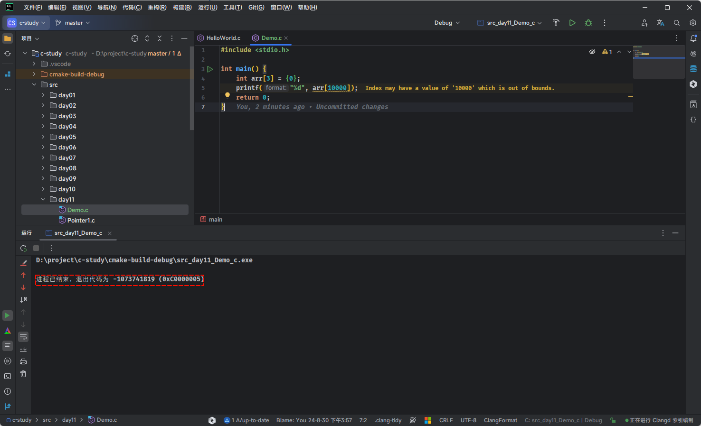
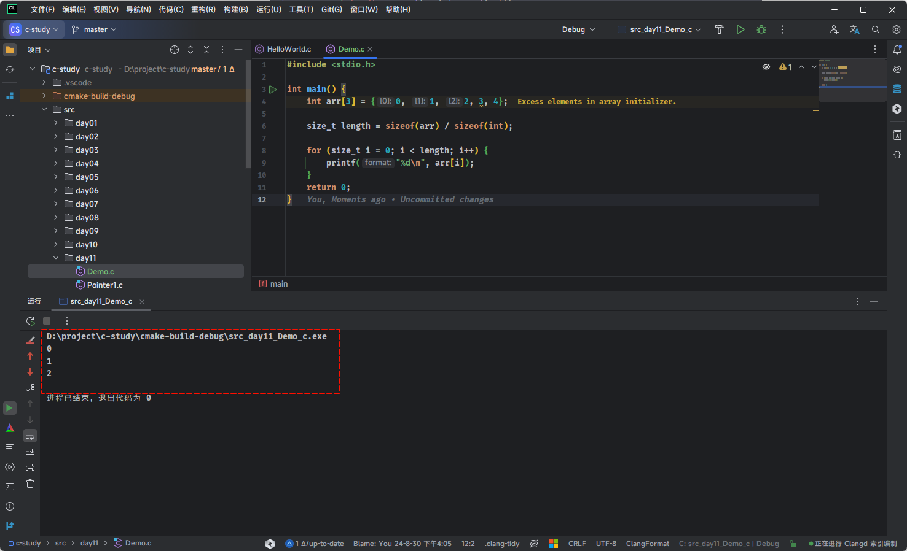

# 第一章：内存中的变量和数组（⭐）

## 1.1 内存中的变量

* 在 C 语言中，数据类型的种类很多，如：short、int、long、float、double、char 等。以 int 类型为例，在 32 位或 64 位操作系统中的，int 类型的变量都是占 4 个字节，当我们在代码中这么定义变量，如：

```c
#include <stdio.h>

int main(){
    
	// 禁用 stdout 缓冲区
    setbuf(stdout, nullptr);
    
    // 定义一个变量并初始化
	int a = 10;
	
	return 0;
}
```

* 那么，编译器就会这么处理，如下所示：


* 在代码中，我们可以使用 `&变量名` 来获取一个变量的内存首地址，如下所示：

```c
#include <stdio.h>

int main() {
    
    // 禁用 stdout 缓冲区
    setbuf(stdout, nullptr);
    
    // 定义一个变量并初始化
    int a = 10;

    printf("变量 a 的首地址是: %p\n", &a); // 变量 a 的首地址是: 0000002bf1dffd0c
    printf("变量 a 的中保存的值是: %d\n", a); // 变量 a 的中保存的值是: 10

    return 0;
}
```

> [!NOTE]
>
> * ① `变量`是对程序中`数据`在内存中存储空间的抽象，如果不涉及到指针变量，那我们在编码的时候，就只需要将变量等价于内存中存储空间里面存储的数据，而不需要再去考虑编译器底层是如何转换，提高了开发效率（机器语言和汇编可不是这样的，需要关注每个细节）。
> * ② 数据类型只在`定义`变量的时候`指定`，而且必须指定；`使用`变量的时候`无需`再声明，因为此时的数据类型已经确定了。

## 1.2 内存中的数组

* 如果我们在代码中这么定义数组，如下所示：

```c
#include <stdio.h>

int main(){
    
	// 禁用 stdout 缓冲区
    setbuf(stdout, nullptr);
    
    // 定义一个数组并初始化
	int arr[] = {1,2,3};
	
	return 0;
}
```

* 那么，编译器就会这么处理，如下所示：


* 在代码中，我们可以直接打印数组名的内存地址，如下所示：

```c
#include <stdio.h>

int main() {

    // 禁用 stdout 缓冲区
    setbuf(stdout, nullptr);

    // 定义一个数组并初始化
    int arr[] = {1, 2, 3};

    printf("arr 的首地址是: %p \n", arr);     // arr 的首地址是: 0x7ffd6c7be5fc
    printf("arr 的首地址是: %p \n", &arr);    // &arr 的地址是: 0x7ffd6c7be5fc
    printf("arr[0] 的地址是: %p \n", &arr[0]);// arr[0] 的地址是: 0x7ffd6c7be5fc
    printf("arr[1] 的地址是: %p \n", &arr[1]);// arr[1] 的地址是: 0x7ffd6c7be600
    printf("arr[2] 的地址是: %p \n", &arr[2]);// arr[2] 的地址是: 0x7ffd6c7be604

    return 0;
}
```

> [!WARNING]
>
> 在上述示例中，`arr` 和 `&arr` 的值是一样的，但是对应的含义是不同的。
>
> * ① `arr` 是数组名，在大多数情况下会转换为数组第一个元素的地址，即：`arr` 等价于 `&arr[0]`，其数据类型是 `int *`。
> * ② `&arr`是数组名的地址，即整个数组的地址，它指向数组本身，并不是数组第一个元素的地址，`&arr` 的数据类型是 `int(*)[3]`。


# 第二章：数组越界和数组溢出（⭐）

## 2.1 数组越界

* C 语言的数组是静态的，当我们定义的时候，就不能自动扩容。当我们试图访问数组的`负索引`或`超出`数组长度的索引时，就会产生`数组越界`。

> [!NOTE]
>
> * ① C 语言为了提高效率，保证操作的灵活性，并不会对越界行为进行检查，即使越界了，也能够正常编译，只有在运行期间才可能发现问题，所以对程序员的要求很高。
> * ② 但是，现代化的高级编程语言，如：Java 等，为了降低开发难度以及提高开发效率，像数组这种越界行为，在编译期间就会由编译器提前捕获，并直接报错！！！

* 请看下面的代码：

```c {10-11,15-16}
#include <stdio.h>

int main() {
    
    // 禁用 stdout 缓冲区
    setbuf(stdout, NULL);

    int arr[3] = {10, 20, 30};

    printf("arr[-1] = %d\n", arr[-1]); // arr[-1] = -23718968
    printf("arr[-2] = %d\n", arr[-2]); // arr[-2] = 0
    printf("arr[0] = %d\n", arr[0]); // arr[0] = 10
    printf("arr[1] = %d\n", arr[1]); // arr[1] = 20
    printf("arr[2] = %d\n", arr[2]); // arr[2] = 30
    printf("arr[3] = %d\n", arr[3]); // arr[3] = -23718976
    printf("arr[4] = %d\n", arr[4]); // arr[4] = 605

    return 0;
}
```

* 越界访问数组元素的值都是不确定的，没有实际的含义，因为在数组之外的内存，我们并不知道到底是什么，可能是其它变量的值，可能是函数参数，也可能是一个地址，这些都是不可控的。

> [!NOTE]
>
> 由于 C 语言的”放任“，我们访问数组时必须非常小心，要确保不会发生越界。

* 当发生数组越界时，如果我们对该内存有使用权限，那么程序将正常运行，但会出现不可控的结果，即：如果我们对该内存没有使用权限，或者该内存压根就没有就分配，那么程序就会崩溃，如下所示：

```c
#include <stdio.h>

int main() {
    
    // 禁用 stdout 缓冲区
    setbuf(stdout, nullptr);
    
    int arr[3] = {0};
    printf("%d", arr[10000]);
    
    return 0;
}
```

* 其结果，如下所示：



> [!NOTE]
>
> * ① 每个程序能使用的内存都是有限的，该程序要访问 `4*10000` 字节处的内存，显然太远了，超出了程序的访问范围。
> * ② 这个地方的内存可能没有被分配，可能是系统本身占用的内存，可能是其它数据的内存，如果放任这种行为，将带来非常危险的后果，操作系统只能让程序停止运行。

* 当然，我们在实际开发中，也不会这么访问，而是会使用 `sizeof` 运算符来获取数组的长度，进而遍历数组中的元素，即：

```c {7}
#include <stdio.h>

int main() {
    
    // 禁用 stdout 缓冲区
    setbuf(stdout, nullptr);
    
    int arr[3] = {0};

    // 获取数组的元素
    size_t length = sizeof(arr) / sizeof(int);

    for (size_t i = 0; i < length; i++) {
        printf("%d\n", arr[i]);
    }
    
    return 0;
}
```

## 2.2 数组溢出

* 数组溢出通常是指将数据存储到一个数组中，超出了数组所能容纳的空间，那么多余的元素就会被丢弃。对于一般的数组，貌似没什么问题，如下所示：

```c
#include <stdio.h>

int main() {
    
    // 禁用 stdout 缓冲区
    setbuf(stdout, nullptr);
    
    int arr[3] = {0, 1, 2, 3, 4};

    size_t length = sizeof(arr) / sizeof(int);

    for (size_t i = 0; i < length; i++) {
        printf("%d\n", arr[i]);
    }
    
    return 0;
}
```

* 其结果，如下所示：



* 但是，对于字符串而言，就会出现不可控的情况，如下所示：

```c {8}
#include <stdio.h>

int main() {
    
    // 禁用 stdout 缓冲区
    setbuf(stdout, nullptr);
    
    // C 语言中没有专门的字符串类型，而是使用字符数组来模拟字符串的
    char str[10] = "Hello World，Hello World，Hello World，";
    puts(str);
    
    return 0;
}
```

* 其结果，如下所示：


* 因为字符串的长度大于数组的长度，数组只能容纳字符串前面的一部分，即使编译器在字符串最后保存了 `'\0'`，也无济于事，因为超过数组长度的元素都会被丢弃。而 `printf()` 输出字符串时，会从第 `0` 个元素开始往后检索，直到遇见`'\0'`才停止，然后把`'\0'`前面的字符全部输出，至于何时遇到 `'\0'`，就只有上帝才能知道。

> [!NOTE]
>
> * ① 在用字符串给字符数组赋值时，要保证数组长度大于字符串长度，以容纳结束符`'\0'`。
> * ② `数组溢出`通常发生在动态分配内存或者通过不安全的函数（如： `strcpy`）进行字符串操作。


# 第三章：C 语言数组 VS Java 语言数组（⭐）

## 3.1 Linux 下 32 位环境的用户空间内存分布情况

* 对于 32 位的环境而言，理论上程序是可以拥有 4GB 的虚拟地址空间的，在 C 语言中使用到的变量、函数、字符串等都会对应内存中的一块区域。
* 但是，在这 4GB 的地址空间中，要拿出一部分给操作系统内核使用，应用程序无法直接访问这一段内存，这一部分内存地址被称为`内核空间`（Kernel Space）。

> [!NOTE]
>
> - ① Windows 在默认情况下会将高地址的 2GB 空间分配给内核（也可以配置为 1GB）。
> - ② 而 Linux 默认情况下会将高地址的 1GB 空间分配给内核。

* 也就是说，应用程序只能使用剩下的 2GB 或 3GB 的地址空间，称为`用户空间`（User Space）。
* Linux 下 32 位环境的经典内存模型，如下所示：


* 各个内存分区的说明，如下所示：

| 内存分区                  | 说明                                                         |
| :------------------------ | :----------------------------------------------------------- |
| 程序代码区（code）        | 存储程序的执行代码，通常为只读区，包含程序的指令。 程序启动时，这部分内存被加载到内存中，并不会在程序执行期间改变。 |
| 常量区（constant）        | 存放程序中定义的常量值，通常也是只读的，这些常量在程序运行期间不可修改。 |
| 全局数据区（global data） | 存储程序中定义的全局变量和静态变量。 这些变量在程序的整个生命周期内存在，且可以被修改。 |
| 堆区（heap）              | 用于动态分配内存，例如：通过 `malloc` 或 `new` 分配的内存块。 堆区的内存由程序员手动管理，负责分配和释放。 如果程序员不释放，程序运行结束时由操作系统回收。 |
| 动态链接库                | 动态链接库（如： `.dll` 或 `.so` 文件）被加载到内存中特定的区域，供程序运行时使用。 |
| 栈区（stack）             | 用于存储函数调用的局部变量、函数参数和返回地址。 栈是自动管理的，随着函数的调用和返回，栈上的内存会自动分配和释放。 |

> [!NOTE]
>
> - ① 程序代码区、常量区、全局数据区在程序加载到内存后就分配好了，并且在程序运行期间一直存在，不能销毁也不能增加（大小已被固定），只能等到程序运行结束后由操作系统收回，所以全局变量、字符串常量等在程序的任何地方都能访问，因为它们的内存一直都在。
> - ② 函数被调用时，会将参数、局部变量、返回地址等与函数相关的信息压入栈中，函数执行结束后，这些信息都将被销毁。所以局部变量、参数只在当前函数中有效，不能传递到函数外部，因为它们的内存不在了。
> - ③ 常量区、全局数据区、栈上的内存由系统自动分配和释放，不能由程序员控制。程序员唯一能控制的内存区域就是`堆`（Heap）：它是一块巨大的内存空间，常常占据整个虚拟空间的绝大部分，在这片空间中，程序可以申请一块内存，并自由地使用（放入任何数据）。堆内存在程序主动释放之前会一直存在，不随函数的结束而失效。在函数内部产生的数据只要放到堆中，就可以在函数外部使用。

## 3.2 C 语言中的数组

* 之前，我们都是这么使用数组的，如下所示：

```c
#include <stdio.h>

int main() {
    
    // 禁用 stdout 缓冲区
    setbuf(stdout, nullptr);
    
    // 定义数组和全部初始化：数组初始化的元素个数等于数组的长度。
    int arr[5] = {1, 2, 3, 4, 5};

    return 0;
}
```

* 其实，这样定义的数组是在`栈`中的，而栈的内存空间是有限的，如果数组中的元素过多，将会出现 `Stack Overflow` 的现象，即：栈溢出。

> [!NOTE]
>
> * ① 栈内存的大小和编译器有关，编译器会为栈内存制定一个最大值。
> * ② 在 VS 中，默认是 1 MB；在 GCC 下，默认是 8 MB。
> * ③ 虽然可以通过参数来修改栈内存的大小；但是，在实际开发中，我们一般也不会这么做。

* 所以，在实际开发中，如果我们要使用数组，就需要在`堆`中开辟内存空间，因为堆中的内存空间是可以动态扩容和缩容的，只不多在 C 语言中对于堆中申请的内存空间，需要程序员在用完之后，手动释放掉；否则，将会造成内存泄漏现象。

```c
#include <stdio.h>
#include <stdlib.h>

int main() {
    
    // 禁用 stdout 缓冲区
    setbuf(stdout, nullptr);
    
    int n;  // 数组的大小
    printf("请输入数组的大小: ");
    scanf("%d", &n);

    // 使用 malloc 申请内存，申请 n 个 int 类型的空间
    int *array = (int *)malloc(n * sizeof(int));

    // 检查 malloc 是否成功
    if (array == NULL) {
        printf("内存分配失败！\n");
        return 1;  // 程序退出
    }

    // 初始化数组并输出
    for (int i = 0; i < n; i++) {
        array[i] = i + 1;  // 简单赋值操作
        printf("array[%d] = %d\n", i, array[i]);
    }

    // 使用完毕后，释放内存
    free(array);

    return 0;
}
```

## 3.3 Java 语言中的数组

* Java 语言和 C 语言不同，Java 语言从`语法层面`就将数组在内存中的分配放到了`堆`中。

```c
public class Test {
    
    public static void main(String[] args){
        // 在堆内存开辟数组，使用完毕后，不需要手动回收对应的内存空间
        int[] arr = new int[4] ; 
    }
}
```

> [!NOTE]
>
> * ① 在 Java 语言中，数组的内存分配是由 JVM（Java Virtual Machine，Java 虚拟机）自动管理的，开发者不需要像在 C 语言中那样手动调用 `malloc` 来申请内存。Java 提供了更加高级的内存管理机制，所有数组在堆中动态分配。
> * ② 在 Java 中，声明和初始化数组的过程本质上就是在堆内存中分配数组内存的过程。每个数组在创建时都会被分配到堆中，并且由垃圾回收机制（Garbage Collector，GC）自动负责内存的回收。
> * ③ 我们甚至可以理解为：Java 语言是 C 语言在实际开发过程中的最佳实践版本。

