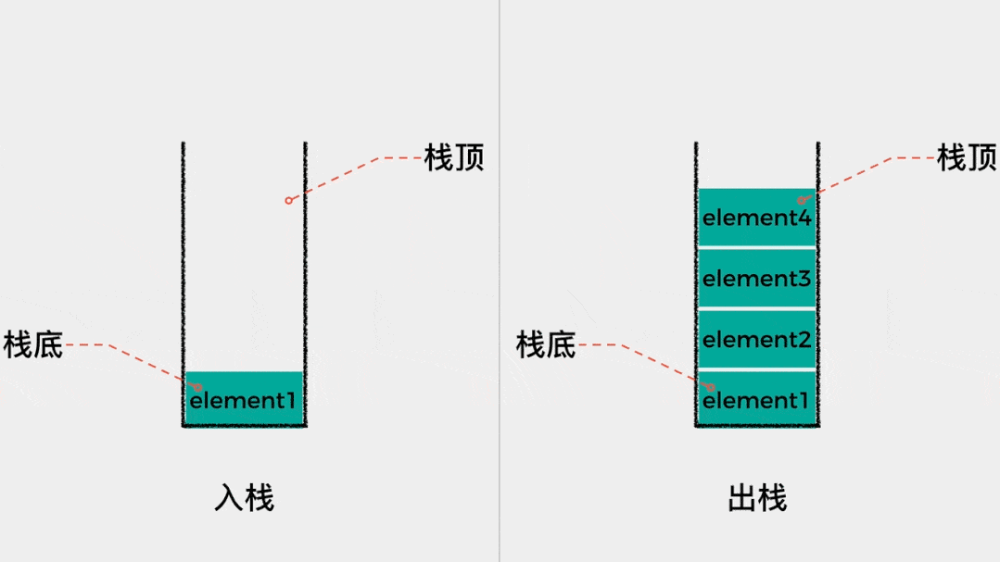

# 第一章：C 语言中的数组指针（⭐）

## 1.1 扫清概念

* `数组指针`（Pointer to an Array）：当指针变量中存放的是一个数组的首地址的时候，就称该指针变量为指向数组的指针变量，简称为`数组指针`。

> [!NOTE]
>
> * ① `数组指针`是`指针变量`，即：指向数组的指针变量，而不是数组。
> * ② 如果整型指针，如：`int *p` ，表示的是指向整型数据的指针变量。那么，数组指针，表示的就是指向数组的指针变量。

> [!NOTE]
>
> ::: details 点我查看 一维数组指针和二维数组指针
>
> * 一维数组指针：指向一维数组的指针（使用居多）。
>
> ```c {2}
> int arr[5] = {1, 2, 3, 4, 5};
> int *p = arr;  // p 是指向 int 类型的指针，指向 arr[0]
> ```
>
> * 二维数组指针：指向二维数组的指针。
>
> ```c {6}
> int arr[3][4] = {
>     {1, 2, 3, 4},
>     {5, 6, 7, 8},
>     {9, 10, 11, 12}
> };
> 
> int (*p)[4] = arr;  // p 是指向包含 4 个整数的数组的指针，指向 arr[0] 
> ```
>
> :::

> [!NOTE]
>
> ::: details 点我查看 一维数组指针的应用场景
>
> **一维数组指针**常用于动态数组、函数参数传递、数组遍历等场景。它简单、高效，尤其适用于处理一维数据结构。
>
> * ① **动态数组管理**：当我们需要在运行时动态分配一维数组的内存时，指针能够提供更大的灵活性，如：使用 `malloc` 或 `new` 动态分配一维数组并通过指针访问。
>
> ```c
> int *arr = (int *)malloc(sizeof(int) * 10);  // 动态分配10个整数的空间
> // 使用指针操作数组
> for (int i = 0; i < 10; i++) {
>     *(arr + i) = i * i;
> }
> free(arr);  // 释放动态内存
> ```
>
> * ② **函数参数传递**：一维数组通常通过指针传递给函数，而不是整个数组。这样可以避免数组复制，提高性能，如：处理数据时通过指针传递数组，减少内存开销。
>
> ```c
> void processArray(int *arr, int size) {
>     for (int i = 0; i < size; i++) {
>         printf("%d ", *(arr + i));
>     }
> }
> int main() {
>     int arr[5] = {1, 2, 3, 4, 5};
>     processArray(arr, 5);  // 传递数组指针
>     return 0;
> }
> ```
>
> * ③ **数组遍历和操作**：当我们需要在一个一维数组上进行遍历和操作时，指针提供了更加灵活的方式，尤其是在处理大型数据时，可以通过指针直接访问内存位置，效率较高。
>
> ```c
> int arr[5] = {1, 2, 3, 4, 5};
> int *p = arr;
> while (p < arr + 5) {
>     printf("%d ", *p);
>     p++;
> }
> ```
>
> * ④ **数组与指针混合使用**：有时数组与指针结合使用，尤其是在处理多维数组时，一维数组指针可以方便地访问和修改数组的元素。这种方式适合在不需要多维数组指针时使用。
>
> ```c
> int arr[3][4] = {
>     {1, 2, 3, 4},
>     {5, 6, 7, 8},
>     {9, 10, 11, 12}
> };
> int *p = &arr[0][0];
> printf("%d\n", *(p + 5));  // 访问 arr[1][1]，值为6
> ```
>
> :::

> [!NOTE]
>
> ::: details 点我查看 二维数组指针的应用场景
>
> **二维数组指针**适合用于处理复杂的二维数据（矩阵、表格、图像等），尤其在需要动态分配内存、优化内存布局时非常有用。
>
> * ① **处理二维动态数组**：当我们需要动态创建二维数组时，使用二维数组指针可以灵活地分配和访问内存，如：创建一个动态的矩阵，在内存中分配一个二维数组的指针并进行操作。
>
> ```c
> int **arr;
> int rows = 3, cols = 4;
> arr = (int **)malloc(rows * sizeof(int *));  // 分配指向行的指针
> for (int i = 0; i < rows; i++) {
>     arr[i] = (int *)malloc(cols * sizeof(int));  // 分配每行的列
> }
> 
> // 填充二维数组
> for (int i = 0; i < rows; i++) {
>     for (int j = 0; j < cols; j++) {
>         arr[i][j] = i * j;
>     }
> }
> 
> // 释放内存
> for (int i = 0; i < rows; i++) {
>     free(arr[i]);
> }
> free(arr);
> ```
>
> * ② **矩阵操作**：在处理矩阵（如图像处理、科学计算、机器学习等领域）时，二维数组指针非常常见。通过二维数组指针可以方便地操作每行的元素。
>
> ```c
> void printMatrix(int (*arr)[4], int rows) {
>     for (int i = 0; i < rows; i++) {
>         for (int j = 0; j < 4; j++) {
>             printf("%d ", arr[i][j]);
>         }
>         printf("\n");
>     }
> }
> 
> int main() {
>     int arr[3][4] = {
>         {1, 2, 3, 4},
>         {5, 6, 7, 8},
>         {9, 10, 11, 12}
>     };
>     printMatrix(arr, 3);  // 输出整个矩阵
>     return 0;
> }
> ```
>
> * ③ **多维数组的处理**：二维数组指针也可以用来处理更高维度的数据。通过指针逐层访问数据，可以处理复杂的数据结构，如：三维数组、四维数组等。
>
> ```c
> void process3DArray(int (*arr)[4][3], int depth) {
>     for (int i = 0; i < depth; i++) {
>         for (int j = 0; j < 4; j++) {
>             for (int k = 0; k < 3; k++) {
>                 printf("%d ", arr[i][j][k]);
>             }
>             printf("\n");
>         }
>     }
> }
> 
> int main() {
>     int arr[2][4][3] = {
>         {{1, 2, 3}, {4, 5, 6}, {7, 8, 9}, {10, 11, 12}},
>         {{13, 14, 15}, {16, 17, 18}, {19, 20, 21}, {22, 23, 24}}
>     };
>     process3DArray(arr, 2);  // 输出三维数组
>     return 0;
> }
> ```
>
> :::

* `指针数组`（Array of Pointers）：数组可以用来存放一系列相同类型的数据，那么数组也可以用来存放指针，这种用来`存放指针的数组`就被称为`指针数组`。

> [!NOTE]
>
> * ① `指针数组`是`数组`，用来存放指针的数组。
> * ② `指针数组`要求存放在数组中的指针的`数据类型必须一致`。

> [!NOTE]
>
> ::: details 点我查看 指针数组的应用场景
>
> * ① **字符数组**：直接定义一个字符数组来存储多个字符串时，每个字符串需要事先指定大小。字符数组内的字符串是固定长度的，通常需要分配一个足够大的内存空间来存储最长的字符串。
>
> ```c
> char strArr[4][20] = {"Hello", "World", "C", "Programming"}; 
> ```
>
> * ② **指针数组**：指针数组更灵活，因为每个指针元素都可以指向不同长度的字符串，且不需要预先知道字符串的长度。
>
> ```c
> char *strArr[] = {"Hello", "World", "C", "Programming"};
> ```
>
> :::

## 1.2 数组指针相关的概念

* 数组（Array）就是一系列具有相同类型的数据的集合，每一份数据称为数组元素（Element）。数组中的所有元素在内存中都是连续排列的，整个数组占用的是一块大的内存。
* 以 `int arr[] = {1,2,3,4,5,6};` 为例，该数组在内存中，就是这样的，如下所示：


* 在定义数组的时候，需要给出数据名和数组长度，数组名通常`认为`是一个指针，它指向数组的第 `0` 个元素，如下所示：

> [!NOTE]
>
> * ① 在 C 语言中，我们将第 `0` 个元素的地址称为数组的首地址。
> * ② 数组名的本意是表示整个数组，即：表示多份数据的集合，但是在使用过程中，经常会转换为指向数组第 0 个元素的内存地址（指针），所以上文中使用了`认为`；换言之，数组名和数组的首地址并不总是等价的。
> * ③ 此处，我们可以暂时忽略这个细节，将数组名就当做数组第 `0` 个元素的内存地址（指针）使用，后面再讨论具体细节。


> [!IMPORTANT]
>
> * ① 为了能够通过指针遍历数组的元素，在`定义数组指针`的时候需要`降维处理`，如：三维数组指针实际指向的数据类型是二维数组，二维数组指针实际指向的数据类型是一维数组，一维数组指针实际指向的数据类型是一个基本数据类型。
>
> * ② 在表达式中，数组名也会进行同样的转换！！！

## 1.3 数组元素的遍历

### 1.3.1 下标法

* 使用`传统`的方式（`下标法`）遍历数组中的元素。


* 示例：

```c
#include <stddef.h>
#include <stdio.h>

int main() {
    
    // 禁用 stdout 缓冲区
    setbuf(stdout, NULL);

    // 定义普通数组
    int arr[] = {1, 2, 3, 4, 5, 6};

    // 计算数组的长度
    int len = sizeof(arr) / sizeof(int);

    // 使用传统方式遍历数组
    for (int i = 0; i < len; i++) { // [!code highlight]
        printf("arr[%d] = %d\n", i, arr[i]);
    }

    return 0;
}
```

### 1.3.2 指针法

* 使用`指针`的方式遍历数组中的元素。


* 示例：

```c {19}
#include <stddef.h>
#include <stdio.h>

int main() {
    
    // 禁用 stdout 缓冲区
    setbuf(stdout, NULL);

    // 定义普通数组
    int arr[] = {1, 2, 3, 4, 5, 6};

    // 计算数组的长度
    int len = sizeof(arr) / sizeof(int);

    // 使用指针方式遍历数组
    for (int i = 0; i < len; i++) {
        // arr 是 int* 类型的指针变量，每次 + 1 的时候，自身会增加 sizeof(int) * i
        // 在使用下标法的时候，C 语言底层会将 arr[i] 转换为 *(arr + i) 
        printf("arr[%d] = %d\n", i, *(arr + i)); // *(arr+i) 等价于 arr[i]
    }

    return 0;
}
```

### 1.3.3 指针法

* 由于 `arr` 本身就是一个指针，所以我们也可以将其赋值给另一个指针变量 `p`。


* 示例：

```c
#include <stddef.h>
#include <stdio.h>

int main() {
    
    // 禁用 stdout 缓冲区
    setbuf(stdout, NULL);

    // 定义普通数组
    int arr[] = {1, 2, 3, 4, 5, 6};

    // 计算数组的长度
    int len = sizeof(arr) / sizeof(int);

    // 将 arr 的地址赋值给 p
    int *p = arr; // [!code highlight]

    // 使用指针方式遍历数组
    for (int i = 0; i < len; i++) {
        printf("arr[%d] = %d\n", i, *(p + i));
    }

    return 0;
}
```

### 1.3.4 注意事项

* ① `arr` 是数组第 `0` 个元素的地址，所以 `int *p = arr;` 也可以写成 `int *p = &arr[0];`；换言之，`arr`、`p` 和 `&arr[0]` 是等价的，都是指向数组的第 0 个元素。
* ② 需要说明的是，`“arr 本身就是一个指针”`的说法并不是很严谨。严格来说，应该是“arr 被转换为一个指针”，请暂时忽略这个细节。
* ③ `数组名`和普通的`指针变量`不同，它是一个`常量指针`（`int* const p = arr`），意味着它的值（指向的地址）是固定的，不能被修改。

## 1.4 数组指针的类型

* 如果一个`指针变量`指向了数组，我们就称它是`数组指针`。

> [!NOTE]
>
> * ① 通常情况下，数组指针指向的是数组中第 0 个元素（建议）。
> * ② 但是也未必，数组指针可以指向数组中的任意一个具体的元素。

* 如果是一个普通的变量，我们可以知道它的类型是什么，如下所示：

```c
int num = 10; // 普通变量 num 的类型是 int 类型
char c = 'a'; // 普通变量 c 的类型是 char 类型
```

* 那么，同样的道理，我们也可以知道一个数组指针（指针变量）的类型是什么，如下所示：

```c
int arr[] = {1,2,3,4,5};

int *p = arr; // 指针变量 p 的类型是 int*
```

* 反过来想，对于一个指针变量 p 而言，它并不清楚它指向的是一个数组，还是一个整型的变量，如下所示：

```c {5-6}
int num = 10;
int arr[] = {1,2,3,4,5}
int *p = NULL;

p = arr;
p = &num;
```

* 对于指针变量 p 而言，怎么使用，取决于程序员的编码，如下所示：

```c
#include <stddef.h>
#include <stdio.h>

int main() {
    
    // 禁用 stdout 缓冲区
    setbuf(stdout, NULL);

    // 定义普通数组
    int arr[] = {1, 2, 3, 4, 5, 6};

    // 计算数组的长度
    int len = sizeof(arr) / sizeof(int);

    // 将 arr 的地址赋值给 p
    int *p = arr;

    // 使用指针方式遍历数组
    for (int i = 0; i < len; i++) {
        printf("arr[%d] = %d\n", i, *(p + i)); // [!code highlight]
    }

    return 0;
}
```

> [!NOTE]
>
> * ① 数组的元素在内存中只是简单的排列，没有开始标识，也没有结束标识。所以，在获取数组长度的时候，并不可以使用 `sizeof(p) / sizeof(int)`，因为指向变量 `p` 就是一个指向 `int` 类型的指针，它的类型就是 `int*`，它并不清楚自己指向的是数组还是整数，而 `sizeof(p)`获取的是指针变量 `p`本身占用的字节数，在 `32` 位操作系统上是 `4` 个字节，在 `64` 位操作系统上是 `8` 个字节， 并不是数组中所有元素占用的字节数。
> * ② 换言之，数组指针不能逆推出整个数组元素的个数，以及数组从哪里开始、到哪里结束等信息。不像字符串，数组本身也没有特定的结束标志，如果不知道数组的长度，那么就无法遍历整个数组。
> * ③ 数组名是常量，它的值不能改变，而数组指针是变量（除非特别指明它是常量），它的值可以任意改变，即：数组名只能指向数组的开头，而数组指针可以先指向数组开头，再指向其他元素。

## 1.5 指针带下标的使用

* 指向数组元素的指针变量也可以带下标，如：`p[i]` 就会在底层转换为 `*(p+i)`。如果指针变量 `p` 指向数组的第 `0` 个元素 `arr[0]`，则 `p[i]` 就代表 `arr[i]`。

> [!WARNING]
>
> * ① 必须搞清楚，指针变量 `p` 当前指向数组中的哪个元素？如果指针变量 `p` 指向 `arr[3]`，那么 `p[2]` 并不是代表 `arr[2]`，而是代表 `arr[3+2]`，即 `arr[5]`。
> * ② 在实际开发中，强烈建议将指针变量 `p` 指向数组中的第 `0` 个元素！！！


* 示例：

```c
#include <stdio.h>

int main() {
    
    // 禁用 stdout 缓冲区
    setbuf(stdout, nullptr);

    // 定义数组
    int arr[] = {1, 2, 3, 4, 5};

    // 获取数组长度
    int len = sizeof(arr) / sizeof(int);

    // 定义指针变量指向数组的第 0 个元素
    int *p = arr; // [!code highlight]

    // 遍历数组
    for (int i = 0; i < len; ++i) { // [!code highlight]
        printf("arr[%d] = %d\n", i, p[i]);
    }

    return 0;
}
```

## 1.6 数组遍历大总结

* 对于数组而言，可以根据`下标法`和`指针法`来遍历元素，如下所示：


> [!NOTE]
>
> 通常而言，数组名通常`认为`是一个指针，它指向数组的第 `0` 个元素；并且，上图中的指针变量 `p`也指向数组的第 `0` 个元素，那么：
>
> * 对于数组元素 `arr[0]` 而言：
>   * 其`内存地址`可以这样表示：`&arr[0]`、`arr`、`p`。
>   * 其`值`可以这样表示：`arr[0]`、`*arr`、`*p`。
> * 对于数组元素 `arr[1]` 而言：
>   * 其`内存地址`可以这样表示：`&arr[1]`、`arr+1`、`p+1`。
>   * 其`值`可以这样表示：`arr[1]`、`*(arr+1)`、`*(p+1)`。
> * ...
> * 对于数组元素 `arr[i]` 而言：
>   * 其`内存地址`可以这样表示：`&arr[i]`、`arr+i`、`p+i`。
>   * 其`值`可以这样表示：`arr[i]`、`*(arr+i)`、`*(p+i)`。


* 示例：下标法

```c {16}
#include <stddef.h>
#include <stdio.h>

int main() {
    
    // 禁用 stdout 缓冲区
    setbuf(stdout, NULL);

    // 定义普通数组
    int arr[] = {1, 2, 3, 4, 5, 6};

    // 计算数组的长度
    int len = sizeof(arr) / sizeof(int);

    // 使用传统方式遍历数组
    for (int i = 0; i < len; i++) {
        printf("arr[%d] = %d\n", i, arr[i]); // [!code highlight]
    }

    return 0;
}
```


* 示例：指针法

```c {18}
#include <stddef.h>
#include <stdio.h>

int main() {
    
    // 禁用 stdout 缓冲区
    setbuf(stdout, NULL);

    // 定义普通数组
    int arr[] = {1, 2, 3, 4, 5, 6};

    // 计算数组的长度
    int len = sizeof(arr) / sizeof(int);

    // 使用指针方式遍历数组
    for (int i = 0; i < len; i++) {
        // arr 是 int* 类型的指针变量，每次 + 1 的时候，自身会增加 sizeof(int) * i
        printf("arr[%d] = %d\n", i, *(arr + i)); // *(arr+i) 等价于 arr[i]
    }

    return 0;
}
```


* 示例：指针法

```c
#include <stddef.h>
#include <stdio.h>

int main() {
    
    // 禁用 stdout 缓冲区
    setbuf(stdout, NULL);

    // 定义普通数组
    int arr[] = {1, 2, 3, 4, 5, 6};

    // 计算数组的长度
    int len = sizeof(arr) / sizeof(int);

    // 将 arr 的地址赋值给 p
    int *p = arr; // [!code highlight]

    // 使用指针方式遍历数组
    for (int i = 0; i < len; i++) { // [!code highlight]
        printf("arr[%d] = %d\n", i, *(p + i));
    }

    return 0;
}
```


* 示例：指针法

```c
#include <stddef.h>
#include <stdio.h>

int main() {
    
    // 禁用 stdout 缓冲区
    setbuf(stdout, NULL);

    // 定义普通数组
    int arr[] = {1, 2, 3, 4, 5, 6};

    // 计算数组的长度
    int len = sizeof(arr) / sizeof(int);

    // 将 arr 的地址赋值给 p
    int *p = arr; // [!code highlight]

    // 使用指针方式遍历数组
    for (int i = 0; i < len; i++) { // [!code highlight]
        printf("arr[%d] = %d\n", i, *p++);
    }

    return 0;
}
```


* 示例：指针法

```c
#include <stdio.h>

int main() {
    
    // 禁用 stdout 缓冲区
    setbuf(stdout, nullptr);

    // 定义数组
    int arr[] = {1, 2, 3, 4, 5};

    // 获取数组长度
    int len = sizeof(arr) / sizeof(int); 

    // 定义指针变量指向数组的第 0 个元素
    int *p = arr; // [!code highlight]

    // 遍历数组
    for (int i = 0; i < len; ++i) { // [!code highlight]
        printf("arr[%d] = %d\n", i, p[i]);
    }

    return 0;
}
```

## 1.7 数组指针的不同写法

* 如果指针变量 p 是指向数组 arr 中第 0 个元素的指针，那么 `*p++` 、`*++p`以及 `(*p)++` 分别是什么意思？
  * `*p++`中的 `p++` 的优先级比 `*p`要高，即：`*p++` 相当于 `*(p++)`，而 `p++` 的值是 `p`，副作用是 `p+1` ；所以，`*p++` 的值是 `*p`，副作用是 `p+1`。
  * `(*p)++`中的 `(*p)` 优先级最高，即：`(*p)++`的值是 `*p` ，副作用是 `*p+1`。
  * `*++p` 中的 `++p` 的优先级比 `*p` 要高，即：`*++p` 相当于 `*(++p)`，而 `++p` 的值是 `p+1` ，副作用是 `p+1`；所以，`*++p` 的值是 `*(p+1)`，副作用是 `p+1`。


> [!NOTE]
>
> 在实际开发中，`*p++`  用的居多！！！


# 第二章：C 语言中的二级指针（⭐）

## 2.1 概述

* 在 C 语言中，指针变量只能保存内存地址。那么，指针变量是可以指向普通类型的数据，即：一级指针，如：

```c {3}
int num = 10;

// 表示 p 指针所指向的是一个 int 类型的数据，简称 int 指针
int *p = &num; 
```

```c {3}
char c = 'a';

// 表示 p 指针所指向的是一个 char 类型的数据，简称 char 指针
char *p = &c; 
```

```c {3}
double d = 3.14;

// 表示 p 指针所指向的是一个 char 类型的数据，简称 char 指针
double *p = &d; 
```

* 其内存简图，就是这样的，如下所示：


* 一级指针也是变量，也有自己的内存地址，并且指针变量只能保存内存地址，所以指针变量也可以指向一级指针，即：二级指针，如下所示：

```c 
int num = 10;

// 表示 p 指针所指向的是一个 int 类型的数据，简称 int 指针
int *p = &num; 

// 表示 pp 指针所指向的是一个 int* 类型的数据，简称 int 二级指针
int **pp = &p; // [!code highlight]
```

```c
char c = 'a';

// 表示 p 指针所指向的是一个 char 类型的数据，简称 char 指针
char *p = &c; 

// 表示 pp 指针所指向的是一个 char* 类型的数据，简称 char 二级指针
char **pp = &p; // [!code highlight]
```

```c 
double d = 3.14;

// 表示 p 指针所指向的是一个 double 类型的数据，简称 double 指针
double *p = &d; 

// 表示 pp 指针所指向的是一个 double* 类型的数据，简称 double 二级指针
double **pp = &p; // [!code highlight]
```

* 其内存简图，就是这样的，如下所示：


## 2.2 语法

* 语法：

```c
数据类型 **指针变量名; // 二级指针
```

> [!NOTE]
>
> * ① 二级指针就是一个指针变量的值是另外一个指针变量的内存地址。
> * ② 通俗的讲，二级指针就是指向指针的指针。
> * ③ 针变量也是一种变量，也会占用存储空间，也可以使用`&`获取它的地址。C 语言不限制指针的级数，每增加一级指针，在定义指针变量时就得增加一个星号`*`。换言之，一级指针在定义的时候，有一个 `*` ，二级指针在定义的时候，有两个 `*` 。
> * ④ 在实际开发中，会经常使用一级指针和二级指针，几乎用不到高级指针。

## 2.3 应用示例

* 示例：定义二级指针

```c {10,13}
#include <stdio.h>

int main() {
    
    // 禁用 stdout 缓冲区
    setbuf(stdout, NULL);

    int num = 10;

    int *p = &num; // 一级指针
    printf("num = %d\n", *p); // num = 10

    int **pp = &p; // 二级指针
    printf("num = %d\n", **pp); // num = 10

    return 0;
}
```


* 示例：定义多级指针

```c {10,13,16}
#include <stdio.h>

int main() {
    
    // 禁用 stdout 缓冲区
    setbuf(stdout, NULL);

    int num = 10;

    int *p = &num; // 一级指针
    printf("num = %d\n", *p); // num = 10

    int **pp = &p; // 二级指针
    printf("num = %d\n", **pp); // num = 10

    int ***ppp = &pp; // 三级指针
    printf("num = %d\n", ***ppp); // num = 10

    return 0;
}
```


# 第三章：数组和指针并不等价（⭐）

## 3.1 概述

* 通过之前的讲解，相信很多人会认为`数组`和`指针`是等价的，`数组名`表示的是`数组`的`首地址`，如下所示：

> [!NOTE]
>
> 这里所说的`指针`是`指针变量`，而不是`内存地址`。

```c
#include <stddef.h>
#include <stdio.h>

int main() {
    
    // 禁用 stdout 缓冲区
    setbuf(stdout, NULL);

    // 定义普通数组
    int arr[] = {1, 2, 3, 4, 5, 6};

    // 计算数组的长度
    int len = sizeof(arr) / sizeof(int);

    // 将 arr 的地址赋值给 p
    int *p = arr; // [!code highlight]

    // 使用指针方式遍历数组
    for (int i = 0; i < len; i++) {
        printf("arr[%d] = %d\n", i, *(p + i));
    }

    return 0;
}
```

## 3.2 数组和指针并不等价

* 但是，上面的看法，在严格意义上是不正确的，数组和指针（指针变量）并不等价，如下所示：

> [!NOTE]
>
> * ① 在大多数情况下，数组名确实会转换会指针（内存地址）；但是，并不代表数组就和指针（指针变量）等价。
> * ② 很好理解，当定义完数组之后，数组就不会再变化了，即：在程序运行过程中，数组名就是一个内存地址，不会再发生变化，我们可以将数组名认为是一个常量地址。但是，指针变量是一个变量，而变量是可以变化的。

```c {16-17,20-21}
#include <stddef.h>
#include <stdio.h>

int main() {
    
    // 禁用 stdout 缓冲区
    setbuf(stdout, NULL);

    // 定义普通数组
    int arr[] = {1, 2, 3, 4, 5, 6};

    // 将 arr 的地址赋值给 p
    int *p = arr;

    // 计算长度
    int lenA = sizeof(arr) / sizeof(int);
    int lenB = sizeof(p) / sizeof(int);

    // 打印
    printf("lenA = %d\n", lenA); // lenA = 6
    printf("lenB = %d\n", lenB); // lenB = 2

    return 0;
}
```

> [!NOTE]
>
> * ① 数组是一系列数据的集合，没有开始标识和结束标识，指针变量 `p` 仅仅是一个指向 `int` 类型的指针，编译器不会知道它到底指向的是一个整数还是一堆整数，对 `p` 进行 `sizeof` 运算，获取的只是指针变量本身在内存空间占据的字节数，如：在 `32` 位操作系统是 `4` 字节，在 `64` 位操作系统是 `8` 字节，所以 `lenB  = 8 ÷ 4 = 2` 。换言之，编译器并没有将指针变量 `p` 和`数组`关联起来，`p` 仅仅代表是一个指针变量，不管它指向哪里，对其进行 `sizeof` 运算，获取的永远是它本身在内存空间占据的的字节数。
> * ② 从编译器的角度而言，数组名、变量名就是一种符号而已，它们最终都要和数据绑定在一起的。变量名就是用来代表内存空间中的一份数据，而数组名就是用来代表内存空间中的一组数据或者数据的结合，它们都是有类型的，以便推断出所指向的数据在内存空间中占据的字节数。

>[!IMPORTANT]
>
>总结：数组就是有类型的，如果我们将 `int`、`float`、`char` 等理解为基本数据类型，那么数组就可以理解为由基本数据类型派生得到的稍微复杂一些的数据类型，`sizeof` 就是根据`符号的类型`来计算长度的。

* 对于数组 `arr` 而言，它的类型是 `int[6]`，表示是一个拥有 `6` 个 `int` 数据的集合，`1` 个 int 类型的长度是 `4` ，`6` 的 `int` 的长度就是 `6 × 4 = 24` 。所以，通过 `sizeof` 就可以很容易的获取到 `arr` 的长度。

```c
int arr[] = {1, 2, 3, 4, 5, 6};
```

* 对于指针变量 `p` 而言，它的类型是 `int *`，在 `32` 位操作系统是 `4` ，在 `64` 位操作系统是 `8` 。

```c
int *p = NULL;
```

> [!NOTE]
>
> * ① `p` 和 `arr` 的符号的类型不同，所代表的数据也不是同的，而 `sizeof` 是根据符号的类型来获取长度的，`p` 和 `arr` 的类型不同，当然获取的长度也是不一样的。
>
> * ② 同样的道理，就二维数组而言，如：`int arr[3][3] = {1, 2, 3, 4, 5, 6, 7, 8, 9};`，它的类型就是 `int[3][3]`，长度就是 `4 × 3 × 3 = 36` 。


## 3.3 从编译器的角度看问题

* 编程语言的目的就是为了将`计算机指令（机器语言）`抽象为人类能够理解的`自然语言`，让程序员能够更加容易，去管理和操作计算机中的各种资源，如：CPU、内存、硬盘等，这些`计算机资源`最终表现为`编程语言`中的各种`符号`和`语法规则`。
* `编译器`在`编译过程`中会维护一种`数据结构`，通常称为`符号表`，如下所示：

| 变量名称   | 数据类型 | 大小（字节） | 内存地址     | 作用域         | 初始值                                 |
| ---------- | -------- | ------------ | ------------ | -------------- | -------------------------------------- |
| `intVar`   | `int`    | 4            | `0x7ffeabc0` | 局部（函数内） | `10`                                   |
| `floatVar` | `float`  | 4            | `0x7ffeabc4` | 局部（函数内） | `3.14`                                 |
| `arrayVar` | `int[5]` | 20           | `0x7ffeabc8` | 全局           | `{1,2,3,4,5}`                          |
| `ptr`      | `int*`   | 8            | `0x7ffeabcc` | 局部（函数内） | `0x7ffeabc8`（指向 `arrayVar` 的地址） |

> [!NOTE]
>
> * ① 符号表用于存储程序中所有标识符的信息，包括：变量名、函数名、类型、作用域以及在内存中的地址等。
> * ② 在编译过程中，当编译器遇到一个标识符时，它会查找符号表，以确认这个标识符的属性。这使得程序员在编写代码时可以使用易于理解的名字，而不需要关心底层的内存地址和数据布局。
> * ③ `sizeof` 操作符通过查询符号表，能够获取到标识符所对应的数据类型的大小（以字节为单位）。因此，程序员只需使用 `sizeof` 来获取数据类型的大小，而不必自己去计算或查找其在内存中的占用。

> [!IMPORTANT]
>
> * ① 符号表在编译器中起到桥梁的作用，使得高级语言的抽象能够有效地转化为底层机器能够理解的指令和内存布局。
> * ② 这种机制提高了编程的效率和安全性，让程序员能够专注于逻辑而非内存管理。

> [!NOTE]
>
> * ① 但是，和普通变量名相比，数组名就既有“一般性”，也有“特殊性”。
> * ② 所谓的“一般性”，就是数组名和普通变量类似，是用来代替特定的内存空间的存储区域，有自己的类型和长度，如：`int arr[5] = {1, 2, 3, 4, 5};` 中的 `arr` 就是一个`数组名`，它的类型是 `int[5]` ，它的长度是 `5 × 4 = 20` 。
> * ③ 所谓的“特殊性”，就是数组名在大多数情况下会被隐式转换为指向其第一个元素的指针，也被称为“数组到指针的衰退”，这就意味着：数组名本身并不是直接表示数组的所有值，而是指向数组第一个元素的地址。


# 第四章：数组到底在什么时候会转换为指针（⭐）

## 4.1 C 语言编译器的处理过程

* C 语言编译器在编译代码的时候，其步骤大致分为`词法分析`、`语法分析`、`语义分析`、`中间代码生成`、`优化`、`目标代码生成`、`汇编与链接`，如下所示：


* C 语言在语义分析阶段，会将变量名、类型、作用域等信息存储在符号表中，如下所示：

| 变量名称   | 数据类型 | 大小（字节） | 内存地址     | 作用域         | 初始值                                 |
| :--------- | :------- | :----------- | :----------- | :------------- | :------------------------------------- |
| `intVar`   | `int`    | 4            | `0x7ffeabc0` | 局部（函数内） | `10`                                   |
| `floatVar` | `float`  | 4            | `0x7ffeabc4` | 局部（函数内） | `3.14`                                 |
| `arrayVar` | `int[5]` | 20           | `0x7ffeabc8` | 全局           | `{1,2,3,4,5}`                          |
| `ptr`      | `int*`   | 8            | `0x7ffeabcc` | 局部（函数内） | `0x7ffeabc8`（指向 `arrayVar` 的地址） |

* 当编译器遇到`数组`参与的`表达式计算`或作为`函数参数`的时候，会进行以下的操作：
  * ① 查符号表：编译器会通过符号表查找到这个标识符（数组名）对应的类型和内存地址。
  * ② 识别数组类型：编译器识别出这是一个数组，而不是普通变量。
  * ③ 自动转换：据语言规则，编译器会在`特定的场景`下自动将`数组名`转换为一个指向数组第一个元素的`指针`。

> [!IMPORTANT]
>
> * ① C 语言标准规定：当数组名作为数组定义的标识符，即：定义或声明数组时，遇到 `sizeof` 运算符或 `&` 操作符的时候，数组名代表整个数组；否则，数组名会被转换为指向第 `0` 个元素的指针（地址）。
> * ② C 语言标准规定，作为“类型的数组”的形参应该调整为“类型的指针”。在函数形参定义这个特殊情况下，编译器必须把数组形式改写成指向数组第 `0` 个元素的指针形式。编译器只向函数传递数组的地址，而不是整个数组的拷贝。

## 4.2 数组名转换为指针

### 4.2.1 概述

* 在大多数情况下，C 语言的编译器会自动将数组名转换为指向数组第 `0` 个元素的指针，这个过程也被称为“数组到指针的衰退”。
* C 语言编译器，会在如下的场景下，自动将`数组名`转换为指向数组第 `0` 个元素的`指针`：
  * ① `数组名作为函数的参数`。
  * ② `数组名参与表达式计算`。

### 4.2.2 数组名作为函数的参数

* 当我们将`数组名`作为`参数`传递给`函数`的时候，编译器会自动将其转换为指向该数组第 `0` 个元素的指针。

> [!IMPORTANT]
>
> * ① 数组名作为函数参数的时候，我们需要事先计算好数组的长度，并和数组名一起作为参数传递给函数作为形参。
> * ② 否则，由于数组名在作为函数形参的时候，会自动`退化`为指针；当使用 `sizeof(数组名)` 的时候，获取的不是数组所有元素在内存中占据的存储单元，而是指针在内存中占据的存储单元，将不能正确的遍历数组中的所有元素。

> [!NOTE]
>
> 
>
> ::: details 点我查看 为什么叫`退化`，而不是`进化`？
>
> * 退化的主要原因，如下所示：
>   * ① `信息丢失`：数组名作为函数形参的时候传递到数组中，会丢失数组长度的信息。
>   * ② `语义变化`：在数组没有作为函数形参的时候，数组名还是代表整个数组。但是，一旦作为函数的形参传递到函数内部，数组名就仅仅只代表是一个指针，代表的是数组第 0 个元素的地址。这是一个从"更丰富"到"更简单"的转变，所以用“退化”这个词来描述是恰当的。
>
> * 我们讲数组`退化`为指针，主要是指在传递数组时丢失了其原有属性，而只保留了最基本的，即：数组第 0 个元素的地址。
>
> :::


* 示例：

```c
#include <stddef.h>
#include <stdio.h>

void print(int arr[], int len) {

    // arr 的长度是 = 8，64 位机器的指针长度是 8
    printf("arr 的长度是 = %zu\n", sizeof(arr));

    for (int i = 0; i < len; ++i) {
        printf("%d ", arr[i]);
    }
}

int main() {
   
    // 禁用 stdout 缓冲区
    setbuf(stdout, NULL);

    // 定义普通数组
    int arr[6] = {1, 2, 3, 4, 5, 6};

    // 计算数组的长度
    int len = sizeof(arr) / sizeof(arr[0]);

    // 打印数组
    print(arr, len); // [!code highlight]

    return 0;
}
```

### 4.2.3 数组名参与表达式计算

* 在大多数情况下，`数组名`参与`表达式计算`时，编译器也会将其转换为指向数组第 `0` 个元素的指针。

> [!NOTE]
>
> 所谓的`数组名`参与`表达式计算`，有两种情况，如下所示：
>
> * ① `数组名`在`赋值表达式`的`右边`，如：`int *p = arr;`。
> * ② `数组名`参与`算术运算`，如：`int *p = arr + 3;`。

> [!CAUTION]
>
> * ① 在 C 语言中，`数组`是`不可以`重新赋值的。
>
> ::: details 点我查看
>
> ```c
> #include <stddef.h>
> #include <stdio.h>
> 
> int main() {
>     
>     // 禁用 stdout 缓冲区
>     setbuf(stdout, NULL);
> 
>     // 初始化
>     int arr[6] = {1, 2, 3, 4, 5, 6};
> 
>     // 错误
>     arr = NULL; // [!code error]
> 
>     return 0;
> }
> ```
>
> :::
>
> * ② 在 Java 语言中，`数组`是`可以`重新赋值的。
>
> ::: details 点我查看
>
> ```java
> public class Array {
>     public static void main(String[] args){
>         
>         // 初始化
>         int[] arr = new int[]{1,2,3,4,5,6};
>         
>         // 可以
>         arr = null; // [!code highlight]
>     }
> }
> ```
> :::


* 示例：

```c {13,16}
#include <stddef.h>
#include <stdio.h>

int main() {
    
    // 禁用 stdout 缓冲区
    setbuf(stdout, NULL);

    // 定义普通数组
    int arr[6] = {1, 2, 3, 4, 5, 6};

    // 数组名参与表达式计算，赋值也属于计算
    int *p = arr; // arr 会自动转换为指针，等同于 &arr[0]

    // 数组名参与表达式计算，加减也属于计算
    int *p2 = arr + 1; // // arr 会自动转换为指针，等同于 &arr[1]

    printf("arr[0] = %d\n", *p);  // arr[0] = 1
    printf("arr[1] = %d\n", *p2); // arr[1] = 2

    return 0;
}
```

## 4.3 特殊情况不转换

### 4.3.1 概述

* 当数组名作为数组定义的标识符，即：定义或声明数组时，遇到 `sizeof` 运算符或 `&` 操作符的时候，数组名代表整个数组，不会自动转换为指向数组第 `0` 个元素的指针。

### 4.3.2 sizeof 运算符

* 在使用 `sizeof`运算符时，数组名不会自动转换为指针，而是表示整个数组。

> [!IMPORTANT]
>
> `sizeof` 返回的是整个数组的大小（元素个数 × 单个元素大小）。


* 示例：

```c
#include <stddef.h>
#include <stdio.h>

int main() {
    
    // 禁用 stdout 缓冲区
    setbuf(stdout, NULL);

    // 定义普通数组
    int arr[6] = {1, 2, 3, 4, 5, 6};

    // 计算数组的长度
    int len = sizeof(arr) / sizeof(arr[0]); // [!code highlight]

    // 打印数组的长度
    printf("len = %d\n", len); // len = 6

    return 0;
}
```

### 4.3.3 & 操作符

* 在使用 `&`运算符时，数组名不会自动转换为指针。`&arr` 就是对数组变量取地址，得到的是代表整个数组的地址。

> [!NOTE]
>
> * ① 因为变量的地址是变量内存空间的第一个字节的内存地址，对于数组而言，就是第 0 个元素的地址。
> * ② 虽然数组名在转换为指针的时候，和 `&arr`获取到的地址，在使用 `printf` 函数打印的的结果是一样的（`printf` 函数只会打印`无符号类型`的地址值（整数值），不会考虑类型差异），都是存储数组第 0 个元素的地址。但是，`arr` 转换为`指针`的类型是 `int *`，而 `&arr` 的数据类型却是 `int(*)[n]`。


* 示例：

```c {12}
#include <stddef.h>
#include <stdio.h>

int main() {
    
    // 禁用 stdout 缓冲区
    setbuf(stdout, NULL);

    // 定义普通数组
    int arr[6] = {1, 2, 3, 4, 5, 6};

    int(*p)[6] = &arr; // p 指向整个数组
    
    // 通过指针访问数组元素
    for (int i = 0; i < 6; i++) {
        printf("%d ", (*p)[i]);
    }

    return 0;
}
```


# 第五章：数组名为什么需要转换为指针？（⭐）

## 5.1 概述

* 在 C  语言中，函数的参数不仅仅可以是整数、小数、字符等具体的数据，如下所示：

```c
int add(int a,int b){ // [!code highlight]
    ...
}

int main(){
        
    // 禁用 stdout 缓冲区
    setbuf(stdout, NULL);
    
    int a = 10;
    int b = 20;
    
    add(a,b); // [!code highlight]
    
    return 0;
}
```

* 还可以是指向它们的指针，如下所示：

```c
int add(int* a,int* b){ // [!code highlight]
    ...
}

int main(){
    
    // 禁用 stdout 缓冲区
    setbuf(stdout, NULL); 
    
    int a = 10;
    int b = 20;
    
    add(&a,&b); // [!code highlight]
    
    return 0;
}
```

> [!NOTE]
>
> * ① 用`指针变量`作为`函数参数`将函数外部`变量的地址`传递给函数内部，使得在函数内部就可以操作函数外部的数据，并且这些数据不会随着函数的结束而被销毁。
> * ② 诸如`数组`、`字符串`、`动态分配的内存`都是一系列的集合，是没有办法通过一个参数将其直接传入函数内部的，只能传递它们的指针，以便在函数内部通过指针来操作这些数据集合（至于为什么，看下文）。

## 5.2 交换两个变量

### 5.2.1 概述

* 有的时候，对于整数、小数、字符等基本数据类型的操作可能也需要借助指针，最为典型的例子就是交换两个变量了。

> [!NOTE]
>
> * ① 如果你学过 Java 等语言，一定会明白，如果要在函数中交换两个变量，最为有效的方案就是传递引用。
>
> * ② 其实，在 C 语言中，也是类似的，只不过 C 语言更为直接而已，传递指针。

### 5.2.2 借助函数来交换两个变量的值

* 为了程序的通用性，我们想到最为有效的方案可能就是借助函数了，如下所示：

```c {9-13,21-22,28}
#include <stddef.h>
#include <stdio.h>

/**
 * 交换两个变量的值
 * @param a
 * @param b
 */
void swap(int a, int b) {
    int temp = a;
    a = b;
    b = temp;
}

int main() {
    
    // 禁用 stdout 缓冲区
    setbuf(stdout, NULL);

    // 定义两个变量
    int a = 10;
    int b = 20;

    // 输出结果
    printf("a = %d, b = %d\n", a, b); // a = 10, b = 20

    // 调用交换函数
    swap(a, b);

    // 输出结果
    printf("a = %d, b = %d\n", a, b); // a = 10, b = 20

    return 0;
}
```

* 从结果很容易得就可以看出，变量 a 和变量 b 内部报错的值并没有发生改变，导致交换失败。在 C 语言中，源代码在经过编译器编译之后会产生可执行文件，而这个可执行文件中的代码会被加载进内部的不同区域，如下所示：


> [!NOTE]
>
> * ① 在 C 语言程序运行的时候，通常会将代码加载进`程序代码区`，该部分是用来存储`程序的机器指令`，即编译后的代码，这个区域通常是只读的，就是防止程序在运行的时候修改自己的代码。
> * ② 在 C 语言程序运行的时候，`全局数据区`是用来存储`全局变量`或`静态变量`。
> * ③ 在 C 语言程序运行的时候，`栈`通常是用于`函数调用`时的`局部变量`、`函数参数`以及`返回地址`等数据。
> * ④ 在 C 语言程序运行的时候，`堆`通常是用于`动态内存分配`，如：`malloc`、`calloc`、`realloc` 函数分配的内存。

* 其中，`栈`的特点是`先进后出`，如下所示：



> [!IMPORTANT]
>
> * ① 函数在`调用的时候`就是`入栈`，而函数`调用完毕之后`就是`出栈`。
> * ② 当一个函数被调用时，程序会将当前的执行状态（`返回地址`、`局部变量`和`参数（形式参数，形参）`）压入调用栈中。这通常涉及：
>   - 保存`返回地址`，以便函数执行完毕后可以返回到正确的位置。
>   - 分配空间以存储函数的`局部变量`和`参数（形式参数，形参）`。
> * ③ 当函数执行完毕后，程序会从调用栈中弹出先前保存的状态。这通常涉及：
>   * 恢复`返回地址`，以便继续执行被调用函数后的代码。
>   * 释放为`局部变量`和`参数（形式参数，形参）`分配的栈空间。
> * ④ 总体而言，入栈是为了保存函数调用的上下文，而出栈则是为了恢复这些上下文以继续执行程序。

> [!NOTE]
>
> ::: details 点我查看 返回地址
>
> * `返回地址`是在程序中用于确保函数执行完毕后能够正确返回调用位置的一个重要概念。它表示的是程序在调用函数之后，下一条需要执行的指令的地址。
>
>   * ① 当我们调用一个函数时，程序需要暂停当前的执行并跳转到函数的代码中。为了能在函数执行完后，能回到之前调用的地方继续执行，就需要记录下调用该函数的那条指令的`下一条指令的地址`，这就是`返回地址`。
>
>   * ② `保存返回地址`：在函数调用时，系统会将调用函数的指令地址压入调用栈（通常是函数调用的下一条指令的位置），这样在函数执行完毕后，程序知道从哪里继续执行。
>
>   * ③ `恢复返回地址`：当函数执行完毕，程序会从栈中弹出保存的返回地址，并跳转到这个地址，继续执行调用函数后的代码。
>
>
> * 总结：`返回地址`就是为了让程序能够正确返回到调用函数的位置，而不至于在执行函数后迷失方向。
>
> :::

* 对于上述的代码，我们将其标注一下，如下所示：

```c {9-13,21-22,28}
#include <stddef.h>
#include <stdio.h>

/**
 * 交换两个变量的值
 * @param a
 * @param b
 */
void swap(int a, int b) { // 在栈中
    int temp = a;
    a = b;
    b = temp;
}

int main() {
    
    // 禁用 stdout 缓冲区
    setbuf(stdout, NULL);

    // 定义两个变量
    int a = 10; // 在全局数据区
    int b = 20; // 在全局数据区

    // 输出结果
    printf("a = %d, b = %d\n", a, b); // a = 10, b = 20

    // 调用交换函数
    swap(a, b);

    // 输出结果
    printf("a = %d, b = %d\n", a, b); // a = 10, b = 20

    return 0;
}
```

* 那么，其在内存中就是这样的，如下所示：


> [!NOTE]
>
> * ① 也许，你会感觉困惑？ `swap()` 函数内部的`变量 a` 、`变量 b` 和 `main()` 函数内部的`变量 a` 、`变量 b`都是在栈中的，应该一样的啊。其实不然，而是当执行到 `main()` 函数或 `swap()` 函数的时候，会在栈中由系统为它们开辟自己的内存空间，并在栈中对应的内存空间中创建各自的变量。
> * ② `swap()` 函数内部的`变量 a` 、`变量 b` 和 `main()` 函数内部的`变量 a` 、`变量 b` 是不同的变量，在内存中的位置是不一样的，它们之间除了名字一样，没有任何关联。
> * ③ `swap()` 函数交换的是其内部`变量 a` 和`变量 b` 的值，并不会影响 `main()` 函数内部的`变量 a` 和`变量 b` 的值。

### 5.2.3 在函数中借助指针来交换变量的值

* 如果我们改用`指针`作为函数的`参数`，就可以很容易实现：在函数中的交换两个变量的值，如下所示：

```c {9-13,21-22,28}
#include <stddef.h>
#include <stdio.h>

/**
 * 交换两个变量的值
 * @param a 指针
 * @param b 指针
 */
void swap(int *a, int *b) {
    int temp = *a;
    *a = *b;
    *b = temp;
}

int main() {
    
    // 禁用 stdout 缓冲区
    setbuf(stdout, NULL);

    // 定义两个变量
    int a = 10;
    int b = 20;

    // 输出结果
    printf("a = %d, b = %d\n", a, b); // a = 10, b = 20

    // 调用交换函数
    swap(&a, &b);

    // 输出结果
    printf("a = %d, b = %d\n", a, b); // a = 20, b = 10

    return 0;
}
```

> [!NOTE]
>
> * ① 当我们调用 `swap()` 函数的时候，将 `main()` 函数中`变量 a`的`内存地址`和`变量 b`的`内存地址`分别赋值给 `swap()` 函数的参数`指针变量 a`和`指针变量 b`，并且 `swap()` 函数内部的 `*a` 和 `*b` 就是 `main()` 函数内部的`变量 a` 和`变量 b`。
> * ② 这样，虽然当 `swap()` 函数运行结束之后，会将 `指针变量 a`和 `指针变量 b`销毁；但是，由于`指针变量 a`和`指针变量 b`操作的是`内存地址`，是“持久化”的，并不会随着 `swap()` 函数的结束而“恢复原样”。

## 5.3 数组作为函数的参数

* 在 C 语言中，数组是一系列数据的集合，无法直接通过`参数`将它们一次性的传递给函数内部。如果需要在函数内部操作数组，则必须传递`数组指针`，如下所示：

```c {4,29}
#include <stddef.h>
#include <stdio.h>

int max(int *p, int len) {
    // 假设第 0 个元素是最大值
    int max = *p;
    // 遍历数组，获取最大值
    for (int i = 0; i < len; i++, p++) {
        if (*p >= max) {
            max = *p;
        }
    }
    // 返回最大值
    return max;
}

int main() {
    
    // 禁用 stdout 缓冲区
    setbuf(stdout, NULL);

    // 定义数组
    int arr[] = {1, 2, 3, 4, 5, 6};

    // 计算数组的长度
    int len = sizeof(arr) / sizeof(arr[0]);

    // 调用函数
    int maxValue = max(arr, len);

    // 打印结果
    printf("数组中的最大值为：%d\n", maxValue); // 数组中的最大值为：6

    return 0;
}
```

* 但是，之前也说过，数组名作为函数的参数，编译器会自动将其转换为指向该数组第 `0` 个元素的指针，如下所示：

```c {4,29}
#include <stddef.h>
#include <stdio.h>

int max(int arr[], int len) {
    // 假设第 0 个元素是最大值
    int max = arr[0];
    // 遍历数组，获取最大值
    for (int i = 1; i < len; i++) {
        if (arr[i] > max) {
            max = arr[i];
        }
    }
    // 返回最大值
    return max;
}

int main() {
    
    // 禁用 stdout 缓冲区
    setbuf(stdout, NULL);

    // 定义数组
    int arr[] = {1, 2, 3, 4, 5, 6};

    // 计算数组的长度
    int len = sizeof(arr) / sizeof(arr[0]);

    // 调用函数
    int maxValue = max(arr, len);

    // 打印结果
    printf("数组中的最大值为：%d\n", maxValue); // 数组中的最大值为：6

    return 0;
}
```

> [!NOTE]
>
> * ① `参数的传递，本质上是一次赋值的过程，所谓的赋值就是对内存的拷贝。而所谓的内存拷贝就是将一块内存上的数据复制到另一块内存上。`
> * ② 对于像 int、float、char 这样的基本数据类型的数据，它们占用的内存往往就只有几个字节，对它们进行内存拷贝速度非常快。但是，数组是一系列数据的集合，数量没有任何限制，可以很少，也可能很多，如果数组中元素的个数太多，对它们进行内存拷贝将会是一个漫长的过程，会严重拖慢程序的效率，为了防止技艺不佳的程序员写出低效的代码，C 语言从语法上就禁止数据集合的直接赋值。

> [!IMPORTANT]
>
> 除了 C 语言，像 C++、Java、Python 等现代化的编程语言，都禁止对大块内存进行拷贝；并且，在底层都使用了类似指针的实现方式！！！


# 第六章：C 语言中的野指针（⭐）

## 6.1 概述

* 在 C 语言中，指针变量可以指向计算机中的任何一块内存，不管该内存有没有被分配，也不管该内存是否有权限，只要将内存地址给这个指针变量，该指针变量就可以指向这块内存。

> [!IMPORTANT]
>
> * ① 其实这就是野指针，即：指针指向的位置是不可知（ 随机性 ， 不正确 ， 没有明确限制的 ）。
> * ② 野指针，在生活中的例子就是：你的对象（指针所指向的数据）是谁（在哪里）？不知道（不知道指针所指向的数据在哪里）。
> * ③ 换言之，C 语言并没有一种机制来保证指向的内存的正确性，需要程序员自己提高警惕！！！

* 许多初学者，无意间会对没有初始化的指针进行操作，非常危险，如下所示：

```c
#include <stdio.h>

int main() {
   
    // 禁用 stdout 缓冲区
    setbuf(stdout, nullptr);

    char *str;  // [!code highlight]
    printf("请输入：");
    
    gets(str); // [!code highlight]
    
    printf("%s\n", str);

    return 0;
}
```

* 上述的代码，没有任何语法错误，都能够编译和链接。但是，当用户输入完字符串之后并按下回车键的时候，就会发生错误，其在 Windows 下，会直接程序崩溃，如下所示：


* 之前说过，未初始化的局部变量的值是不确定的，C 语言并没有对此作出规定，不同的编译器有不同的实现。

> [!IMPORTANT]
>
> * ① 野指针是很危险的，因为无法确定它指向的内存区域中存储了什么。
> * ② 操作这样的指针，可能引发不可预见的后果，如：数据损坏或程序崩溃乃至于其它未定义行为。

* 其实，在 C 语言中，变量的默认定义是这样的：

```c
auto 数据类型 变量名 = 值; // 默认 auto 是缺省的
```

* 在 C 语言中，不同类型的数据，在内存中的存储区域是不一样的，如下所示：


* 上述代码中的 `str` 就是一个没有初始化的局部变量，它的值是不确定的，究竟指向哪块内存是未知的，如果它做指向的内存没有被分配或者没有读写权限，那么使用 `gets()` 函数向它里面写入数据，显然就是错误的。

## 6.2 如何避免？

* 强烈建议对`没有初始化`的`指针`赋值为 `NULL`，如下所示：

```c {1}
char *str = NULL;
```

> [!NOTE]
>
> * ① `NULL` 是零值的意思，在 C 语言中表示空指针，即：不指向任何数据的指针，是无效指针，程序使用它并不会产生效果。
> * ② 空指针，在生活中的例子是：你的对象（指针所指向的数据）是谁（在哪里）？我没有（指针没有指向任何数据）。
> * ③ 其实，在 C23 标准之前，`NULL` 是一个宏定义，其定义是：`#define NULL ((void *)0)`，就是用来指代内存中的 `0` 地址。 
> * ④ 在 C23 标准中，提供了 `nullptr_t` 类型表示空指针，并加入了 `nullptr` 常量；所以，如果你的项目支持 C23 标准，也可以使用 `nullptr` 来代替 `NULL`。 

* 很多库函数都对传入的指针做了判断，如果是空指针就不做任何操作，或给出对应的提示，如下所示：

```c
#include <stdio.h>

int main() {
    
    // 禁用 stdout 缓冲区
    setbuf(stdout, nullptr);

    char *str = NULL; // [!code highlight]

    printf("请输入：");

    gets(str); // [!code highlight]

    printf("%s\n", str);

    return 0;
}
```

* 执行结果，如下所示：


* 当程序运行后，还没等到用户输入任何字符，程序就结束了，并没有报错。

> [!NOTE]
>
> * ① `gets()`函数不会让用户输入字符串，也不会向指针指向的内存中写入数据。
> * ② `printf()` 不会读取指针指向的内容，只是简单地给出提示，让程序员意识到使用了一个空指针。

* 所以，我们自己定义的函数中也可以进行类似的判断，如下所示：

```c {2}
void func(char *p){
    if(p == NULL){
        printf("(null)\n");
    }else{
        printf("%s\n", p);
    }
}
```

## 6.3 为什么空指针是 NULL，而不是其它？

* 上文提过，NULL 是一个宏定义，其具体内容是：

```c
#define NULL ((void *)0)
```

* `(void *)0`是将数值 `0` 强制转换为`void *`类型，最外层的`()`把宏定义的内容括起来，防止发生歧义。

> [!NOTE]
>
> 从整体上来看，`NULL` 指向了地址为 `0` 的内存，而不是前面说的不指向任何数据。

* 在 C 语言中，不同类型的数据，在内存中的存储区域是不一样的，如下所示：


> [!NOTE]
>
> * ① 在虚拟地址中的最低处，有一段内存区域被称为保留区，这个区域既不能存储有效数据的，也不能被用户程序访问，将 NULL 指向这块区域就可以很容易的，被操作系统检测到是违规指针，进而被其停止运行。
> * ② 在大多数操作系统中，极小的地址通常不保存数据，也不允许程序访问，NULL 可以指向这段地址区间中的任何一个地址。

* 需要注意的是，C 语言并没有定义 `NULL` 的指向。不过，大多数的标准库都约定将 `NULL` 指向了 `0` ，不要将 `NULL` 和 `0` 等同起来，如下所示：

```c {2,5}
// 不标准
int *p = 0 ; // [!code warning]

// 标准写法
int *p = NULL;
```

## 6.4 野指针的成因

### 6.4.1 指针使用前未初始化

* 指针变量在定义时如果未初始化， 其值是随机的 ，此时操作指针就是去访问一个不确定的地址，所以结果是不可知的。


* 示例：

```c
#include <stdio.h>

int main() {
    
    // 禁用 stdout 缓冲区
    setbuf(stdout, nullptr);

    char *str; // [!code warning]

    printf("请输入：");

    gets(str); // [!code highlight]

    printf("%s\n", str);

    return 0;
}
```

### 6.4.2 指针越界访问

* 在使用指针操作或访问数组元素的时候，超出了数组的访问范围。


* 示例：

```c {13}
#include <stdio.h>

int main() {
    
    // 禁用 stdout 缓冲区
    setbuf(stdout, nullptr);

    int arr[10] = {0};

    int *p = arr;

    for (int i = 0; i <= 10; i++, p++) { // [!code warning]
        *p = i; // i=10 时越界
        printf("arr[%d] = %d ", i, *p);
    }

    return 0;
}
```

### 6.4.3 指向已经释放的空间

* 对于函数中的`局部变量`、`函数参数`以及`函数返回值`等，在调用的时候，存储在栈中。一旦，函数调用结束，这些数据所占据的空间将会被释放。

> [!NOTE]
>
> 在函数中不要返回指向当前栈帧的指针！！！
>
> * ① 其实，在函数调用完毕之后，这些数据占据的内存空间，未必会立即释放。
> * ② 只是，在函数调用完毕之后，程序已经失去了对这些数据所占据内存空间的访问权限而已！！！

* 如果，在函数调用之后，依然通过指针指向这些被释放数据的内存空间，就会导致野指针。


* 示例：

```c
#include <stdio.h>

int *test() { // [!code warning]

    int num = 10; // [!code highlight]
	
    // 错误，在函数中不要返回指向当前栈帧的指针！！！
    return &num; // [!code warning]
}

int main() {
    
    // 禁用 stdout 缓冲区
    setbuf(stdout, nullptr);

    int *p = test(); // [!code highlight]

    printf("num = %d", *p);

    return 0;
}
```


* 示例：

```c
#include <stdio.h>

int *test() { // [!code highlight]

    static int num = 10; // [!code highlight]
    
    // 在函数中不要返回指向当前栈帧的指针！！！
    return &num; // [!code highlight]
}

int main() {

    // 禁用 stdout 缓冲区
    setbuf(stdout, nullptr);

    int *p = test(); // [!code highlight]

    printf("num = %d\n", *p);

    return 0;
}

```


# 第七章：空指针、野指针和悬空指针（⭐）

## 7.1 概述

* 在学习 C/C++ 的时候，不可避免的会遇到`空指针`、`野指针`和`悬空指针`的概念。

## 7.2 空指针

### 7.2.1 概述

* 在 C 语言中，`空指针`通常通过 `NULL` 来表示。`NULL` 是一个常量，表示指针没有指向任何有效的内存位置。

> [!NOTE]
>
> 使用场景：
>
> * ① 空指针常用于初始化指针，表明指针尚未指向任何有效的内存。
> * ② 空指针可以作为函数返回值，表示“无效”或“错误”。
> * ③ 空指针可以作为“结束标志”或“未找到”的标识。

> [!CAUTION]
>
> * ① 空指针本身不会引发问题，但如果程序尝试访问或解引用空指针，就会导致`段错误`，进而使得程序崩溃！！！
> * ② 空指针并不可怕，因为现代的编译平台会使得程序直接崩溃，并不会引起`未定义行为`。


* 示例：

```c
#include <stdio.h>

int main() {

    // 禁用 stdout 缓冲区
    setbuf(stdout, NULL);
    
    // 初始化为空指针
    int *ptr = NULL;  // [!code highlight]
    // 检查指针是否为空
    if (ptr == NULL) { 
        printf("ptr is null\n");  
    }

    return 0;
}
```


* 示例：

```c
#include <stdio.h>

int main() {

    // 禁用 stdout 缓冲区
    setbuf(stdout, NULL);

    int *ptr = NULL;
    // 错误：解引用空指针，程序崩溃
    *ptr = 10; // [!code error]

    return 0;
}
```

### 7.2.2 解决方案

* ① 在使用指针之前，始终检查指针是否为空。
* ② 在函数中返回空指针的时候，调用者应该处理返回值为 `NULL` 的情况。


* 示例：

```c
#include <stdio.h>

void printValue(const int *ptr) {
    // 检查指针是否为空
    if (ptr != NULL) { // [!code highlight]
        printf("Value: %d\n", *ptr);
    } else {
        printf("Error: Pointer is NULL.\n");
    }
}

int main() {

    // 禁用 stdout 缓冲区
    setbuf(stdout, NULL);

    int num = 10;
    
    // 正常情况，指针指向有效地址
    int *ptr = &num; // [!code highlight]
    printValue(ptr); // [!code highlight]

    // 空指针情况
    ptr = NULL; // [!code highlight]
    printValue(ptr); // [!code highlight]

    return 0;
}
```


* 示例：

```c
#include <stdio.h>
#include <stdlib.h>

// 返回一个指向整数的指针，模拟在某些条件下返回 NULL
int *getPointer(int condition) {
    if (condition) {
        int *ptr = (int *)malloc(sizeof(int));
        *ptr = 100; 
        // 返回一个指向有效数据的指针
        return ptr; // [!code highlight]
    } else {
        // 返回空指针
        return NULL; // [!code highlight]
    }
}

int main() {

    // 禁用 stdout 缓冲区
    setbuf(stdout, NULL);

    int *ptr = getPointer(1); // 尝试获取一个有效的指针
    if (ptr != NULL) { // [!code highlight]
        printf("Got pointer with value: %d\n", *ptr);
        free(ptr); // 记得释放内存
    } else {
        printf("Error: No valid pointer returned.\n");
    }

    ptr = getPointer(0); // 此次会返回空指针
    if (ptr != NULL) { // [!code highlight]
        printf("Got pointer with value: %d\n", *ptr);
        free(ptr); // 记得释放内存
    } else {
        printf("Error: No valid pointer returned.\n");
    }

    return 0;
}
```

## 7.3 野指针

### 7.3.1 概述

* 在 C 语言中，任何指向随机、未知、非法的内存区域的指针都是`野指针`。

> [!NOTE]
>
> 原因：
>
> * ① 未初始化的指针：指针在声明时没有被初始化，指向一个未知的内存地址，可能是随机值。
> * ② 释放后的指针：指针指向的内存已经被释放（调用 `free` ），但指针仍然保持着原来的值。

> [!CAUTION]
>
> * ① 野指针会导致程序访问非法内存，可能引发`段错误`或者`未定义行为`。
> * ② 由于它指向的内存地址是不确定的，任何对其的访问都可能导致程序崩溃或错误的数据操作。


* 示例：

```c
#include <stdio.h>

int main() {

    // 禁用 stdout 缓冲区
    setbuf(stdout, NULL);

    // 声明了一个指针，但没有初始化
    int *ptr;  // [!code highlight]
    // 此时 ptr 是野指针，访问未知地址
    *ptr = 10; // [!code error]

    return 0;
}
```


* 示例：

```c
#include <stdio.h>

int main() {
    
    // 禁用 stdout 缓冲区
    setbuf(stdout, nullptr);

    int arr[10] = {0};

    int *p = arr;

    for (int i = 0; i <= 10; i++, p++) { // [!code error]
        *p = i; // i=10 时越界
        printf("arr[%d] = %d ", i, *p);
    }

    return 0;
}
```

### 7.3.2 解决方案

* ① 在声明指针时，要进行初始化；如果不知道初始化什么地址，最好先初始化为 `NULL`。
* ② 在解引用一个指针变量之前，如果不确定它是否为 `NULL`，可以先判 `NULL`。


* 示例：

```c
#include <stdio.h>
#include <stdlib.h>

int main() {

    // 禁用 stdout 缓冲区
    setbuf(stdout, NULL);

    // 初始化为 NULL
    int *ptr = NULL;  // [!code highlight]

    // 判 NULL
    if (ptr == NULL) { // [!code highlight]
        printf("Pointer is uninitialized (NULL).\n");
    } else {
        printf("Pointer is initialized.\n");
    }

    return 0;
}
```


* 示例：

```c
#include <stdio.h>
#include <stdlib.h>

void safeDereference(const int *ptr) {
    if (ptr != NULL) { // [!code highlight]
        printf("Value: %d\n", *ptr); // 安全解引用
    } else {
        printf("Error: Cannot dereference a NULL pointer.\n");
    }
}

int main() {

    // 禁用 stdout 缓冲区
    setbuf(stdout, NULL);

    // 空指针
    int *ptr1 = NULL; // [!code highlight]
    int value = 10;
    // 有效指针
    int *ptr2 = &value;

    safeDereference(ptr1); // 尝试解引用空指针
    safeDereference(ptr2); // 安全解引用有效指针


    return 0;
}
```

## 7.4 悬空指针

### 7.4.1 概述

* 在 C 语言中，`悬空指针`指的是“曾经指向有效内存区域，但是由于内存被释放销毁而没有改变指向，从而指向非法内存区域的指针”。

> [!NOTE]
>
> 原因：
>
> * ① 函数返回一个指向局部变量的指针，局部变量的生命周期结束后，该指针就变成了悬空指针。
> * ② 指针指向一个手动分配的内存区域（malloc），之后被 free 了，该指针就变成了悬空指针。

> [!CAUTION]
>
> * ① 访问悬空指针会导致程序访问无效的内存，可能引发`段错误`或者`未定义行为`。
> * ② 悬空指针尤其在动态内存管理中常见，是内存泄漏和程序崩溃的常见原因之一。
> * ③ 悬空指针是野指针的一种特殊的情况，悬空指针就是野指针。

> [!NOTE]
>
> ::: details 点我查看 C 语言中函数不允许返回数组；但是，可以返回指针，应该怎样返回？
>
> * ① 返回一个静态存储期限的变量或常量的指针。
>
> ```c
> #include <stdio.h>
> 
> int* get_static_var_pointer() {
>     // 静态变量
>     static int static_var = 42; // [!code highlight]     
>     // 返回指向静态变量的指针
>     return &static_var; // [!code highlight]      
> }
> 
> int main() {
> 
>     int* ptr = get_static_var_pointer();
> 
>     printf("%d\n", *ptr);  // 输出 42
> 
>     return 0;
> }
> ```
>
> * ② 返回参数传递的指针（较少使用）：因为参数传递进来的指针，它指向的数据，一定是函数调用者可以访问到的。
>
> ```c
> #include <stdio.h>
> 
> int* update_value(int* ptr) { // [!code highlight]
>     // 修改指针指向的数据
>     *ptr = 100;  
>     // 返回传递的指针 
>     return ptr;  // [!code highlight]     
> }
> 
> int main() {
>     int value = 42;
>     printf("Before: %d\n", value);  // 输出 42
> 
>     // 获取返回的指针
>     int* updated_ptr = update_value(&value);
> 
>     // 使用返回的指针进行输出
>     printf("After: %d\n", *updated_ptr);  // 输出 100
> 
>     return 0;
> }
> ```
>
> * ③ 返回堆区动态内存分配的指针，需要注意手动管理内存（大多数情况）。
>
> ```c
> #include <stdio.h>
> #include <stdlib.h>
> 
> // 函数声明，返回一个整型指针
> int* createArray(int size) {
>     // 从堆中分配内存
>     int* arr = malloc(size * sizeof(int));   // [!code highlight]     
>     if (arr == NULL) {
>         printf("Memory allocation failed.\n");
>         return NULL;  // 内存分配失败时返回 NULL
>     }
>     for (int i = 0; i < size; i++) {
>         arr[i] = i * i;  // 初始化数组元素
>     }
>     // 返回指向数组的指针 
>     return arr;  // [!code highlight]     
> }
> 
> int main() {
>     int n = 5;
>     int* myArray = createArray(n);  // 调用函数并接收返回的指针
>     if (myArray != NULL) {
>         for (int i = 0; i < n; i++) {
>             printf("%d ", myArray[i]);  // 打印数组元素
>         }
>         printf("\n");
>         free(myArray);  // 释放内存
>     }
>     return 0;
> }
> ```
>
> :::


* 示例：

```c
#include <stdio.h>

int *getPointer() {
    int num = 10;
    // 返回指向局部变量的指针，局部变量超出作用域后指针悬空
    return &num; // [!code error]
}

int main() {

    // 禁用 stdout 缓冲区
    setbuf(stdout, NULL);

    int *p = getPointer();
    printf("p = %d\n", *p);


    return 0;
}
```


* 示例：

```c
#include <stdio.h>
#include <stdlib.h>

int main() {

    // 禁用 stdout 缓冲区
    setbuf(stdout, NULL);

    // 动态分配内存
    int *ptr = (int *)malloc(sizeof(int));
    // 释放内存
    free(ptr);
    // ptr 成为悬空指针，访问已释放的内存
    *ptr = 20; // [!code error]

    return 0;
}
```

### 7.4.2 解决方案

* ① 千万不要返回当前栈区的指针，它一定是一个野指针。
* ② 在释放指针指向的内存后，应立即将指针设置为 `NULL`，避免指针变成悬空指针。


* 示例：

```c
#include <stdio.h>
#include <stdlib.h>

int main() {

    // 禁用 stdout 缓冲区
    setbuf(stdout, NULL);

    // 动态分配内存
    int *ptr = (int *)malloc(sizeof(int));
    // 释放内存
    free(ptr);
    // 防止悬空指针
    ptr = NULL; // [!code highlight]
    // ptr 是空指针
    if (ptr != NULL) {
        *ptr = 20;
        printf("ptr = %d\n", *ptr);
    } else {
        printf("ptr is NULL\n");
    }


    return 0;
}
```


# 第八章：void* 指针（⭐）

## 8.1 概述

* 在 C 语言中，`void` 关键字通常在函数定义中使用，有两个作用：

  * ① 表示没有返回值：当 `void` 用在函数的返回值类型中的时候，它表示该函数不返回任何值。换言之，函数执行完毕之后不会返回任何结果。

  ```c {1}
  void fun(){
      // 该函数没有返回值
  }
  ```

  * ② 表示没有参数：在 C 语言中，如果函数没有参数，可以使用 `void` 来明确规定该函数不接收任何参数。当然，也可以省略 `void` ，只不过使用 `void` 更加明确。

  ```c {1}
  int fun(void){
      // 这个函数不需要任何参数
      return 1;
  }
  ```

* 而 `void*` 表示所指针的数据类型是未知的。但是， `void*` 是一个有效的指针，它确实指向实实在在的数据，只是数据的类型尚未确定。因此，我们在操作指针指向的数据时，需要先将 `void*` 转换为适当的类型。

> [!IMPORTANT]
>
> `void*` 指针的作用：
>
> * ① **通用性**：`void*` 可以指向任意类型的数据，因此它具有很强的通用性。通过这种方式，可以编写与特定数据类型无关的函数或代码，使代码更加灵活和可扩展。
> * ② **类型转换**：虽然 `void*` 指针可以指向任何类型的数据，但在使用时必须将它转换回具体的数据类型。为了操作它所指向的内存，需要将它强制转换为具体的指针类型。
> * ③ **内存操作**：在很多内存管理操作中，如：动态内存分配（`malloc` 和 `free`），`void*` 被广泛使用。`malloc` 返回的就是 `void*`，因此可以将它转换为任何所需的类型。

> [!NOTE]
>
> * ① 如果你学过 Java 语言，可能将 `void*` 理解为 `Object` 类，`Object` 类是所有类的父类，一些通用的功能都在 `Object` 类中，如：`toString()` 方法，`getClass()` 方法等。
> * ② 但是，C 语言中的 `void*`是不安全的，因为 `void*` 没有任何类型信息，在使用的时候，如果不能正确的进行类型转换，将对程序的安全性构成危险。

## 8.2 应用示例

* 需求：使用 C 语言提供的动态分配函数 `malloc()`，申请可以用于存储 `30` 个字符的内存空间。

> [!NOTE]
>
> `malloc()` 函数的声明是：`void *malloc (size_t __size)` ，即：`void *` 指针作为函数的`返回值`。


* 示例：

```c
#include <malloc.h>
#include <stdio.h>

int main() {
   
    // 禁用 stdout 缓冲区
    setbuf(stdout, nullptr);

    char *str = (char *)malloc(sizeof(char) * 30); // [!code highlight]

    printf("请输入[0,30]个字符: ");

    gets(str);

    printf("你输入的字符是: %s\n", str);

    return 0;
}
```

## 8.3 应用示例

* 需求：定义一个函数，用来交换两个变量记录的数据，要求具有通用性。

> [!NOTE]
>
> 函数的参数是 `void*` 类型，并在函数中将参数转换为 `char*` 类型，这样就可以一个字节一个字节的交换，即：`void*` 指针作为函数的`参数`。


* 示例：使用`普通指针`作为函数的`参数类型`，不具有通用性

```c {8}
#include <stdio.h>

/**
 * 交换两个变量记录的数据
 * @param a
 * @param b
 */
void swap(int *a, int *b) {
    int temp = *a;
    *a = *b;
    *b = temp;
}

int main() {

    // 禁用 stdout 缓冲区
    setbuf(stdout, nullptr);

    int a = 10;
    int b = 20;

    // 交换之前：a = 10，b=20
    printf("交换之前：a = %d，b=%d\n", a, b);

    swap(&a, &b);

    // 交换之后：a = 20，b=10
    printf("交换之后：a = %d，b=%d\n", a, b);

    return 0;
}
```


* 示例： 使用`void*` 作为函数的`参数类型`，更具有通用性

```c {9}
#include <stdio.h>

/**
 * 交换两个变量记录的数据
 * @param a void* 指针类型
 * @param b void* 指针类型
 * @param len 变量占据内存空间的大小
 */
void swap(void *a, void *b, int len) {
    char *ac = (char *)a;
    char *bc = (char *)b;

    for (int i = 0; i < len; ++i) {
        /* 一个字节一个字节的交换数据 */
        char temp = *ac;
        *ac = *bc;
        *bc = temp;
        /* 指针自增 */
        ac++;
        bc++;
    }
}

int main() {

    // 禁用 stdout 缓冲区
    setbuf(stdout, nullptr);

    int a = 10;
    int b = 20;

    // 交换之前：a = 10，b=20
    printf("交换之前：a = %d，b=%d\n", a, b);

    swap(&a, &b, sizeof(int));

    // 交换之后：a = 20，b=10
    printf("交换之后：a = %d，b=%d\n", a, b);

    return 0;
}
```


* 示例：使用`void*` 作为函数的`参数类型`，更具有通用性

```c {9}
#include <stdio.h>

/**
 * 交换两个变量记录的数据
 * @param a void* 指针类型
 * @param b void* 指针类型
 * @param len 变量占据内存空间的大小
 */
void swap(void *a, void *b, int len) {
    char *ac = (char *)a;
    char *bc = (char *)b;

    for (int i = 0; i < len; ++i) {
        /* 一个字节一个字节的交换数据 */
        char temp = *ac;
        *ac = *bc;
        *bc = temp;
        /* 指针自增 */
        ac++;
        bc++;
    }
}

int main() {

    // 禁用 stdout 缓冲区
    setbuf(stdout, nullptr);

    char a = 'a';
    char b = 'b';

    // 交换之前：a = a，b = b
    printf("交换之前：a = %c，b = %c\n", a, b);

    swap(&a, &b, sizeof(char));

    // 交换之后：a = b，b = a
    printf("交换之后：a = %c，b = %c\n", a, b);

    return 0;
}
```


# 第九章：arr 和 &arr 的区别（⭐）

## 9.1 概述

* 到这里，我们也许还会对 `arr` 和 `&arr` 之间的区别感觉困惑，这边再详细解释下。

## 9.2 arr

* 假设一个数组是这么定义的，如下所示：

```c
int arr[] = {1,2,3,4,5};
```

* 那么，数组名 `arr`在作为`函数参数`以及`参与表达式计算`的时候会退化为`指向第 0 个元素的指针`，如下所示：

```c
int *p = arr;
```

```c
void printArray(int *p, int len){
    ...
}

printArray(arr,sizeof(arr)/sizeof(arr[0]));
```

* 当然，此时数组名 `arr` 的类型是 `int*`，它的内存地址和数组第 `0` 个元素的内存地址相同，如下所示：


## 9.3 &arr

* 假设一个数组是这么定义的，如下所示：

```c
int arr[] = {1,2,3,4,5};
```

* 如果给数组名加上 & ，即：&arr，就表示指向`数组变量`的指针，即：

```c
int (*p)[5] = &arr；
```

* 此时，`&arr` 的类型是 `int (*)[5]`，其实就是 `int[5] *`，它的内存地址和数组第 `0` 个元素的内存地址相同。

> [!NOTE]
>
> ::: details 点我查看 为什么 `&arr` 的类型是 `int (*)[5]`，却不是 `int[5] *`？
>
> * ① C 语言的设计者 Dennis Ritchie 曾经这么评价 C 语言：“C 语言是一门简单的、有缺陷的，但大获成功的编程语言”。
> * ② 之所以，`&arr` 的类型是  `int (*)[5]`，就是因为 C 追求的是简洁。如果 `&arr` 类型是 `int[5] *`，那么就可以在一行代码就声明许多变量，如：`int (*p)[5] = &arr,num = 10;`。
> * ③ 这也和当时的计算机资源（CPU、内存等）非常有限有关系；所以，C 语言在设计时，充分考虑了硬件资源的限制，力求编写出高效的代码。
>
> ::: 

> [!NOTE]
>
> ::: details 点我查看 为什么 `&arr` 的内存地址也和数组第 `0` 个元素的内存地址相同？
>
> * ① 对于一个 int 类型的变量 num 而言，其保存的是 num 变量的首地址。
> * ② 同理，对于 `&arr` 而言，也是保存变量的首地址，即：数组第 0 个元素的内存地址。
>
> :::

* 其内存示意图，如下所示：


