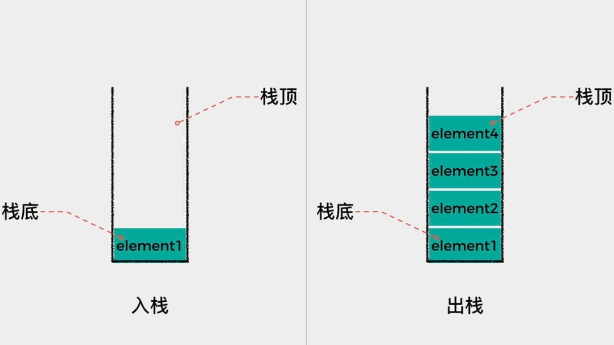

# 第一章：前言

## 1.1 概述

* 根据变量的`定义位置`、`存储位置`、`存储期限`（`生命周期`）、`作用域`等的不同，C 语言中的变量主要分为以下几种类型：
  * `局部变量`（Local Variable）。
  * `全局变量`（Global Variable）。
  * `静态局部变量`（Static Local Variable）。
  * `静态全局变量`（Static Global Variable）。

> [!NOTE]
>
> * ① 在实际开发中，使用最多的`变量类型`就是`局部变量`。
> * ② 但是，其它类型的变量我们也需要了解！！！

## 1.2 Linux 32 位环境用户空间的内存分布情况

* 回顾 Linux 32 位环境用户空间的内存分布情况，如下所示：


* 各个内存分区的说明：

| 内存分区   | 说明                                                         |
| ---------- | ------------------------------------------------------------ |
| 程序代码区 | 存放函数体的二进制代码。<br/>一个 C 语言程序由多个函数构成，C 语言程序的执行就是函数之间的相互调用。 |
| 常量区     | 存放一般的常量、字符串常量等。<br/>这块内存只有读取权限，没有写入权限，因此它们的值在程序运行期间不能改变。 |
| 全局数据区 | 存放全局变量、静态变量等。<br/>这块内存有读写权限，因此它们的值在程序运行期间可以任意改变。 |
| 堆区       | 一般由程序员分配和释放，若程序员不释放，程序运行结束时由操作系统回收。<br>malloc()、calloc()、free() 等函数操作的就是这块内存。 |
| 动态链接库 | 用于在程序运行期间加载和卸载动态链接库。                     |
| 栈区       | 存放函数的参数值、局部变量的值等，其操作方式类似于数据结构中的栈。 |


# 第二章：局部变量（⭐）

## 2.1 概述

* 在 C 语言中，`局部变量就是在函数中定义的变量`，它最主要的特点是：`只在其声明的{}中有效`。

## 2.2 定义位置

* C 语言中的`局部变量`总是定义在`函数体`当中的，包括：
  * ① 函数体中直接声明的变量。
  * ② 函数的形式参数。
  * ③ 在函数体内部的某个语句`{}` 中，如：函数体中 if 或 for 循环中定义的变量。、
  * ④ 在函数体内部的某个代码块 `{}` 中定义的变量。

> [!NOTE]
>
> 如果局部作用域中定义了与全局作用域中同名的标识符，优先使用本作用域中定义的数据。


* 示例：

```c
#include <stdio.h>

int main() {

    // 禁用 stdout 缓冲区
    setbuf(stdout, nullptr);
    
    // num 是局部变量，只在 main 函数中有效
    int num = 10; // [!code highlight]

    printf("num = %d\n", num);

    return 0;
}
```


* 示例：

```c
#include <stdio.h>

int main() {

    // 禁用 stdout 缓冲区
    setbuf(stdout, nullptr);

    // num 是局部变量（局部常量），只在 main 函数中有效
    const int num = 10; // [!code highlight]

    printf("num = %d\n", num);

    return 0;
}

```


* 示例：

```c
#include <stdio.h>

int main() {

    // 禁用 stdout 缓冲区
    setbuf(stdout, nullptr);

    // arr 是局部数组（变量），只在 main 函数中有效
    int arr[] = {1, 2, 3}; // [!code highlight]

    printf("arr[0] = %d\n", arr[0]);
    printf("arr[1] = %d\n", arr[1]);
    printf("arr[2] = %d\n", arr[2]);
    
    return 0;
}
```


* 示例：

```c
#include <stdio.h>

/**
 * 加法
 * @param a 局部变量，只在 add 函数体内有效 
 * @param b 局部变量，只在 add 函数体内有效 
 * @return
 */
int add(int a, int b) { // [!code highlight]
    return a + b;
}

int main() {

    // 禁用 stdout 缓冲区
    setbuf(stdout, nullptr);

    // result 是局部变量，只在 main 函数中有效
    int result = add(1, 2); // [!code highlight]

    printf("result = %d\n", result);

    return 0;
}
```


* 示例：

```c
#include <stdio.h>

int main() {

    // 禁用 stdout 缓冲区
    setbuf(stdout, nullptr);

    // i 是局部变量，只在 for 范围内有效
    for (int i = 0; i < 10; ++i) { // [!code highlight]
        printf("%d \n", i);
    }

    return 0;
}
```


* 示例：

```c
#include <stdio.h>

int main() {

    // 禁用 stdout 缓冲区
    setbuf(stdout, nullptr);

    // num 是局部变量，只在 main 函数中有效
    int num = 10; // [!code highlight]

    {
        // num 是局部变量，只在 {} 中有效
        int num = 20; // [!code highlight]
        printf("num = %d\n", num); 
    }

    printf("num = %d\n", num);

    return 0;
}
```

## 2.3 存储位置以及生命周期

* 操作系统会为每个执行的 C 程序（进程）分配一个虚拟的内存空间，局部变量就存储在一片称为`栈`的内存区域中。
* `栈`的工作原理是`先进后出`，如下所示：



* 在 C 程序的运行过程中，每当一个函数被调用，系统会为其创建一个**`“栈帧”`**来存储该函数的执行上下文，并将这个栈帧压入栈顶，这个过程称为`函数进栈（push）`。一个函数被调用，就是函数栈帧进栈的的过程。

> [!NOTE]
>
> 栈帧中会存储此函数的局部变量（包括形式参数）。

* 当函数开始执行，对应的栈帧被压入栈顶时，局部变量得以初始化并生效。随着函数执行完毕，栈帧从栈顶中弹出。此时，函数内的局部变量也随之被销毁，这个过程称为`函数出栈（pop）`。


* 局部变量的生命周期与包含它们的函数的生命周期是一致的，即：
  * ① 当函数被调用时，其局部变量被创建。
  * ② 当函数返回时，这些变量被销毁。

> [!NOTE]
>
> * ① 在 C 语言当中，这种`"依托于变量存储空间单元存在而存在"`的变量生命周期形式被称为`"自动存储期限"`。
> * ② 局部变量的自动存储期限，依赖于函数调用栈。

* 假设函数相互调用的代码，如下所示：

```c
#include <stdio.h>
void test(void);
void test2(void);
int  main() {

    // 禁用 stdout 缓冲区
    setbuf(stdout, nullptr);

    printf("main before\n");

    int a = 10;

    test();

    printf("main after\n");
    return 0;
}

void test(void) {
    printf("test before\n");
    int a = 20;
    test2();
    printf("test after\n");
}

void test2(void) {
    printf("test2 before\n");
    int a = 30;
    printf("test2 after\n");
}
```

* 其函数调用的过程是：
  * ① main 函数先调用，main 函数栈帧先进栈。
  * ② main 函数中调用 test 函数，test 函数栈帧进栈。
  * ③ test 函数中调用 test2 函数，test 函数栈帧进栈。

> [!NOTE]
>
> * ① 函数调用的顺序（即：函数栈帧进栈的顺序）是：main --> test --> test2 。
> * ② 函数调用结束的顺序（即：函数栈帧出栈的顺序）是：test2 --> test --> main。

* 再次回顾下 Linux 32 位环境用户空间的内存分布情况，如下所示：


> [!NOTE]
>
> 栈区是从高地址向低地址增长的！！！

* 那么，上述过程的示意图就是这样的，如下所示：


## 2.4 初始化

* 在 C 语言中，对于局部变量，默认是使用 `auto` 关键字修饰的，即：

```c
auto int num;
```

* 这样导致局部变量的初始值是未定义的，它的值可以是任意的、随机的"垃圾值"。

> [!NOTE]
>
> * ① 使用未初始化的局部变量可能导致程序行为的不确定性和不可预测性。
> * ② 因此，为了保证程序的稳定性和预测性，最佳实践是始终在使用变量之前对其进行初始化。
> * ③ 在 Java 等高级编程语言中，如果局部变量没有初始化，将会在编译阶段报错。可惜的是 C 语言并没有这么做，C 语言就是这么“坑爹”！！！


* 示例：

```c
#include <stdio.h>

int  main() {

    // 禁用 stdout 缓冲区
    setbuf(stdout, nullptr);

    // 等价于 auto int num; 
    // num 中的值是垃圾值，不确定的.
    // 在实际开发中，切记局部变量一定要初始化！！！
    int num; // [!code warning]
    
    // 手动对局部变量进行初始化
    int num2 = 10; // [!code highlight]
    
    return 0;
}
```

## 2.5 作用域

* 局部变量的作用域（`块作用域`），指的是该变量可以被访问和修改的代码范围。

> [!NOTE]
>
> 在 C 语言中，`局部变量`的作用域（`块作用域`）包括`开始位置`和`结束位置`，如下所示：
>
> * ① `开始位置`：局部变量的作用域从其声明的位置开始。
> * ② `结束位置`：局部变量的作用域到该变量所在的块或函数结束为止（通俗的说，就是到定义此局部变量的大括号结束）。


* 示例：

```c
#include <stdio.h>

int main() {

    // 禁用 stdout 缓冲区
    setbuf(stdout, nullptr);

    // i 是局部变量，只在 for 范围内有效
    for (int i = 0; i < 10; ++i) { // [!code highlight]
        printf("%d \n", i);
    }

    return 0;
}
```


* 示例：

```c
#include <stdio.h>

int main() {

    // 禁用 stdout 缓冲区
    setbuf(stdout, nullptr);

    // num 是局部变量，只在 main 函数中有效
    int num = 10; // [!code highlight]

    {
        // num 是局部变量，只在 {} 中有效
        int num = 20; // [!code highlight]
        printf("num = %d\n", num); 
    }

    printf("num = %d\n", num);

    return 0;
}
```

## 2.6 总结

* ① 在 C 语言中，局部变量就是声明定义在函数体内部的变量，它只在该函数的作用域内可见和可用。
* ② 局部变量不会自动初始化。如果一个局部变量仅有声明，那么它们的初始值是未定义的，通常称为`垃圾值，随机值`。因此，`局部变量在使用之前必须手动初始化它`。
* ③ 局部变量的生命周期是自动存储期限，意味着它们仅在声明它们的函数调用期间存活，函数返回后它们就随栈帧销毁。
* ④ `局部变量的作用域就是仅限于{}内部，实际使用时要注意{}的起止`。
* ⑤ `{}`嵌套后，内层`{}`会共享外层大括号中的变量。但也可以屏蔽外层大括号作用域，以定义自身独立局部变量。


# 第三章：全局变量（外部变量）

## 3.1 概述

* 在 C 语言中，`全局变量`也是一种特别常见的变量类型，有时它也被称为`外部变量`。

> [!NOTE]
>
> 将`全局变量`也称为`外部变量`的原因在于：`全局变量`在`函数之外`被`定义`，并且`可以在整个文件内，甚至其他文件中（通过外部链接）被访问和使用`。

## 3.2 定义位置

* 只要在一个文件内，在所有`函数外部`，直接声明或定义的变量都是`全局变量`。


* 示例：

```c
#include <stdio.h>

// 全局变量
double PI = 3.14; // [!code highlight]

int main() {

    // 禁用 stdout 缓冲区
    setbuf(stdout, nullptr);

    // 局部变量
    int num = 10; // [!code highlight]

    return 0;
}
```

## 3.3 存储位置以及生命周期

* `全局变量`被存储在虚拟内存空间中的`全局数据区`（称为`数据段`的内存区域）中。
* 不同于`局部变量`随着函数的调用和返回被创建和销毁，`全局变量`的`生命周期`是从程序开始执行开始，直到程序结束为止。

> [!NOTE]
>
> * ① `局部变量`的`生命周期`和`函数`的`生命周期`是`同步`的：它们随着函数的调用和返回被创建和销毁。
> * ② `全局变量`的`生命周期`和`程序`的`生命周期`是`同步`的：它们在程序开始时被创建并初始化，并在程序结束时被销毁。


## 3.4 初始化

* 当 C 程序开始执行时，会在程序加载时为`全局数据区`中的变量进行初始化，包括：`全局变量`等，此时：
  * ① 如果全局变量已由程序员明确初始化赋值，该初始值会直接在程序启动时分配给它。
  * ② 如果程序员未进行显式初始化赋值，系统则会为其设置默认值（也就是 0 值）。 

> [!NOTE]
>
> ::: details 点我查看 全局变量的默认初始化
>
> 如果没有显式初始化，它们会被自动、默认初始化为`零`或`空值`，具体取决于数据类型。
>
> * `int` 类型的默认初始化值是 `0` 。
> * `char` 类型的默认初始化值是 `'\0'` 或 `0` 。
> * `float` 类型的默认初始化值是 `0.0f` 。
> * `double` 类型的默认初始化值是 `0.0` 。
> * `指针`类型的默认初始化值是 `NULL` 或 `nullptr` 。
>
> :::

> [!CAUTION]
>
> * ① 除非不确定此全局变量的初始值，否则建议对其进行手动初始化。
> * ② 全局变量的初始化有且仅有程序启动时的一次。

## 3.5 作用域

* 变量的作用域（`文件作用域`），指的是该变量可以被访问和修改的代码范围。

> [!NOTE]
>
> 在 C 语言中，全局变量的作用域（`文件作用域`）从"声明位置"开始，并延申至整个程序。具体来说：
>
> * ① 在定义全局变量的文件内，全局变量可以在其声明之后的任何位置被访问和修改。
> * ② 要想在其他源文件中使用该全局变量，可以通过`extern 关键字`来引用它。

> [!CAUTION]
>
> ::: details 点我查看 不同编程语言中`变量声明`和`变量定义之间`的区别
>
> * 变量的声明和定义，只在 C/C++ 中是有区别的。
>
>   * ① 变量的声明：声明是给编译器看的，告诉编译器变量的类型和名字等信息，并不分配内存空间。
>
>   * ② 变量的定义：变量的定义是声明一个变量，并在运行时期为变量分配内存空间的组合动作。
>
>   * ③ 变量的定义总是一个声明，但某些变量的声明并不是定义，也就是说某些变量的声明不会在运行时期分配内存空间。
>
>   * ④ `extern` 关键字修饰的变量就是变量的声明，并不会分配内存空间，如：`extern int num;`。
>
>   * ⑤ 之前见到的变量的定义，会在运行使其分配内存空间，如：`int num = 10;`。
>
> * 在其它的编程语言，如：Java 中，变量的声明和定义是一样的概念。
>
> :::


* 示例：

```c
#include <stdio.h>

// 全局变量，从此处开始，整个文件中都可以访问和修改
double PI = 3.14; // [!code highlight]

int main() {

    // 禁用 stdout 缓冲区
    setbuf(stdout, nullptr);

    // 局部变量
    int num = 10;

    printf("num = %d\n", num);
    printf("PI = %f\n", PI);
    
   return 0;
}
```

## 3.6 全局变量的使用建议

* 虽然全局变量的使用，为 C 语言提供了许多灵活性并为一些问题提供了解决方案，但使用全局变量也带来了一系列问题，包括：
  * ① 可读性和代码维护上的困难：由于全局变量可以在任何地方被修改，这可能会使代码的流程变得难以理解，从而降低代码的可读性和可维护性。
  * ② 风险增加：由于全局变量可以在文件或模块之间随意访问和修改，这增加了不小心破坏数据或引入错误的风险。
  * ③ 命名污染：使用大量的全局变量可能导致命名空间的污染，从而增加命名冲突的风险。
  * ④ 调试困难：若一个变量跨多文件使用，这无疑给程序的调试带来极大的麻烦。
  * ⑤ 内存管理风险：全局变量在程序的整个生命周期中都存在，这可能导致不必要的内存占用，尤其是在资源受限的环境中。
  * ⑥ ...
* 总之，对于全局变量的使用，我们给出以下建议：
  * ① `非必要不要使用全局变量`：如果多个函数要共享数据，可以优先考虑用参数传递的方式共享，而不是全局变量。
  * ② 如果非要使用全局变量，尽量限制其不能跨文件使用，即：使用 static 修饰的全局变量。
  * ③ 如果非要使用全局变量，那么一定要给出一个清晰的命名约定。比如：约定以 `"global_"` 开头的都是全局变量。
  * ④ 在代码的文档或注释中清晰地描述全局变量的用途、范围和正确使用方式。

> [!NOTE]
>
> 在适当的场景下，全局变量是有其合理用途的，不必完全回避，但应当谨慎使用！！！

## 3.7 static 修饰全局变量

* `static` 修饰的全局变量的主要效果是`其作用域限制在声明它的文件中`，这意味着该变量只能在它所在的源文件中被访问和修改。
* `static` 修饰的全局变量的其它的特性，如：生命周期、初始化方式和存储位置，与普通的全局变量是相同的。

## 3.8 全局变量 VS 局部变量

* 作用域对比：

| 类别     | 作用域                                                       |
| -------- | ------------------------------------------------------------ |
| 局部变量 | 它的作用域只能在其定义的函数或代码块内部，超出该范围将无法访问。 |
| 全局变量 | 它的作用域默认是整个程序，也就是所有的代码文件。             |

* 访问权限对比：

| 类别     | 作用域                                                       |
| -------- | ------------------------------------------------------------ |
| 局部变量 | 由于局部变量的作用域仅限于定义它们的函数或代码块，只有在该范围内才能访问它们。<br>其他函数无法直接访问局部变量。 |
| 全局变量 | 全局变量可以被程序中的任何函数访问，只要它们在被访问之前已经被声明。 |

* 生命周期对比：

| 类别     | 作用域                                                       |
| -------- | ------------------------------------------------------------ |
| 局部变量 | 局部变量的生存周期仅限于定义它们的函数或代码块。<br>它们在函数或代码块执行结束后会被销毁。 |
| 全局变量 | 全局变量的生命周期从程序开始运行直到程序结束。 <br/>它们在程序整个运行期间都存在。 |

* 初始值对比：

| 类别     | 作用域                                                       |
| -------- | ------------------------------------------------------------ |
| 局部变量 | 系统不会对其默认初始化，必须对局部变量初始化后才能使用。<br>否则，程序运行后可能会异常退出。 |
| 全局变量 | 如果没有显式初始化，它们会被自动、默认初始化为`零`或`空值`，具体取决于数据类型。<br>`int` 类型的默认初始化值是 `0` 。<br>`char` 类型的默认初始化值是 `'\0'` 或 `0` 。<br>`float` 类型的默认初始化值是 `0.0f` 。<br/>`double` 类型的默认初始化值是 `0.0` 。<br/>`指针`类型的默认初始化值是 `NULL` 或 `nullptr` 。 |

* 内存中的位置对比：

| 类别     | 作用域                                                 |
| -------- | ------------------------------------------------------ |
| 局部变量 | 保存在`栈`中，函数被调用时才动态地为变量分配存储单元。 |
| 全局变量 | 保存在内存的`全局存储区` 中，占用静态的存储单元。      |


# 第四章：静态局部变量

## 4.1 概述

* 静态局部变量，就是 `static` 修饰的局部变量。但它与一般的局部变量在很多地方都是完全不同的。

## 4.2 定义位置

* 静态局部变量就是在原本局部变量定义的基础上，使用 `static` 关键字声明得到的变量。


* 示例：

```c
#include <stdio.h>

int main() {

    // 禁用 stdout 缓冲区
    setbuf(stdout, nullptr);
    
    // num 是静态局部变量，只在 main 函数中有效
    static int num = 10; // [!code highlight]

    printf("num = %d\n", num);

    return 0;
}
```


* 示例：

```c
#include <stdio.h>

int main() {

    // 禁用 stdout 缓冲区
    setbuf(stdout, nullptr);

    // num 是静态局部变量（局部常量），只在 main 函数中有效
    static const int num = 10; // [!code highlight]

    printf("num = %d\n", num);

    return 0;
}
```


* 示例：

```c
#include <stdio.h>

int main() {

    // 禁用 stdout 缓冲区
    setbuf(stdout, nullptr);

    // arr 是静态局部数组（变量），只在 main 函数中有效
    static int arr[] = {1, 2, 3}; // [!code highlight]

    printf("arr[0] = %d\n", arr[0]);
    printf("arr[1] = %d\n", arr[1]);
    printf("arr[2] = %d\n", arr[2]);

    return 0;
}
```

## 4.3 存储位置以及生命周期

* `静态局部变量`的`存储位置`、`生命周期`和`全局变量`的`存储位置`、`生命周期`是`一致`的，即：
  * ① 都是存储在全局数据区（称为`数据段`的内存区域）中。
  * ② 生命周期都是从程序开始执行开始，直到程序结束为止。

* `静态局部变量`和一般的`局部变量`不同：`静态局部变量不会随着函数的返回而销毁，它会始终保留到程序执行完毕`。


## 4.4 初始化

* 不要将静态局部变量理解成"活得更长"的局部变量，局部变量和静态局部变量在初始化方面有非常大的区别。

> [!NOTE]
>
> ::: details 点我查看 静态局部变量的初始化特性
>
> * ① 默认初始化：如果不显式地为静态局部变量提供一个初始值，系统会默认将其初始化为 `0` 值。
> * ② 初始化只有一次：静态局部变量只会在其所在函数，第一次被调用时初始化一次。此后，不论调用几次该函数，都不会再次初始化了。
>
> :::


* 示例：

```c
#include <stdio.h>

void call_counter() {
    // 静态局部变量，仅在首次调用时初始化为0，再次调用不会再次初始化
    static int count = 0; 
    // 每次调用函数时，增加 count 计数器
    count++;              
    printf("此函数已经被调用了%d次!\n", count);
}

int main() {

    // 禁用 stdout 缓冲区
    setbuf(stdout, nullptr);

    /**
     * 执行结果：
     *  此函数已经被调用了1次!
     *  此函数已经被调用了2次!
     *  此函数已经被调用了3次!
     *  此函数已经被调用了4次!
     *  此函数已经被调用了5次!
     */
    for (int i = 0; i < 5; i++) {
        call_counter();
    }

    return 0;
}
```

## 4.5 作用域

* 静态局部变量的作用域仅限于其所在的函数。这意味着：`尽管静态局部变量的生命周期与程序的整个执行期间一致，但它只能在定义它的函数内部被访问`。


# 第五章：附录

## 5.1 寄存器变量（register 变量）

* 一般情况下，变量（包括静态存储方式和动态存储方式）的值是存放在内存中的。当程序中用到哪一个变量的值时，由控制器发出指令将内存中该变量的值送到运算器中。经过运算器进行运算，如果需要存数，再从运算器将数据送到内存存放。
* 如果有一些变量使用频繁（例如，在一个函数中执行 10 000 次循 环，每次循环中都要引用某局部变量），则为存取变量的值要花费不少时间。为提高执行效率，C 语言允许将局部变量的值放在 CPU 中的寄存器中，需要用时直接从寄存器取出参加运算，不必再到内存中去存取。由于对寄存器的存取速度远高于对内存的存取速度，因此这样做可以提高执行效率。这种变量叫做寄存器变量，用关键字`register`作声明。
* 语法：

```c
register 数据类型 变量 = 初始化值; 
```

> [!NOTE]
>
> * ① 由于现在的计算机的速度愈来愈快，性能愈来愈高， 优化的编译系统能够识别使用频繁的变量，从而自动地将这些变量放在寄存器中，而不需要程序设计者指定。
> * ② 因此，在实际开发中，使用 register 声明变量的频率已经越来越少了！！！

## 5.2 局部变量 VS 全局变量 VS 静态局部变量 VS 静态全局变量

* `局部变量`、`全局变量`、`静态局部变量`以及`静态全局变量`之间的对比，如下所示：

| 特性                   | 局部变量                                         | 全局变量                                               | 静态局部变量                               | 静态全局变量                            |
| ---------------------- | ------------------------------------------------ | ------------------------------------------------------ | ------------------------------------------ | --------------------------------------- |
| 定义位置               | 函数内部                                         | 函数外部                                               | 函数内部                                   | 函数外部                                |
| 存储位置               | `栈`                                             | 全局数据区（数据段）                                   | 全局数据区（数据段）                       | 全局数据区（数据段）                    |
| 存储期限（生命周期）   | 从函数调用开始到函数退出为止（自动存储期限）     | 程序启动到程序结束（静态存储期限）                     | 程序启动到程序结束（静态存储期限）         | 程序启动到程序结束（静态存储期限）      |
| 作用域                 | 仅限于所在函数                                   | `整个程序的所有文件，但在其它文件使用需要用extern声明` | 仅限于所在函数                             | `仅限于定义它的文件`                    |
| 初始化时机             | `每次函数调用时都初始化，不同函数调用初始化不同` | 程序启动时初始化，只初始化一次。                       | `函数第一次调用时进行初始化，只初始化一次` | 程序启动时初始化，只初始化一次。        |
| 默认初始化             | `不手动初始化，可能得到一个随机值`               | 即便不手动初始化，也会默认初始化为 0 值                | 即便不手动初始化，也会默认初始化为 0 值    | 即便不手动初始化，也会默认初始化为 0 值 |
| 是否可以被其他文件访问 | 否                                               | 在其它文件中使用 extern 关键字链接访问                 | 否                                         | 否                                      |

## 5.3 作用域和生命周期（存储期限）

### 5.3.1 概述

* `作用域`与`生命周期`（存储期限）是两个基本但重要的编程概念；虽然它们都关联到变量，但它们描述的是不同的特性。

### 5.3.2 作用域

* `定义`：描述变量可被访问和修改的代码范围。
* `特性`：`作用域是编译时概念。如果在变量的非作用域内尝试访问它，编译器会报错。`
* `分类`，如下所示：

| 类别       | 说明                                                         |
| ---------- | ------------------------------------------------------------ |
| 局部作用域 | 变量只在其定义的函数或块中有效。                             |
| 文件作用域 | 适用于 static 修饰的全局变量，其作用范围限制在定义它的文件中。 |
| 全局作用域 | 全局变量可在整个程序中访问，包括其他源文件（需要使用 extern 关键字）。 |

### 5.3.3 生命周期（存储期限）

* `定义`：描述变量在内存中存在的时间段。
* `特性`：`生命周期是运行时概念，因为只有当程序运行时，变量才会被存储在内存中。`

* `分类`，如下所示：

| 类别         | 说明                                             |
| ------------ | ------------------------------------------------ |
| 自动存储期限 | 局部变量，其生命周期与其所在的函数调用栈相绑定。 |
| 静态存储期限 | 全局变量和静态局部变量，从程序开始到程序结束。   |

### 5.3.4 总结

* `局部变量`的`作用域`和`生命周期`确实存在重叠：它们的`作用域`和`生命周期`都局限于所在的`函数`。
* `全局变量`**、**`静态局部变量`、和 `静态全局变量`的`生命周期`是整个程序的运行期间，而`作用域`则依赖于定义和访问的位置。
