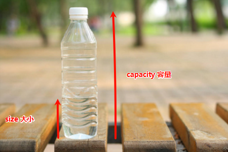
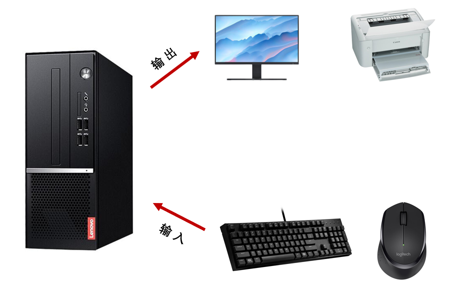

# 第一章：回顾虚拟地址空间

## 1.1 概述

* 在学习 C 语言中的过程中，我们可以通过 `&` 运算符来获取变量的内存地址，如下所示：

 ```c
 #include <stdio.h>
 
 // 全局变量
 int a = 10;
 int b = 20;
 
 int main() {
 
     // 禁用 stdout 缓冲区
     setbuf(stdout, nullptr);
 
     printf("a = %p\n", &a); // a = 0x55fda7351010
     printf("b = %p\n", &b); // b = 0x55fda7351014
 
     return 0;
 }
 ```

* 我们也知道，现代操作系统是`多用户`、`多任务`、`图形化`、`网络化`的操作系统。其中，所谓的`多任务`就是可以支持多个应用程序（进程），如下所示：


> [!NOTE]
>
> - ① 正如上面的程序一样，程序在链接的时候，内存地址就已经确定了，无法改变。
> - ② 如果此时，物理内存中的内存地址已经被该程序占用了，那么其它程序岂不是运行不了？
> - ③ 如果此时，物理内存中的内存地址已经被其它程序占用了，那么该程序岂不是运行不了？

* 其实，这些地址都是假的，并不是真实的物理地址，而是虚拟地址（虚地址）。虚拟地址（虚地址）需要通过 CPU 内部的 MMU（Memory Management Unit，内存管理单元）来将这些虚拟地址（虚地址）转换为物理地址（实地址），如下所示：


## 1.2 虚拟地址空间模型

* 为了更好的管理程序，操作系统将虚拟地址空间分为了不同的内存区域，这些内存区域存放的数据、用途、特点等皆有不同，下面是 Linux 下 32 位环境的经典内存模型，如下所示：


- 每个内存区域的特点，如下所示：

| 内存分区                  | 说明                                                         |
| :------------------------ | :----------------------------------------------------------- |
| 程序代码区（code）        | 存储程序的执行代码，通常为只读区，包含程序的指令。 程序启动时，这部分内存被加载到内存中，并不会在程序执行期间改变。 |
| 常量区（constant）        | 存放程序中定义的常量值，通常也是只读的，这些常量在程序运行期间不可修改。 |
| 全局数据区（global data） | 存储程序中定义的全局变量和静态变量。 这些变量在程序的整个生命周期内存在，且可以被修改。 |
| 堆区（heap）              | 用于动态分配内存，例如：通过 `malloc` 或 `new` 分配的内存块。 堆区的内存由程序员手动管理，负责分配和释放。 如果程序员不释放，程序运行结束时由操作系统回收。 |
| 动态链接库                | 动态链接库（如： `.dll` 或 `.so` 文件）被加载到内存中特定的区域，供程序运行时使用。 |
| 栈区（stack）             | 用于存储函数调用的局部变量、函数参数和返回地址。 栈是自动管理的，随着函数的调用和返回，栈上的内存会自动分配和释放。 |

> [!NOTE]
>
> - ① 程序代码区、常量区、全局数据区在程序加载到内存后就分配好了，并且在程序运行期间一直存在，不能销毁也不能增加（大小已被固定），只能等到程序运行结束后由操作系统收回，所以全局变量、字符串常量等在程序的任何地方都能访问，因为它们的内存一直都在。
> - ② 函数被调用时，会将参数、局部变量、返回地址等与函数相关的信息压入栈中，函数执行结束后，这些信息都将被销毁。所以局部变量、参数只在当前函数中有效，不能传递到函数外部，因为它们的内存不在了。
> - ③ 常量区、全局数据区、栈上的内存由系统自动分配和释放，不能由程序员控制。程序员唯一能控制的内存区域就是堆（Heap）：它是一块巨大的内存空间，常常占据整个虚拟空间的绝大部分，在这片空间中，程序可以申请一块内存，并自由地使用（放入任何数据）。堆内存在程序主动释放之前会一直存在，不随函数的结束而失效。在函数内部产生的数据只要放到堆中，就可以在函数外部使用。

* 在 64 位 Linux 环境下，虚拟地址空间大小为 256TB，Linux 将高 128TB 的空间分配给内核使用，而将低 128TB 的空间分配给用户程序使用，如下所示：


> [!NOTE]
>
> - ① `程序代码区`，也可以称为`代码段`；而`全局数据区`和`常量区`，也可以称为`数据段`。
> - ② `全局数据区`分为`初始化数据段`（存储已初始化的全局变量和静态变量）和`未初始化数据段`（存储未初始化的全局变量和静态变量）；`常量区`也称为`只读数据段`，通常是只读的，防止数据被修改。
> - ③ 冯·诺依曼体系结构中的`程序`，也被称为`存储式程序`，需要通过加载器（Loader），将程序从硬盘加载到内存中运行。
> - ④ `存储式程序`中的`程序`分为`指令`和`数据`；其中，`代码段`中保存的是`指令`，`数据段`中保存的是`数据`。


# 第二章：C 语言中的字符串和字符数组（⭐）

## 2.1 概述

* 在实际开发中，我们除了经常处理整数、浮点数、字符、数组等，还需要经常和`字符串`打交道，如：`"Hello World"`、`"Hi"` 等。

## 2.2 字符串和字符数组

* 和其他编程语言（如：Java 中的 String、TS 中的 string 等）不同，C 语言其实是没有专门的`字符串类型`的。
* 在 C 语言中，`字符串`是通过`字符数组`来进行存储的，以空字符 `\0` 作为结尾，这样的字符串也被称为 `C 风格的字符串`。

* 假设 C 程序中的字符串是 `"Hello World!"`，如下所示：

```c
"Hello World!" // 在 C 语言中，底层存储就是 Hello World!\0
```

* 其底层就是这样存储的，如下所示：


## 2.3 字符串和字符数组的区别

* `在 C 语言中，字符串就是字符数组；但是，字符数组却不一定是字符串。`
* 对于 `“Hello”` 这样的字符串，我们可以这些定义，如下所示：

```c
char str[6] = {'H', 'e', 'l', 'l', 'o', '\0'};
```

* 在 C 语言中，如果没有给出数组中元素的个数，却给出了初始化的元素，将由系统自动推断出数组中元素的个数，如下所示：

```c
char str[] = {'H', 'e', 'l', 'l', 'o', '\0'};
```

* 但是，上述的写法实在太繁琐，C 语言给我们提供了语法糖，如下所示：

```c
char str[] = "Hello";
```

> [!CAUTION]
>
> * ① `语法糖`是编程语言中的一种术语，指的是一些让程序更加简洁易懂、表达更直观的语法特性。它们不会增加语言的功能或表达能力，而是提供更方便或更易读的方式来实现某些操作。可以理解为，它是一种编程语言设计上的便利，它使得写代码时的语法更加简洁、易懂，但本质上与原本的功能没有区别。
> * ② 对于`char str[] = "Hello";`，其底层存储的依然是`'H'`、`'e'`、`'l'`、`'l'` 、`'o'`、`'\0'`。

* 如果我们将 `'\0'` 放在中间，如：`"He\0llo"`，就不再表示 `"Hello"`，而是表示 `"He"`，如下所示：

```c
char str[] = "He\0llo"; // He
```

```c
char str[] = {'H', 'e','\0', 'l', 'l', 'o', '\0'}; // He
```

## 2.4 打印字符串

* 在 C 语言中，可以通过 `printf` 函数来打印字符串，并通过格式占位符 `%s` 来输出字符串。

> [!CAUTION]
>
> * ① `%s`会忽略字符串前面的空白字符，并一直匹配到空字符`'\0'`为止。
> * ② 如果一直没有`'\0'`，就会越界访问，直到访问到`'\0'`为止，即：会产生野指针。


* 示例：

```c
#include <stdio.h>

int main() {

    // 禁用 stdout 缓冲区
    setbuf(stdout, NULL);

    char str[6] = {'H', 'e', 'l', 'l', 'o', '\0'};

    // str = Hello
    printf("str = %s\n", str); // [!code highlight]

    return 0;
}
```


* 示例：

```c
#include <stdio.h>

int main() {

    // 禁用 stdout 缓冲区
    setbuf(stdout, NULL);

    char str[] = {'H', 'e', 'l', 'l', 'o', '\0'};

    // str = Hello
    printf("str = %s\n", str); // [!code highlight]

    return 0;
}
```


* 示例：

```c
#include <stdio.h>

int main() {

    // 禁用 stdout 缓冲区
    setbuf(stdout, NULL);

    char str[] = "Hello";

    // str = Hello
    printf("str = %s\n", str); // [!code highlight]

    return 0;
}
```


* 示例：

```c
#include <stdio.h>

int main() {

    // 禁用 stdout 缓冲区
    setbuf(stdout, NULL);

    char str[] = {'H', 'e','\0', 'l', 'l', 'o', '\0'};

    // str = He
    printf("str = %s\n", str); // [!code highlight]

    return 0;
}
```


* 示例：

```c
#include <stdio.h>

int main() {

    // 禁用 stdout 缓冲区
    setbuf(stdout, NULL);

    char str[] = "He\0llo";

    // str = He
    printf("str = %s\n", str); // [!code highlight]

    return 0;
}
```

## 2.5 C 语言中字符串设计的优缺点以及产生的影响

### 2.5.1 概述

* 优点：
  * ① **简单高效**：字符串通过`'\0'`结尾，处理简单，且 C 库提供了基础的字符串函数。
  * ② **性能好**：不需要一个额外的新类型、内存占用较少（和其他语言中的字符串对比）。
  * ③ **灵活性强**：可以直接操作字符数组，甚至用指针高效传递。
  * ④ **内存高效**：字符串是字符数组，内存管理由程序员控制，节省空间。
* 缺点：
  * ① **无法直接判断字符串**：C 语言中的字符串是以`'\0'`（空字符）作为结束符的，因此无法直接判断一个字符数组是否是字符串，必须遍历数组直到找到`'\0'`。
  * ② **操作繁琐**：处理字符串时需要手动管理`'\0'`字符，考虑到结束符的存在，很多字符串操作（复制、拼接、比较）都变得复杂且容易出错。
  * ③ **字符串没有内建长度信息**：C 语言的字符串依赖`'\0'`作为结束标志，而没有像其他语言那样的长度属性。没有`'\0'`就无法正确处理字符串。
  * ④ **获取字符串长度消耗性能**：C 语言获取字符串长度必须遍历整个字符串，直到遇到`'\0'`，对于长字符串来说，效率较低。

> [!IMPORTANT]
>
> 鉴于以上的缺点，在 C 语言之后的许多编程语言，如：C++、Java、Go 等都内置了单独的 string 类型，并且这些单独的 string 类型自带数组长度的属性。

### 2.5.2 大小（size）和容量（capacity）

* `大小（size）`：表示容器中当前存储的元素的数量，例如：
  * 对于一个数组，大小就是数组中实际存储的元素个数。
  * 对于一个字符串，大小是字符串的长度，不包括结束符（`'\0'`）。
  * 对于容器类（`std::vector`或`std::string`），`size`通常表示已使用的元素个数。

```c
// 字符串 "hello"，容量（capacity）是 6，大小（size）是 5（不包括'\0'）
char str[] = "hello";  
```


* `容量（capacity）`：表示容器可以存储的最大元素数量。在很多动态数据结构中，容量可能大于当前大小，因为容器通常会预分配一定的内存空间以便应对未来的增长，例如：
  * 对于动态数组（`std::vector`或`std::string`），容量是指该数组当前能够容纳的元素个数，通常是实现的一个优化，避免每次增加元素时都进行内存重新分配。
  * 对于固定大小的容器（C 语言中的数组），容量就是数组的固定大小。

```c
// 字符串"hello"，容量（capacity）是 10，大小（size）是 5
char str[10] = "hello";  
```



### 2.5.3 C 语言之后的编程语言是如何设计字符串的？

* C 语言之后的编程语言（C++、Java 等）设计的字符串，类似于 C 语言中的结构体，如下所示：


# 第三章：字符串字面值（⭐）

## 3.1 概述

* C 语言是支持在代码中直接书写`字面量`的，如： 整数字面量、浮点数字面量、字符字面量以及字符串字面量。

> [!NOTE]
>
> 字面量（字面量常量）：就是可以直接使用的常量，而不需要声明或定义。


* 示例：

```c
#include <stdio.h>

int main() {

     // 禁用 stdout 缓冲区
    setbuf(stdout, NULL);
    
    1;  // 整数字面量
    'A'; // 字符字面量
    12.3; // 浮点数字面量
    "你好"; // 字符串字面量

    return 0;
}
```

## 3.2 字符串字面量

* 在 C 语言中，当我们在源码中直接使用双引号括起来的字符序列，如：`"Hello World"`等，就称为`字符串字面量`（字符串字面量常量），它们是程序中的常量值。

* 在 C 语言中，字符串字面值的表示形式比较灵活，有如下的几种形式：

  * ① **`标准字符串字面值`**（常用）：普通的字符串字面值使用双引号包裹，默认以 `\0` 作为结束标志；这种形式是最常见的，字符串由 ASCII 或 UTF-8 字符组成。

  ```c
  char str[] = "Hello World!";
  ```

  * ② **多行字符串字面值**：多行中用反斜杠`\`实现换行。

  ```c
  char str[] = "This is a long string\n \
  that spans multiple lines."; // 使用反斜杠换行
  ```

  * ③ **多行字符串字面值**：可以通过使用多个双引号直接拼接。

  ```c
  char str[] = "Hello" "World";
  ```

> [!NOTE]
>
> printf 函数中的 `%s` 格式占位符，也支持上述字符串的写法！！！


* 示例：

```c
#include <stdio.h>

int main() {

    // 禁用 stdout 缓冲区
    setbuf(stdout, NULL);

    char str[] = "Hello World!";
    
    printf("str: %s\n", str);

    return 0;
}
```


* 示例：

```c
#include <stdio.h>

int main() {

    // 禁用 stdout 缓冲区
    setbuf(stdout, NULL);

    char str[] = "This is a long string\n \
that spans multiple lines."; // 使用反斜杠换行

    printf("str: %s\n", str);

    return 0;
}
```


* 示例：

```c
#include <stdio.h>

int main() {

    // 禁用 stdout 缓冲区
    setbuf(stdout, NULL);

    char str[] = "Hello"
                 " World!";
    printf("str: %s\n", str);

    return 0;
}
```

## 3.3 字符串字面值的存储形式

### 3.3.1 概述

* 在 C 语言中，`字符串字面值`是以`字符数组`的形式存储的。

> [!NOTE]
>
> 对于长度为 n 的字符串字面量，它是存储在虚拟地址空间中的只读数据段中，分配 n+1 长度的字符数组，用来存储字符序列以及一个空字符 \0 作为结尾。

* `字符串字面值`在虚拟地址空间中的位置，如下所示：


* 如果一个`字符串字面量`是 `"abc"`，那么它在`只读数据段`中就是这么存储的，如下所示：


* 当然，`字符串字面量`也可以是一个空字符串 `""`，其在`只读数据段`就是这么存储的，如下所示：


* 字符串字面量存储在只读数据段，这就意味着字符串字面量有以下的特点：
  * ① 不可变、只读。
  * ② 静态存储期限，即：其生命周期和进程的生命周期相同。

> [!CAUTION]
>
> * ① 字符串字面量本质上就是一个存储在只读数据段中的字符数组。
> * ② 在 C 语言中，所有的字符串都是以一个空字符 `\0` 作为结尾的字符数组；但是，并非所有的字符数组都是字符串。

### 3.3.2 应用场景

* 字符串字面量在大多数情况下，都视为一个字符数组的数组名去使用，即：视为字符数组首元素的指针。
* 但是，对于 `sizeof` 和 `&` 取地址符而言，就不能视为首元素的指针。

> [!NOTE]
>
> 这其实和《[数组到底在什么时候会转换为指针](/01_c-se/c-leap/08_xdx/#%E7%AC%AC%E5%9B%9B%E7%AB%A0-%E6%95%B0%E7%BB%84%E5%88%B0%E5%BA%95%E5%9C%A8%E4%BB%80%E4%B9%88%E6%97%B6%E5%80%99%E4%BC%9A%E8%BD%AC%E6%8D%A2%E4%B8%BA%E6%8C%87%E9%92%88-%E2%AD%90)》中讲解的原理是一样的。


* 示例：

```c
#include <stdio.h>

int main() {

    // 禁用 stdout 缓冲区
    setbuf(stdout, NULL);

    // 指针 p 指向数据段中的只读字符串字面值数组，此时指针 p 无法修改指向内容
    char *p = "hello";

    char h = p[0];

    printf("%c\n",h); // h 

    return 0;
}
```


* 示例：

```c
#include <stdio.h>

int main() {

    // 禁用 stdout 缓冲区
    setbuf(stdout, NULL);

    // "hello" 视为数组名，就意味着支持索引操作
    char c = "hello"[4];
    printf("%c\n", c); // o

    return 0;
}
```


* 示例：

```c
#include <stdio.h>

int main() {

    // 禁用 stdout 缓冲区
    setbuf(stdout, NULL);

    // "hello" 视为数组名，视为指向数组首元素的指针
    char *c = "hello" + 4; // 和 Java 不同，在 Java 中是拼接；但是，C 语言中不是
    printf("%c\n", *c); // o

    return 0;
}
```


* 示例：

```c
#include <stdio.h>

int main() {

    // 禁用 stdout 缓冲区
    setbuf(stdout, NULL);

    // "hello" 视为数组名，视为指向数组首元素的指针
    // 索引运算就是算术运算和解引用运算的语法糖。
    char c = *("hello" + 4);
    printf("%c\n", c); // o

    return 0;
}
```

## 3.4 字符串字面值的操作

### 3.4.1 概述

* 当`字符串字面量`在代码中视为`数组名`的时候，我们可以将其视为一个`字符常量数组`的`名字`，如：`const char str[]`。
* 这意味着`字符串字面量`有如下的特点：
  * ① `字符串字面量不能指向一个新的字符数组`：数组名视为指针的时候就是一个不可改变指向的指针，该指针指向数组首元素的地址，不可更改。
  * ② `字符串字面量指向的内容不可以修改`：字符串字面值存储在只读数据段中，具有只读性，所以内容也不可变。字符串字面值存储在只读数据段中，具有只读性，所以内容也不可变。

```c
// 错误，字符串字面量不能指向一个新的字符数组
"hello" = NULL; // [!code error]
```

```c
// 错误，字符串字面量指向的内容不可以修改
"hello"[4] = 'A' // [!code error]
```

* 既然`字符串字面量`可以视为数组名（视为字符数组首元素的指针），那么将有以下的应用场景：
  * ① 使用`指针变量`接收`字符串字面量`。
  * ② 将`字符串字面量`作为`参数`进行传递。

### 3.4.2 使用指针变量接收字符串字面量

* 使用`指针变量`接收字符串字面量的时候，该指针是一个`指向常量`的指针，即：`指针可以改变指向；但是，指针指向的内容不可变`。

> [!NOTE]
>
> ::: details 点我查看 指针变量可变，但是指针指向的内容不可变
>
> * ① 指针变量可变。
>
> ```c
> #include <stdio.h>
> 
> int main() {
> 
>     // 禁用 stdout 缓冲区
>     setbuf(stdout, NULL);
> 
>     const char *p = "hello";
> 
>     // 指针 p 允许改变指向
>     p = "world"; // [!code highlight]
> 
>     printf("%s\n", p); // world
> 
>     return 0;
> }
> ```
>
> * ② 指针指向的内容不可变。
>
> ```c
> #include <stdio.h>
> 
> int main() {
> 
>     // 禁用 stdout 缓冲区
>     setbuf(stdout, NULL);
> 
>     const char *p = "hello";
> 
>     // 错误，指针 p 指向的内容不可变
>     *p = "h"; // [!code error]
> 
>     printf("%s\n", p); // world
> 
>     return 0;
> }
> ```
>
> :::


* 示例：

```c
#include <stdio.h>

int main() {

    // 禁用 stdout 缓冲区
    setbuf(stdout, NULL);

    const char *p = "hello";

    printf("%s\n", p); // hello

    return 0;
}
```

### 3.4.3 将字符串字面量作为参数进行传递

* 我们经常会在 `printf` 或 `scanf` 中使用`字符串字面量`作为参数，即：

```c
printf("a + b = %d",a + b);
```

* 此时的字符串字面量 `"a + b = %d"`是在`只读数据段`中存储的一个`字符数组`，而传递给 `printf` 函数的就是该字符数组的首元素指针，如下所示：


> [!NOTE]
>
> 对于`字符串字面量`而言，即使函数内部得到了`字符串字面量`对应的`字符数组`的`首元素指针`，由于`字符串字面量`存储在`只读数据段`中，在函数内部是不能修改字符串内容的；否则，将会引发未定义行为。

* 如果函数中的参数可能传入`字符串字面量`，在声明的时候，请为`形参`添加 `const` 关键字，以明确其不可修改的特点，如下所示：

```c
int printf (const char *__format, ...);
```

```c
int scanf(const char *__format, ...);
```

```c
char *strcpy(char *dest, const char *src);
```

```c
char *strncpy( char *dest, const char *src, size_t count );
```

```c
char *strcat( char *dest, const char *src );
```

```c
char *strncat( char *dest, const char *src, size_t count );
```

```c
int strcmp( const char* lhs, const char* rhs );
```


# 第四章：字符串变量（⭐）

## 4.1 概述

* ① C 语言中没有`字符串类型`。

> [!NOTE]
>
> 很多编程语言中都内置了字符串类型，如：Java 中的 String 类型、TS 中的 string 类型。

* ② C 语言中的`字符串`依赖于`字符数组`存在。

> [!NOTE]
>
> C 语言使用`字符数组`来存储字符串，如：`char str[32]`。

* ③ C 语言中的`字符串`是一种`逻辑类型`，如：`Hello\0World\0`表示的就是`Hello`。

## 4.2 字符串变量的声明

* C 语言的`字符串`以`字符数组`为载体，所以声明`字符串变量`实际也就是声明字符数组，但会稍有区别，即：我们需要声明一个比字符串多一位的字符数组来存储字符串。

```c
#define LEN 80

char str[LEN+1]; // 多出一个位置用来存储空字符
```

> [!NOTE]
>
> ::: details 点我查看 使用指针声明字符串
>
> * ① 数组名在大多数情况下可以视为数组首元素的指针，所以使用字符指针来声明字符串类型是可以，如下所示：
>
> ```c
> char *str;
> ```
>
> * ② 但是，上述的声明格式一般需要`字符串字面量`或者`指向一个已经存在的字符串`，如下所示：
>
> ```c
> char *str = "hello";
> ```
>
> ```c
> char str[6] = "hello";
> char *str2 = str;
> ```
>
> * ③ 如果 str 指针指向`字符串字面量`的时候，就不能修改字符串的内容，如下所示：
>
> ```c
> #include <stdio.h>
> 
> int main() {
> 
>     // 禁用 stdout 缓冲区
>     setbuf(stdout, NULL);
> 
>     const char *p = "hello";
> 
>     // 错误，指针 p 指向的内容不可变
>     *p = "h"; // [!code error]
> 
>     printf("%s\n", p); // world
> 
>     return 0;
> }
> ```
>
> * ④ 在大多数情况下，指针格式的声明用于指向一个动态内存分配的字符串；并且，使用指针，比使用字符数组类型更加直观和灵活，如下所示：
>
> ```c
> #include <stdio.h>
> #include <stdlib.h>
> 
> #define LEN 5
> int main() {
> 
>     // 禁用 stdout 缓冲区
>     setbuf(stdout, NULL);
> 
>     char *str = (char *)malloc((LEN + 1) * sizeof(char)); // 分配 6 字节
>     if (str == NULL) {
>         printf("内存分配失败\n");
>         return 1;
>     }
> 
>     printf("请输入一个字符串（最多%d个字符）：", LEN);
> 
>     // 使用 fgets 获取输入
>     if (fgets(str, (LEN + 1), stdin) != NULL) {
>         printf("您输入的字符串是: %s\n", str);
>     }
> 
>     // 释放内存
>     free(str);
> 
>     return 0;
> }
> ```
>
> :::


* 示例：

```c
#include <stdio.h>

#define LEN 80
int main() {

    // 禁用 stdout 缓冲区
    setbuf(stdout, NULL);

    // 声明字符串变量，即：声明字符串数组
    // 字符串数组的最后一个元素是字符串的结束符 '\0'
    char str[LEN+1];

    return 0;
}
```

## 4.3 字符串变量的初始化

### 4.3.1 标准写法

* 手动在字符串的结尾添加 `'\0'`作为字符串的结束标识。


* 示例：

```c
#include <stdio.h>

int main() {
    
    // 禁用 stdout 缓冲区
    setbuf(stdout, nullptr);

    // 字符数组，不是字符串
    char c1[] = {'H', 'e', 'l', 'l', 'o', ' ', 'W', 'o', 'r', 'l', 'd'};
    // C 风格的字符串
    char c2[] = {'H', 'e', 'l', 'l', 'o', ' ', 'W', 'o', 'r', 'l', 'd', '\0'};

    return 0;
}
```

### 4.3.2 简化写法（推荐）

* 字符串写成数组的形式，非常麻烦。C 语言中提供了一种简化写法，即：双引号中的字符，会自动视为字符数组。

> [!IMPORTANT]
>
> * ① 简化写法会自动在末尾添加 `'\0'` 字符，强烈推荐使用！！！
> * ② 简化写法只是一种语法糖，不要认为 C 语言中的数组支持赋值操作。


* 示例：

```c
#include <stdio.h>

int main() {
    
    // 禁用 stdout 缓冲区
    setbuf(stdout, nullptr);
    
	// 注意使用双引号，非单引号
    char c1[] = {"Hello World"}; // [!code highlight]
    
    // 语法糖：可以省略一对 {} 来初始化数组元素
    // "Hello World" 是数组初始化的简写形式！！！
    // 不要认为 C 语言中的数组支持赋值操作，这边仅仅是语法糖而已！！！
    char c2[] = "Hello World"; // [!code highlight]
    
    return 0;
}
```

### 4.3.3 其他写法

* ① 指定数组长度，是字符串长度 + 1 ，如下所示：

> [!NOTE]
>
> ::: details 点我查看 其对应的内存示意图
>
> 
>
> :::

```c
char str[6] = "hello";
```

* ② 指定数组长度，但是其长度大于`字符串长度 + 1` ，如下所示：

> [!NOTE]
>
> ::: details 点我查看 其对应的内存示意图
>
> 
>
> :::

```c
char str[7] = "hello";
```

* ③ 指定数组长度，但是长度不可以小于`字符串长度 + 1`（在 C 语言中，这样的字符数组是不能作为字符串使用的）。

```c
// 错误
char str[5] = "hello"; // [!code error]
```

## 4.4 字符串变量的存储形式

* 对于字符串变量，如下所示：

```c
char str[] = "hello";
```

* 其是存储在栈中的，如下所示：


## 4.5 字符串变量初始化和字符指针初始化的区别

* 对于字符串变量初始化，如下所示：

```c
char str[] = "hello";
```

* 对于字符指针初始化，如下所示：

```c
char *p = "hello";
```

* 它们在虚拟地址空间中的位置是不同的，如下所示：


* 正是由于它们在虚拟地址空间分布的不同，造成它们的特性不同，如下所示：
  * ① str 是一个字符串变量，同时也是一个字符串数组。
    * 在此初始化代码中的 `"hello"`，是字符串变量初始化的简写形式，是一个语法糖。
    * str 数组是一个在栈上创建的独立的新数组。
    * `str 数组表示的字符串内容以及整个字符数组元素，都是完全可变的`。
  * ② p 是一个指向字符串字面量的指针变量。
    * 在此初始化代码中的 `"hello"`，是字符串字面量。
    * p 指针指向的是只读数据段中，存储的是字符串字面量在只读数据段中字符数组的首元素指针。
    * `字符串字面量不可变，即：意味着指针 p ，是一个可以改变指向，但是不能改变指向内容的指针`。

* 所以，对于字符串变量，完全可以读写，如下所示：

```c
#include <stdio.h>
#include <stdlib.h>

int main() {

    // 禁用 stdout 缓冲区
    setbuf(stdout, NULL);

    char str[] = "hello";

    // 读
    printf("%c\n", str[0]); // h

    // 写
    str[0] = 'H';
    printf("%s\n", str); // Hello

    return 0;
}
```

* 但是，对于字符串字面量，只可以读，不可以写，如下所示：

```c
#include <stdio.h>
#include <stdlib.h>

int main() {

    // 禁用 stdout 缓冲区
    setbuf(stdout, NULL);

    char *p = "hello";

    // 读
    printf("%c\n", p[0]); // h

    // 写，错误
    p[0] = 'H'; // [!code error] 
    printf("%s\n", p); // Hello

    return 0;
}
```

> [!TIP]
>
> ::: details 点我查看 实际开发中的建议
>
> * ① 如果需要一个可以修改内容的字符串，可以主动声明初始化一个字符数组来存放该字符串，即：字符串变量。
>
> ```c
> char str[] = "hello";
> ```
>
> * ② 如果该字符串不可以修改，可以使用指针变量来接收。
>
> ```c
> char *str = "hello";
> ```
>
> * ③ 对于字符数组是在栈中开辟的，一旦声明或初始化过多，将会出现栈溢出，即：Stack Overflow ；此时，就可以在堆中使用内存分配函数进行动态分配。
>
> ```c {10}
> #include <stdio.h>
> #include <stdlib.h>
> 
> #define LEN 5
> int main() {
> 
>     // 禁用 stdout 缓冲区
>     setbuf(stdout, NULL);
> 
>     char *str = (char *)malloc((LEN + 1) * sizeof(char)); // 分配 6 字节
>     if (str == NULL) {
>         printf("内存分配失败\n");
>         return 1;
>     }
> 
>     printf("请输入一个字符串（最多%d个字符）：", LEN);
> 
>     // 使用 fgets 获取输入
>     if (fgets(str, (LEN + 1), stdin) != NULL) {
>         printf("您输入的字符串是: %s\n", str);
>     }
> 
>     // 释放内存
>     free(str);
> 
>     return 0;
> }
> ```
> :::

## 4.6 字符串变量的输入（读）和输出（写）

### 4.6.1 概述

* 在计算机编程领域，当我们提到`输入(Input)`和`输出(Output)`这两个术语时，通常都是有固定含义的：
  * 站在内存（或进程）的角度：从数据源（文件、键盘输入、网络等）中输入数据，获取数据，将其加载到进程的内存中，这个过程称之为`输入`。
  * 站在内存（或进程）的角度：将进程内存中的数据发送到目的地（显示器、文件、网络等），输出数据，这个过程称之为`输出`。
* 其对应的图示，如下所示：



* 在字符串处理中，也是类似的，即：
  * `字符串输入`：意味着编写代码，调用函数从键盘录入、文件等数据源中输入数据。
  * `字符串输出`：意味着编写代码，调用函数将数据输出到显示器、文件等目的地，输出数据。

> [!CAUTION]
>
> 字符串字面量是不可以修改的，只可以读，而不能写！！！

### 4.6.2 字符串输出

* 所谓的`字符串输出`，也就是将整个字符串遍历，逐个输出字符或者整个输出。

> [!CAUTION]
>
> 字符串变量和字符串字面量都可以输出。

* 在 C 语言中，有两个函数可以在控制台上输出字符串，它们分别是：
  * ① `puts()`：输出字符串并自动换行，并且该函数只能输出字符串。
  * ② `printf()` ：通过格式占位符 `%s`，就可以输出字符串，不能自动换行。

> [!NOTE]
>
> `puts()` VS `printf()` ：
>
> * ① `puts()` 只能用于输出字符串，而 `printf()` 可用于输出各种数据类型。
> * ② `puts()` 函数需要传入一个字符数组作为参数，若传入的字符数组无法表示字符串，会引发未定义行为。
> * ③ `puts()` 在字符串后自动添加换行符，而 `printf()` 则不会，除非明确添加了 `\n`。
> * ④ `puts()` 通常比 `printf()` 快，因为它不需要解析格式字符串。
> * ⑤ `printf()` 显然更加灵活，因为它支持格式化输出；所以，在实际开发中，`printf()` 函数用的居多！！！


* 示例：

```c
#include <stdio.h>

int main() {
    
    // 禁用 stdout 缓冲区
    setbuf(stdout, NULL);

    char c1[] = {"Hello World"}; // 注意使用双引号，非单引号
    char c2[] = "Hello World";   // 可以省略一对 {} 来初始化数组元素

    puts(c1); // Hello World
    puts(c2); // Hello World

    return 0;
}
```


* 示例：

```c
#include <stdio.h>

int main() {
    
    // 禁用 stdout 缓冲区
    setbuf(stdout, NULL);

    char c1[] = {"Hello World"}; // 注意使用双引号，非单引号
    char c2[] = "Hello World";   // 可以省略一对 {} 来初始化数组元素

    printf("c1 = %s\n", c1); // c1 = Hello World
    printf("c2 = %s\n", c2); // c2 = Hello World

    return 0;
}
```


* 示例：

```c
#include <stdio.h>
#include <stdlib.h>

int main() {

    // 禁用 stdout 缓冲区
    setbuf(stdout, NULL);

    char *p = "hello";

    printf("%s\n", p); // hello

    puts(p); // hello

    return 0;
}
```

### 4.6.3 字符串输入

* 所谓`字符串输入`，也就是通过某个数据源，将一串字符数据存储到字符串变量的字符数组中。
* 在 C 语言中，有两个函数可以让用户从键盘输入字符串，它们分别是：
  * ① ~~`gets()`：读取一行输入，直到遇到换行符为止，换行符会被丢弃。~~
  * ② `scanf()`：使用 `%s` 可以读取字符串，但会将遇到的空白字符（如空格、回车）视为输入的结束标志。
  * ③ `fgets()`： 从输入流中读取一行字符，并包括换行符，换行符存入字符串末尾，直到达到指定的长度或遇到换行符为止，即：如果 str 数组的长度是10，此函数调用最多会将 9 个字符存储到字符数组中，因为会留一个位置存空字符 `'\0'`。所以此函数是安全的，不会导致数组越界，访问非法数据。

> [!NOTE]
>
> `scanf()` VS `gets()` VS `fgets()` ：
>
> * ① `scanf()` 的特点：
>   * 使用 `%s` 可以读取字符串，但会将遇到的空白字符（如空格、回车）视为输入的结束标志。
>   * 不会自动检查缓冲区是否溢出（需要手动限制读取的字符数），即：不安全。
> * ② `gets()` 的特点：
>   * 不支持限制输入的长度，容易导致**缓冲区溢出**。
>   * 不会读取空格（会直接忽略它们）。
>   * 不安全，C11 标准已经将其弃用。
> * ③ `fgets()` 的特点：
>   * 必须明确指定最大读取字符数，有效防止缓冲区溢出。
>   * 可以处理空格和空行，换行符会保留在字符串中。


* 示例：

```c
#include <stdio.h>

int main() {
    
    // 禁用 stdout 缓冲区
    setbuf(stdout, NULL);

    char str[32] = {'\0'};

    printf("请输入字符串：");
    gets(str);

    printf("字符串是：%s\n", str);

    return 0;
}
```


* 示例：

```c
#include <stdio.h>

#define LEN 10
int main() {

    // 禁用 stdout 缓冲区
    setbuf(stdout, NULL);

    char str[LEN] = {'\0'};

    printf("请输入字符串：");

    scanf("%9s", str); // [!code highlight]

    printf("字符串是：%s\n", str);

    return 0;
}
```


* 示例：

```c
#include <stdio.h>

int main() {
    
    // 禁用 stdout 缓冲区
    setbuf(stdout, NULL);

    char str[32] = {'\0'};

    printf("请输入字符串：");
    // scanf() 在读取数据时需要的是数据的地址，这一点是恒定不变的。
    // 对于 int、char、float 等类型的变量都要在前边添加 & 以获取它们的地址。
    // 而数组或者字符串用于 scanf() 时不用添加 &，它们本身就会转换为地址。
    scanf("%[^\n]", str); // [!code highlight]

    printf("字符串是：%s\n", str);

    return 0;
}
```


* 示例：

```c
#include <stdio.h>
#include <string.h>

int main() {

    // 禁用 stdout 缓冲区
    setbuf(stdout, nullptr);

    char str[5] = {'\0'};
    printf("请输入一行文本： ");

    // 读取最多 4 个字符，保留换行符
    if (fgets(str, sizeof(str), stdin) != NULL) { // [!code highlight]
        printf("你输入的内容是：%s", str);
    } else {
        printf("读取失败。\n");
    }

    return 0;
}
```


# 第五章：标准字符串函数（⭐）

## 5.1 概述

* 字符串相关的库函数，在头文件 `<string.h>` 中。

> [!CAUTION]
>
> * ① 标准库中的绝大多数函数都是不安全的。
> * ② 下面虽然会有手动实现；但是，在实际开发中，推荐使用标准库或第三方库。
> * ③ 如果想要使用安全的字符串处理函数，可以使用第三方安全字符串库，如：[safestringlib](https://github.com/intel/safestringlib) 。

## 5.2 获取字符串长度

### 5.2.1 概述

* 方法声明：

```c
size_t strlen(const char *str);
```

> [!NOTE]
>
> * ① 该函数的名称是 `strlen` ，全名是 `string_length`，即：获取字符串的长度。
> * ② 返回当前字符串的长度，也就是字符数组中空字符`'\0'`前面的字符数量。

> [!CAUTION]
>
> * ① 函数传参的字符数组，必须是一个能够表示字符串的字符数组。否则，函数调用会产生未定义行为。
> * ② 此函数的形参类型是：`const char *str`。它表示函数传入的指针，是一个不能用于修改指向内容的指针。


* 示例：

```c
#include <stdio.h>
#include <string.h>

int main() {

    // 禁用 stdout 缓冲区
    setbuf(stdout, NULL);

    size_t len = strlen("abc");
    printf("len = %zu\n", len); // len = 3

    len = strlen("");
    printf("len = %zu\n", len); // len = 0

    const char str[] = "abcd";
    len = strlen(str);
    printf("len = %zu\n", len); // len = 4

    const char str2[10] = "12345";
    len = strlen(str2);
    printf("len = %zu\n", len); // len = 5

    const char str3[5] = {'a', '\0', 'c'};
    len = strlen(str3);
    printf("len = %zu\n", len); // len = 1

    return 0;
}
```

### 5.2.2 手动实现一

* 思路：累加计数法。

> [!NOTE]
>
> ::: details 点我查看 实现思路
>
> * 使用一个计数器变量 `len`，逐步统计字符串中的字符数。
> * 每次循环（循环条件就是判 `'\0'`）：
>   - 通过 `str++` 移动指针到下一个字符。
>   - 同时将计数器 `len` 加一。
> * 循环结束时，`len` 的值即为字符串的长度。
>
> :::


* 示例：

```c
#include <stdio.h>
#include <stdlib.h>

/**
 * 获取字符串长度
 * @param str
 * @return
 */
size_t strlen(const char *str) {
    // 检查参数是否合法
    if (str == NULL) {
        exit(1);
    }
    // 计数法
    size_t len = 0;
    while (*str != '\0') {
        str++;
        len++;
    }
    return len;
}

int main() {

    // 禁用 stdout 缓冲区
    setbuf(stdout, NULL);

    size_t len = strlen("abc");
    printf("len = %zu\n", len); // len = 3

    return 0;
}
```

### 5.2.3 手动实现二

* 思路：指针相减运算。

> [!NOTE]
>
> ::: details 点我查看 实现思路
>
> - 使用两个指针：
>   - `p` 用于保存字符串的起始位置。
>   - `str` 用于逐步遍历字符串。
> - 循环结束时，`str` 指针已经移动到字符串的末尾（结束符 `\0` 的位置），而 `p` 指针仍指向字符串的首字符。
> - 最后，通过指针相减计算字符串长度。
>
> :::


* 示例：

```c
#include <stdio.h>
#include <stdlib.h>

/**
 * 获取字符串长度（官方实现）
 * @param str
 * @return
 */
size_t strlen(const char *str) {
    // 检查参数是否合法
    if (str == NULL) {
        exit(1);
    }
    const char *p = str;
    // 循环结束条件是遇到字符串结束符
    while (*str != '\0') {
        str++;
    }
    // 当循环结束时，str 指向字符串结束符，p 指向字符串首字符
    // 返回字符串长度，即：指针相减
    return str - p;
}

int main() {

    // 禁用 stdout 缓冲区
    setbuf(stdout, NULL);

    size_t len = strlen("abc");
    printf("len = %zu\n", len); // len = 3

    return 0;
}
```

## 5.3 字符串复制

### 5.3.1 概述

* 方法声明：

```c
char *strcpy(char *dest, const char *src);
```

> [!NOTE]
>
> * ① 该函数的名称是 `strcpy` ，全名是 `string_copy`，即：将某个（src）字符串复制到目标字符数组（dest）中。
> * ② 函数的作用：
>   * strcpy 函数会将`src(source，源数组)` 中存储的以空字符`'\0'`结束的字符串复制到`dest(destination，目标数组)`所指向的数组中。
>   * 也就是说，从首字符开始逐个字符地从 src 复制字符（包括空字符在内），并从 dest 首位置开始，逐个字符地复制到 dest 当中。
>   * 这个过程中，src 数组是不会被修改的，所以它被 const 修饰。
> * ③ 函数返回值：该函数会返回指向目标数组 dest 的指针，一般来说，该函数的返回值没有什么意义，推荐忽略它。但某些场景下，这个`返回值允许 strcpy 函数的调用，可以被嵌套使用或者用于更复杂的表达式中`。

> [!CAUTION]
>
> * ① strcpy 函数是不安全的，因为该函数不能限制复制的字符数量，该函数是将 src 中的所有字符（包括空字符）全部复制到 dest 中，如果 dest 的长度不够，将会因为数组越界（野指针）而产生未定义行为。
> * ② 为了安全起见，可以考虑使用`strncpy` 函数解决这一问题。


* 示例：

```c
#include <stdio.h>
#include <string.h>

int main() {

    // 禁用 stdout 缓冲区
    setbuf(stdout, NULL);

    char src[] = "Hello World";

    char dest[sizeof(str) + 1];

    strcpy(dest, src);

    printf("dest = %s\n", dest);

    return 0;
}
```


* 示例：

```c
#include <stdio.h>

int main() {

    // 禁用 stdout 缓冲区
    setbuf(stdout, NULL);

    char src[] = "Hello World";

    char dest[sizeof(str) + 1];

    char dest2[sizeof(str) + 1];

	// 链式调用
    strcpy(dest2, strcpy(dest, src));

    printf("dest = %s\n", dest);
    printf("dest2 = %s\n", dest2);

    return 0;
}
```

### 5.3.2 手动实现

* 思路：从首字符开始逐个字符地从 src 复制字符（包括空字符在内），并从 dest 首位置开始，逐个字符地复制到 dest 当中。

> [!NOTE]
>
> ::: details 点我查看 实现思路
>
> * 将源字符串 (`src`) 的内容逐字符拷贝到目标字符串 (`dest`)。
> * 在目标字符串末尾添加字符串结束符 `'\0'`。
> * 返回目标字符串的首地址。
>
> :::


* 示例：

```c
#include <stdio.h>

/**
 * 将一个字符串拷贝到另一个字符串中
 * @param dest
 * @param src
 * @return
 */
char *strcpy(char *dest, const char *src) {
    char *p = dest;
    while (*src != '\0') {
        *dest++ = *src;
        *src++;
    }

    *dest = '\0';

    return p;
}

int main() {

    // 禁用 stdout 缓冲区
    setbuf(stdout, NULL);

    char src[] = "Hello World";

    char dest[sizeof(str) + 1];
    char dest2[sizeof(str) + 1];

    strcpy(dest2, strcpy(dest, src));

    printf("dest = %s\n", dest);
    printf("dest2 = %s\n", dest2);

    return 0;
}
```

## 5.4 更安全的字符串复制

### 5.4.1 概述

* 方法声明：

```c
char *strncpy (char *dest, const char *src, size_t n)
```

> [!NOTE]
>
> * ① 该函数的名称是 `strncpy` ，全名是 `string_n(character)_copy`，即：将某个（src）字符串中的字符复制 n 个到目标字符数组（dest）中。
> * ② 在实际开发中，建议将 `n` 设置为 `dest 的长度 - 1` ，并主动将 dest 的最后一个元素设置为 `'\0'`，这样总能安全的得到一个字符串。

> [!CAUTION]
>
> 该函数将从 src 字符串中复制 n 个字符到 dest 字符数组中：
>
> * ① 如果 n = strlen(src) + 1 ，即：n 正好是 src 的长度 + 1 ，strncpy 函数会将 src 完整复制到 dest 数组中，包括空字符。
> * ② 如果 n < strlen(src) + 1，即： n 小于 src 的长度 + 1，strncpy 函数不会将 src 完整复制到 dest 数组中，并且此时复制完成的 dest 数组也不会以空字符结尾，无法表示一个字符串。
> * ③ 如果 n > strlen(src) + 1，即： n 大于 src 的长度 + 1，strncpy 函数不仅会完整复制 src 字符串到 dest 中，还会将 `剩余 (n - strlen(src) - 1) 个字符` 设置为空字符。
>
> strncpy 函数一定会处理 n 个字符数据，如果 n 比较大，在复制完源数组后，它会顺道将 dest 数组中的元素置为空字符。


* 示例：

```c
#include <stdio.h>
#include <string.h>

int main() {

    // 禁用 stdout 缓冲区
    setbuf(stdout, NULL);

    char str[] = "hello";

    char dest[sizeof(str) + 1];

    strncpy(dest, str, sizeof(dest) - 1);
    dest[sizeof(dest) - 1] = '\0';

    printf("dest = %s\n", dest);

    return 0;
}
```

### 5.4.2 为什么 strncpy 更安全？

* 如果 dest 的长度大于或等于 src 的长度 + 1 ，strncpy 复制是没有问题的，如下所示：

```c
#include <stdio.h>
#include <string.h>

int main() {

    // 禁用 stdout 缓冲区
    setbuf(stdout, NULL);

    char str[] = "hello";

    char dest[sizeof(str) + 1];

    strncpy(dest, str, sizeof(dest) - 1);
    dest[sizeof(dest) - 1] = '\0';

    printf("dest = %s\n", dest); // dest = hello

    return 0;
}
```

* 但是，dest  的长度小于 src 的长度 + 1，strncpy 复制虽然只复制了一部分，但是并不会产生数组越界，进而导致未定义行为：

```c
#include <stdio.h>
#include <string.h>

int main() {

    // 禁用 stdout 缓冲区
    setbuf(stdout, NULL);

    char str[] = "hello";

    char dest[3];

    strncpy(dest, str, sizeof(dest) - 1);
    dest[sizeof(dest) - 1] = '\0';

    printf("dest = %s\n", dest); // dest = he

    return 0;
}
```

## 5.5 字符串拼接

* 方法声明：

```c
char *strcat(char *dest, const char *src);
```

> [!NOTE]
>
> * ① 该函数的名称是 `strcat` ，全名是 `string_concat`，即：将一个字符串拼接到另一个字符串的末尾。
> * ② 会从 dest 字符串的空字符 `'\0'` 开始，替换这个空字符，然后将src中表示字符串的字符数据从开头到空字符，全部拼接到dest末尾。在这个过程中，src 字符串不会被修改，所以它被 const 修饰。
> * ② 返回拼接后的字符串，即：dest 将包含 dest 和 src 的字符串拼接后的副本。

> [!CAUTION]
>
> * ① src 和 dest两个参数都必须是字符串，即以空字符串结尾的字符数组，否则将引发未定义行为。
> * ② strcat 函数与 strcpy 一样，不会检查 dest 数组是否能够容纳拼接后的字符串。如果 dest 不够大，就会产生未定义行为，这是潜在的安全隐患。
> * ③ 可以考虑使用更安全的`strncat`函数来实现字符串拼接，它允许指定最大拼接的字符数。


* 示例：

```c
#include <stdio.h>
#include <string.h>

int main() {

    // 禁用 stdout 缓冲区
    setbuf(stdout, NULL);

    char dest[20] = "Hello, ";
    char src[] = "World!";

    // 调用函数后，dest 数组变为 "Hello, World!\0"，其余部分填充为空字符
    strcat(dest, src);

    // 输出拼接后的字符串
    printf("%s", dest); // Hello, World!

    return 0;
}
```

## 5.6 更安全的字符串拼接

* 方法声明：

```c
char *strncat(char *dest, const char *src, size_t n);
```

> [!NOTE]
>
> strncat 函数的行为：仍旧是找到dest字符串末尾的空字符，然后从该字符开始，将 src 的首个元素复制到 dest末尾，直到：
>
> * ① 已经复制了 n 个字符。
> * ② 复制到达了`src`字符串的结尾，即遇到了`src`的空字符串。所以该函数不会把 src 中的空字符复制到 dest 中。
>
> `strncat`函数一定会在 dest 的末尾添加一个空字符，以确保 dest 能够表示一个字符串。由于这一步操作的存在，该函数仍然具有越界访问的风险，需要程序员自己设定合理的 n 取值，以规避这种情况。

> [!CAUTION]
>
> 为了安全的使用此函数，基于函数的特点，我们就可以得出 n 的计算公式：
>
> ```txt
> // dest数组的长度 - 已存储字符串的长度 - 1(留给存空字符)
> int n = sizeof(dest) - strlen(dest) - 1;   
> ```


* 示例：

```c
#include <stdio.h>
#include <string.h>

int main() {

    // 禁用 stdout 缓冲区
    setbuf(stdout, NULL);

    char src[] = "world";
    char dest[10] = "hello, ";
    // 确保 dest 是一个数组类型，而不是一个指针类型才能这样操作
    int n = sizeof(dest) - strlen(dest) - 1;
    strncat(dest, src, n);

    printf("%s\n",dest);

    return 0;
}
```

## 5.7 字符串比较大小（字典顺序比较）

* 方法声明：

```c
int strcmp(const char *str1, const char *str2);
```

> [!NOTE]
>
> * ① `strcmp` 函数的全名是 `string_compare`，它用于比较两个字符串的大小。
> * ② `strcmp` 函数按照`字典顺序`比较两个字符串的大小。


* 示例：

```c
#include <stdio.h>
#include <string.h>

int main() {

    // 禁用 stdout 缓冲区
    setbuf(stdout, NULL);

    char str[] = "abc";
    char str2[] = "123";
    char str3[] = "bbb";
    char str4[] = "aaa";
    char str5[] = "abcd";
    char str6[] = "abc";

    printf("%d\n", strcmp(str, str2));
    printf("%d\n", strcmp(str, str3));
    printf("%d\n", strcmp(str, str4));
    printf("%d\n", strcmp(str, str5));
    printf("%d\n", strcmp(str, str6));

    return 0;
}
```


# 第六章：字符串数组

## 6.1 概述

* 在实际开发中，我们经常需要处理一组字符串；那么，我们需要如何存储一组字符串集合？
* 在 C 语言中，处理字符串集合的时候，我们通常有两种存储方式：
  * ① 使用`字符二维数组`来存储字符串集合。
  * ② 使用`字符指针数组`来存储字符串集合（推荐方式）。

> [!NOTE]
>
> * ① 上述的两种方式都称为`字符串数组`。
> * ② 只不过，在实际开发中，我们更加推荐`字符指针数组`的形式，原因下文详解。

## 6.2 字符二维数组

* 字符串的本质是一个字符数组，那么存储字符串的数组就是一个字符数组的数组，也就是字符二维数组。
* 如果定义字符二维数组，用来存储`星期名称`的字符串集合，如下所示：

```c
char week_days[][10] = 
    { "Monday","Tuesday","Wednesday","Thursday","Friday","Saturday","Sunday" };
```

* 其在内存中，就是这样的，如下所示：


> [!CAUTION]
>
> 这种做法简单直观，但是有如下的缺点：
>
> * ① 浪费内存空间：上图的很多空字符都是多余的，但是却无法利用。
> * ② 不够灵活也效率低下：如果需要对一组字符串进行排序，可能就需要复制交换整个字符串里面的内容。

## 6.3 字符指针数组（⭐）

* 字符指针数组，也就是存储字符指针变量的数组，通过存储一个字符串字符数组的首元素指针变量，进而存储一个字符串集合。
* 如果定义字符指针数组，用来存储`星期名称`的字符串集合，如下所示：

```c
char* week_days[] =
    { "Monday","Tuesday","Wednesday","Thursday","Friday","Saturday","Sunday" };
```

* 其在内存中，就是这样的，如下所示：


> [!NOTE]
>
> * ① 虽然额外为这些字符串数组的指针分配了空间，但字符串的字符数组本身就不会再浪费内存空间了。
> * ② 这样的存储方式很灵活，对字符串数组进行操作的时候，我们只需要操作指针数组中的指针元素即可，不再需要操作整个字符串字符数组。

