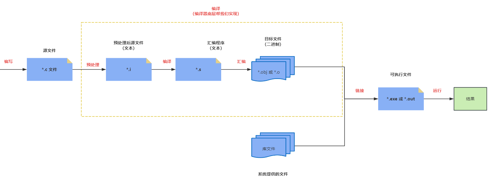
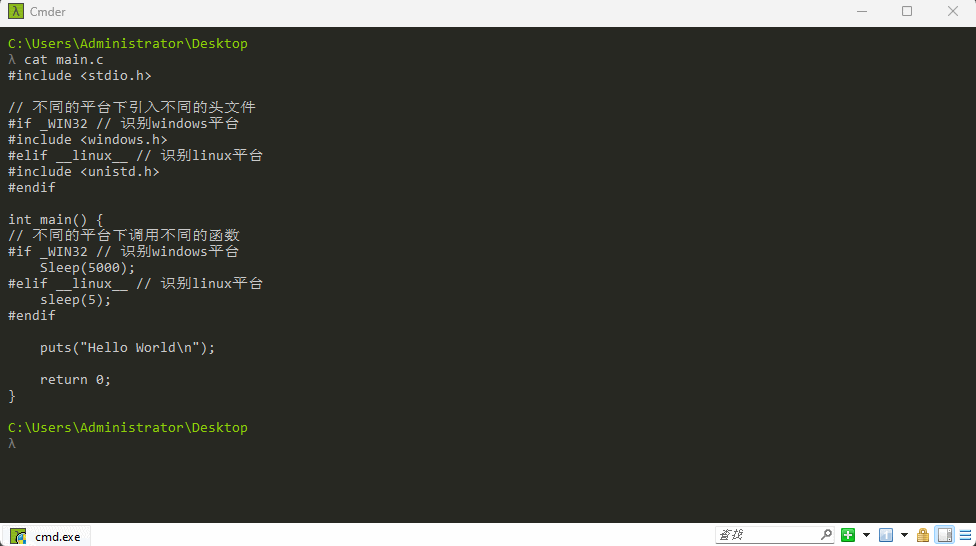
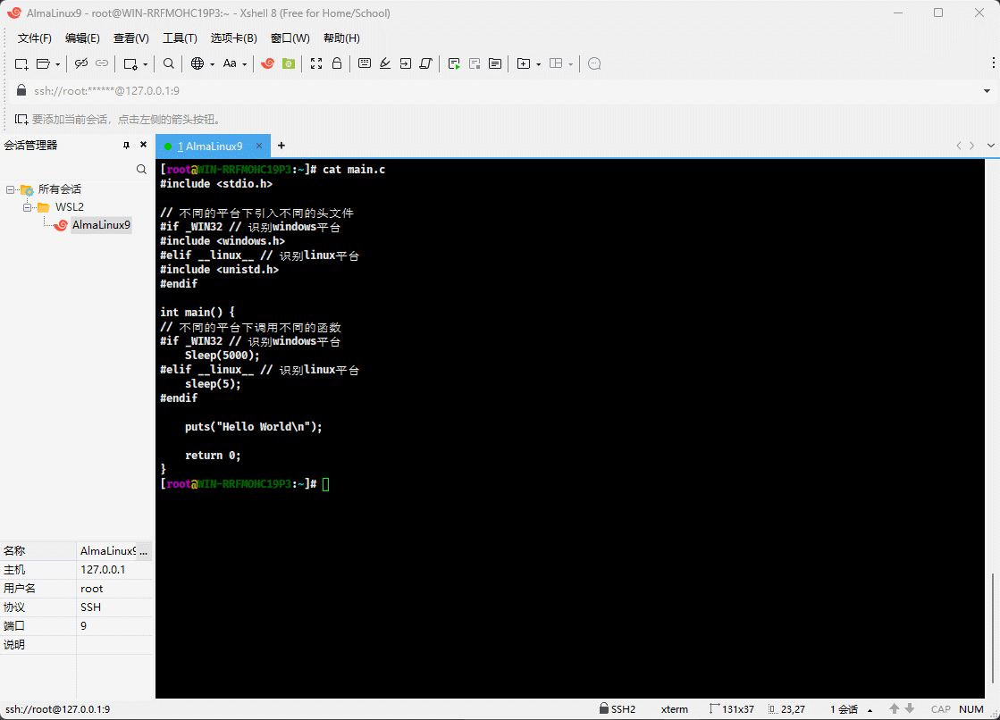
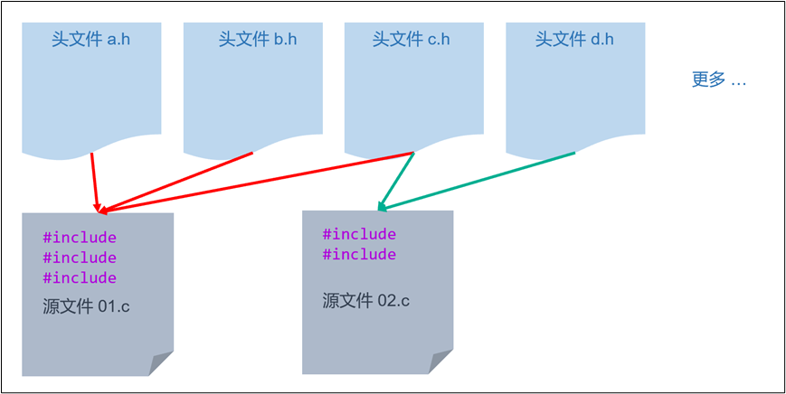
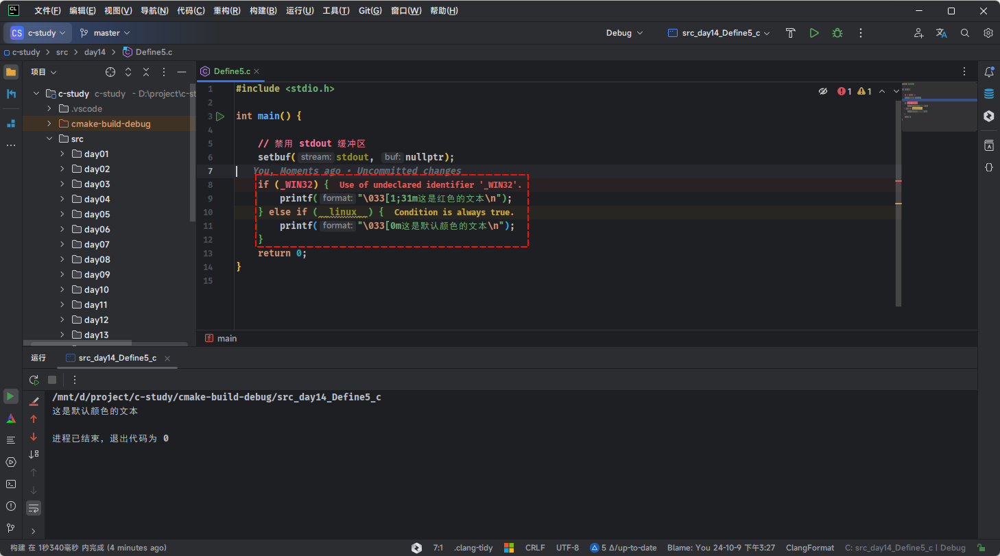
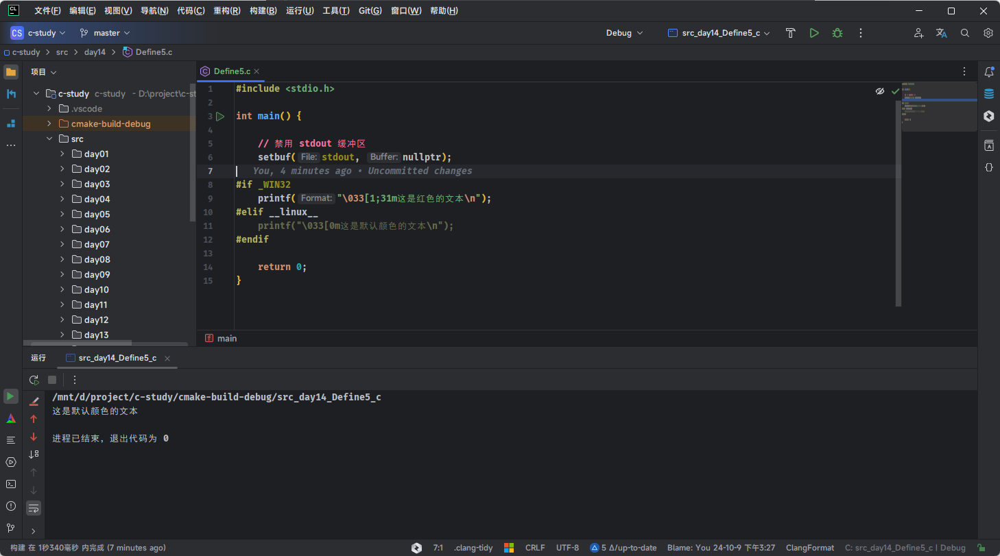
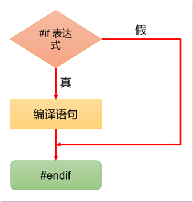
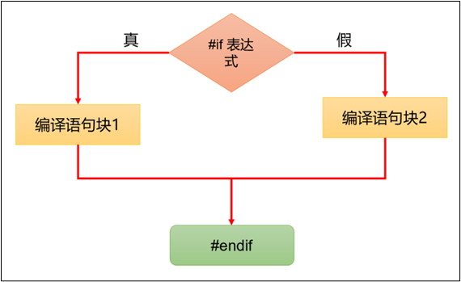
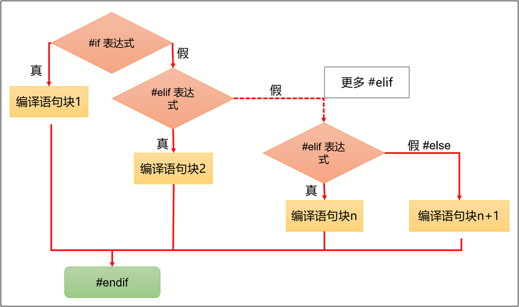

# 第一章：基本介绍

## 1.1 回顾 C 语言的编译过程

* C 语言的编译过程，如下所示：



* 过程 ① ：编写（编辑）源代码，即：编写 C 语言源程序代码，并以文件的形式存储在磁盘中。

> [!NOTE]
>
> 源程序需要以 `.c` 作为扩展名。

* 过程 ② ：编译，即：将 C 语言源程序转换为`目标程序（或目标文件）`。如果程序没有错误，没有任何提示，就会生成一个扩展名为 `.obj`或 `.o` 的二进制文件。C 语言中的每条可执行语句经过编译之后，最终都会转换为二进制的机器指令。

> [!NOTE]
>
> - ① 其实，`编译阶段`包含了`预处理`、`编译`和`汇编`。
> - ② `预处理`（Preprocess）是编译过程的第一个阶段。
>
>   ::: details 点我查看
>
>   - 在这个阶段，预处理器处理源代码中的指令（例如：`#include`、`#define`等），主要任务包括：
>     - 头文件包含：将头文件的内容插入到源文件中。例如：`#include <stdio.h>`会被替换为`stdio.h`文件的内容。
>     - 宏展开：替换宏定义。例如：`#define PI 3.14`会将代码中的`PI`替换为`3.14`。
>     - 条件编译：根据条件指令（如：`#ifdef`、`#ifndef`）有选择地编译代码。
>     - 删除代码中的注释，但是不会进行语法检查。
>   - 预处理完成后，生成一个扩展名为`.i`的中间文件。
>
>   :::
>
> - ③ `编译`（Compile）是将预处理后的源代码转换为汇编代码的过程。在这个阶段，编译器会检查代码的语法和语义，将其转换为目标机器的汇编语言，生成一个扩展名为`.s`的汇编文件。
> - ④ `汇编`（Assemble）是将汇编代码转换为机器代码（也称为目标代码或目标文件）的过程。在这个阶段，汇编器将汇编指令转换为二进制机器指令，生成一个扩展名为`.o`或 `.obj`的目标文件。

* 过程 ③ ：链接（Link），即：将编译形成的目标文件 `*.obj` 或 `*.o`和库函数以及其他目录文件`链接`，形成一个统一的二进制文件 `*.exe`。

> [!NOTE]
>
> - 为什么需要链接库文件？
> - 因为我们的 C 程序会使用 C 程序库中的内容，如：`<stdio.h>` 中的 `printf()` 函数，这些函数不是程序员自己写的，而是 C 程序库中提供的，因此需要链接。其实，在链接过程中，还会加入启动代码，这个启动代码（和系统相关，Linux 下主要有 crt0.c、crti.c 等，它们设置堆栈后，再调用 main() 函数）负责初始化程序运行时的环境。

- 过程 ④ ：执行，即：有了可执行的 `*.exe`文件，我们就可以在控制台上运行此 `*.exe` 文件。

> [!NOTE]
>
> 如果`修改`了源代码，还需要重新`编译`、`链接`，并生成新的 `*.exe`文件，再执行，方能生效。

## 1.2 和其他编程语言的对比

* 在编译和链接之前，C 语言需要对源文件进行一些文本方面的操作，如：删除代码中的注释，但是不会进行语法检查、头文件包含、宏展开、条件编译等，这个过程叫做预处理，由`预处理程序（预处理器）`完成。
* 较之其他的编程语言，如：Java 、C# 等，C/C++ 语言更依赖预处理器，所以在阅读或开发 C/C++ 程序的过程中，可能会接触到大量的预处理指令，如：`#include`、`#define` 等。

## 1.3 预处理指令

### 1.3.1 概述

* 预处理过程中会执行预处理指令，预处理指令以 `#`开头，如：`#include` 等，用于指导预处理器执行不同的任务。

### 1.3.2 注意事项

* ① 预处理指令应该放在代码的开头部分。

```c
// 预处理指令应该放在代码的开头部分
#include <stdio.h> // [!code highlight]

int main () {    

    return 0;
    
}
```

* ② 预处理指令都以 `#`开头，指令前面可以有空白字符（比如空格或制表符），`#`和指令的其余部分之间也可以有空格，但是为了兼容老的编译器，一般不留空格。

```c
// 推荐写法
#include <stdio.h>
```

```c
// 不推荐写法
    #include <stdio.h> // [!code warning]
```

* ③ 预处理指令都是一行的，除非在行尾使用反斜杠，将其折行，但强烈不建议这么干。

```c
// 不推荐写法
#include <std\ // [!code warning]
io.h> // [!code warning]
```

* ④ 预处理指令不需要分号作为结束符，指令结束是通过换行符来识别的。

```c
#include <stdio.h>; // 这里有分号会报错
```

```c
#define PI 3.14; // 分号会成为 PI 的值的一部分
```

* ⑤ 预处理指令通常不能写在函数内部，有些编译器的扩展允许将预处理指令写在函数里，但强烈不建议这么干。

```c
int main () {
    
    // 一般不允许写在这里
    #include <stdio.h> // [!code warning]

    return 0;
}
```

## 1.4 为什么 C 语言需要预处理？

### 1.4.1 概述

* 在实际开发中，有的时候，我们希望自己编写的程序能够跨平台（操作系统）运行，但是可能每个平台提供的系统库函数不同，如：在 Windows 上实现暂停的函数是 `void Sleep(DWORD dwMilliseconds)`，单位是 `ms`，头文件是 `<windows.h>`；而 Linux 上实现暂停的函数是 `unsigned int sleep (unsigned int seconds)`，单位是 `s` ，头文件是 `<unistd.h>`。所以，我们希望在 Windows 上调用的是 `Sleep()` 函数，而在 Linux 上调用的是 `sleep()` 函数，怎么办？
* 这就需要在编译之前对源文件进行处理：如果检测到的平台是 Windows，就保留 `Sleep()` 函数而删除 `sleep()` 函数；反之，如果检测到的平台是 Linux，则保留 `sleep()` 函数而删除 `Sleep()` 函数。

> [!NOTE]
>
> * ① 这些在编译之前对源文件进行简单加工的过程，就称为`预处理`，即：预先处理、提前处理。
> * ② 之前提过，在 Windows 上推荐使用 `MSYS2` ，就是因为 `MSYS2` 提供了一个兼容层，使得在 Windows 上可以使用类似于 Linux 的环境。并且，`MSYS2` 同时支持 Windows 和类 Unix 的库函数，对我们开发跨平台程序更为友好！！！

### 1.4.2 应用示例

* 需求：开发一个 C 语言程序，让它暂停 5 秒以后再输出内容，并且要求跨平台。

> [!NOTE]
>
> ::: details 点我查看 不同平台下的暂停函数和头文件
>
> * ① Windows 平台下的暂停函数的原型是`void Sleep(DWORD dwMilliseconds)`（注意 S 是大写的），参数的单位是 `ms`，位于 `<windows.h>` 头文件。
> * ② Linux 平台下暂停函数的原型是`unsigned int sleep (unsigned int seconds)`，参数的单位是 `s`，位于 `<unistd.h>` 头文件。
>
> :::


* 示例：

```c
#include <stdio.h>

// 不同的平台下引入不同的头文件
#if _WIN32 // 识别windows平台
#include <windows.h>
#elif __linux__ // 识别linux平台
#include <unistd.h>
#endif

int main() {
// 不同的平台下调用不同的函数
#if _WIN32 // 识别windows平台
    Sleep(5000);
#elif __linux__ // 识别linux平台
    sleep(5);
#endif

    puts("Hello World\n");

    return 0;
}
```

### 1.4.3 Windows 平台预处理

* 上述程序，对于 Windows 平台，进行预处理，即：

```c
gcc -E main.c -o main.i
```



* 处理后的代码就是这样的，如下所示：

```c {2,6}
#include <stdio.h>
#include <windows.h>

int main() {
    
    Sleep(5000);
    
    puts("Hello World\n");

    return 0;
}
```

### 1.4.4 Linux 平台预处理

* 上述程序，对于 Linux 平台，进行预处理，即：

```c
gcc -E main.c -o main.i
```



* 处理后的代码就是这样的，如下所示：

```c {2,6}
#include <stdio.h>
#include <unistd.h>

int main() {
    
    sleep(5);

    puts("Hello World\n");

    return 0;
}
```


# 第二章：宏定义

## 2.1 概述

* `#define` 在 C 语言中就称为宏定义命令，它是 C 语言预处理命令中的一种。所谓的`宏定义`，就是用一个标识符（宏名称）来表示一个替换文本，如果在后面的代码中出现了该标识符（宏名称），预处理器就会将它替换为对应的文本，我们也称该过程是宏替换或宏展开。
* 语法：

```c
#define 宏名称 替换文本
```

> [!NOTE]
>
> * ① 宏定义不是说明或语句，在行末不必加分号，如果加上分号则连分号也一起替换。
> * ② 宏名称：宏的名称，是一个标识符，通常使用大写字母表示，以便和普通的变量名进行区别。
> * ③ 替换文本：宏名称在代码中的每次出现都会被替换为这段文本。
> * ④ 宏定义必须写在函数之外，其作用域为宏定义命令起到源程序结束。如果要终止其作用域可使用`#undef`命令。
> * ⑤ 宏定义是用宏名来表示一个替换文本，在宏展开时又以该替换文本取代宏名，这只是一种简单粗暴的替换。替换文本中可以含任何字符，它可以是常数、表达式、if 语句、函数等，预处理程序对它不作任何检查，如果有错误，只能在编译已被宏展开后的源程序时发现。


* 示例：

```c
#include <stdio.h>

// N 是宏名称，3 是替换文本
#define N 3 // [!code highlight]

int main() {
    
    // 禁用 stdout 缓冲区
    setbuf(stdout, nullptr);

    int sum = 20 + N; // [!code highlight]

    printf("sum = %d\n", sum); // sum = 23

    return 0;
}
```

## 2.2 使用宏定义常量

* 需求：编写一个程序，求圆的面积，要求使用宏定义 PI。


* 示例：

```c
#include <stdio.h>

#define PI 3.1415926 // [!code highlight]

int main() {

    // 禁用 stdout 缓冲区
    setbuf(stdout, nullptr);

    int r = 0;
    printf("请输入圆的半径：");
    scanf("%d", &r);

    double area = PI * r * r; // [!code highlight]
    printf("圆的面积为：%.2f\n", area);

    return 0;
}
```

## 2.3 使用宏定义数据类型

* 需求：编程一个程序，模拟布尔类型。

> [!NOTE]
>
> * ① C23 标准中已经提供了布尔类型，即：`bool`，其值是 `true`或 `false`。
> * ② 但是，在 ANSI C 标准中是没有布尔类型的，使用 `0` 表示`假`，`1` 表示`真`。


* 示例：

```c
#include <stdio.h>

#define BOOL int // [!code highlight]
#define TRUE 1 // [!code highlight]
#define FALSE 0 // [!code highlight]

int main() {

    // 禁用 stdout 缓冲区
    setbuf(stdout, nullptr);

    BOOL isPass = FALSE; // [!code highlight]
    BOOL isOk   = TRUE; // [!code highlight]

    printf("isPass = %d\n", isPass); // isPass = 0
    printf("isOk = %d\n", isOk);     // isOk = 1

    return 0;
}
```

## 2.4 使用宏定义替换文本

* 需求：程序中反复使用的表达式可以使用宏定义，要求将`M` 替换为 `(n*n+3*n)`。


* 示例：

```c
#include <stdio.h>

#define M (n * n + 3 * n) // [!code highlight]

int main() {

    // 禁用 stdout 缓冲区
    setbuf(stdout, nullptr);

    int n = 3;
    // int sum = 3 * (n*n+3*n) + 4 * (n*n+3*n) + 5 * (n*n+3*n);
    int sum = 3 * M + 4 * M + 5 * M; // [!code highlight]

    printf("sum = %d\n", sum); // sum = 216

    return 0;
}
```

## 2.5 宏定义嵌套

* 需求：宏定义允许嵌套，在宏定义的替换文本中可以使用已经定义的宏名，在宏展开时由预处理程序层层替换。


* 示例：

```c
#include <stdio.h>

#define PI 3.1415926 // [!code highlight]
#define AREA PI *r *r // [!code highlight]

int main() {

    // 禁用 stdout 缓冲区
    setbuf(stdout, nullptr);

    int r = 0;
    printf("请输入圆的半径：");
    scanf("%d", &r);

    printf("圆的面积为：%.2f\n", AREA); // [!code highlight]

    return 0;
}
```

## 2.6 取消宏定义

* 需求：有的时候，我们希望在某个函数内取消宏定义。

> [!NOTE]
>
> * ① 宏定义必须写在函数之外，其作用域为宏定义命令起到源程序结束。
> * ② 如果要终止其作用域可使用`#undef`命令。


* 示例：

```c
#include <stdio.h>

#define PI 3.1415926 // [!code highlight]

int main() {

    // 禁用 stdout 缓冲区
    setbuf(stdout, nullptr);

    int r = 0;
    printf("请输入圆的半径：");
    scanf("%d", &r);

    double area = PI * r * r;
    printf("圆的面积为：%.2f\n", area);

    return 0;
}

// 取消宏定义
#undef PI // [!code highlight]

void func() {
    // 错误，这里不能使用 PI
    // printf("PI=%f", PI); // [!code error]
}
```


# 第三章：带参数的宏定义

## 3.1 概述

* C 语言允许宏带有参数。在宏定义中的参数称为“形式参数”，在宏调用中的参数称为“实际参数”，这点和函数有些类似。
* 带参宏定义语法：

```c
#define 宏名(形参列表) 替换文本
```

> [!NOTE]
>
> * ① 对带参数的宏，在展开过程中不仅要进行字符串替换，还要用实参去替换形参。
> * ② 带参宏定义的一般形式为`#define 宏名(形参列表) 替换文本`，在替换文本中可以含有各个形参。

* 带参宏调用语法：

```c
宏名(实参列表);
```


* 示例：使用函数来获取两个数中的较大的数

```c
#include <stdio.h>

/**
 * 获取两个整数中的最大值
 * @param a
 * @param b
 * @return
 */
int max(int a, int b) {
    return a > b ? a : b;
}

int main() {

    // 禁用 stdout 缓冲区
    setbuf(stdout, nullptr);

    int a = 10;
    int b = 20;

    int maxValue = max(a, b);

    printf("maxValue = %d\n", maxValue); // maxValue = 20

    return 0;
}
```


* 示例：使用带参宏定义来获取两个整数中的最大值

```c
#include <stdio.h>

#define MAX(a, b) a > b ? a : b // [!code highlight]

int main() {

    // 禁用 stdout 缓冲区
    setbuf(stdout, nullptr);

    int a = 10;
    int b = 20;

    int maxValue = MAX(a, b);

    printf("maxValue = %d\n", maxValue); // maxValue = 20

    return 0;
}

```

## 3.2 使用细节和注意事项

* ① 带参宏定义中，形参之间可以出现空格，但是宏名和形参列表之间不能有空格出现。
* ② 在带参宏定义中，不会为形式参数分配内存，因此不必指明数据类型，而在宏调用中，实参包含了具体的数据，要用它们去替换形参，因此实参必须要指明数据类型。
* ③ 在宏定义中，替换文本内的形参通常要用`()`括起来以避免出错；并且，替换文本也应该使用 `()` 括起来以避免出错。


* 示例：演示 ① 

```c
#include <stdio.h>

#define MAX (a, b) a > b ? a : b // [!code highlight]

int main() {

    // 禁用 stdout 缓冲区
    setbuf(stdout, nullptr);

    int a = 10;
    int b = 20;

    // MAX 就相当于 (a, b) a > b ? a : b
    // MAX(a, b) 就相当于 (a, b) a > b ? a : b(a, b)
    int maxValue = MAX(a, b); // [!code error]

    printf("maxValue = %d\n", maxValue); 

    return 0;
}

```


* 示例：演示 ③ 

```c
#include <stdio.h>

// 带参宏定义,字符串内的形参通常要用括号括起来以避免出错
#define SQ(y) (y) * (y) // [!code highlight]

int main()
{
    int a, sq;
    printf("input a number: ");
    scanf("%d", &a);

    // 宏替换为 (a+1) * (a+1)
    sq = SQ(a + 1);  // [!code highlight]
    printf("sq=%d\n", sq);

    return 0;
}
```

## 3.3 带参宏定义和函数的区别

* ① 宏展开仅仅是文本的替换，不会对表达式进行计算；宏在编译之前就被处理掉了，它没有机会参与编译，也不会占用内存。
* ② 函数是一段可以重复使用的代码，会被编译，会给它分配内存，每次调用函数，就是执行这块内存中的代码。


* 示例：使用函数计算平方值

```c
#include <stdio.h>

int SQ(int y) {
    return ((y) * (y));
}

int main() {

    for (int i = 1; i <= 5; i++) {
        printf("%d^2 = %d\n", i, SQ(i));
    }

    return 0;
}
```


* 示例：使用带参宏定义计算平方值

```c
#include <stdio.h>

#define SQ(y) ((y) * (y))

int main() {

    for (int i = 1; i <= 5; i++) {
        printf("%d^2 = %d\n", i, SQ(i));
    }

    return 0;
}
```


# 第四章：文件包含

## 4.1 概述

* `#include` 指令用于引入标准头文件、自定义头文件或第三方库的头文件，以便在当前源文件中使用其中定义的函数、变量、宏定义等，如下所示：



> [!NOTE]
>
> * ① 一个 `#include` 指令只能包含一个头文件，多个头文件需要多个 `#include` 命令。
> * ② 一个源文件可以导入多个头文件，一个头文件也可以被多个源文件导入（需要注意，`头文件重复`问题）。
> * ③ 标准库头文件、自定义头文件以及第三方库的头文件的扩展名都是 `.h`。

## 4.2 包含标准库头文件

* 引入`标准库头文件`需要使用`尖括号`将文件名包裹起来，如下所示：

```c
// 用于包含标准库头文件或系统头文件。
// 编译器将在系统的标准头文件目录中查找文件。
#include <filename>
```

> [!TIP]
>
> 使用尖括号来引入标准头文件，使用双引号来引入自定义头文件，以便区分！！！

## 4.3 包含自定义头文件

* 引入`自定义的头文件`需要使用`双引号`将文件名包裹起来，如下所示：

```c
// 用于包含用户自定义的头文件。
// 编译器首先在当前目录中查找文件，如果未找到，再在标准头文件目录中查找。
#include "filename"
```

> [!TIP]
>
> 使用尖括号来引入标准头文件，使用双引号来引入自定义头文件，以便区分！！！


# 第五章：C 语言中的预定义宏

## 5.1 概述

* 所谓的预定义宏就是已经预先定义好的宏，我们可以直接使用，无需再重新定义。
* ANSI C 规定了以下几个预定义宏，它们在各个编译器下都可以使用，如下所示：

| 预定义宏            | 说明                                             |
| ------------------- | ------------------------------------------------ |
| `__LINE__`          | 表示当前源代码的行号                             |
| `__FILE__`          | 表示当前源文件的名称                             |
| `__DATE__`          | 表示当前的编译日期                               |
| `__TIME__`          | 表示当前的编译时间                               |
| `__STDC__`          | 当要求程序严格遵循 ANSI C 标准时该标识被赋值为 1 |
| `__cplusplus`       | 当编写 C++ 程序时该标识符被定义                  |
| `_WIN32`或 `_WIN64` | 目标平台是 Windows 。                            |
| `__linux__`         | 目标平台是 Linux。                               |

## 5.2 应用示例

* 需求：演示常用的 C 语言预定义宏。


* 示例：

```c
#include <stdio.h>

int main() {

    // 禁用 stdout 缓冲区
    setbuf(stdout, nullptr);

    printf("Date : %s\n", __DATE__);
    printf("Time : %s\n", __TIME__);
    printf("File : %s\n", __FILE__);
    printf("Line : %d\n", __LINE__);

    return 0;
}
```


# 第六章：条件编译

## 6.1 概述

* 现在需要开发一个 C 语言程序，要求在 Windows 上的控制台的颜色是红色，而在 Linux 上的控制台的颜色是默认颜色，怎么办？
* Windows 上的预定义宏是 `_WIN32`，而 Linux 上预定义宏是 `__linux__`，我们很容易的想到使用 `if...else` 来实现，代码如下：

```c
#include <stdio.h>

int main() {

    // 禁用 stdout 缓冲区
    setbuf(stdout, nullptr);

    if (_WIN32) {
        printf("\033[1;31m这是红色的文本\n");
    } else if (__linux__) {
        printf("\033[0m这是默认颜色的文本\n");
    }
    return 0;
}
```

* 但是，编译器会直接报错，如下所示：



> [!CAUTION]
>
> * ① 此时我的环境是 Linux，而在 Linux 环境下编译器是不认识 `_Win32` 的，会提示未定义的标识符。
> * ② 同理，如果我的环境是 Windows，而在 Windows 环境下编译器是不认识 `__linux__` 的，会提示未定义的标识符。

* 此时，我们可以使用 `#if ...#endif` 来对上述的程序进行改进，如下所示：

```c
#include <stdio.h>

int main() {

    // 禁用 stdout 缓冲区
    setbuf(stdout, nullptr);

#if _WIN32
    printf("\033[1;31m这是红色的文本\n");
#elif __linux__
    printf("\033[0m这是默认颜色的文本\n");
#endif

    return 0;
}
```

* 我们可以看到，此时的编译器是不会报错的，如下所示：



> [!NOTE]
>
> * ① `#if`、`#elif`、`#endif` 等都是预处理命令，其含义是：如果宏 `_WIN32` 为真，就保留第 9 行代码，而删除第 11 行代码；如果宏 `__linux__`为真，就保留第 11 行代码，而删除第 9 行代码。
> * ② 这些操作都是在预处理阶段完成的，多余的代码以及所有的宏都不会参与编译，不仅保证了代码的正确性，还减小了编译后文件的体积。
> * ③ `这种能够根据不同情况编译不同代码、产生不同目标文件的机制，称为条件编译`。
> * ④ 条件编译是预处理程序的功能，不是编译器的功能。

## 6.2 #if

### 6.2.1 #if ... #endif

* 语法：

```c
#if 条件表达式
	...
#endif
```

> [!NOTE]
>
> * ① `#if...#endif` 指令用于预处理器的条件判断，满足条件时，内部的行会被编译，否则就被编译器忽略。
> * ② `#if...#endif` 指令相当于分支结构中的 `if` 语句。

* 流程图，如下所示：




* 示例：

```c
#include <stdio.h>

#define AGE 19

int main() {

    // 禁用 stdout 缓冲区
    setbuf(stdout, nullptr);

#if AGE >= 18
    printf("你已经是一个成年人了，可以为自己的行为负责！！！");
#endif

    return 0;
}
```


* 示例：

```c
#include <stdio.h>

#define AGE 17

int main() {

    // 禁用 stdout 缓冲区
    setbuf(stdout, nullptr);

#if AGE >= 18
    printf("你已经是一个成年人了，可以为自己的行为负责！！！");
#endif

    return 0;
}
```

### 6.2.2 #if … #else … #endif

* 语法：

```c
#if 条件表达式
	...
#else
    ...    
#endif
```

> [!NOTE]
>
> * ① `#if...#endif`之间还可以加入 `#else` 指令，用于指定判断条件不成立时，需要编译的语句。
> * ② `#if … #else … #endif` 指令相当于分支结构中的 `if...else` 语句。

* 流程图，如下所示：




* 示例：

```c
#include <stdio.h>

#define AGE 19

int main() {

    // 禁用 stdout 缓冲区
    setbuf(stdout, nullptr);

#if AGE > 18
    printf("你已经是一个成年人了，可以为自己的行为负责！！！");
#else
    printf("你还是一个未成年人，需要监护人监护！！！");
#endif

    return 0;
}
```


* 示例：

```c
#include <stdio.h>

#define AGE 17

int main() {

    // 禁用 stdout 缓冲区
    setbuf(stdout, nullptr);

#if AGE > 18
    printf("你已经是一个成年人了，可以为自己的行为负责！！！");
#else
    printf("你还是一个未成年人，需要监护人监护！！！");
#endif

    return 0;
}
```

### 6.2.3 #if … #elif … #else … #endif

* 语法：

```c
#if 条件表达式1
	...
#elif 条件表达2
    ...    
#else
    ...    
#endif
```

> [!NOTE]
>
> `#if … #elif … #else … #endif` 指令相当于分支结构中的 `if...elseif..else` 语句。

* 流程图，如下所示：




* 示例：

```c
#include <stdio.h>

#define AGE 17

int main() {

    // 禁用 stdout 缓冲区
    setbuf(stdout, nullptr);

#if AGE < 6
    printf("你现在处于幼儿阶段\n");
#elif AGE < 12
    printf("你现在处于少年阶段\n");
#elif AGE < 18
    printf("你现在处于青年阶段\n");
#elif AGE < 40
    printf("你现在处于壮年阶段\n");
#else
    printf("你现在处于老年阶段\n");
#endif


    return 0;
}
```

## 6.3 #ifdef 

* 语法：

```c
#ifdef  宏名
    ...
#else
    ...
#endif
```

> [!NOTE]
>
> * ① 应用场景：用于判断某个宏是否定义过。
> * ② 类似于分支结构中的 `if...else` 语句。
> * ③ 最典型的应用就是解决头文件重复问题。


* 示例：

```c
#include <stdio.h>

int main() {

    // 禁用 stdout 缓冲区
    setbuf(stdout, nullptr);

#ifdef _DEBUG
    printf("正在使用 Debug 模式编译程序...\n");
#else
    printf("正在使用 Release 模式编译程序...\n");
#endif

    return 0;
}
```

## 6.4 \#if defined

* 语法：

```c
#if defined 宏名
  ...
#elif defined 宏名
  ...
#else
  ...
#endif
```

> [!NOTE]
>
> * ① 应用场景：用于判断某个宏是否定义过。
> * ② 类似于分支结构中的 `if...elseif..else` 语句。


* 示例：

```c
#include <stdio.h>

int main() {

    // 禁用 stdout 缓冲区
    setbuf(stdout, nullptr);

#if defined(_DEBUG)
    printf("正在使用 Debug 模式编译程序...\n");
#elif defined(NDEBUG)
    printf("正在使用 Release 模式编译程序...\n");
#elif defined(RELWITHDEBINFO)
    printf("正在使用 RelWithDebInfo 模式编译程序...\n");
#elif defined(_MINSIZEREL)
    printf("正在使用 Minsizerel 模式编译程序...\n");
#else
    printf("正在使用未知模式编译程序...\n");
#endif

    return 0;
}
```

## 6.5 #ifndef

* 语法：

```c
#ifndef 宏名
    ... 
#else 
    ...  
#endif
```

> [!NOTE]
>
> * ① `#ifndef...#endif` 指令跟 `#ifdef...#endif`正好相反。
> * ② 它用来判断，如果某个宏没有被定义过。


* 示例：

```c
#include <stdio.h>

int main() {

    // 禁用 stdout 缓冲区
    setbuf(stdout, nullptr);

#ifndef _DEBUG
    printf("正在使用 Release 模式编译程序...\n");
#else
    printf("正在使用 Debug 模式编译程序...\n");
#endif

    return 0;
}
```

## 6.6 应用示例

* 需求：开发一个 C 语言程序，让它暂停 5 秒以后再输出内容，并且要求跨平台。

> [!NOTE]
>
> ::: details 点我查看 不同平台下的暂停函数和头文件
>
> * ① Windows 平台下的暂停函数的原型是`void Sleep(DWORD dwMilliseconds)`（注意 S 是大写的），参数的单位是 `ms`，位于 `<windows.h>` 头文件。
> * ② Linux 平台下暂停函数的原型是`unsigned int sleep (unsigned int seconds)`，参数的单位是 `s`，位于 `<unistd.h>` 头文件。
>
> :::


* 示例：

```c
#include <stdio.h>

#if _WIN32 // 如果是 Windows 平台, 就引入 <windows.h>
#include <windows.h>
#define SLEEP(t) Sleep(t * 1000)
#elif __linux__ // 如果是 Linux 平台， 就引入<unistd.h>
#include <unistd.h>
#define SLEEP sleep
#endif

int main() {

    // 禁用 stdout 缓冲区
    setbuf(stdout, nullptr);

    SLEEP(5);
    printf("hello, 大家好~");

    return 0;
}
```

