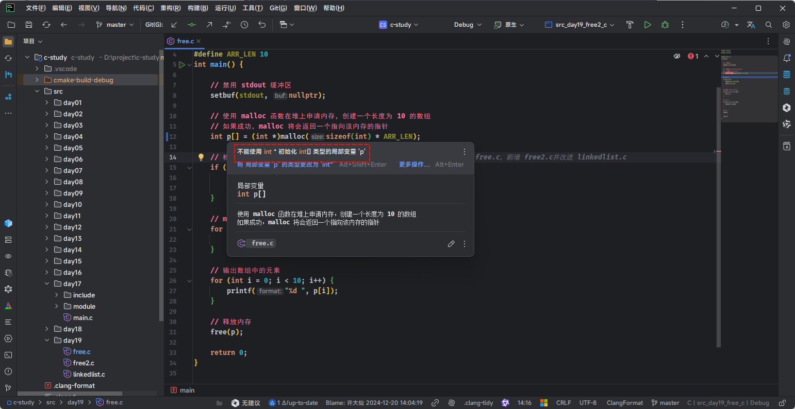
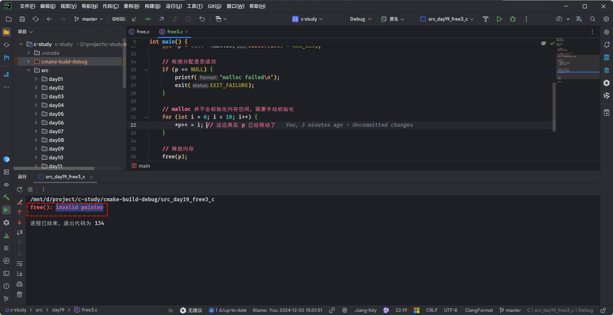
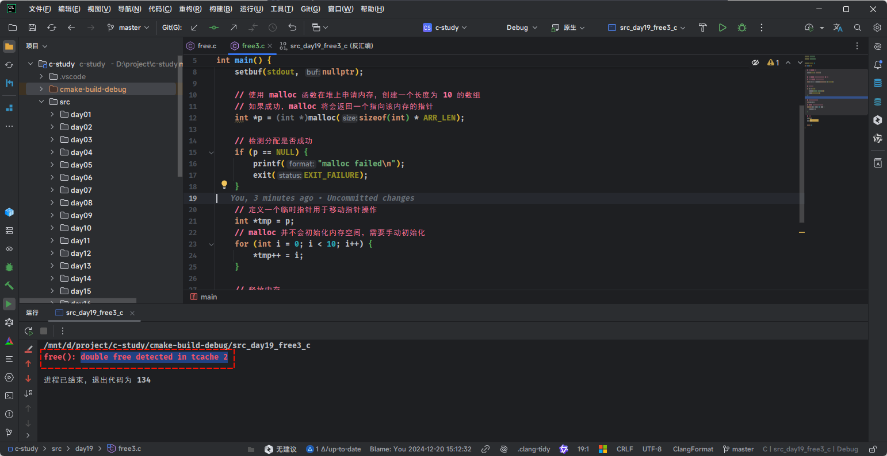

# 第一章：回顾知识

## 1.1 虚拟地址空间

* 为了更好的管理程序，操作系统将虚拟地址空间分为了不同的内存区域，这些内存区域存放的数据、用途、特点等皆有不同，下面是 Linux 下 32 位环境的经典内存模型，如下所示：


- 每个内存区域的特点，如下所示：

| 内存分区                  | 说明                                                         |
| :------------------------ | :----------------------------------------------------------- |
| 程序代码区（code）        | 存储程序的执行代码，通常为只读区，包含程序的指令。 程序启动时，这部分内存被加载到内存中，并不会在程序执行期间改变。 |
| 常量区（constant）        | 存放程序中定义的常量值，通常也是只读的，这些常量在程序运行期间不可修改。 |
| 全局数据区（global data） | 存储程序中定义的全局变量和静态变量。 这些变量在程序的整个生命周期内存在，且可以被修改。 |
| `堆区（heap，⭐）`         | 用于动态分配内存，例如：通过 `malloc` 或 `new` 分配的内存块。 堆区的内存由程序员手动管理，负责分配和释放。 如果程序员不释放，程序运行结束时由操作系统回收。 |
| 动态链接库                | 动态链接库（如： `.dll` 或 `.so` 文件）被加载到内存中特定的区域，供程序运行时使用。 |
| 栈区（stack）             | 用于存储函数调用的局部变量、函数参数和返回地址。 栈是自动管理的，随着函数的调用和返回，栈上的内存会自动分配和释放。 |

> [!NOTE]
>
> - ① 程序代码区、常量区、全局数据区在程序加载到内存后就分配好了，并且在程序运行期间一直存在，不能销毁也不能增加（大小已被固定），只能等到程序运行结束后由操作系统收回，所以全局变量、字符串常量等在程序的任何地方都能访问，因为它们的内存一直都在。
> - ② 函数被调用时，会将参数、局部变量、返回地址等与函数相关的信息压入栈中，函数执行结束后，这些信息都将被销毁。所以局部变量、参数只在当前函数中有效，不能传递到函数外部，因为它们的内存不在了。
> - ③ 常量区、全局数据区、栈上的内存由系统自动分配和释放，不能由程序员控制。`程序员唯一能控制的内存区域就是堆`（Heap）：它是一块巨大的内存空间，常常占据整个虚拟空间的绝大部分，在这片空间中，程序可以申请一块内存，并自由地使用（放入任何数据）。堆内存在程序主动释放之前会一直存在，不随函数的结束而失效。在函数内部产生的数据只要放到堆中，就可以在函数外部使用。

* 在 64 位 Linux 环境下，虚拟地址空间大小为 256TB，Linux 将高 128TB 的空间分配给内核使用，而将低 128TB 的空间分配给用户程序使用，如下所示：


> [!NOTE]
>
> - ① `程序代码区`，也可以称为`代码段`；而`全局数据区`和`常量区`，也可以称为`数据段`。
> - ② `全局数据区`分为`初始化数据段`（存储已初始化的全局变量和静态变量）和`未初始化数据段`（存储未初始化的全局变量和静态变量）；`常量区`也称为`只读数据段`，通常是只读的，防止数据被修改。
> - ③ 冯·诺依曼体系结构中的`程序`，也被称为`存储式程序`，需要通过加载器（Loader），将程序从硬盘加载到内存中运行。
> - ④ `存储式程序`中的`程序`分为`指令`和`数据`；其中，`代码段`中保存的是`指令`，`数据段`中保存的是`数据`。

## 1.2 栈区的内存管理、特点、优缺点和应用场景

### 1.2.1 栈内的内存管理

* `栈区`（Stack）的内存管理主要依赖`栈指针寄存器（Stack Pointer 寄存器，简称：SP 寄存器）`的移动来实现。
* 我们可以简单的将 SP 寄存器看成是一个跟踪`栈顶位置`的指针，它始终指向栈的顶部。
* 栈区可以随着函数的调用生长，而且是从高地址向低地址，向下生长，即：
  * ① 当函数开始调用，栈帧进栈的时候，SP 会减少，栈顶移向低地址。
  * ② 当函数结束调用，栈帧出栈的时候，SP 会增加，栈顶移向高地址。
* 假设函数调用的代码，如下所示：

```c
#include <stdio.h>

void test(){
    
    printf("我是 test 函数");
    
}

int main(){
    
    test(); // [!code highlight]
    
    printf("我是 main 函数")
    
    return 0;
}
```

* 当 `test` 函数开始调用，即：test 栈帧进栈的时候，其对应的内存示意图，如下所示：


* 当 `test` 函数结束调用，即：test 栈帧出栈的时候，其对应的内存示意图，如下所示：


### 1.2.2 栈区的特点及其优缺点

* ① 栈区的特点：

| 特点                         | 说明                                                         |
| ---------------------------- | ------------------------------------------------------------ |
| `存取速度快`                 | 栈是一块连续的内存区域，且管理方式简单（仅需要调整栈指针），因此栈区的内存分配和访问速度极快。 |
| `自动管理`                   | 操作系统负责栈区内存的分配与释放，程序员无需显式操作。<br>避免了内存泄漏等问题，但同时缺乏灵活性。 |
| `空间有限`                   | 栈的大小通常是固定的（由操作系统或编译器设定），因此栈区的内存较为有限，适合存储小型对象或短期变量。<br/>若栈空间耗尽（递归过深），可能导致`栈溢出（Stack Overflow）`。 |
| `短生命周期（自动存储期限）` | 栈区的内存用于局部变量和临时数据，生命周期短，当函数执行完毕后，栈帧随即释放。<br/>栈区的变量通常仅在函数作用域内有效。 |
| `线程私有`                   | 每个线程都有自己独立的栈空间，不会被其他线程访问，即：线程安全。 |
| `地址从高向低分配`           | 栈通常是从高地址向低地址增长的（取决于具体的硬件架构）。     |

* ② 栈区的优点：

| 优点   | 说明                                                 |
| ------ | ---------------------------------------------------- |
| `高效` | 由于操作系统自动管理栈，分配和释放的效率很高。       |
| `安全` | 程序员不需要显式释放内存，避免了悬空指针和内存泄漏。 |

* ③ 栈区的缺点：

| 缺点         | 说明                                                         |
| ------------ | ------------------------------------------------------------ |
| `空间受限`   | 栈的大小固定，无法动态扩展，容易发生栈溢出。                 |
| `生命周期短` | 只能用于短期数据的存储，不适合存储大数据或需要长时间保存的数据。。 |

### 1.2.3 应用场景

* 由于栈区的优点，即：栈区`适合`存储短生命周期的小型数据，如下所示：
  * ① 局部变量。
  * ② 函数参数。
  * ③ 返回地址。
  * ④ 临时变量。
  * ...

* 由于栈区的缺点，即：栈区`不适合`存储需要动态分配、生命周期较长或跨函数调用的数据结构，如下所示：
  * ① 存储体积较大的数据结构，如：大数组、长字符串和大型结构体。
  * ② 动态数据结构，如：动态长度的数组，链表，树等。
  * ③ 多线程共享的数据。
  * ④ 需要作为函数返回值的数据结构的指针（返回栈区数据的指针会引发悬空指针问题）。
  * ...

## 1.3 堆区的内存管理、特点、优缺点和应用场景

### 1.3.1 堆区的内存管理

* `堆区`（Heap）是计算机内存中的一部分，用于动态分配内存。与栈区不同，堆区的内存管理由程序员控制，通常用于存储程序运行时动态生成的数据。

> [!NOTE]
>
> ::: details 点我查看 堆区内存管理的具体方面
>
> * ① **动态内存分配**：
>   * 在程序执行过程中，可以根据需求动态分配内存。
>   * 在 C/C++ 中，使用 `malloc`、`calloc`、`realloc` 等函数来分配堆内存，使用 `free` 来释放内存。
>   * 在 Java 或其他现代语言中，堆内存由垃圾回收机制（GC）自动管理，但仍然是动态分配的。
>
> * ② **内存管理方式**：
>   * 在 C/C++ 中，对于堆区的内存管理是`手动管理`，即：程序员需要显式分配和释放堆内存，若忘记释放，会造成内存泄漏；释放后指针仍然指向已释放的内存会导致悬挂指针等问题。
>   * 在 Java、C# 中，对于堆区的内存管理是`自动管理`，即：堆内存由垃圾回收机制（GC）自动管理，程序员不需要手动释放内存，但也要小心避免内存泄漏（对象仍被引用但不再使用）。
> * ③ **内存分配和释放过程**：
>   * 内存分配时，堆区会找到一个足够大的空闲区域并返回内存地址，分配的内存没有固定的顺序或结构，可能导致内存碎片。
>   * 堆内存释放时，操作系统会将已释放的内存标记为可用，但并不立即回收，直到下一次分配时才会重新利用。
>
> :::

### 1.3.2 堆区的特点及其优缺点

* ① 堆区的特点：

| 特点                     | 说明                                                         |
| ------------------------ | ------------------------------------------------------------ |
| `灵活的内存分配与释放`   | 堆内存由程序员显式管理，内存的大小和生命周期不固定，可以根据需要动态调整。<br/>适用于存储需要长时间存在的对象，或者其大小在编译时无法确定的数据结构，如：动态数组、链表、树等。 |
| `内存碎片化`             | 堆区内存管理采用的是一种"自由存储"方式（free store），会出现内存碎片。<br>内存碎片可以通过优化内存分配算法（`内存池`）或使用垃圾回收机制来减轻，但无法完全避免。 |
| `程序员控制`             | 堆内存的分配和释放通常是由程序员来手动控制（在低级语言，如： C/C++ 中），这带来灵活性但也增加了出错的可能性（忘记释放内存导致内存泄漏）。<br/>现代语言，如：Java 和 Python ，使用自动垃圾回收机制来减少手动管理内存的麻烦，但堆内存的生命周期和分配仍然是动态的。。 |
| `跨函数调用生命周期`     | 堆区内存的生命周期由程序员控制，可以在多个函数或作用域之间共享。<br/>可以通过指针或引用将堆内存分配的对象传递给不同的函数。 |
| `相对较慢的内存访问速度` | 由于堆区内存需要动态分配，且可能涉及到较为复杂的内存管理策略，因此其访问速度通常不如栈区内存。<br/>与栈区的内存访问不同，堆区可能存在更多的内存寻址和管理开销。 |
| `线程共享`               | 堆区内存是线程共享的，这意味着多个线程可以访问堆上的数据。<br/>使用堆内存时需要注意线程安全问题，需要使用互斥锁（mutexes）等同步机制来防止多个线程同时访问同一块堆内存而导致竞争条件。 |

* ② 堆区的优点：

| 优点             | 说明                                                         |
| ---------------- | ------------------------------------------------------------ |
| `灵活性高`       | 可以动态分配和释放内存，适用于未知大小或生命周期较长的数据。 |
| `跨函数调用共享` | 堆上的数据可以在不同函数间共享，适用于全局性、长期有效的对象。 |
| `适合大数据结构` | 动态数组、链表、树、图等大数据结构通常存放在堆区。           |

* ③ 堆区的缺点：

| 缺点         | 说明                                                         |
| ------------ | ------------------------------------------------------------ |
| `管理复杂`   | 需要程序员手动管理内存（在 C/C++ 中），容易造成内存泄漏或悬空指针。 |
| `内存碎片化` | 频繁的分配与释放会导致堆内存碎片化，影响效率。               |
| `性能较差`   | 内存分配和访问速度相对较慢。                                 |

### 1.3.3 应用场景

* 由于堆区的优点，即：堆区`适合`存储需要动态分配、生命周期较长或跨函数调用的数据结构，如下所示：
  * ① 存储体积较大的数据结构，如：大数组、长字符串和大型结构体。
  * ② 动态数据结构，如：动态长度的数组，链表，树等。
  * ③ 多线程共享的数据。
  * ④ 需要作为函数返回值的数据结构的指针（返回栈区数据的指针会引发悬空指针问题）。
  * ...
* 由于堆区的缺点，即：堆区`不适合`存储短生命周期的小型数据，如下所示：
  - ① 局部变量。
  - ② 函数参数。
  - ③ 返回地址。
  - ④ 临时变量。
  - ...

## 1.4 栈区 VS 堆区

* 栈区 VS 堆区，如下所示：

| 特性         | 栈区                           | 堆区                               |
| ------------ | ------------------------------ | ---------------------------------- |
| 内存分配方式 | 自动分配与释放                 | 程序员手动分配与释放（或垃圾回收） |
| 生命周期     | 局部，随着函数调用结束自动释放 | 根据程序员需求，生命周期灵活       |
| 内存大小     | 固定，通常较小                 | 动态分配，理论上较大               |
| 访问速度     | 快（栈指针调整）               | 慢（需要查找空闲块）               |
| 存储内容     | 局部变量、函数参数、返回地址等 | 动态分配的数据结构、大型对象等     |
| 线程安全     | 线程私有                       | 线程共享，需注意同步               |
| 内存碎片问题 | 无明显碎片                     | 容易出现内存碎片                   |

> [!CAUTION]
>
> * ① 尽管堆区提供了灵活的内存管理方式，但也需要程序员小心处理内存分配与释放，防止内存泄漏和碎片化等问题。
> * ② 在现代编程语言中，垃圾回收机制可以减轻程序员的内存管理负担，但对堆内存的操作仍然比栈区更复杂且开销较大。
> * ③ 彼之蜜饯，吾之砒霜：合理地结合栈和堆的使用，我们能够设计出既高效又灵活的应用程序。在这个过程中，理解每种内存区域的特性及其最佳应用场景是至关重要的。


# 第二章：C 语言中的动态内存分配（⭐）

## 2.1 概述

* `动态内存分配`在 C 语言编程中有着举足轻重的地位，因为它是链式结构的基础。我们可以将动态分配的内存链接在一起，形成链表、树、图等灵活的数据类型。
* 虽然动态内存分配适用于所有的数据类型，但是其主要的应用场景是字符串、数组和结构体中。其中，动态分配的结构体是最值得关注的，因为它可以被链接成链接、树和其它的数据结构。

> [!CAUTION]
>
> * ① 一般来说，如果没有特殊需求，不要在堆上为基本数据类型动态分配内存。
> * ② 在实际开发中，一般也没有必要，在堆上为基本数据类型动态分配内存。

## 2.2 CLion 整合 Valgrind（必做）

* C 语言中的指针是否使用是个颇具争议的话题，现代化的高级编程语言通过各种策略和机制，在编译期就能解决指针危险的问题。但是，遗憾的是，C 语言的指针很大程度上，在运行期才会暴露问题。
* 幸运的是，我们可以使用 `Valgrind` 项目来进行`内存泄漏检测`，而 `Valgrind` 只支持 Linux 。

> [!NOTE]
>
> :::details 点我查看
>
> * ① [点我跳转：CLion 整合 Valgrind](/01_c-se/c-leap/04_xdx/#_4-1-内存泄漏检测)。
> * ② 在使用 C 语言开发项目的时候，尤其是涉及到动态内存分配，很容易引起内存溢出或未定义行为等，强烈建议在 CLion 中调用 `Valgrind` 进行项目开发。
>
> :::

## 2.3 通用指针类型

### 2.3.1 概述

* 在 C 语言中，通用指针类型就是 `void *`类型的指针。

### 2.3.2 特点

* ① `类型无关，赋值灵活`：由于指针本质上是一个存储内存地址的变量，而内存地址是没有类型的（unsigned int，即：无符号整数）；所以，`void *` 指针可以存储任何类型的地址，并指向任意类型的对象。

> [!NOTE]
>
> * ① 在底层实现上，指针实际上只存储内存地址，不管指针的具体类型是什么，指针变量的值都是内存地址（unsigned int，即：无符号整数），例如：一个 `int*`类型的指针和一个 `double*`类型的指针在底层的存储都是一样，二者之间的区别在于：
>   * 编译器根据指针类型推断数据类型，从而决定指针在解引用的时候如何解释内存中的数据。
>   * 指针的算术操作（加减）依赖数据类型，决定指针步长的大小。
> * ② `void *` 指针去除了指针的“类型约束”，只保留了指针的通用特性——存储内存地址。

```c {15-18}
#include <stdio.h>

int main() {

    // 禁用 stdout 缓冲区
    setbuf(stdout, nullptr);

    int a = 10;
    double d = 20;
    int arr[] = {1, 2, 3, 4, 5};

    void *p = NULL;

    // 通用指针类型可以存储任意类型的地址，指向任意类型的对象
    p = &a;
    p = arr;
    p = &arr;
    p = &d;
    
    return 0;
}
```

* ② `不支持类型安全检查`：`void*` 跳过了编译器的类型检查机制，这意味着程序员需要手动确保类型的正确性，稍有不慎可能导致类型错误或程序崩溃。

```c
#include <stdio.h>

int main() {

    // 禁用 stdout 缓冲区
    setbuf(stdout, nullptr);

    double d = 3.14;
    void *p = &d;
    // 强制转换为错误类型，可能引发未定义行为
    int *int_ptr = (int *)p;  // [!code error]
    
    return 0;
}
```

* ③ `无法直接解引用`：由于 `void *` 并未定义指向的具体数据类型，无法直接对其进行解引用操作。若要解引用，必须将其`强制类型转换`为具体的数据类型。

```c
#include <stdio.h>

int main() {

    // 禁用 stdout 缓冲区
    setbuf(stdout, nullptr);

    int a = 10;
    void *ptr = &a;
    // 错误，无法解引用 void *
    printf("%d\n", *ptr); // [!code error]

    return 0;
}
```

```c
#include <stdio.h>

int main() {

    // 禁用 stdout 缓冲区
    setbuf(stdout, nullptr);

    int a = 10;
    void *ptr = &a;
    // 强制转换为 int 类型指针
    int *int_ptr = (int *)ptr; // [!code highlight]
    printf("%d", *int_ptr);

    return 0;
}
```

* ④ `无法执行指针运算`：由于 `void *` 类型的大小未定义，不能对其进行指针运算（加减操作）。若需要指针运算，必须先将其强制转换为具体类型的指针。

```c
#include <stdio.h>

int main() {

    // 禁用 stdout 缓冲区
    setbuf(stdout, nullptr);

    int arr[] = {1, 2, 3, 4, 5};
    void *ptr = arr + 1;
    // 错误
    ptr++; // [!code error]
  
    return 0;
}
```

```c
#include <stdio.h>

int main() {

    // 禁用 stdout 缓冲区
    setbuf(stdout, nullptr);

    int arr[] = {1, 2, 3, 4, 5};
    void *ptr = arr + 1;
    // 强制转换为 int 类型指针
    int *int_ptr = (int *)ptr; // [!code highlight]
    printf("%d", *int_ptr);    // 2

    return 0;
}
```

### 2.3.3 为什么要设计通用指针类型？

* ① `动态内存分配`：`malloc`、`calloc` 返回 `void *`，方便程序员动态管理各种类型的数据。

> [!NOTE]
>
> ::: details 点我查看
>
> ```c
> #include <stdio.h>
> #include <stdlib.h>
> 
> int main() {
> 
>     // 禁用 stdout 缓冲区
>     setbuf(stdout, nullptr);
> 
>     int *p = (int *)malloc(sizeof(int) * 10); // [!code highlight]
>     
>      if (p == NULL) {
>         printf("Memory allocation failed\n");
>         return 1;
>     }
> 
>     // 初始化
>     for (int i = 0; i < 10; i++) {
>         p[i] = i;
>     }
> 
>     // 输出数组中的元素
>     for (int i = 0; i < 10; i++) {
>         printf("%d\n", p[i]);
>     }
> 
>     free(p);
> 
>     return 0;
> }
> ```
>
> :::

* ② `通用数据结构`：链表、栈、队列等，可以存储不同类型的数据。

> [!NOTE]
>
> ::: details 点我查看
>
> ```c
> #include <stdio.h>
> #include <stdlib.h>
> 
> // 定义链表节点
> typedef struct Node {
>     void *data;             // 使用 void * 存储任意类型的数据
>     struct Node *next;
> } Node;
> 
> // 创建新节点
> Node *createNode(void *data) {
>     Node *newNode = (Node *)malloc(sizeof(Node));
>     newNode->data = data;
>     newNode->next = NULL;
>     return newNode;
> }
> 
> // 遍历链表
> void printIntList(Node *head) {
>     Node *current = head;
>     while (current != NULL) {
>         printf("%d -> ", *(int *)current->data);
>         current = current->next;
>     }
>     printf("NULL\n");
> }
> 
> int main() {
>     
>     // 禁用 stdout 缓冲区
>     setbuf(stdout, nullptr);
>     
>     int a = 10, b = 20, c = 30;
> 
>     // 创建链表
>     Node *head = createNode(&a);
>     head->next = createNode(&b);
>     head->next->next = createNode(&c);
> 
>     // 打印链表
>     printIntList(head);
> 
>     // 释放内存
>     Node *current = head;
>     while (current != NULL) {
>         Node *temp = current;
>         current = current->next;
>         free(temp);
>     }
> 
>     return 0;
> }
> ```
>
> :::

* ③ `通用函数接口`：标准库的 `qsort`，使用 `void *` 实现类型无关的比较操作。

> [!NOTE]
>
> ::: details 点我查看
>
> ```c
> #include <stdio.h>
> #include <stdlib.h>
> 
> // 比较函数
> int compare(const void *a, const void *b) {
>     return (*(int *)a - *(int *)b);
> }
> 
> int main() {
>     
>     // 禁用 stdout 缓冲区
>     setbuf(stdout, nullptr);
>     
>     int arr[] = {42, 8, 23, 16, 15, 4};
>     size_t size = sizeof(arr) / sizeof(arr[0]);
> 
>     // 使用 qsort 排序
>     qsort(arr, size, sizeof(int), compare);
> 
>     // 打印排序后的数组
>     for (size_t i = 0; i < size; i++) {
>         printf("%d ", arr[i]);
>     }
>     printf("\n");
> 
>     return 0;
> }
> ```
>
> :::

## 2.4 动态内存分配函数的介绍

* 在 C 语言中，要想在堆上进行动态内存分配，主要依赖于以下的函数，其都在头文件`<stdlib.h>` 中，如下所示：

```c
void *malloc (size_t size);
```

```c
void *calloc (size_t num, size_t size);
```

```c
void *realloc (void *ptr, size_t size);
```

* 在 C 语言中，为了避免内存泄漏，在确定动态分配的内存不再使用后，要及时调用 free 函数释放它，其也在头文件`<stdlib.h>` 中，如下所示：

```c
void free (void *ptr);
```

## 2.5 内存分配函数 malloc

### 2.5.1 概述

* `malloc`函数的方法声明：

```c
void *malloc (size_t size);
```

> [!NOTE]
>
> * ① `malloc` 的全称是 `memory allocation`，其中文含义就是`内存分配`。
> * ② 该函数会在`堆`空间分配一片连续，以 `size` 个字节大小的连续空间。
> * ③ `此函数不会对堆空间分配的内存块的数据进行初始化；换言之，此函数在堆空间内存块中的数据是随机的、未定义的`。
> * ④ 如果分配成功，此函数会返回指向堆空间`内存块地址（首字节）地址`的指针。
>   * 返回的指针类型是 `void*`，在使用之前需要进行强转。
>   * 如果分配的是一个`数组`内存空间，我们可以利用返回值指针进行数组操作。
>   * 如果分配的是一个`结构体`内存精简，我们可以利用返回值指针进行结构体操作。
> * ⑤ 如果分配失败，此函数将会返回一个空指针（NULL）。

### 2.5.2 应用示例

* 需求：使用 malloc 函数在堆中开辟长度为 10 的 int 数组，进行初始化并输出数组中的元素。


* 示例：

```c
#include <stdio.h>
#include <stdlib.h>

#define ARR_LEN 10
int main() {

    // 禁用 stdout 缓冲区
    setbuf(stdout, nullptr);

    // 使用 malloc 函数在堆上申请内存，创建一个长度为 10 的数组
    // 如果成功，malloc 将会返回一个指向该内存的指针
    int *p = (int *)malloc(sizeof(int) * ARR_LEN); // [!code highlight]

    // 检测分配是否成功
    if (p == NULL) {
        printf("malloc failed\n");
        exit(EXIT_FAILURE);
    }

    // malloc 并不会初始化内存空间，需要手动初始化
    for (int i = 0; i < 10; i++) {
        p[i] = i;
    }

    // 输出数组中的元素
    for (int i = 0; i < 10; i++) {
        printf("%d ", p[i]);
    }

    // 释放内存
    free(p);

    return 0;
}
```

### 2.5.3 应用示例

* 需求：使用 malloc 函数在堆中开辟 10 个 Student 结构体变量，进行初始化并输出每个结构体变量中的元素。


* 示例：

```c
#include <stdio.h>
#include <stdlib.h>
#include <string.h>

#define LEN 10

typedef struct Student {
    int id;
    char name[20];
    int age;
} Student;

int main() {

    // 禁用 stdout 缓冲区
    setbuf(stdout, nullptr);

    // 使用 malloc 函数在堆上申请内存，创建一个 10 个结构体变量
    // 如果成功，malloc 将会返回一个指向该内存的指针
    Student *p = (Student *)malloc(sizeof(Student) * LEN); // [!code highlight]

    // 检测分配是否成功
    if (p == NULL) {
        printf("malloc failed\n");
        exit(EXIT_FAILURE);
    }

    // malloc 并不会初始化内存空间，需要手动初始化
    for (int i = 0; i < 10; i++) {
        p[i].id = i;
        snprintf(p[i].name, sizeof(p[i].name), "C-%d", i); // 将 i 转为字符串
        p[i].age = i + 18;
    }

    // 输出结构体中的元素
    for (int i = 0; i < 10; i++) {
        printf("id=%d，姓名=%s，年龄=%d\n", p[i].id, p[i].name, p[i].age);
    }

    // 释放内存
    free(p);

    return 0;
}
```

### 2.5.4 不要使用数组类型接收 malloc 等函数的返回值

* 在实际开发中，我们会经常使用 `malloc`、`calloc` 或 `realloc` 等函数在堆中创建数组；但是，可能有些人会想当然的使用数组类型来接收，如下所示：

```c
// 错误！使用数组类型接收 malloc 等函数的返回值
int arr[] = malloc(4 * sizeof(int)); // [!code error]
```

```c
// 错误！使用数组类型接收 malloc 等函数的返回值
int arr[4] = malloc(4 * sizeof(int)); // [!code error]
```

* 上述的做法，是不对的，在 C 语言中是不会编译通过的，会直接报错，如下所示：



* 正确的做法，应该使用对应的数据类型的指针来接收（强制类型转换）：

```c
int *p = (int *)malloc(sizeof(int) * ARR_LEN);
```

> [!NOTE]
>
> ::: details 点我查看 原因
>
> * ① 在 C 语言中，数组类型的长度必须是在`编译`的时候确定，数组名在声明的时候就和`栈区`的一块内存绑定，如下所示：
>
> ```c
> // 在栈区开辟 4 个 int 大小的数组
> int arr[4] = {1,2}; 
> ```
>
> ```c
> // 由系统推断出数组的大小，还是在栈区开辟 4 个 int 大小的数组
> int arr[] = {1,2,3,4}; 
> ```
>
> * ② 在 C 语言中，malloc 是在`运行`的时候动态分配内存的，数组类型的变量显然不能接收 malloc 函数的返回值，只能通过指针类型来接收，如下所示：
>
> ```c
> // 错误！使用数组类型接收 malloc 等函数的返回值
> int arr[] = malloc(4 * sizeof(int)); // [!code error]
> ```
>
> ```c
> // 错误！使用数组类型接收 malloc 等函数的返回值
> int arr[4] = malloc(4 * sizeof(int)); // [!code error]
> ```
>
> ```c
> int *p = (int *)malloc(sizeof(int) * ARR_LEN);
> ```
>
> :::

> [!IMPORTANT]
>
> 在使用动态内存分配函数的时候，不要考虑其它的类型，记住使用指针类型即可。

## 2.6 内存清理函数 free

### 2.6.1 概述

* `free`函数的方法声明：

```c
void free (void *ptr);
```

> [!NOTE]
>
> * ① 为了避免内存泄漏，在确定动态分配的内存不再使用之后，需要及时的调用 free 函数释放它，这是非常重要的。
> * ② `参数必须是堆上申请内存块的地址(首字节地址)，不能传递别的指针，否则会引发未定义行为`。
> * ③ free 函数的行为，如下所示：
>   * free 函数并不会修改它所释放的内存区域中存储的任何数据，free 的作用仅仅是告诉操作系统这块内存不再被使用了，可以将其标记为可用状态，以供将来的内存分配请求使用。
>   * 释放后的内存区域中的数据一般仍然会继续存在，直到被下一次的内存分配操作覆盖。当然即便 free 前的原始数据一直存在未被覆盖，这片内存区域也不再可用了，因为你不知道什么时候数据就会被覆盖掉了。
>   * free 函数不会修改传入指针指向的内容，更不会对实参指针本身做任何修改。

### 2.6.2 应用示例

* 需求：使用 malloc 函数在堆中开辟长度为 10 的 int 数组，进行初始化并输出数组中的元素。当数组不再使用的时候，需释放堆中对应的内存空间。


* 示例：

```c
#include <stdio.h>
#include <stdlib.h>

#define ARR_LEN 10
int main() {

    // 禁用 stdout 缓冲区
    setbuf(stdout, nullptr);

    // 使用 malloc 函数在堆上申请内存，创建一个长度为 10 的数组
    // 如果成功，malloc 将会返回一个指向该内存的指针
    int *p = (int *)malloc(sizeof(int) * ARR_LEN); 

    // 检测分配是否成功
    if (p == NULL) {
        printf("malloc failed\n");
        exit(EXIT_FAILURE);
    }

    // malloc 并不会初始化内存空间，需要手动初始化
    for (int i = 0; i < 10; i++) {
        p[i] = i;
    }

    // 输出数组中的元素
    for (int i = 0; i < 10; i++) {
        printf("%d ", p[i]);
    }

    // 释放内存
    free(p); // [!code highlight]

    return 0;
}
```

### 2.6.3 传递 NULL 指针

* 如果 `ptr` 是 `NULL`，`free` 函数不会执行任何操作，也不会导致程序崩溃。


* 示例：

```c
#include <stdio.h>
#include <stdlib.h>

int main() {

    // 禁用 stdout 缓冲区
    setbuf(stdout, nullptr);

    int *ptr = NULL;

    // 安全，无需担心崩溃
    free(ptr); // [!code highlight]

    int num = 10;
    printf("num = %d\n", num); // num = 10

    return 0;
}
```

### 2.6.4 尽量不要移动原始指针

* free 函数需要传递`指向`堆上动态分配内存的内存块的`指针`，不会乱传一个指向栈区或数据段数据的指针。

> [!CAUTION]
>
> free 函数需要的指针是指向分配内存块首字节地址的指针，不能是其余字节的指针！！！

```c
#include <stdio.h>
#include <stdlib.h>

#define ARR_LEN 10
int main() {

    // 禁用 stdout 缓冲区
    setbuf(stdout, nullptr);

    // 使用 malloc 函数在堆上申请内存，创建一个长度为 10 的数组
    // 如果成功，malloc 将会返回一个指向该内存的指针
    int *p = (int *)malloc(sizeof(int) * ARR_LEN);

    // 检测分配是否成功
    if (p == NULL) {
        printf("malloc failed\n");
        exit(EXIT_FAILURE);
    }

    // malloc 并不会初始化内存空间，需要手动初始化
    for (int i = 0; i < 10; i++) {
        // 这边其实 p 已经移动了
        *p++ = i; // [!code error]
    }

    // 释放内存
    free(p);

    return 0;
}
```

* 最新版本的 GCC，针对这种情况，会报 `invalid pointer` 错误，如下所示：



> [!TIP]
>
> 尽量不要移动指向堆中内存块的原始指针，如果实在有移动指针的必要，可以创建一个副本指针来移动。

* 创建一个副本指针，来修正上述的问题，如下所示：

```c
#include <stdio.h>
#include <stdlib.h>

#define ARR_LEN 10
int main() {

    // 禁用 stdout 缓冲区
    setbuf(stdout, nullptr);

    // 使用 malloc 函数在堆上申请内存，创建一个长度为 10 的数组
    // 如果成功，malloc 将会返回一个指向该内存的指针
    int *p = (int *)malloc(sizeof(int) * ARR_LEN);

    // 检测分配是否成功
    if (p == NULL) {
        printf("malloc failed\n");
        exit(EXIT_FAILURE);
    }

    // 定义一个临时指针用于移动指针操作
    int *tmp = p; // [!code highlight]
    // malloc 并不会初始化内存空间，需要手动初始化
    for (int i = 0; i < 10; i++) {
        *tmp++ = i;
    }

    // 释放内存
    free(p);

    return 0;
}

```

### 2.6.5 不要两次 free 同一片内存区域

* C 语言标准规定，动态分配内存的内存块可以手动 free 一次表明它不再被使用，但不能进行 "double free"，这将导致未定义行为。

```c
#include <stdio.h>
#include <stdlib.h>

#define ARR_LEN 10
int main() {

    // 禁用 stdout 缓冲区
    setbuf(stdout, nullptr);

    // 使用 malloc 函数在堆上申请内存，创建一个长度为 10 的数组
    // 如果成功，malloc 将会返回一个指向该内存的指针
    int *p = (int *)malloc(sizeof(int) * ARR_LEN);

    // 检测分配是否成功
    if (p == NULL) {
        printf("malloc failed\n");
        exit(EXIT_FAILURE);
    }

    // 定义一个临时指针用于移动指针操作
    int *tmp = p;
    // malloc 并不会初始化内存空间，需要手动初始化
    for (int i = 0; i < 10; i++) {
        *tmp++ = i;
    }

    // 释放内存
    free(p);
    free(p); // [!code highlight]

    return 0;
}
```

* 最新版本的 GCC，针对这种情况，会报 `double free detected in tcache 2` 错误，如下所示：



> [!NOTE]
>
> ::: details 点我查看 如何避免重复释放？
>
> * ① 使用 Valgrind 等工具来检测内存问题，包括：重复释放和未释放的内存。
> * ② 释放内存后，及时将指针显示的设置为 NULL，因为 `free(NULL)` 是合法操作，且不会引发任何问题。
>
> ```c
> free(p);
> p = NULL;  // 避免悬空指针和重复释放
> ```
>
> :::

### 2.6.6 悬空指针

* free 函数调用后，指针所指向的内存块就被释放了；但是，`free 函数不会改变传入的实参本身`，因为参数类型是 `void *`。
* free 后的实参指针就变为了指向一片已释放区域的指针，即：悬空指针（悬空指针就是野指针，使用悬空指针会引发未定义行为）。

```c
int *p = (int *)malloc(sizeof(int) * ARR_LEN);

// 释放内存
free(p);

// free 之后的 p 就是一个悬空指针
for (int i = 0; i < 10; i++) {
    p[i] = i; // [!code error]
}
```

> [!NOTE]
>
> ::: details 点我查看 如何解决悬空指针？
>
> * ① 使用 Valgrind 等工具来检测内存问题，包括：重复释放和未释放的内存。
> * ② 释放内存后，及时将指针显示的设置为 NULL，因为 `free(NULL)` 是合法操作，且不会引发任何问题。
>
> ```c
> free(p);
> p = NULL;  // 避免悬空指针和重复释放
> ```
>
> :::

* 其实，在一个函数内部进行内存管理是比较容易的；但是，如果悬空指针出现在多个函数中，就会比较难以排查，如下所示：

```c
#include <stdio.h>
#include <stdlib.h>

void freeMemory(int* p) {
    free(p); // 内存被释放
}

void useMemory(int* p) {
    *p = 42; // 使用已释放的内存
    printf("Value: %d\n", *p);
}

int main() {
    int* ptr = malloc(sizeof(int));
    *ptr = 10;

    freeMemory(ptr);  // 在此释放内存
    useMemory(ptr);   // 再次使用，导致悬空指针问题

    return 0;
}
```

> [!NOTE]
>
> ::: details 点我查看 如何解决悬空指针？
>
> * ① 使用 Valgrind 等工具来检测内存问题，包括：重复释放和未释放的内存。
> * ② 释放内存后，及时将指针显示的设置为 NULL，因为 `free(NULL)` 是合法操作，且不会引发任何问题。
>
> ```c
> free(p);
> p = NULL;  // 避免悬空指针和重复释放
> ```
>
> * ③ 只让一个函数，用来进行内存清理工作，如下所示：
>
> ```c
> typedef int E;
> 
> typedef struct {
>     // 元素
>     E *elements;
>     // 实际需要存放的元素个数
>     int size;
>     // 数组容量，即：数组中可以存放元素个数
>     int capacity;
> } Vector;
> 
> // 初始化
> Vector *vector_create();
> 
> // 销毁
> void vector_destroy(Vector *vector);
> ```
>
> :::

### 2.6.7 避免不可到达的区域

* 有的时候，`不可达到区域`导致的内存泄漏更加严重（和忘记 free 导致的内存泄漏相比），如下所示：

```c
p = malloc(xxxx);
q = malloc(xxxx);

p = q;
```

* 将指针变量 q 赋值给指针变量 q ，这样指针变量 p 和指针变量 q 都会指向同一块内存，这也会导致 p 指向的内存块再也无法访问，即：内存泄露。


* 所以，如果在程序中需要给指向分配内存块的指针赋值，应该先进行 free 再赋值，如下所示：

```c
p = malloc(xxxx);
q = malloc(xxxx);

free(p); // [!code highlight]

p = q;
```

* 此时，程序中就不会出现内存泄漏了，因为 p 原本指向的内存区域已经被释放了。


> [!NOTE]
>
> 对一个指向堆区的指针，在修改它的指向前，需要考虑是否需要 free，以避免内存泄漏。

### 2.6.8 总结

* 手动管理内存实在是太复杂了，针对 C 语言手动分配内存以及释放内存，给出如下建议：

> [!TIP]
>
> * ① `正确传参 free 函数`：free 函数需要传入指向动态分配内存块首字节的指针，free 之前不妨检查指针是否已被移动。
> * ② `在 free 内存块后，建议立刻将指针设置为 NULL`：
>   * 避免了`double free`的风险：对空指针调用`free 函数`是安全的，它不会有任何效果。
>   * 减少悬空指针出现的风险：解引用空指针导致程序崩溃，比悬空指针带来的未定义行为要更容易检测和修正。
> * ③ `慎重改变堆区指针的指向`：指向堆区域的指针，如果需要改变它的指向，在改变之前应当考虑指向的内存块是否需要 free。
> * ④ `多函数共同管理同一块内存区域时，应严格遵循单一原则`：哪个函数用于分配内存，哪个函数用于 free 释放内存，这两个函数一定要明确单一的职责。

* 也正是因为手动管理内存的复杂性，在 C 之后的很多语言，如：Java 、Go、Python 等，都内置了 GC ，来帮助程序员管理内存。

## 2.7 清零内存分配函数 calloc

### 2.7.1 概述

* `calloc`函数的方法声明：

```c
void *calloc (size_t num, size_t size);
```

> [!NOTE]
>
> - ① `calloc` 的全称是 `clear allocation`，其中文含义就是`内存分配时自动初始化 0 值`。
> - ② 参数 `num` 表示分配的元素的数量，而参数 `size` 表示每个元素的内存大小。
> - ③ 该函数会在`堆`空间分配一片连续，以 `size * num` 个字节大小的连续空间。
> - ④ calloc 和 malloc 最大的不同就在于其会将分配的内存初始化为 0 ，这意味着其不仅仅分配内存，还会清零所有内存。
> - ⑤ 如果分配成功，此函数会返回指向堆空间`内存块地址（首字节）地址`的指针。
>   - 返回的指针类型是 `void*`，在使用之前需要进行强转。
>   - 如果分配的是一个`数组`内存空间，我们可以利用返回值指针进行数组操作。
>   - 如果分配的是一个`结构体`内存精简，我们可以利用返回值指针进行结构体操作。
> - ⑥ 如果分配失败，此函数将会返回一个空指针（NULL）。

> [!TIP]
>
> 在使用动态内存分配函数在堆中开启内存空间时，如果需要将对应的内存空间初始化为 0 ，推荐使用 calloc 函数，因为其比 malloc 更加安全！！！

### 2.7.2 应用示例

* 需求：使用 calloc 函数在堆中开辟长度为 10 的 int 数组，并输出数组中的元素。


* 示例：

```c
#include <stdio.h>
#include <stdlib.h>

#define ARR_LEN 10
int main() {

    // 禁用 stdout 缓冲区
    setbuf(stdout, nullptr);

    // 使用 malloc 函数在堆上申请内存，创建一个长度为 10 的数组
    // 如果成功，malloc 将会返回一个指向该内存的指针
    int *p = (int *)calloc(ARR_LEN, sizeof(int)); // [!code highlight]

    // 检测分配是否成功
    if (p == NULL) {
        printf("calloc failed\n");
        exit(EXIT_FAILURE);
    }

    // calloc 会自动清零，输出数组中的元素
    for (int i = 0; i < 10; i++) {
        printf("%d ", p[i]);
    }

    // 手动初始化
    for (int i = 0; i < 10; i++) {
        p[i] = i;
    }

    printf("\n");

    // 输出数组中的元素
    for (int i = 0; i < 10; i++) {
        printf("%d ", p[i]);
    }

    // 释放内存
    free(p);

    return 0;
}
```

### 2.7.3 应用示例

* 需求：使用 calloc 函数在堆中开辟 10 个 Student 结构体变量，进行初始化并输出每个结构体变量中的元素。


* 示例：

```c
#include <stdio.h>
#include <stdlib.h>
#include <string.h>

#define LEN 10

typedef struct Student {
    int id;
    char name[20];
    int age;
} Student;

int main() {

    // 禁用 stdout 缓冲区
    setbuf(stdout, NULL);

    // 使用 malloc 函数在堆上申请内存，创建一个 10 个结构体变量
    // 如果成功，calloc 将会返回一个指向该内存的指针
    Student *p = (Student *)calloc(LEN, sizeof(Student)); // [!code highlight]

    // 检测分配是否成功
    if (p == NULL) {
        printf("calloc failed\n");
        exit(EXIT_FAILURE);
    }

    // calloc 会初始化内存空间，输出结构体中的元素
    for (int i = 0; i < 10; i++) {
        printf("id=%d，姓名=%s，年龄=%d\n", p[i].id, p[i].name, p[i].age);
    }

    printf("\n");

    // 手动初始化
    for (int i = 0; i < 10; i++) {
        p[i].id = i;
        snprintf(p[i].name, sizeof(p[i].name), "C-%d", i); // 将 i 转为字符串
        p[i].age = i + 18;
    }

    // 输出结构体中的元素
    for (int i = 0; i < 10; i++) {
        printf("id=%d，姓名=%s，年龄=%d\n", p[i].id, p[i].name, p[i].age);
    }

    // 释放内存
    free(p);

    return 0;
}
```

### 2.7.4 malloc VS calloc

* 相同点：都可以在堆上进行内存分配。
* 不同点：
  * ① `malloc 性能更好`：malloc 由于不需要初始化 0 值，性能可能会更好一点，如果特别在意性能以及内存确实需要手动初始化的时候，优先使用 malloc 函数。
  * ② `calloc 更加安全`：如果使用 malloc 函数在堆上进行内存分配，那么内存块中的所有元素都是随机值、未定义的，如果忘记直接使用这些随机值将会产生未定义行为，非常危险。但是，如果使用 calloc 函数并不会产生未定义行为。

> [!IMPORTANT]
>
> * ① malloc、calloc 和 realloc 中，只有`calloc`会自动初始化 0 值，其余函数均不会自动初始化 0 值。
> * ② 在实际开发中，如果当程序安全和正确性是首要考虑时，推荐使用`calloc`函数，因为其更加安全！！！

## 2.8 内存重新分配函数 realloc

### 2.8.1 概述

* `realloc`函数的方法声明：

```c
void *realloc (void *ptr, size_t new_size);
```

> [!NOTE]
>
> - ① `realloc`的全称是 `reallocation`，其中文含义就是`重新分配内存`，即：经常应用于动态扩容和缩容的场景。
> - ② 参数 `ptr` 指向原先已分配的内存块，而参数 `new_size` 表示新的内存块大小。
> - ③ 该函数根据参数的取值不同，可能会有 `malloc` 和 `free` 的行为（实际开发中，不会有此应用场景）：
>   - 如果 `ptr` 指针是一个空指针，那么该函数的行为和 `malloc` 一致，即：分配 `new_size` 字节的内存空间，并且返回该内存块的首字节指针。
>   - 如果 `new_size` 的取值为 0 ，那么该函数的行为和 `free` 一致，会释放 `ptr` 指向的内存块。
> - ④ 如果没有上述的两种情况，那么 `realloc` 就用于重新调整已分配内存块的大小，即：`ptr` 指针指向的已分配内存块的大小。
>   - 当 `new_size` 的取值和 `ptr` 指针指向的已分配内存块的`大小一致`的时候，并不会做任何操作。
>   - 当 `new_size` 的取值比 `ptr` 指针指向的已分配内存块`小`的时候（新内存块小于旧内存块），会在旧内存块的`尾部（高地址）`进行截取，被截断抛弃的内存块会被自动释放。
>   - 当 `new_size` 的取值比 `ptr` 指针指向的已分配内存块`大`的时候（新内存块大于旧内存块），会尽可能地在原地扩大旧内存块，即：原地扩容（效率高）。但是，如果无法进行原地扩容，那么就会在别处申请空间分配 new_size 大小的新内存块，并将旧内存块中的数据全部复制到新内存块，将旧内存块自动释放。
>   - 不管采取那种方式进行新内存块的扩容，新扩容部分的内存区域都不会进行初始化，都是随机值、未定义。
> - ⑤ 如果 `realloc` 函数分配内存空间成功，它会返回指向新内存块的指针；若失败，仍会返回空指针，且不会改变旧内存块。

### 2.8.2 realloc 内存重新分配机制解析

* ① 当 `new_size` 的取值比 `ptr` 指针指向的已分配内存块`小`的时候（新内存块小于旧内存块），会在旧内存块的`尾部（高地址）`进行截取，被截断抛弃的内存块会被自动释放。

> [!NOTE]
>
> ::: details 点我查看 为什么会截取高地址？
>
> * ① 如果截取的是`低`地址，那么当我们进行`free`的时候，将会出现`invalid pointer`错误，因为`free`的原则之一：尽量不要移动原始指针。
> * ② 如果截取的是`高`地址，那么当我们进行`free`的时候，因为原始指针没有移动，不会出现错误。
>
> :::


* ② 当`new_size`的取值比`ptr`指针指向的已分配内存块`大`的时候（新内存块大于旧内存块），会尽可能地在原地扩大旧内存块，即：原地扩容（效率高）。


* ③ 当`new_size`的取值比`ptr`指针指向的已分配内存块`大`的时候（新内存块大于旧内存块），如果无法进行原地扩容，那么就会在别处申请空间分配`new_size`大小的新内存块，并将旧内存块中的数据全部复制到新内存块，将旧内存块自动释放。


### 2.8.3 realloc 函数的正确使用姿势

* 如果我们使用`malloc`或`calloc`在堆区申请一块内存空间，如下所示：

```c
int len = 5;
int* p = (int*)malloc(len * sizeof(int));

// 分配失败
if(p == NULL){
    printf("malloc ERROR\n");
    exit(1);
}

// 到这里，p 指针一定不是空指针
```

* 于是，我们使用了`realloc`进行扩容，可能会这么写，如下所示：

```c
len = 10;
realloc(p,len);
```

* 这是一个`扩容`的过程，如果`是`原地扩容，这个代码并没有什么毛病，如下所示：


* 这是一个`扩容`的过程，如果`不是`原地扩容，那么`p`指针就指向了一个已经被释放内存的区域，即：悬空指针，如下所示：


* 此时，我们可以使用`p`指针来接收`realloc`函数的返回值，这样就没有悬空指针的问题了，如下所示：

```c
len = 10;
p = (int*)realloc(p,len * sizeof(int));
```

* 如果`realloc`分配成功，皆大欢喜，没有悬空指针的问题，如下所示：


* 如果`realloc`分配失败，`realloc`就返回`NULL`，而`p`指针指向`NULL`，是没有什么问题的；但是，原先 `p` 指针所指向的`旧内存块`就成为了一片`永远无法到达的区域`（垃圾），从而造成`内存泄漏`！！！


* `终极解决方案`：使用一个`临时指针`来接收`realloc`函数的返回值，判断是否分配成功，如果分配成功，再将`临时指针`赋值给`p`指针，如下所示：

```c
len = 10;
int* tmp = (int*)realloc(p,len * sizeof(int));
// 分配失败
if(tmp == NULL){
    printf("realloc ERROR\n");
    exit(1);
}

// 到这里一定是分配成功的
p = tmp; // 既避免了`p`成为一个悬空指针，也避免了因为`realloc`分配失败导致内存泄漏。
```

### 2.8.4 应用示例

* 需求：使用`realloc`函数进行正确的扩缩容。


* 示例：

```c
#include <stdio.h>
#include <stdlib.h>

#define LEN 10
#define SMALL_SIZE 3
#define BIG_SIZE 13

void print_arr(int *arr, int len) {
    printf("[");
    for (size_t i = 0; i < len; i++) {
        printf("%d, ", *arr++);
    }
    printf("\b\b]\n");
}

int main() {

    // 禁用 stdout 缓冲区
    setbuf(stdout, NULL);

    // 使用 malloc 函数在堆上申请内存，创建一个长度为 10 的数组
    int *arr = (int *)malloc(LEN * sizeof(int));

    // 检测分配是否成功
    if (arr == NULL) {
        printf("Failed to allocate memory.\n");
        exit(1);
    }

    // 初始化
    for (int i = 0; i < LEN; i++) {
        arr[i] = i;
    }

    // 打印数组中的元素
    print_arr(arr, LEN);

    // 缩容
    int *tmp = (int *)realloc(arr, SMALL_SIZE * sizeof(int)); // [!code highlight]

    // 检测分配是否成功
    if (tmp == NULL) { // [!code highlight]
        printf("Failed to reallocate memory.\n");
        exit(1);
    }

    // 更新指针
    arr = tmp; // [!code highlight]

    // 打印数组中的元素
    print_arr(arr, SMALL_SIZE); // [!code highlight]

    // 扩容
    tmp = (int *)realloc(arr, BIG_SIZE * sizeof(int));

    // 检测分配是否成功
    if (tmp == NULL) {
        printf("Failed to reallocate memory.\n");
        exit(1);
    }

    // 更新指针
    arr = tmp;

    // 初始化新扩容的区域
    for (int i = LEN; i < BIG_SIZE; i++) {
        arr[i] = i;
    }

    // 打印数组中的元素
    print_arr(arr, BIG_SIZE);

    // 释放内存
    free(arr);

    return 0;
}
```


# 第三章：手动实现 C++ 中的Vector

## 3.1 概述

* 我们知道，C 语言中的数组，如下所示：

```c
int arr[] = {1,2,3,4,5};
```

* 默认是在`栈`中开辟的，而且在编译期就需要确定数组的长度，否则将无法通过编译。但是，在实际开发中，有的时候，我们希望数组的大小在运行的时候根据需要动态分配和调整，即：动态数组。

> [!NOTE]
>
> * ① 很多编程语言中已经内置了动态数组，如：C++ 中的 Vector 、Java 中的 ArrayList 。
> * ② C 语言没有内置动态数组，需要我们通过动态内存分配函数手动实现。

## 3.2 实现思路

* 在`堆`中申请一个 `Vector` 结构体，`Vector` 结构体的定义，如下所示：

```c
typedef int E;

typedef struct {
    // 元素
    E *data;
    // 实际需要存放的元素个数
    int size;
    // 数组容量，即：数组中可以存放元素个数
    int capacity;
} Vector;
```

* `Vector` 结构体中的元素有 `*data`、`size` 和 `capacity`，如下所示：


> [!NOTE]
>
> * ① `*data` 是一个指向`堆`中的`数组`。
> * ② `size` 是`堆`中数组元素的`个数`。
> * ③ `capacity` 是`堆`中数组的`容量`。

* 我们可以提供如下的函数来实现动态数组，如下所示：

```c
// 初始化
Vector *vector_create();

// 销毁
void vector_destroy(Vector *vector);

// 在末尾添加元素
void vector_push_back(Vector *vector, E element);

// 获取元素个数
int vector_size(const Vector *vector);

// 判断是否为空
bool vector_empty(const Vector *vector);
```

## 3.3 面向接口编程

* 项目结构：

```txt
├─📁 include/------ # 头文件目录
│ └─📄 vector.h
├─📁 module/------- # 函数体
│ └─📄 vector.c
└─📄 main.c-------- # 主函数
```


* 示例：

```c [include/vector.h]
#ifndef VECTOR_H
#define VECTOR_H

typedef int E;

typedef struct {
    // 元素
    E *data;
    // 实际需要存放的元素个数
    int size;
    // 数组容量，即：数组中可以存放元素个数
    int capacity;
} Vector;

// 初始化
Vector *vector_create();

// 销毁
void vector_destroy(Vector *vector);

// 在末尾添加元素
void vector_push_back(Vector *vector, E element);

// 获取元素个数
int vector_size(const Vector *vector);

// 判断是否为空
bool vector_empty(const Vector *vector);

#endif // VECTOR_H
```

```c [module/vector.c]
#include "./include/vector.h"

#include <stdio.h>
#include <stdlib.h>

#define DEFAULT_CAPACITY 8
#define THRESHOLD 1024

Vector *vector_create() {
    Vector *vector = (Vector *)malloc(sizeof(Vector));
    if (vector == NULL) {
        printf("ERROR：malloc vector failed\n");
        exit(1);
    }

    E *elements = (int *)malloc(sizeof(E) * DEFAULT_CAPACITY);
    if (elements == NULL) {
        free(vector);
        printf("ERROR：malloc elements failed\n");
        exit(1);
    }

    vector->data = elements;
    vector->capacity = DEFAULT_CAPACITY;
    vector->size = 0;

    return vector;
}

// 扩容
void grow_capacity(Vector *vector) {
    // 计算新容量
    int new_capacity = 0;
    if (vector->capacity < THRESHOLD) {
        new_capacity = vector->capacity << 1;
    } else {
        new_capacity = vector->capacity + (vector->capacity >> 1);
    }

    // 申请新内存，进行扩容
    E *tmp = (E *)realloc(vector->data, sizeof(E) * new_capacity);
    if (tmp == NULL) {
        printf("ERROR：realloc failed in grow_capacity \n");
        exit(1);
    }

    vector->data = tmp;
    vector->capacity = new_capacity;
}

void vector_push_back(Vector *vector, const E element) {
    // 判断是否需要扩容
    if (vector->size == vector->capacity) {
        grow_capacity(vector);
    }
    // 添加元素
    vector->data[vector->size++] = element;
}

void vector_destroy(Vector *vector) {
    if (vector != NULL) {
        free(vector->data);
        free(vector);
        vector = NULL;
    }
}

int vector_size(const Vector *vector) {
    return vector->size;
}

bool vector_empty(const Vector *vector) {
    return vector->size == 0;
}
```

```c [main.c]
#include "vector.h"

#include <stdio.h>
#include <time.h>

#define LEN 10

int main() {

    // 禁用 stdout 缓冲区
    setbuf(stdout, nullptr);

    Vector *vector = vector_create();

    for (int i = 0; i < LEN; i++) {
        vector_push_back(vector, i + 1);
    }

    // 遍历动态数组
    for (int i = 0; i < vector->size; i++) {
        printf("%d ", vector->data[i]);
    }

    vector_destroy(vector);

    return 0;
}
```

