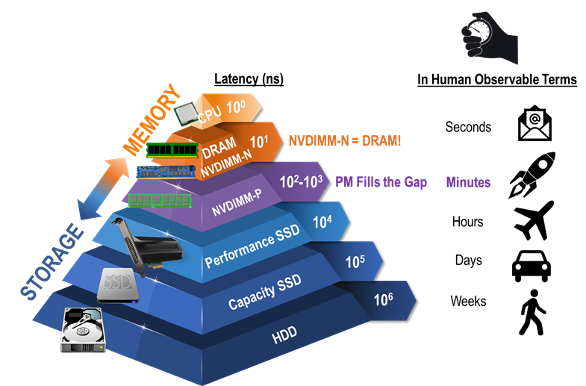
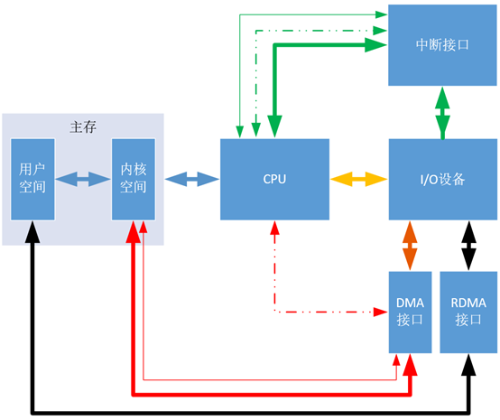
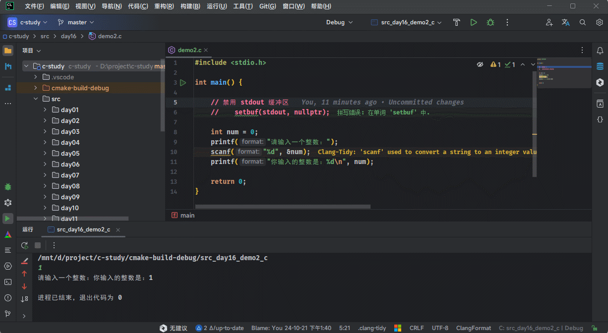
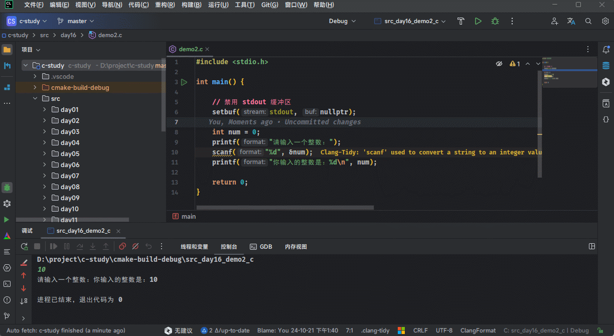

# 第一章：输入输出模型

## 1.1 回顾冯·诺依曼体系结构

* `冯·诺依曼`体系结构的理论要点如下：
  - ① **存储程序**：`程序指令`和`数据`都存储在计算机的内存中，这使得程序可以在运行时修改。
  - ② **二进制逻辑**：所有`数据`和`指令`都以`二进制`形式表示。
  - ③ **顺序执行**：指令按照它们在内存中的顺序执行，但可以有条件地改变执行顺序。
  - ④ **五大部件**：计算机由`运算器`、`控制器`、`存储器`、`输入设备`和`输出设备`组成。
  - ⑤ **指令结构**：指令由操作码和地址码组成，操作码指示要执行的操作，地址码指示操作数的位置。
  - ⑥ **中心化控制**：计算机的控制单元（CPU）负责解释和执行指令，控制数据流。


> [!NOTE]
>
> 上述的组件协同工作，构成了一个完整的计算机系统：
>
> - `运算器`和`控制器`通常被集成在一起，组成中央处理器（CPU），负责数据处理和指令执行。
> - `存储器`（内存）保存数据和程序，是计算机运作的基础。
> - `输入设备`和`输出设备`负责与外界的交互，确保用户能够输入信息并接收计算机的处理结果。
>
> 直到今天，虽然硬件的发展日新月异，但是现代计算机的硬件理论基础还是《冯·诺依曼体系结构》。

## 1.2 冯·诺依曼体系结构的瓶颈

* 计算机是有性能瓶颈的：如果 CPU 有每秒处理 1000 个服务请求的能力，各种总线的负载能力能达到 500 个， 但网卡只能接受 200个请求，而硬盘只能负担 150 个的话，那这台服务器得处理能力只能是 150 个请求/秒，有 85% 的处理器计算能力浪费了，在计算机系统当中，`硬盘`的读写速率已经成为影响系统性能进一步提高的瓶颈。



* 计算机的各个设备部件的延迟从高到低的排列，依次是机械硬盘（HDD）、固态硬盘（SSD）、内存、CPU 。


* 从上图中，我们可以知道，CPU 是最快的，一个时钟周期是 0.3 ns ，内存访问需要 120 ns ，固态硬盘访问需要 50-150 us，传统的硬盘访问需要 1-10 ms，而网络访问是最慢，需要 40 ms 以上。

> [!NOTE]
>
> 时间的单位换算如下：
>
> * ① 1 秒 = 1000 毫秒，即 1 s = 1000 ms。
> * ② 1 毫秒 = 1000 微妙，即 1 ms = 1000 us 。
> * ③ 1 微妙 = 1000 纳秒，即 1 us = 1000 ns。

* 如果按照上图，将计算机世界的时间和人类世界的时间进行对比，即：

```txt
如果 CPU 的时钟周期按照 1 秒计算，
那么，内存访问就需要 6 分钟；
那么，固态硬盘就需要 2-6 天；
那么，传统硬盘就需要 1-12 个月；
那么，网络访问就需要 4 年以上。
```

> [!NOTE]
>
> * ① 这就中国古典修仙小说中的“天上一天，地上一年”是多么的相似！！！
> * ② 对于 CPU 来说，这个世界真的是太慢了！！！

* 其实，中国古代中的文人，通常以`蜉蝣`来表示时间的短暂（和其他生物的寿命比），也是类似的道理，即：

```txt
鹤寿千岁，以极其游，蜉蝣朝生而暮死，尽其乐，盖其旦暮为期，远不过三日尔。
	                                        --- 出自 西汉淮南王刘安《淮南子》
```

```txt
寄蜉蝣于天地，渺沧海之一粟。 哀吾生之须臾，羡长江之无穷。 
挟飞仙以遨游，抱明月而长终。 知不可乎骤得，托遗响于悲风。
	                                        --- 出自 苏轼《赤壁赋》
```

> [!NOTE]
>
> * ① 从`蜉蝣`的角度来说，从早到晚就是一生；但是，从`人类`角度来说，从早到晚却仅仅只是一天。
> * ② 这和“天上一天，地上一年”是多么的相似，即：如果`蜉蝣`是`人类`的话，那`我们`就是`仙人`了。

* 存储器的层次结构（CPU 中也有存储器，即：寄存器、高速缓存 L1、L2 和 L3），如下所示：


> [!NOTE]
>
> 上图以层次化的方式，展示了价格信息，揭示了一个真理，即：鱼和熊掌不可兼得。
>
> - ① 存储器越往上速度越快，但是价格越来越贵， 越往下速度越慢，但是价格越来越便宜。
> - ② 正是由于计算机各个部件的速度不同，容量不同，价格不同，导致了计算机系统/编程中的各种问题以及相应的解决方案。

* 正是由于 CPU、内存以及 I/O 设备之间的速度差异，从而导致了计算机的性能瓶颈，即所谓的`“冯·诺依曼体系结构的瓶颈”`。


* 因为 CPU 的处理速度远远快于内存和 I/O 设备，导致在等待数据处理和传输的时候，CPU 大部分处于空闲状态，就是这种显著的速度差异就导致了计算机的性能瓶颈，限制了整个计算机系统的效率。

> [!NOTE]
>
> * ① 有的时候，难道不感觉奇怪吗？既然计算机系统的瓶颈在于 IO 设备，如：硬盘等。那么，我们拼命的提高 IO 设备的速度，不就可以了？为什么一直在追求 CPU 的速度（不停的追求 CPU 的芯片制程，如：14-32 nm，7 nm，2 nm，就是为了在 CPU 中集成更多的晶体管）？总感觉本末倒置？
> * ② 其实，不然，对于硬件的这种显著的速度差异，我们程序员虽然是无法解决的。但是，为了平衡这三者之间的速度鸿沟，我们可以通过引入`缓存`或`缓冲区`技术，来降低系统的开销。

* `CPU` 和`RAM（内存）`是有速度差异的，在 CPU 内部是通过 MMU（Memory Management Unit，内存管理单元） 部件中的 TLB（后备缓冲区）以及 L1、L2、L3 高速缓存，来平衡 CPU 和内存之间的速度差异。

> [!NOTE]
>
> TLB 和 L1、L2、L3 高速缓存的关系主要是配合，主要涉及以下的流程，如下所示：
>
> * ① 地址转换：
>   * 当 CPU 需要读取或写入一个地址的时候，首先通过`TLB`将虚拟地址转换为物理地址。
>   * `页表`存储了虚拟地址到物理地址的完整映射信息。
>   * 如果`TLB 命中`，可以快速获得物理地址；如果 `TLB 未命中`，MMU 会查阅 `页表` 来获得物理地址。
> * ② 数据和指令的获取：
>   * 获取物理地址后，CPU 会检查`L1、L2 或 L3 缓存`中是否存储了该物理地址对应的数据或指令。
>   * `如果缓存命中`，CPU 直接从缓存中获取数据或指令。
>   * `如果缓存未命中`，则会从主内存中读取该物理地址的数据或指令，并将其加载到缓存中，便于下次快速访问。


* `CPU` 和 `I/O 设备`（外部设备）是有速度差异的，是通过 DMA（Direct Memory Access，直接内存访问）部件来平衡速度差异的。

> [!NOTE]
>
> * ① 早期的 I/O 设备和内存的信息交换，都需要经过 CPU  的操作（最早使用的是`轮询方式`，或`中断方式`）。
> * ② 虽然`中断方式`相比`轮询方式`已经节省了大量的 CPU 资源。但是在处理大量的数据事，DMA 相比`中断方式`进一步解放了CPU 。
> * ③ DMA 就是Direct Memory Access，意思是 I/O 设备直接存储器访问，几乎不消耗 CPU 的资源。在 I/O 设备和主存传递数据的时候，CPU 可以处理其它事情。



> [!NOTE]
>
> * ① `黄线`代表的是`程序轮询方式`。
> * ② `绿线`代表是`中断方式`。
> * ③ `红线`代表是 `DMA 方式`。
>
> 可以看出 `DMA 方式`与`程序轮询方式`还有`中断方式`的区别是传输数据跳过了 CPU，直接和主存交流。

* `RAM（内存）`和 `I/O 设备`是有速度差异的，是通过`缓冲区`或`缓存`来平衡速度差异的。

> [!NOTE]
>
> * ① `缓冲区`是一种用于临时存储数据的内存区域，特别适用于在内存和 I/O 设备之间传输数据时平衡速度差异。
> * ② `缓存`可以减少内存和 I/O 设备之间的直接交互次数，通过把最近使用的数据保存在缓存中，进一步加快数据传输过程。

## 1.3 缓冲区

### 1.3.1 如果存在缓冲区，键盘输入的数据是怎么到达程序的？

* 当我们在键盘上输入数据并传递给程序时，通常会经历如下的几个步骤：
  * ① `键盘生成输入信号`：当我们在键盘上按下某个键的时候，键盘会将这个动作转换为对应的电信号，传递给键盘控制器。
  * ② `键盘控制器发送中断信号`：计算机的`键盘控制器`会检测到按键动作，向 CPU 发送中断请求。
  * ③ `CPU 执行中断处理程序`：CPU 暂停当前任务，进入中断处理状态，操作系统的中断处理程序接收并处理键盘输入。
  * ④ `操作系统将输入存入缓冲区`：键盘输入的数据被存入`内存缓冲区`，操作系统会将这些数据暂时存放在缓冲区中，等待程序从缓冲区中读取数据。
  * ⑤ `程序读取数据`：程序通过系统调用或库函数从缓冲区读取数据，并进行处理。


* 其对应的图示，如下所示：


> [!IMPORTANT]
>
> 其实，C 语言中的 `printf` 函数和 `scanf` 函数，其内部就使用了缓冲区。
>
> * ① 当我们使用 `printf` 函数输出数据的时候，数据并不会立即就写出到输出设备（如：屏幕等）。而是先将其放置到 `stdout 缓冲区`中，然后在满足条件的时候，再从缓冲区中刷新到输出设备。
> * ② 当我们使用 `scanf` 函数输入数据的时候，数据并不会立即就从输入设备中读取（如：键盘等）。而是先将其放置到 `stdin 缓冲区`中，然后在满足条件的时候，再从缓冲区中加载数据。

### 1.3.2 如果没有缓冲区，键盘输入的数据是怎么到达程序的？

* 当我们在键盘上输入数据并传递给程序时，通常会经历如下的几个步骤：
  * ① `键盘生成输入信号`：当我们在键盘上按下某个键的时候，键盘会将这个动作转换为对应的电信号，传递给键盘控制器。
  * ② `键盘控制器发送中断信号`：键盘控制器检测到按键动作，向 CPU 发送`中断请求`，通知操作系统有输入数据。
  * ③ `操作系统处理输入`：操作系统接收到`中断信号`后，立即获取键盘数据并处理。由于没有缓冲区，操作系统必须将数据立即传递给程序。
  * ④ `程序直接读取数据`：程序必须在键盘每次输入后立即读取数据，并且处理这个输入，不会有任何数据被暂存或积累。

* 其对应的图示，如下所示：


> [!NOTE]
>
> 如果没有缓冲区，键盘输入的数据将无法有效地被程序管理和处理，系统的工作效率会显著下降，具体影响体现在以下几个方面：
>
> * ① `程序与设备的频繁交互`：在没有缓冲区的情况下，程序需要直接与键盘设备进行交互。这意味着每次按键输入，操作系统都必须立即将数据传递给程序处理，这样会带来一些问题。
>   
>   ::: details 点我查看
>   
>   * **频繁的 I/O 操作**：每一次键盘输入都会触发一个 I/O 操作，将数据直接传输给程序。程序必须每次都立即响应输入设备，执行读操作，导致程序处理器频繁被中断。
>   * **实时响应要求**：程序需要时刻等待并响应输入，哪怕是输入非常小的数据（比如一个字符），程序都必须立即读取并处理。这对程序的设计提出了很高的实时性要求，可能会降低程序的运行效率。
>   
>   :::
> * ② `处理效率低下`：由于没有缓冲区，程序无法积累多个输入数据再进行批量处理。每一次输入必须立即处理，程序执行的效率会受到影响。
>
>   ::: details 点我查看
>
>   * **I/O 阻塞**：程序可能会因为等待输入设备的响应而阻塞。没有缓冲区的情况下，程序不能继续执行其他任务，必须等待每一次输入完成后才能继续执行其他操作。
>   * **浪费系统资源**：程序频繁地切换到处理 I/O 操作，导致处理器资源被大量占用。在处理较大数据量时，这种方式的效率极低，容易造成资源浪费。
>
>   :::
> * ③ `用户体验差`：从用户角度来看，程序对键盘输入的响应会显得非常僵硬，无法处理多个输入操作的积累。
>
>   ::: details 点我查看
>
>   * **输入延迟**：程序必须实时处理每个键盘输入，用户输入数据的速度一旦超过程序的处理能力，可能导致输入延迟或丢失输入。
>   * **无法处理复杂输入**：如果用户需要输入多个字符或进行复杂的输入操作（比如连续输入多个命令），程序可能难以一次性正确处理，因为它只能逐一处理每一个输入，而无法一次性获取多个输入进行批量处理。
>
>   :::

### 1.3.3 缓冲区的好处

* `减少了 I/O 操作的频率，降低了系统资源的消耗，提高了系统的性能，提升了用户的使用体验`。

### 1.3.4 缓冲区是如何提高 I/O 操作的频率？

* 对于 C 语言中的 `printf` 函数和 `scanf` 函数，其功能如下：
  * `printf` 函数：将程序中的数据输出到外部设备（如：显示器）中。
  * `scanf` 函数：从外部设备（如：键盘）中读取数据到程序中。

* 这些都是非常典型的 I/O 操作，并且 I/O 过程的效率也是很低的。除了硬件性能本身的差异外，I/O  操作的复杂性也是非常重要的因素，每次 I/O 操作都会带来一些固定的开销，如：
  * ① 每次 I/O 操作都需要设备初始化和响应等待。
  * ② 操作系统管理 I/O 请求，涉及中断处理和上下文切换，这些都消耗了大量时间。
  * ③ 应用从用户态切换到内核态的系统调用也会带来额外的时间开销。（I/O 操作普遍涉及系统调用）
  * ④ ...
* 如果每输入一个字符或每输出一个字符都需要进行一次完整的 I/O 操作，那么这些固定的开销会迅速积累，进而导致系统的性格显著下降。
* 硬件层面的效率低下，我们没有办法通过软件层面的优化去解决。但对于这些大量的固定开销，我们可以通过`缓冲区`来进行效率优化。

> [!IMPORTANT]
>
> * ① 缓冲区的主要目的是暂时存储数据，然后在适当的时机一次性进行大量的 I/O 操作。
> * ② 这样，多个小的 I/O 请求可以被组合成一个大  I/O 的请求，有效地分摊了固定开销，并显著提高了总体性能。

* 对于 `scanf` 函数而言，当用户通过键盘输入字符的时候，这些输入的字符首先被保存在 `stdin` 的缓冲区中，`当满足某个触发条件后`，才传递给程序处理，这样就减少了总的 I/O 次数，提高了效率。


* 对于 `printf` 函数而言，输出的内容首先会保存到 `stdout` 的缓冲区中，`当满足某个触发条件后`，这些内容会一次性输出并显示到屏幕，降低了与显示设备的交互频率。


> [!NOTE]
>
> * ① 如果你还不能理解，就可以将 I/O 操作，看做是搬家。对于搬家而言，需要搬运东西的总量是固定的，搬一趟的时间也是差不多的。我们当然希望：一次性搬的东西尽量多，搬运的次数尽量少，这样总耗时就少。
> * ② 不使用缓冲区，就类似每次搬家只能手提一个东西，需要频繁的往返。而使用缓冲区，就好比我们使用一个小推车，可以一次性的搬运多个东西，极大的提高了效率。

### 1.3.5 缓冲区的分类

* 从上述的内容中，我们可以明确到看到缓冲区有一个显著的特点：`当满足某个触发条件后，程序会开始对缓冲区的数据执行输入或输出操作`。而这种`满足某个条件，就触发数据传输`的行为，就称为`缓冲区的自动刷新`机制。
* 基于这种自动刷新的触发条件的不同，我们可以将缓冲区划分为以下三种类型：
  * ① `全缓冲（满缓冲）`：仅当缓冲区达到容量上限时，缓冲区才会自动刷新，并开始处理数据。否则，数据会持续积累在缓冲区中直到缓冲区满触发自动刷新。`文件操作`的输出缓冲区便是这种类型的经典例子。
  * ② `行缓冲`：缓冲区一旦遇到换行符，缓冲区就会自动刷新，所有数据都会被传输。`stdout` 缓冲区就是典型的行缓冲区。
  * ③ `无缓冲（不缓冲）`：在此模式下，数据不经过中间的缓冲步骤，每次的输入或输出操作都会直接执行。这种方法适用于需要快速、实时响应的场合。`stderr`（标准错误输出）就是这种方式，它经常被用来即时上报错误信息。

* 之前，我们经常会在代码中，会加入以下的代码，其实就是为了让行缓冲变为无缓冲，如下所示：

```c {6}
#include <stdio.h>

int main() {

    // 禁用 stdout 缓冲区
    setbuf(stdout, nullptr);

    int num = 0;
    printf("请输入一个整数：");
    scanf("%d", &num);
    printf("你输入的整数是：%d\n", num);

    return 0;
}
```

* 如果不加入上述的代码，将会这样显示：



* 但是，一旦我们加入了上述的代码，将会这样显示：



> [!NOTE]
>
> * ① setbuf 是 C 语言标准库中的一个函数，用于设置文件流的缓冲区。它允许程序员控制 I/O 操作的缓冲行为，从而影响文件流（如 `stdin`、`stdout` 或文件指针 `FILE *` 类型）的效率和顺序。
> * ② 其定义，如下所示：
>
> ```c
> /**
> * @param stream 缓冲区的文件流
> * @param buf 用户提供的缓冲区，如果为 NULL，就是禁用缓冲
> */
> void setbuf(FILE *stream, char *buf);
> ```
> * ③ 不同的编译器和开发环境可能会对输出缓冲进行特殊设置，尤其是在调试模式下，以便提供更好的调试体验，例如：微软的 MSVC 在 debug 模式下，即使没有换行符，printf 函数的输出通常也会立即显示在控制台上。这种行为是为了帮助程序员更有效地调试程序，即时看到他们的输出，而不需要等待缓冲区刷新条件。但是，遗憾的是，GCC 在 debug 模式中，并没有这么做！！！

> [!IMPORTANT]
>
> * ① 无论是哪种类型的缓冲区，当缓冲区满了时，都会触发自动刷新。
>
>   * 全缓冲区：唯一的自动刷新条件是缓冲区满。
>
>   * 行缓冲区：除了缓冲区满导致的自动刷新，还有遇到换行符的自动刷新机制。
>
> * ② 手动刷新：大多数缓冲区提供了手动刷新的机制，如：使用 `fflush` 函数来刷新 stdout 缓冲区，也可以使用 `setbuf` 函数来禁用缓冲区。
> * ③ `输出缓冲区中的数据需要刷新才能输出到目的地，但输入缓冲区通常不需要刷新，强制刷新输入缓冲区往往会引发未定义行为。`
> * ④ 当程序执行完毕（如：main 函数返回）时，缓冲区通常会自动刷新，除此之外，还有一些独特的机制也可以刷新缓冲区。但这些机制可能因不同的编译器或平台而异，不能作为常规手段。`强烈建议依赖手动或者常规自动刷新的机制来完成缓冲区的刷新。`


# 第二章：printf 函数

## 2.1 概述

* printf 函数的核心作用：将各种数据类型（int、float 等）的数据转换为字符，并输出到 `stdout` 缓冲区中。
* 语法：

```c
extern int printf (const char *format, ...);
```

> [!NOTE]
>
> * ① format 参数是`格式化字符串`，常见的格式占位符有 `%d`、`%f` 等。
> * ② printf 函数和 scanf 函数只需要大致了解一下用法，不比深究。
> * ③ 在实际开发中，如果我们使用 Qt 开发，或使用 C++ 作为服务器开发，会有更高级的输入输出功能，如：使用 C++ 的标准输出流 `std::cout` 或 `std::cin`，或者直接使用日志库（如：`spdlog`、`glog` 等）来处理日志和调试输出。

* printf 函数的语法规则，如下所示：


> [!NOTE]
>
> * ① 对于`format`参数中的`非格式化字符串`，即：普通字符，printf 函数会将其作为普通字符原封不动的进行显示，如：`我今年 岁`。
> * ② 对于`format`参数中的`格式化字符串`，即：以 `%`开头的字符，会和后面输出列表中的字符一一匹配，然后将匹配到的字符替换对应的格式化字符，如：`我今年%d岁`中的`%d`会被替换为`18` 。


* 示例：

```c
#include <stdio.h>

int main() {
    
    // 禁用 stdout 缓冲区
    setbuf(stdout, nullptr);

    // 声明变量并赋值
    int num = 18;

    // 使用输出语句，将变量 num 的值输出，其中 %d 表示输出的是整数
    printf("我今年%d岁\n", num);

    return 0;
}
```

## 2.2 格式占位符的转换说明

* 语法：

```c
%[标志][字段宽度][.精度][长度]说明符
```

> [!IMPORTANT]
>
> * ① `%` 是`格式占位符`的`开头`，是必不可少的，其余部分可以省略。
> * ② `说明符`是`格式占位符`的`结尾`，是必不可少的，其余部分可以省略。
>
> ::: details 点我查看 常见的说明符
>
> | 说明符  | 说明                                                         |
> | ---------- | ------------------------------------------------------------ |
> | `d` 或 `i` | 表示有符号的十进制整数。                                     |
> | `u`        | 表示无符号的十进制整数。                                     |
> | `o`        | 表示无符号的八进制整数。                                     |
> | `x`        | 表示无符号的十六进制整数，使用小写字母（例如：`a-f`）。      |
> | `X`        | 表示无符号的十六进制整数，使用大写字母（例如：`A-F`）。      |
> | `f`        | 浮点数（普通浮点数表示）                                     |
> | `e`        | 强制用科学计数法显示此浮点数，使用小写的“e”表示10的幂次。    |
> | `E`        | 强制用科学计数法显示此浮点数，使用大写的“E”表示10的幂次。    |
> | `g`        | 选择最合适的表示方式，浮点数或科学记数法。<br>当选择使用科学计数法显示此浮点数时，使用小写的“e”表示10的幂次。 |
> | `G`        | 选择最合适的表示方式，浮点数或科学记数法。<br/>当选择使用科学计数法显示此浮点数时，使用大写的“E”表示10的幂次。 |
> | `c`        | 字符                                                         |
> | `s`        | 字符串                                                       |
> | `p`        | 指针                                                         |
> 
> :::

> [!NOTE]
>
> * ① `[标志]`用于决定一些特殊的格式，如：
>   * `-`：左对齐输出。如果没有该标志，默认是右对齐输出。
>   * `+`：输出正负号。对于正数，会输出 `+`；对于负数，会输出 `-` 。
>
> * ② `[字段宽度]`用于指定输出的最小字符宽度，但不会导致截断数据：
>   * 如果输出的字符，宽度小于指定的宽度，那么输出的值将会按照指定的`[标志]`来进行填充。若标志位没有 0 ，则会填充空格。
>   * 如果输出的字符，宽度大于指定的宽度，那么 printf 函数并不会截断，而是完全输出所有字符。
> * ③ `[.精度]`定义打印的精度。
>   
>   ::: details 点我查看 整数和浮点数打印的精度
>   
>   * 对于整数，表示要输出的最小位数，若位数不足则左侧填充 0 。
>   * 对于浮点数，表示要在小数点后面打印的位数。
>     * 当有效数字不足时，会自行在后面补 0 。
>     * 当有效位数超出时，会截断保留指定的有效位数。这个过程一般会遵守 "四舍五入" 的原则。
>     * 但由于浮点数存储的固有精度问题，某些数值可能不能完美表示，导致结果中的数字稍有偏差。
>     * 需要注意的是，在不指定`[.精度]`的情况下，浮点数默认显示 6 位小数，多的部分舍弃，不够的话，会在后面补 0 。
>   
>   :::
> * ④ `[长度]`主要描述参数的数据类型或大小。
>   ::: details 点我查看 常见的长度修饰符
>
>   | 长度修饰符         | 说明                                                         |
>   | ------------------ | ------------------------------------------------------------ |
>   | `h`                | 与整数说明符一起使用，表示 short 类型。                      |
>   | `l (小写的 L)`     | 通常与整数或浮点数说明符一起使用，表示 long（对于整数）或 double（对于浮点数）。 |
>   | `ll (两个小写的L)` | 与整数说明符一起使用，表示 long long 类型的整数。            |
>   | `L (大写的L)`      | 与浮点数说明符一起使用，表示 long double 。                  |
>
>   :::
>


* 示例：

```c
#include <stdio.h>

int main() {

    // 禁用 stdout 缓冲区
    setbuf(stdout, nullptr);

    printf("|%4f|\n", 3.14159f);
    printf("|%10f|\n", 3.14159f);
    printf("|%.4f|\n", 3.14159f);
    printf("|%4.1f|\n", 3.14159f);
    printf("|%04.1f|\n", 3.14159f);
    printf("|% 4.1f|\n", 3.14159f);
    printf("|%-4.1f|\n", 3.14159f);
    printf("|%+4.1f|\n", 3.14159f);

    return 0;
}
```


* 示例：

```c
#include <stdio.h>

int main() {

    // 禁用 stdout 缓冲区
    setbuf(stdout, nullptr);

    int   i = 40;
    float x = 839.21f;

    printf("|%d|%5d|%-5d|%5.3d|\n", i, i, i, i);
    printf("|%f|%10f|%10.2f|%-10.2f|\n", x, x, x, x);

    return 0;
}
```

## 2.3 格式占位符中的特殊符号 %

* 在格式占位符中 `%`用于表示转换的开头。如果我们也希望打印一个 `%`，就可以使用 `%%` 来表示一个 `%` 。


* 示例：

```c {11}
#include <stdio.h>

int main() {

    // 禁用 stdout 缓冲区
    setbuf(stdout, nullptr);

    int progress = 50;

    // 下载进度: 50%
    printf("下载进度: %d%%\n", progress);

    return 0;
}
```

## 2.4 格式占位符中的特殊符号 *

* 如果我们希望变量在程序运行期间能够打印小数点后的位置以及打印结果的总宽度，就可以在格式占位符中通过 * 来代替。


* 示例：

```c {11}
#include <stdio.h>

int main() {

    // 禁用 stdout 缓冲区
    setbuf(stdout, nullptr);

    int width = 5;
    int point = 2;

    printf("|%*.*f|", width, point, 3.1415); // | 3.14|

    return 0;
}
```

## 2.5 格式占位符中的 %f 和 %lf

* 格式占位符 `%f` 是用来输出 `float` 类型的数据的，而 格式占位符 `%lf` 是用来输出 `double` 类型的数据的。

> [!IMPORTANT]
>
> * ① `%f` 和 `%lf` 是完全等价的。
> * ② 在 C99 之后的标准中，当使用 printf 函数打印浮点数的时候，不管是 float 还是 double 都会自动提升到 double 来进行处理。
> * ③ 仅限于 printf 函数，scanf 函数没有这样的特点，即：scanf 函数中的 `%f` 和 `%lf` 是不一样的。


* 示例：

```c {10-11}
#include <stdio.h>

int main() {

    // 禁用 stdout 缓冲区
    setbuf(stdout, nullptr);

    double num = 123.456;
    
    printf("使用%%f打印的结果是: %f\n", num);
    printf("使用%%lf打印的结果是: %lf\n", num);

    return 0;
}
```

## 2.6 printf 函数中的返回值

* 对于 printf 函数其实是有返回值的，如下所示：

```c
extern int printf (const char *format, ...);
```

> [!NOTE]
>
> * ① 如果输出成功，将返回函数实际输出的字符总数。并且当输出成功时，返回值是一个非负数。
> * ② 如果输出失败，返回值就是一个负数。
> * ③ 在实际开发中，printf 函数的返回值比较少被接受处理。


* 示例：

```c {8,11}
#include <stdio.h>

int main() {

    // 禁用 stdout 缓冲区
    setbuf(stdout, nullptr);

    int ret = printf("hello\n");
    printf("ret = %d\n", ret); // 正常输出了6个字符，所以返回值是6

    int ret2 = printf("");
    printf("ret2 = %d\n", ret2); // 正常输出了0个字符，所以返回值是0

    return 0;
}
```

## 2.7 行缓冲注意事项

* printf 函数将数据输出到 stdout 的行缓冲区，但要将这些数据真正展示到外部设备（如屏幕），则需依靠 stdout 的自动刷新机制。

> [!NOTE]
>
> 为了增加输出的实时性和可预测性，有如下的常见策略：
>
> * ① 输出字符串的末尾添加换行符 `"\n"` ，这样可以立即触发缓冲区的刷新。
> * ② 使用 setbuf 函数禁用 stdout 的行缓冲区。
> * ③ 使用 fflush 函数手动刷新 stdout 的行缓冲区。
> * ④ ...
>
> 本人选择的是第 ② 种方案；但是，如果你选择第 ① 种方案，那么应该在不影响程序逻辑的前提下。


* 示例：

```c
#include <stdio.h>

int main() {

    // 禁用 stdout 缓冲区
    setbuf(stdout, nullptr); // [!code highlight]

    int   chinese, math, english;
    float average;

    printf("请输入语文成绩：");
    scanf("%d", &chinese);

    printf("请输入数学成绩：");
    scanf("%d", &math);

    printf("请输入英语成绩：");
    scanf("%d", &english);

    average = (chinese + math + english) / 3.0;
    printf("平均成绩为：%.2f\n", average);

    return 0;
}
```


# 第三章：scanf 函数

## 3.1 概述

* scanf 函数的核心作用：从 `stdin 缓冲区`读取字符形式的数据，并将其转换为特定类型的数据。
* 语法：

```c
extern int scanf (const char *__restrict __format, ...) 
```

> [!NOTE]
>
> * ① scanf 函数和 printf 函数最大的不同就是，在参数列表中中的参数是变量的地址，即：将读取到的值存放在哪个地址。
> * ② 也可以认为，scanf 函数的格式是：`scanf(格式化字符串, &变量1, &变量2, ...);`，但是变量前面的 `&` 在某些情况下是可以省略的。
> * ③ 对于 scanf 函数中的格式化字符串，除了格式占位符之外，通常不需要普通字符。


* 示例：

```c
#include <stdio.h>

int main() {

    // 禁用 stdout 缓冲区
    setbuf(stdout, nullptr);

    int   chinese, math, english;
    float average;

    printf("请输入语文成绩：");
    scanf("%d", &chinese);

    printf("请输入数学成绩：");
    scanf("%d", &math);

    printf("请输入英语成绩：");
    scanf("%d", &english);

    average = (chinese + math + english) / 3.0;
    printf("平均成绩为：%.2f\n", average);

    return 0;
}
```

## 3.2 格式占位符的转换说明

* 语法：

```c
%[*][字段宽度][长度]说明符
```

> [!IMPORTANT]
>
> * ① `%` 是`格式占位符`的`开头`，是必不可少的，其余部分可以省略。
> * ② `说明符`是`格式占位符`的`结尾`，是必不可少的，其余部分可以省略。
>
> ::: details 点我查看 常见的说明符
>
> | 说明符    | 说明                                                         |
> | ------------ | ------------------------------------------------------------ |
> | `d`          | 表示有符号的十进制整数。                                     |
> | `i`          | `scanf` 的 i 会自动判断输入的整数的进制，支持八进制、十进制和十六进制。<br>`scanf` 中的 i 和 printf 中的 i 不一样。 |
> | `u`          | 表示无符号的十进制整数。                                     |
> | `o`          | 表示无符号的八进制整数。                                     |
> | `x`          | 表示无符号的十六进制整数，使用小写字母（例如：`a-f`）。      |
> | `X`          | 表示无符号的十六进制整数，使用大写字母（例如：`A-F`）。      |
> | `f`          | 浮点数（普通浮点数表示）                                     |
> | `e`          | 强制用科学计数法显示此浮点数，使用小写的“e”表示10的幂次。    |
> | `E`          | 强制用科学计数法显示此浮点数，使用大写的“E”表示10的幂次。    |
> | `g`          | 选择最合适的表示方式，浮点数或科学记数法。<br>当选择使用科学计数法显示此浮点数时，使用小写的“e”表示10的幂次。 |
> | `G`          | 选择最合适的表示方式，浮点数或科学记数法。<br/>当选择使用科学计数法显示此浮点数时，使用大写的“E”表示10的幂次。 |
> | `c`          | 字符                                                         |
> | `s`          | 字符串                                                       |
> | `p`          | 指针                                                         |
> | `%[字符集]`  | 告诉`scanf`只接受和存储来自指定字符集的字符。<br>例如：`%[abc]`将只读取 'a'、'b' 或 'c'字符，其他的字符将导致读取停止。 |
> | `%[^字符集]` | 这是扫描集的否定形式，告诉`scanf`接受和存储除了指定字符集之外的所有字符。<br>例如：`%[^abc]`将读取除了'a'、'b', 和 'c'之外的所有字符，直到遇到这三个字符中的任何一个为止。 |
> 
> :::


* 示例：

```c
#include <stdio.h>

int main() {

    // 禁用 stdout 缓冲区
    setbuf(stdout, nullptr);

    int   chinese, math, english;
    float average;

    printf("请输入语文成绩：");
    scanf("%d", &chinese);

    printf("请输入数学成绩：");
    scanf("%d", &math);

    printf("请输入英语成绩：");
    scanf("%d", &english);

    average = (chinese + math + english) / 3.0;
    printf("平均成绩为：%.2f\n", average);

    return 0;
}
```

## 3.3 scanf 函数的工作原理

* scanf 函数本质上是一个`模式匹配`函数，试图将 `stdin` 缓冲区中的`字符`和`格式占位符`进行匹配，其会从左到右依次匹配格式字符串中的每一项（格式占位符）：
  * 如果匹配成功，那么 scanf 函数会继续处理格式字符串的剩余部分。
  * 如果匹配失败，那么 scanf 函数将不再处理格式字符串的剩余部分，会立即返回。
* 除此之外，scanf 函数的转换说明符大都默认忽略前置的空白字符，这样的设计让输入对用户更好友好，比如：
  * `%d` 忽略前置的`空白字符` (空格符、水平和垂直制表符、换页符和换行符)，然后匹配十进制的有符号整数。
  * `%f` 忽略前置的`空白字符`(空格符、水平和垂直制表符、换页符和换行符)，，然后匹配浮点数。
  * ...

> [!NOTE]
>
> 在实际开发中，scanf 函数最常用的格式字符串是 `%d,%d` 或者 `%d %d`！！！


* 示例：

```c
#include <stdio.h>

int main() {

    // 禁用 stdout 缓冲区
    setbuf(stdout, nullptr);
    
    int num;

    printf("请输入一个整数：");
    scanf("%d", &num);

    int absNum;

    if (num < 0) {
        absNum = -num;
    } else {
        absNum = num;
    }

    printf("%d的绝对值是：%d", num, absNum);

    return 0;
}
```

## 3.4 录入字符数据的特殊性

* scanf 函数用 `%c` 格式占位符来读取单个字符时，并不会跳过空白字符，`%c` 会读取输入的下一个字符，无论它是什么，包括空白字符。

> [!IMPORTANT]
>
> 在录入字符时，尤其是一行录入多个数据且包含输入字符时，一定要在转换说明前面留出一个空格，以匹配可能的空格。


* 示例：

```c {12}
#include <stdio.h>

int main() {

    // 禁用 stdout 缓冲区
    setbuf(stdout, nullptr);

    char ch;
    int num;
    
    printf("请输入一个数字以及一个字符: ");
    scanf("%d %c", &num, &ch); // 注意 %c 前的空格
    
    printf("你输入的数字是: %d\n", num);
    printf("你输入的字符是: %c\n", ch);

    return 0;
}
```

## 3.5 scanf 函数的返回值

* 对于 scanf 函数其实是有返回值的，如下所示：

```c
extern int scanf (const char *__restrict __format, ...) 
```

> [!NOTE]
>
> * ① 只要成功匹配并读取了一个数据输入项，那么函数的返回值就会是一个`正数`。注意，函数返回正数不意味着所有输入都能匹配成功，只要匹配成功一个输入项，返回值就是一个正数。
> * ② 如果返回值是`0`，那说明 scanf 没有成功匹配任何数据输入项，这通常是因为数据输入项`完全不匹配`。
> * ③ 如果函数返回值是`负数`，说明 scanf 读到了 EOF（流末尾）或者发生了错误。在 Windows 系统终端里，键入 "Ctrl + Z" 表示输入 EOF，在类 Unix 平台中，这个按键则是 "Ctrl + D"，可以了解一下。


* 示例：

```c
#include <stdio.h>

int main() {

    // 禁用 stdout 缓冲区
    setbuf(stdout, nullptr);

    int  num1, num2;
    char ch;
    int  ret = scanf("%d %d %c", &num1, &num2, &ch);

    /*
        若键入的数据是 100 200 A，则正常匹配录入 3 个数据，ret 等于 3
        若键入的数据是 100 A 200，则正常匹配录入 1 个数据，ret 等于 1
        若键入的数据是 A 100 200，则正常匹配录入 0 个数据，ret 等于 0
    */
    printf("ret = %d\n", ret);

    return 0;
}
```


