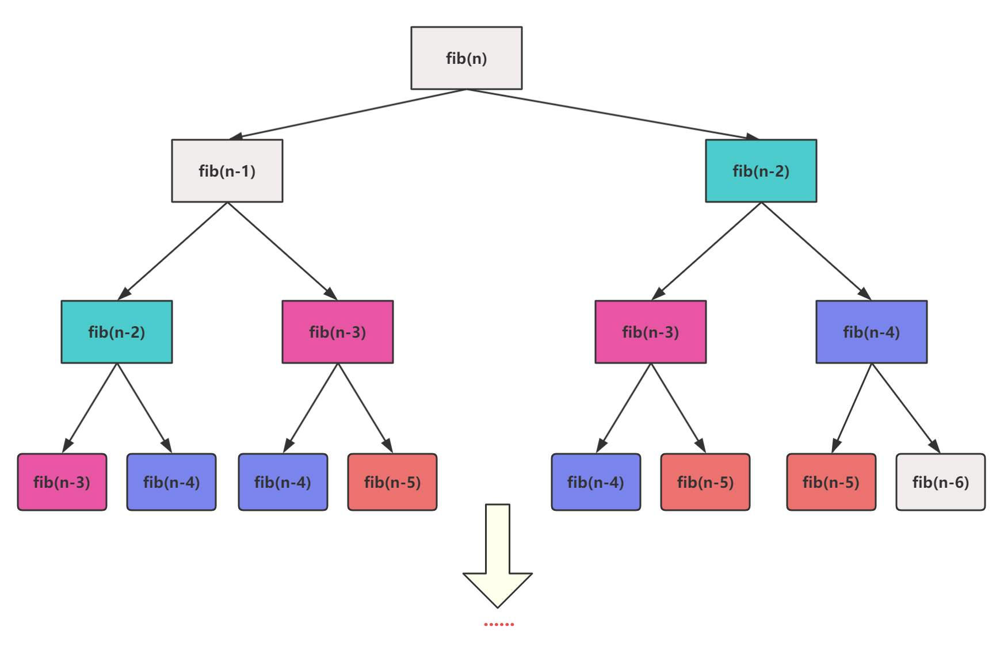
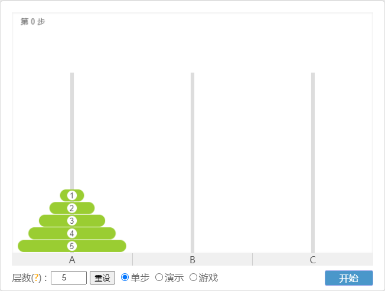
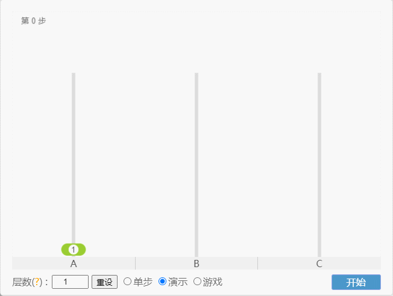
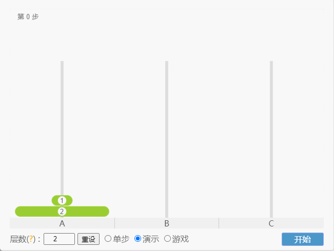
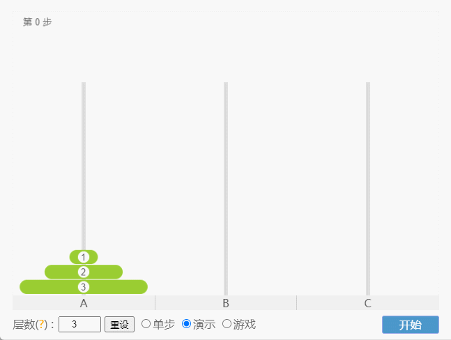
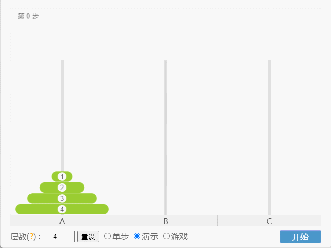
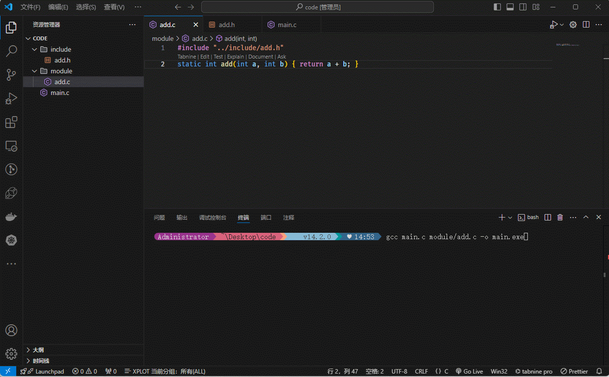
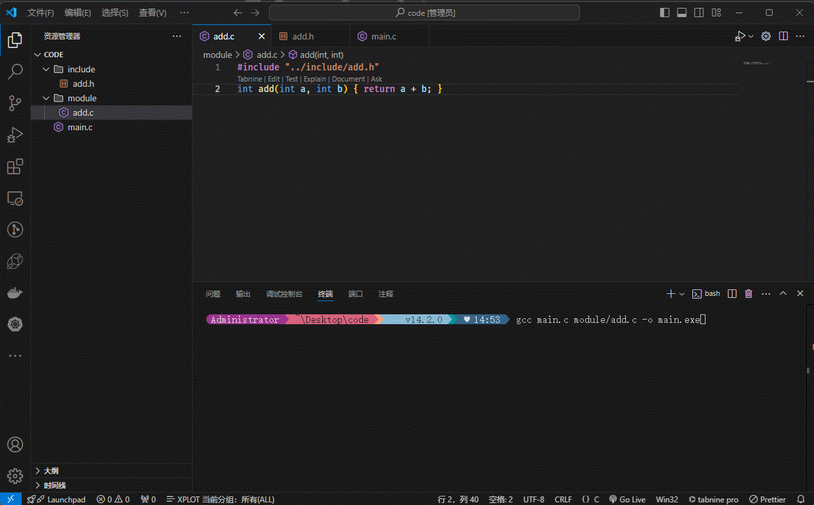

# 第一章：参数传递机制（⭐）

## 1.1 同一函数内变量的传递

* 对于基本数据类型的变量，就是将变量的值传递过去，即：值传递。
* 对于数组，就是将数组的地址传递过去，即：地址传递。
* 对于指针，就是将指针保存的地址传递过去，即：地址传递。

> [!IMPORTANT]
>
> 严格意义上讲：C 语言中，参数的传递机制只有“值传递”，只是传递的“值”内容不同，才表现出不同的效果！！！
>
> ::: details 点我查看
>
> * ① 对于`基本数据类型`的变量而言，传递的是变量的值的副本。
> * ② 对于`数组`而言，传递的是数组首元素的地址。虽然传递的是一个值（数组首元素的地址）；但是，本质上依然是传递了地址的“值”的副本。
> * ③ 对于`指针`而言，传递的是指针变量的值（指针变量中保存的内存地址）；但是，本质上依然是传递了地址的“值”的副本。
>
> :::


* 示例：

```c {10}
#include <stdio.h>

int main() {

    // 禁用 stdout 缓冲区
    setbuf(stdout, nullptr);

    int a = 10;
    // 对于基本数据类型的变量，就是将变量的值传递过去，即：值传递。
    int b = a;

    printf("a = %d\n", a); // a = 10
    printf("b = %d\n", b); // b = 10

    b = 20;

    printf("a = %d\n", a); // a = 10
    printf("b = %d\n", b); // b = 20

    return 0;
}
```


* 示例：

```c {11}
#include <stdio.h>

int main() {

    // 禁用 stdout 缓冲区
    setbuf(stdout, nullptr);

    int arr[] = {1, 2, 3, 4, 5};

    // 对于数组，就是将数组的地址传递过去，即：地址传递。
    int *p = arr;

    // 遍历数组
    for (int i = 0; i < sizeof(arr) / sizeof(int); ++i) {
        printf("arr[%d] = %d \n", i, arr[i]);
    }

    printf("\n");

    p[0] = 2;
    p[1] = 4;
    p[2] = 6;
    p[3] = 8;
    p[4] = 10;

    // 遍历数组
    for (int i = 0; i < sizeof(arr) / sizeof(int); ++i) {
        printf("arr[%d] = %d\n", i, arr[i]);
    }

    return 0;
}
```


* 示例：

```c {15}
#include <stdio.h>

int main() {

    // 禁用 stdout 缓冲区
    setbuf(stdout, nullptr);

    int num = 10;

    printf("num = %d\n", num); // num = 10

    int *p = &num;

    // 对于指针，就是将指针保存的地址传递过去，即：地址传递。
    int *q = p;

    *q = 20;

    printf("num = %d\n", num); // num = 20

    return 0;
}
```

## 1.2 形参和实参

* `形参`（formal parameter）：在定义函数时，函数名后面括号`()`内声明的`变量`称为`形式参数`，简称为`形参`。
* `实参`（actual parameter）：在调用函数时，函数名后面括号`()`内使用的`值`、`变量`或`表达式`称为`实际参数`，简称`实参`。

> [!IMPORTANT]
>
> ::: details 点我查看 函数中`形参`和`实参`的区别
>
> * ① `定义和调用的区别`：
>   * `形参`：在函数定义的时候，列在函数名后面括号`()`中的变量称为`形参`。形参仅仅是一种占位符，表示在调用该函数时应传递的数据的类型和顺序。
>   * `实参`：当我们去带哦用一个函数的时候，函数名后面括号`()`内使用的`值`、`变量`或`表达式`称为`实际参数`，简称`实参`。
> * ② `存储`：
>   * `形参`：它是局部变量的特殊形式，存储在栈区。与一般函数体内的局部变量一样，形参在函数调用时进行初始化。
>   * `实参`：实参可以是常量、变量或表达式，具体而言又可以是局部变量、全局变量等，存储位置不定。
> * ③ `生命周期`：
>   * `形参`：它的生命周期取决于函数调用期间。函数调用结束后，形参作为局部变量就会被销毁。
>   * `实参`：其生命周期取决于其类型。如果实参是局部变量，它的生命周期与所在的作用域`"{}"`有关；若为全局变量，则从程序启动到结束等等。
>
> :::


* 示例：

```c {9,22}
#include <stdio.h>

/**
 * 求和
 * @param x 形参
 * @param y 形参
 * @return
 */
int add(int x, int y) {
    return x + y;
}

int main() {

    // 禁用 stdout 缓冲区
    setbuf(stdout, nullptr);

    int a = 10;
    int b = 20;

    // a 和 b 是实参
    int result = add(a, b);

    printf("%d + %d = %d\n", a, b, result);

    return 0;
}
```

## 1.3 参数的传递机制

### 1.3.1 概述

* 函数中`形参`和`实参`的主要功能是`数据传递`，按照传递的数据是`值`还是`地址`，分为`值传递`和`地址传递`两种。

> [!IMPORTANT]
>
> 严格意义上讲：C 语言中，参数的传递机制只有“值传递”，只是传递的“值”内容不同，才表现出不同的效果！！！
>
> ::: details 点我查看
>
> * ① 对于`基本数据类型`的变量而言，传递的是变量的值的副本。
> * ② 对于`数组`而言，传递的是数组首元素的地址。虽然传递的是一个值（数组首元素的地址）；但是，本质上依然是传递了地址的“值”的副本。
> * ③ 对于`指针`而言，传递的是指针变量的值（指针变量中保存的内存地址）；但是，本质上依然是传递了地址的“值”的副本。
>
> :::

### 1.3.2 参数的传递机制 1：值传递

* `值传递`：就是把主调函数的`实参值`复制给被调用函数的`形参` ，使形参获得初始值。

> [!NOTE]
>
> * ① 如果在函数内对`形参值`的修改，不会影响`实参值`！！！
> * ② 值传递，是`单向传递` ，只能把实参的值传递给形参，而不能把形参的值再传回给实参。
> * ③ 默认`值传递`的类型是：`基本数据类型 (整型类型、浮点类型，字符类 型)`、`结构体`、`共用体`、`枚举类型`。


* 示例：

```c {3,17}
#include <stdio.h>

void increment(int a) {
    a++;
    printf("increment 中 a = %d\n", a); // increment 中 a = 11
}

int main() {

    // 禁用 stdout 缓冲区
    setbuf(stdout, nullptr);

    int i = 10;

    printf("main 中 i = %d\n", i); // main 中 i = 10

    increment(i);

    printf("main 中 i = %d\n", i); // main 中 i = 10

    return 0;
}
```


* 示例：

```c {8,28}
#include <stdio.h>

/**
 * 交换两个变量的值
 * @param x
 * @param y
 */
void swap(int x, int y) {
    int temp = x;
    x        = y;
    y        = temp;

    // swap 函数：x=20，y=10
    printf("swap 函数：x=%d，y=%d\n", x, y);
}

int main() {

    // 禁用 stdout 缓冲区
    setbuf(stdout, nullptr);

    int a = 10;
    int b = 20;

    // main 函数：a = 10，b = 20
    printf("main 函数：a = %d，b = %d\n", a, b);

    swap(a, b);

    // main 函数：a = 10，b = 20
    printf("main 函数：a = %d，b = %d\n", a, b);

    return 0;
}
```

### 1.3.3 参数的传递机制 2：地址传递

#### 1.3.3.1 概述

* `地址传递`：就是把`实参地址常量`进行`复制`，传送给`形参`，使形参获得初始值。

> [!NOTE]
>
> * ① 默认`地址传递`的类型是：`指针`、`数组`。实参将地址传递给形参，二者地址值相同。
> * ② 当`指针`作为函数的形参时，实参传递给形参的是地址， 在函数中通过形参保存的地址访问实参，进而在函数中通过地址对实参的修改影响到实参的值。这也称为`双向传递` 。
> * ③ 当传递`数组首元素地址`时，即把实参数组的起始地址传递给形参。这样形参和实参数组就占用了共同的存储空间。在被调函数中，如果通过形参修改了数组元素值，调用函数后实参数组元素值也发生相应变化。

#### 1.3.3.2 简单变量指针作为形参

* 当函数的形参类型是指针类型时，使用该函数时，需要传递指针（内存地址），或者数组给该形参。函数内以指针的方式操作变量(`*指针`)。


* 示例：

```c {3,17}
#include <stdio.h>

void increment(int *a) {
    (*a)++;
    printf("increment 中 a = %d\n", *a); // increment 中 a = 11
}

int main() {

    // 禁用 stdout 缓冲区
    setbuf(stdout, nullptr);

    int i = 10;

    printf("main 中 i = %d\n", i); // main 中 i = 10

    increment(&i);

    printf("main 中 i = %d\n", i); // main 中 i = 11

    return 0;
}
```


* 示例：

```c {8,28}
#include <stdio.h>

/**
 * 交换两个变量的值
 * @param x
 * @param y
 */
void swap(int *x, int *y) {
    int temp = *x;
    *x       = *y;
    *y       = temp;

    // swap 函数：x=20，y=10
    printf("swap 函数：x=%d，y=%d\n", *x, *y);
}

int main() {

    // 禁用 stdout 缓冲区
    setbuf(stdout, nullptr);

    int a = 10;
    int b = 20;

    // main 函数：a = 10，b = 20
    printf("main 函数：a = %d，b = %d\n", a, b);

    swap(&a, &b);

    // main 函数：a = 20，b = 10
    printf("main 函数：a = %d，b = %d\n", a, b);

    return 0;
}
```

#### 1.3.3.3 数组作为形参

* 当数组名作为函数的参数的时候，会退化为指针。


* 示例：

```c {8,28}
#include <stdio.h>

/**
 * 将数组中的元素 * 2
 * @param arr
 * @param len
 */
void setValue(int arr[], int len) {
    for (int i = 0; i < len; ++i) {
        arr[i] = i * 2;
    }
}

int main() {

    // 禁用 stdout 缓冲区
    setbuf(stdout, nullptr);

    int arr[] = {1, 2, 3, 4, 5};

    // 遍历数组
    for (int i = 0; i < 5; i++) {
        printf("arr[%d]=%d\n", i, arr[i]);
    }

    printf("\n");

    setValue(arr, sizeof(arr) / sizeof(int));

    // 遍历数组
    for (int i = 0; i < 5; i++) {
        printf("arr[%d]=%d\n", i, arr[i]);
    }

    return 0;
}
```


* 示例：

```c {8,30}
#include <stdio.h>

/**
 * 数组元素的反转
 * @param arr
 * @param len
 */
void reverse(int arr[], int len) {
    for (int left = 0, right = len - 1; left < right; ++left, --right) {
        int temp   = arr[left];
        arr[left]  = arr[right];
        arr[right] = temp;
    }
}

int main() {

    // 禁用 stdout 缓冲区
    setbuf(stdout, nullptr);

    int arr[] = {1, 2, 3, 4, 5};

    // 遍历数组
    for (int i = 0; i < 5; i++) {
        printf("arr[%d]=%d\n", i, arr[i]);
    }

    printf("\n");

    reverse(arr, sizeof(arr) / sizeof(int));

    // 遍历数组
    for (int i = 0; i < 5; i++) {
        printf("arr[%d]=%d\n", i, arr[i]);
    }

    return 0;
}
```

#### 1.3.3.4 字符串作为形参

* 字符串本质上就是字符数组，而字符数组作为函数的参数的时候，会退化为指针。


* 示例：

```c {8,26}
#include <stdio.h>

/**
 * 统计字符串中数字的个数
 * @param p
 * @return
 */
int digitalCount(char *p) {
    int count = 0;
    while (*p != '\0') {
        if (*p >= '0' && *p <= '9') {
            count++;
        }
        p++;
    }
    return count;
}

int main() {

    // 禁用 stdout 缓冲区
    setbuf(stdout, nullptr);

    char str[] = "a12bc43hec22b68o";

    int count = digitalCount(str);

    printf("%s 中数字的个数是 %d\n", str, count);

    return 0;
}
```

#### 1.3.3.5 字符串指针数组作为形参

* 字符串指针数组作为函数的参数的时候，会退化为指针。


* 示例：

```c {9,46}
#include <stdio.h>
#include <string.h>

/**
 * 对字符串进行排序
 * @param str
 * @param len
 */
void stringSort(char *str[7], int len) {
    for (int i = 0; i < len - 1; ++i) {
        for (int j = 0; j < len - 1 - i; ++j) {
            if (strcmp(str[j], str[j + 1]) > 0) {
                char *temp = str[j];
                str[j]     = str[j + 1];
                str[j + 1] = temp;
            }
        }
    }
}

int main() {

    // 禁用 stdout 缓冲区
    setbuf(stdout, nullptr);

    // 字符串指针数组
    char *days[] = {
        "Sunday",
        "Monday",
        "Tuesday",
        "Wednesday",
        "Thursday",
        "Friday",
        "Saturday"};

    // 数组的长度
    int len = sizeof(days) / sizeof(days[0]);

    // 遍历字符串指针数组
    for (int i = 0; i < len; ++i) {
        printf("%s\n", days[i]);
    }

    printf("\n");

    stringSort(days, sizeof(days) / sizeof(days[0]));

    // 遍历字符串指针数组
    for (int i = 0; i < len; ++i) {
        printf("%s\n", days[i]);
    }

    return 0;
}
```

## 1.4 值传递的优缺点

* C 语言仅有`值传递`的这种设计具有以下优点：
  * ① 安全：由于传递的是实参的副本，所以原始数据不会被修改。这意味着函数对参数的操作不会影响到外部的变量，避免了非预期的副作用，保护了原始数据。
  * ② 简单直观易懂统一：相比较于 C++ 多种传值方式并存的设计理念，C 语言传值方式单一，这体现了 C 语言简洁统一的设计理念。
  * ③ ...
* C 语言仅有`值传递`的这种设计具有以下缺点：
  * ① 不够灵活，功能弱小。
  * ② 一些大型数据（结构体变量）作为实参时，如果仍然传递拷贝，既占用大量空间，效率也很差。
  * ③ ...

> [!IMPORTANT]
>
> * ① 对于数组，在 C 语言中，在进行函数参数传递的时候，数组名会自动退还为指针，就是防止进行大量数据的拷贝。
> * ② 但是，遗憾的是，在 C 语言中，对于结构体变量和共用体变量，在进行函数参数传递的时候，依然是值传递，这就导致大规模数据的拷贝，既占用大量空间，效率也很差。
> * ③ 对于结构体和共用体，在进行函数参数传递的时候，必须使用`结构体指针`和`共用体指针`来传递，以减少大规模数据的拷贝，降低内存空间的占用，提高系统的效率。

## 1.5 应用示例

* 需求：定义函数，求一维数组元素的最大值。

> [!NOTE]
>
> * ① 函数的原型是：`int pMax(int *p,int len);` 
> * ② 函数的功能：在长度为 len ，由 p 指向的一维数组中求元素的最大值。


* 示例：

```c {9,20,28}
#include <stdio.h>

/**
 * 求一维数组元素的最大值
 * @param p
 * @param len
 * @return
 */
int pMax(int *p, int len);

int main() {

    // 禁用 stdout 缓冲区
    setbuf(stdout, nullptr);
	
    // 定义一维数组
    int arr[] = {1, 2, 3, 43, 5, 6, 7};
	
    // 获取一维数组中元素的最大值
    int max = pMax(arr, sizeof(arr) / sizeof(int));

    // arr 数组元素的最大值为 43
    printf("arr 数组元素的最大值为 %d\n", max);

    return 0;
}

int pMax(int *p, int len) {
    int max = p[0];
    for (int i = 0; i < len; ++i) {
        if (max < p[i]) {
            max = p[i];
        }
    }
    return max;
}
```

## 1.6 应用示例

* 需求：有一个 `3 × 4` 的二维数组，求数组中所有元素中的最大值。

> [!TIP]
>
> ::: details 点我查看 为什么建议使用`可变长数组`的形式作为参数？
>
> ```c
> /**
> * 不使用变长数组(VLA)作为参数，必须携带列数，且列数必须是数字！！！
> * n ：第一维的长度
> * 4 ：是列数
> */
> int pMax(int array[][4], int n) {
>     ...
> } 
> ```
>
> ```c
> /**
> * 使用变长数组(VLA)作为参数，更加通用！！！
> * 二维数组中的行和列可以根据实参动态开辟。
> */
> int pMax(int rows, int cols, int arr[rows][cols]) {
>     ...
> }
> ```
> :::


* 示例：

```c {10,31}
#include <stdio.h>

/**
 * 使用变长数组(VLA) 动态接收列数
 * @param rows 行
 * @param cols 列
 * @param arr 数组名
 * @return 
 */
int pMax(int rows, int cols, int arr[rows][cols]) {
    int max = arr[0][0]; 
    for (int i = 0; i < rows; ++i) {
        for (int j = 0; j < cols; ++j) {
            if (arr[i][j] > max) {
                max = arr[i][j];
            }
        }
    }
    return max;
}

int main() {
    // 定义二维数组
    int arr[3][4] = {{1, 2, 3, 4}, {5, 6, 7, 8}, {9, 10, 11, 12}};

    // 获取数组的行和列
    int rows = sizeof(arr) / sizeof(arr[0]);
    int cols = sizeof(arr[0]) / sizeof(arr[0][0]);

    // 获取二维数组中元素的最大值
    int max = pMax(rows, cols, arr);

    // 打印最大值
    printf("max = %d\n", max);

    return 0;
}
```


# 第二章：递归函数（⭐）

## 2.1 概述

* `递归`在生活中的举例：

```txt
从前有座山,山上有座庙,庙里有个老和尚,老和尚在给小和尚讲故事,讲的啥?
     从前有座山,山上有座庙,庙里有个老和尚,老和尚在给小和尚讲故事,讲的啥?
         从前有座山,山上有座庙,庙里有个老和尚,老和尚在给小和尚讲故事,讲的啥?
             从前有座山,山上有座庙,庙里有个老和尚,老和尚在给小和尚讲故事,讲的啥?...
   ...
老和尚没了,庙塌了,小和尚还俗结婚了。
```

* `递归函数`调用：函数自己调用自己的现象就称为`递归`。

> [!NOTE]
>
> ::: details 点我查看 如何理解`递归`？
>
> 可以将`递归`，拆分为`递`和`归`来理解（其实，就是数据结构和算法中的`分治法`：`分`是`分解问题`的意思，`治`是`解决和合并`的意思）：
>
> * ① `递归`中的`递`就是`递推`或`分解`的意思，即：将一个较大规模的问题逐步分解成较小的、更容易处理的子问题。
> * ② `递归`中的`归`就是`返回`或`回顾`的意思，即：当解决了这些子问题后，会从最底层开始，逐步合并或组合这些子问题的答案，直到得出最初问题的答案。
>
> :::

## 2.2 递归的分类及其三要素

* `递归`可以分为`直接递归`和`间接递归`。

> [!NOTE]
>
> * ① 直接递归：函数自身调用自己。
>
> ::: details 点我查看 直接递归
>
> ```c
> int func(int a){
>  int b,c;
>  ...
>  int c = func(b);
>  ...
> }
> ```
>
> :::
>
> * ② 间接递归：可以理解为 `A()` 函数调用 `B()` 函数，`B()` 函数调用 `C()` 函 数，`C()` 函数调用 `A()` 函数。
>
> ::: details 点我查看 间接递归
>
> ```c
> void A(){
> B();
> }
> 
> void B(){
> C();
> }
> 
> void C(){
> A();
> }
> ```
>
> :::


* 要合理的使用`递归`解决实际问题，需要`注意`递归的`三要素`。


> [!CAUTION]
>
> ::: details 点我查看 递归的三要素
>
> * ① `递归体`（体现`递`的过程）：
>   * 函数内部递归调用自身的部分。
>   * 递归体式递归思维的核心：它表示如何将一个大规模的问题`递推`为较小的、相似的子问题。这一分解过程持续的缩小问题的规模，以便更加方便和容易的处理问题。
> * ② `递归的出口`（体现`归`的过程）：
>   * 当子问题已经足够小或者满足某种条件的时候，我们就不再继续分解，而是开始返回答案。其中，这些条件或某种条件就是递归的出口。
>   * 明确的递归出口是至关重要的。如果没有明确的出口，递归将可能无限进行（类似于死循环），直到耗尽资源并导致栈溢出。通过递归的出口，我们实现从`递`到`归`的转换，并开始逐步合并或组合子问题的答案。
>
> * ③ `递归的深度`：
>   * 每次递归调用都会加深调用的层次，这可以被看作是递归中`递`的深度。
>   * 控制递归深度是至关重要的。因为一个过深的递归不仅会增加计算的复杂性，还可能会导致栈溢出。合理的深度能够确保我们在`递`的过程中不会过分深入，同时在`归`的过程中能够有效的返回和组合答案。
>
> :::

## 2.3 应用示例

* 需求：计算 1 - n 的和。


* 示例：不使用递归函数

```c
#include <stdio.h>

/**
 * 求 1 - n 的和
 * @param n
 * @return 和
 */
int sum(int n) {
    int total = 0;
    for (int i = 1; i <= n; ++i) {
        total += i;
    }
    return total;
}

int main() {

    int n = 5;

    printf("sum(%d) = %d\n", n, sum(n)); // sum(5) = 15

    return 0;
}
```


* 示例：使用递归函数

```c
#include <stdio.h>

/**
 * 求 1 - n 的和
 * @param n
 * @return 和
 */
int sum(int n) { // n 就是递归的深度
    // 当 n == 1 的时候，返回 1
    if (n == 1) { // 递归出口
        return 1;
    }
    // 递归情况：将 n 和 n - 1 的和相加
    return n + sum(n - 1);  // 递归体
}

int main() {

    int n = 5;

    printf("sum(%d) = %d\n", n, sum(n)); // sum(5) = 15

    return 0;
}
```

## 2.4 递归调用过程

* 以上面的递归函数为例，其在内存中是这样的，如下所示：


## 2.5 应用示例

* 需求：使用递归函数获取阶乘 `n!`  的结果。

> [!NOTE]
>
> * ① 当 n = 0 或 1 的时候，n! 的结果是 1 。
> * ② 当 n > 1 的时候，n! = n × (n-1)! 。


* 示例：

```c
#include <stdio.h>

/**
 * 递归函数，计算 n 的阶乘
 * @param n
 * @return 阶乘
 */
int factorial(int n) {
    // 当 n == 0 或 1 的时候，返回 1
    if (n == 0 || n == 1) {
        return 1;
    }
    // 递归调用
    // n * (n - 1) 的阶乘
    return n * factorial(n - 1);
}

int main() {

    int n = 5;

    printf("%d 的阶乘是 %d\n", n, factorial(n)); // 5 的阶乘是 120

    return 0;
}
```

## 2.6 应用示例

* 需求：计算斐波那契数列（Fibonacci）的第 n 个值。

> [!NOTE]
>
> * ① 斐波那契数列满足的规则是：`1,1,2,3,5,8,13,21,34,55,....`，即：前两个数都是 1 ，从第三个数开始，每个数等于前两个数之和。
> * ② 假设 f(n) 代表斐波那契数列的第 n 个值，那么 f(n) 满足： f(n) = f(n-2) + f(n-1); 其中，n >= 3。


* 示例：

```c
#include <stdio.h>

/**
 * 递归函数，计算第 n 个斐波那契数
 * @param n
 * @return 第 n 个斐波那契数
 */
int fib(int n) {
    if (n == 1 || n == 2) {
        return 1;
    }
    return fib(n - 1) + fib(n - 2);
}

int main() {

    int n = 1;
    printf("第 %d 个斐波那契数是 %d\n", n, fib(n)); // 第 1 个斐波那契数是 1
    n = 2;
    printf("第 %d 个斐波那契数是 %d\n", n, fib(n)); // 第 2 个斐波那契数是 1
    n = 3;
    printf("第 %d 个斐波那契数是 %d\n", n, fib(n)); // 第 3 个斐波那契数是 2
    n = 4;
    printf("第 %d 个斐波那契数是 %d\n", n, fib(n)); // 第 4 个斐波那契数是 3
    n = 5;
    printf("第 %d 个斐波那契数是 %d\n", n, fib(n)); // 第 5 个斐波那契数是 5
    n = 6;
    printf("第 %d 个斐波那契数是 %d\n", n, fib(n)); // 第 6 个斐波那契数是 8

    return 0;
}
```

## 2.7 应用示例

* 需求：有 5 个学生坐在一起，问第 5 个学生多少岁，他说比第 4 个学生大 2 岁。问第 4 个学生岁数，他说比第 3 个学生大 2 岁。问第 3 个学生，又说比第 2 个学生大 2 岁。问第 2 个学生，说比第 1 个学生大 2 岁。最后问第 1 个学生，他说是 10 岁。请问第 5 个学生多大？

> [!NOTE]
>
> * ① 当 n = 1 的时候，age(n) = 10。
> * ② 当 n > 1 的时候，age(n) = age(n-1) + 2。


* 示例：

```c
#include <stdio.h>

/**
 * 定义递归函数，获取第 n 个学生的年龄
 * @param n
 * @return
 */
int age(int n) {
    if (n == 1) {
        return 10;
    } else {
        return age(n - 1) + 2;
    }
}

int main() {

    int n = 5;

    printf("第 %d 个学生的年龄是 %d\n", n, age(n)); // 第 5 个学生的年龄是 18

    return 0;
}

```

## 2.8 应用示例

* 需求：假如有 10 阶楼梯，小朋友每次只能向上走 1 阶或者 2 阶，请问对于 n 阶台阶 一共有多少种不同的走法呢？

> [!NOTE]
>
> * 阶数和走法的关系，如下所示：
>   * 阶数：1 2 3 4 。
>   * 走法：1 2 3 5。
>
> * 公式是：fun(n) = fun(n - 1) + fun(n - 2) 。


* 示例：

```c
#include <stdio.h>

/**
 * 定义递归函数，获取第 n 阶台阶的不同的走法
 * @param n
 * @return
 */
int moves(int n) {
    if (n == 1) {
        return 1;
    }

    if (n == 2) {
        return 2;
    }

    return moves(n - 1) + moves(n - 2);
}

int main() {

    int n = 4;

    // 第 4 阶台阶的走法有 5 种
    printf("第 %d 阶台阶的走法有 %d 种\n", n, moves(n)); 

    return 0;
}
```

## 2.9 递归函数的致命缺陷

### 2.9.1 递归函数的空间开销

* 在程序占用的整个内存中，有一块内存区域叫做栈（Stack），它是专门用来给函数分配内存的，每次调用函数，都会将相关数据压入栈中，包括：局部变量、局部数组、形参、寄存器、冗余数据等。
* 栈是针对线程来说的，每个线程都拥有一个栈，如果一个程序包含了多个线程，那么它就拥有多个栈。

> [!NOTE]
>
> 目前我们编写的程序都是单线程的，所以不必考虑多线程的情况。

* 对每个线程来说，栈能使用的内存是有限的，一般是 1M~8M，这在编译时就已经决定了，程序运行期间不能再改变。如果程序使用的栈内存超出最大值，就会发生栈溢出（Stack Overflow）错误。

> [!NOTE]
>
> * ① 栈内存的大小和编译器有关，编译器会为栈内存指定一个最大值，在 Linux GCC 下，默认是 8M。
> * ② 我们也可以通过参数来修改栈内存的大小。

* 发生函数调用时会将相关数据压入栈中，函数调用结束会释放这一部分内存，对于一般的函数来说，这不会有任何问题，但是对于递归函数，这会导致严重的问题！！！

> [!NOTE]
>
> * ① 递归函数内部嵌套了对自身的调用，除非等到最内层的函数调用结束，否则外层的所有函数都不会调用结束。通俗地讲，外层函数被卡住了，它要等待所有的内层函数调用完成后，它自己才能调用完成。
> * ② 每一层的递归调用都会在栈上分配一块内存，有多少层递归调用就分配多少块相似的内存，所有内存加起来的总和是相当恐怖的，很容易超过栈内存的大小限制，这个时候就会导致程序崩溃。


* 示例：演示由于栈溢出而导致程序崩溃

```c
#include <stdio.h>

long sum(int n) {
    // 为了增加每次函数调用的内存，额外增加了一个无用的数组，它占用 1KB 的内存
    int arr[250];

    if (n <= 1) {
        return n;
    } else {
        return  n + sum(n-1);
    }
}

int main() {
    printf("从1加到1000的值为 %ld\n", sum(1000));
    return 0;
}
```

### 2.9.2 递归函数的时间开销

* 每次调用函数都会在栈上分配内存，函数调用结束后再释放这一部分内存，内存的分配和释放都是需要时间的。
* 每次调用函数还会多次修改寄存器的值，函数调用结束后还需要找到上层函数的位置再继续执行，这也是需要时间的。

> [!NOTE]
>
> * ① 使用递归函数计算斐波那契数，会存在大量的重复计算。
>
> ::: details 点我查看
>
> 
>
> :::
>
> * ② 该算法的时间复杂度是 `O(2ⁿ)`，随着 n 的增加，所需时间将急剧增加，导致算法非常低效。


* 示例：

```c
#include <stdio.h>
#include <time.h>

// 递归计算斐波那契数
long fib(int n) {
    if (n <= 2) {
        return 1;
    } else {
        return fib(n - 1) + fib(n - 2);
    }
}

int main() {
    // 禁用 stdout 缓冲区
    setbuf(stdout, nullptr);

    int a;
    clock_t time_start, time_end;

    printf("请输入正整数: ");
    scanf("%d", &a);
    time_start = clock();
    // Fib(50) = 12586269025
    printf("Fib(%d) = %ld\n", a, fib(a));
    time_end = clock();
    // 时间: 45.122685s
    printf("时间: %lfs\n", (double)(time_end - time_start) / CLOCKS_PER_SEC);

    return 0;
}
```

### 2.9.3 使用迭代来代替递归函数

* ① 虽然使用递归函数大大简化了算法的编写，但是递归调用会占用大量的系统堆栈，内存耗用多，在递归调用层次多时速度要比循环慢的多，所以在使用递归时要慎重。
* ② 在要求高性能的情况下尽量避免使用递归，递归调用既花时间又耗内存。
* ③ 可以考虑使用`循环迭代`来代替递归调用（与递归函数相比，迭代不但没有额外的内存开销，也没有额外的时间开销）。

> [!NOTE]
>
> 使用`循环迭代`(`O(n)`)计算`斐波那契数列`的效率，比使用`递归调用`(`O(2ⁿ)`)计算`斐波那契数列`要高很多。


* 示例：

```c
#include <stdio.h>

/**
 * 使用循环来计算斐波那契数列
 * @param n
 * @return
 */
int fib(int n) {

    // 出口条件
    if (n == 1 || n == 2) {
        return 1;
    }

    // 初识条件 a ，对应的是 fib(1)
    int a = 1;
    // 初识条件 b ，对应的是 fib(2)
    int b = 1;
    for (int i = 3; i <= n; ++i) { // 从 3 开始，因为 1 和 2 已经被计算过了
        // 计算当前斐波那契数，即：fib(n) = fib(n-1) + fib(n-2)
        // a 表示前两个斐波那契数较小的，即：fib(n-2)
        // b 表示前两个斐波那契数较大的，即：fib(n-1)
        int temp = a + b;
        // 更新 a 和 b 的值，为计算下一个斐波那契数做准备
        // 现在的 b，即 i - 1 项，变为了新的 a ，即新的 i-2 项
        a = b;
        // 当前计算出的斐波那契数 temp，变为了新的 b ，即新的 i-1 项
        b = temp;
    }

    return b;
}

int main() {

    // 禁用 stdout 缓冲区
    setbuf(stdout, nullptr);

    int n = 1;
    printf("第 %d 个斐波那契数是 %d\n", n, fib(n)); // 第 1 个斐波那契数是 1
    n = 2;
    printf("第 %d 个斐波那契数是 %d\n", n, fib(n)); // 第 2 个斐波那契数是 1
    n = 3;
    printf("第 %d 个斐波那契数是 %d\n", n, fib(n)); // 第 3 个斐波那契数是 2
    n = 4;
    printf("第 %d 个斐波那契数是 %d\n", n, fib(n)); // 第 4 个斐波那契数是 3
    n = 5;
    printf("第 %d 个斐波那契数是 %d\n", n, fib(n)); // 第 5 个斐波那契数是 5
    n = 6;
    printf("第 %d 个斐波那契数是 %d\n", n, fib(n)); // 第 6 个斐波那契数是 8

    return 0;
}
```

## 2.10 汉诺塔

* 有三根杆子 A、B、C，在上面有 N （N>=1）个穿孔圆盘，盘的尺寸由下到上依次变小。



* 需要按下列规则将所有圆盘移动到 C 杆，如下所示：
  * ① 每次只能移动一个圆盘。
  * ② 大盘不能叠在小盘上面。

> [!NOTE]
>
> 可以将圆盘临时置于 B 杆，也可以将从 A 杆移除的圆盘重新移回到 A 杆；但是，必须遵循上面的两条规则。

* 问：至少需要移动多少次？如何移动？

> [!NOTE]
>
> * 如果 N = 1（①），那么只需要移动 1 次，即：A -①-> C 。
>
> ::: details 点我查看
>
> 
>
> :::
>
> * 如果 N = 2（①、②），那么就需要 3 次，即：A -①-> B 、A -②-> C、B -①-> C 。
>
> ::: details 点我查看
>
> 
>
> :::
>
> * 如果 N = 3（①、②、③），那么就需要 7 次，即：A -①-> C 、A -②-> B、C -①-> B、A -③-> C 、B -①-> A、B -②-> C、A -①-> C。
>
> ::: details 点我查看
>
> 
>
> :::
>
> * 如果 N = 4，那么就需要 15 次。
>
> ::: details 点我查看
>
> 
>
> :::


* 示例：

```c
#include <stdio.h>

/**
 * 前提：假设可以移动 n - 1 个盘子，如何移动 n 个盘子？
 * 递归公式：
 *  ① 先将 n - 1 个盘子移动到中间杆，即：A -->B
 *  ② 将最大的盘子移动到目标杆上，即：A --> C
 *  ③ 将中间杆上的盘子移动到目标杆上，即：B --> C
 * 边界条件：当 n = 1 时，只需要移动一次
 * @param n 汉诺塔的层数
 * @return 移动次数
 */
int hanoi(int n) {
    if (n == 1) {
        return 1;
    }
    return hanoi(n - 1) * 2 + 1;
}

int main() {

    // 禁用 stdout 缓冲区
    setbuf(stdout, nullptr);

    int n;
    printf("请输入汉诺塔的层数：");
    scanf("%d", &n);

    // 计算移动次数
    // S(n) = S(n-1) --> 移动到中间杆
    //        + 1 --> 最大的移动到目标杆
    //        + S(n-1) --> 中间杆移动到目标杆
    printf("移动次数：%d\n", hanoi(n));

    return 0;
}
```


# 第三章：可变参数

## 3.1 概述

* 有的时候，函数参数的数量是不确定的，就可以使用 C 语言提供的`可变参数函数`，即：在声明可变参数函数的时候，使用省略号 `...` 来表示可变数量的参数。
* 语法：

```c
返回值类型 函数名(int count,...)
```

> [!CAUTION]
>
> * ① 可变参数 `...` 要放在参数列表的结尾，否则将会报错！！！
> * ② 我们经常使用的 `printf` 函数就是一个可变参数函数，即：`extern int printf (const char *__restrict __format, ...);`
> * ③ 可变参数函数，在编写各种工具函数和格式化输出函数时非常有用。但要小心确保传递的参数数量和类型与函数的预期相匹配，以避免运行时错误。

## 3.2 应用示例

* 示例：

```c
#include <stdarg.h>
#include <stdio.h>
/**
 * 获取平均值
 * @param count
 * @param ...
 * @return
 */
double avg(int count, ...) {
    // ① 声明一个 va_list 变量，该变量将保存遍历可变参数列表所需的信息。
    va_list args;
    // ② 初始化 va_list 变量，使其指向可变参数列表的第一个参数。
    va_start(args, count);
    // ③ 访问可变参数
    double sum = 0;
    for (int i = 0; i < count; i++) {
        /**
         * 1. 获取可变参数的类型和值
         * va_arg(args, int)：返回 args 中的下一个参数，该参数的类型为 int，
         * 并将 args 的位置指向参数列表中的下一个参数。
         * 2. 将获取到的参数值赋给 sum
         */
        sum += va_arg(args, int);
    }
    // ④ 清理 va_list 变量
    va_end(args);
    // 返回平均值
    return sum / count;
}

int main() {

    double avgValue = avg(5, 1, 2, 3, 4, 5);

    printf("avgValue = %.2f\n", avgValue);

    return 0;
}
```


# 第四章：指针函数和函数指针（⭐）

## 4.1 指针函数（返回值是指针）

### 4.1.1 概述

* C 语言允许函数的返回值是一个指针（地址），这样的函数称为指针函数。
* 语法：

```c
返回值类型 * 函数名(形参列表){
    ... // 函数体
}
```

> [!CAUTION]
>
> 指针函数中的函数体 return  必须返回一个指针（地址）。

### 4.1.2 应用示例

* 需求：获取两个字符串中较长的字符串。


* 示例：

```c
#include <stdio.h>
#include <string.h>

/**
 * 获取两个字符串中较长者
 * @param str1
 * @param str2
 * @return
 */
char *maxLengthStr(char *str1, char *str2) {
    if (strlen(str1) >= strlen(str2)) {
        return str1;
    } else {
        return str2;
    }
}

int main() {

    char *str1 = "hello123";
    char *str2 = "world";

    // hello123 和 world 中较长的是：hello123
    printf("%s 和 %s 中较长的是：%s\n", str1, str2, maxLengthStr(str1, str2));

    return 0;
}
```

### 4.1.3 指针函数的注意事项

* 使用指针作为函数返回值的时候，需要注意的是：函数运行结束后会销毁在它内部定义的所有局部数据，包括：局部变量、局部数组和形式参数。

> [!CAUTION]
>
> * ① 函数返回的指针请尽量不要指向这些数据，C 语言没有任何机制来保证这些数据会一直有效，它们在后续使用过程中可能会引发运行时错误。
> * ② 函数运行结束后会销毁所有的局部数据，这个观点并没错，大部分 C 语言教材也都强调了这一点。但是，这里所谓的销毁并不是将局部数据所占用的内存全部抹掉，而是程序放弃对它的使用权限，弃之不理，后面的代码可以随意使用这块内存。


* 示例：错误演示

```c
#include <stdio.h>

int *func(){
    int n = 100;
    return &n;
}

int main(){
    int *p = func(), n;
    n = *p;
    printf("value = %d\n", n);
    return 0;
}
```

## 4.2 函数指针（指向函数的指针）

### 4.2.1 概述

* 一个函数总是占用一段连续的内存区域，函数名在表达式中有时也会被转换为该函数所在内存区域的首地址，这和数组名非常类似。
* 我们可以把函数的这个首地址（或称入口地址）赋予一个指针变量，使指针变量指向函数所在的内存区域，然后通过指针变量就可以找到并调用该函数，这种指针就是函数指针。
* 函数指针声明语法：

```c
返回值类型 (*指针变量名)(参数列表);
```

> [!CAUTION]
>
> - ① 简单来说，函数指针，就是指向函数的指针。
> - ② 参数列表中可以同时给出参数的类型和名称，也可以只给出参数的类型，省略参数的名称。
> - ③ 不可以省略 `()` ，如果写成 `返回值类型 *指针变量名(参数列表);`，就变为了函数原型，而不再是函数指针。

* 函数指针调用语法：

```c
(*指针变量)(实参列表);
```

> [!CAUTION]
>
> - ① C 语言规定，`函数名`本身就是指向函数的指针，通过`函数名`可以获取函数地址。
> - ② 对指向函数的指针变量不能进行算术运算，如：p+n，p++，p-- 等运算是无意义的。
> - ③ 用函数名调用函数，只能调用所指定的一个函数，而通过指针变量调用函数比较灵活，可以根据不同情况先后调用不同的函数。

### 4.2.2 应用示例

* 需求：使用函数指针调用方式来调用函数。


* 示例：

```c
#include <stdio.h>

void print(int n) {
    printf("%d\n", n);
}

int main() {

    // 声明函数指针（变量）
    void (*p)(int);
    // 将函数赋值给函数指针
    p = &print;

    int num = 10;

    // 普通函数调用方式来调用函数
    print(num);

    // 函数指针调用方式来调用函数
    (*p)(num);

    return 0;
}
```

### 4.2.3 应用示例

* 需求：使用函数指针调用方式来调用函数。


* 示例：

```c
#include <stdio.h>

int max(int a, int b) {
    return a > b ? a : b;
}

int main() {

    // 声明函数指针（变量）并赋值
    int (*p)(int, int) = max;

    int a = 10;
    int b = 20;

    // 普通函数调用方式来调用函数
    int maxValue = max(a, b);
    printf("%d 和 %d 中的最大值是 %d\n", a, b, maxValue);

    // 函数指针调用方式来调用函数
    maxValue = (*p)(a, b);
    printf("%d 和 %d 中的最大值是 %d\n", a, b, maxValue);

    return 0;
}
```


# 第五章：回调函数

## 5.1 概述

* 所谓的`回调函数`就是将函数作为参数传递给另一个函数的方式，以便该函数在某个事件发生后调用这个函数。

## 5.2 JavaScript 语言中的回调函数

* 在 JavaScript 中函数是一等公民（头等公民），这意味着函数可以像变量一样传递。

> [!NOTE]
>
> * ① 由于JavaScript 是单线程的，回调函数主要用于处理异步操作。
> * ② JavaScript 中有大量的异步操作，如：事件处理、网络请求等，回调函数可以延迟执行，等操作完成后再回调。
> * ③ JavaScript 有自动垃圾回收机制，开发者不需要手动管理内存。


* 示例：

```js {22}
/**
* @param name
* @param callback 接受一个回调函数作为参数
*/
function asyncFunction(name, callback) {
  setTimeout(function() {
    console.log("执行异步操作");
    callback();// 通过 callback 去执行 callbackFunction 函数的过程，就是函数的回调
  }, 1000);
}

/**
* 回调函数
*/
function done() {
  console.log('Callback function executed.');
}

/**
* done 是一个回调函数
*/
asyncFunction('John', done);
```

## 5.3 C 语言中的回调函数

* C 语言本身没有异步编程的直接支持，回调函数一般用于同步操作中，回调函数往往是立即调用的。

> [!NOTE]
>
> * ① C 语言中的异步操作通常通过`多线程`或`事件驱动编程模型`实现，回调函数可以通过这种方式延迟执行，如：在操作系统中，回调函数用于处理硬件中断、信号等。
> * ② C 语言不提供自动垃圾回收，回调函数如果涉及动态分配内存，开发者需要手动管理内存，防止内存泄漏。

* 其原理是：有一个函数 fun，它有两个形参 x1 和 x2，并且 x1 和 x2 是指针函数的指针变量，即：函数指针。在调用函数 fun 的时候，实参为两个函数名 f1 和 f2 ，给形参传递的时函数 f1 和 f2 的入口地址，这样就可以在函数 fun 中调用 f1 函数和 f2 函数。

```c
/**
 * 定义 fun 函数，形参是指针函数的指针变量
 * @param x1 函数指针
 * @param x2 函数指针
 */
void fun(int (*x1)(int), int (*x2)(int, int)) {
    int a, b;
    a = x1(10);
    b = x2(10, 20);
    printf("a = %d, b = %d\n", a, b);
}
```


* 示例：使用回调函数的方式，给数组中元素赋值，要求赋的值是随机值

```c
#include <stdio.h>
#include <stdlib.h>
#include <time.h>
#include <unistd.h>

/**
 * 初始化随机数生成器的函数
 */
void initializeRandomSeed() {
    srand((unsigned int)time(nullptr) + getpid());
}

/**
 * 生成指定范围的随机数的函数
 * @param min 最小值
 * @param max 最大值
 * @return
 */
int randomInRange(int min, int max) {
    return rand() % (max - min + 1) + min;
}

/**
 * // 初始化数组元素
 * @param arr 数组
 * @param len 数组元素的个数
 * @param random 回调函数
 */
void initArr(int arr[], int len, int (*random)(int, int)) {
    for (int i = 0; i < len; ++i) {
        arr[i] = (*random)(1, 100);
    }
}

#define LEN 10

int main() {

    // 禁用 stdout 缓冲区
    setbuf(stdout, nullptr);

    // 初始化随机数生成器种子
    initializeRandomSeed();

    int arr[LEN] = {0};

    initArr(arr, LEN, randomInRange);

    // 遍历数组
    for (int i = 0; i < LEN; ++i) {
        printf("arr[%d] = %d \n", i, arr[i]);
    }

    return 0;
}
```


# 第六章：函数说明符（⭐）

## 6.1 概述

* 在 C 语言中，函数一旦被定义，就可以被其它的函数调用，其实是因为它默认的修饰符是 `extern` ，如下所示：

```c
extern int printf (const char *__restrict __format, ...);
```

* 但是，对于一个 C 程序而言，可能由很多 `.c` 源文件组成，我们并不一定想让某个源文件中定义的函数被其它源文件中的函数调用。所以，C 语言将函数分为两类：`内部函数（静态函数）`和`外部函数`。

> [!CAUTION]
>
> * ① C 语言的系统库中的函数都是外部函数，以便让所有的人可以调用它。
> * ② 如果在自定义函数的时候，省略了 extern 关键字，默认就是表示外部函数。

## 6.2 内部函数（静态函数）

* 如果在一个 `.c` 的源文件中定义的函数只能被本文件中的函数调用，而不能被同一个源程序的其它文件中的函数调用，这种函数就称为内部函数。此外，内部函数需要使用 `static` 关键字修饰。
* 语法：

```c
static 返回值类型 函数名(形参列表) {
    ...
}
```

* 项目结构：

```txt
├─📁 include/---- # 头文件目录
│ └─📄 add.h
├─📁 module/----- # 函数实现目录
│ └─📄 add.c
└─📄 main.c------ # 主函数
```

* 对于 `include/add.h` 文件，其内容如下：

```c
#ifndef ADD_H
#define ADD_H

int add(int a, int b);

#endif /* ADD_H */
```

* 对于 `module/add.c` 文件，其内容如下：

```c {3}
#include "../include/add.h"

static int add(int a, int b) { 
    return a + b; 
}
```

* 对于 `main.c` 文件，其内容如下：

```c
#include "./include/add.h"
#include <stdio.h>

int main() {

  int a = 10;
  int b = 20;

  int sum = add(a, b);

  printf("Sum = %d\n", sum);

  return 0;
}
```

* 使用 gcc 命令进行编译：

```shell
gcc main.c module/add.c -o main.exe
```



## 6.3 外部函数

* 外部函数在整个源程序中都有效，只需要在定义函数的时候，加上 `extern` 关键字即可。

* 语法：

```c
extern 返回值类型 函数名(形参列表) {
    ...
}
```

> [!NOTE]
>
> * ① 如果省略 `extern` 关键字，默认表示的就是外部函数。
> * ② 在 `MSYS2` 中，倾向于省略 `extern` 关键字，如：`int printf (const char *__restrict __format, ...)` 。
> * ③ 在 `GCC` 中，倾向于加上 `extern` 关键字，如：`extern int printf (const char *__restrict __format, ...)`。

* 项目结构：

```txt
├─📁 include/---- # 头文件目录
│ └─📄 add.h
├─📁 module/----- # 函数实现目录
│ └─📄 add.c
└─📄 main.c------ # 主函数
```

* 对于 `include/add.h` 文件，其内容如下：

```c
#ifndef ADD_H
#define ADD_H

int add(int a, int b);

#endif /* ADD_H */
```

* 对于 `module/add.c` 文件，其内容如下：

```c {3}
#include "../include/add.h"

int add(int a, int b) { 
    return a + b; 
}
```

* 对于 `main.c` 文件，其内容如下：

```c
#include "./include/add.h"
#include <stdio.h>

int main() {

  int a = 10;
  int b = 20;

  int sum = add(a, b);

  printf("Sum = %d\n", sum);

  return 0;
}
```

* 使用 gcc 命令进行编译：

```shell
gcc main.c module/add.c -o main.exe
```



