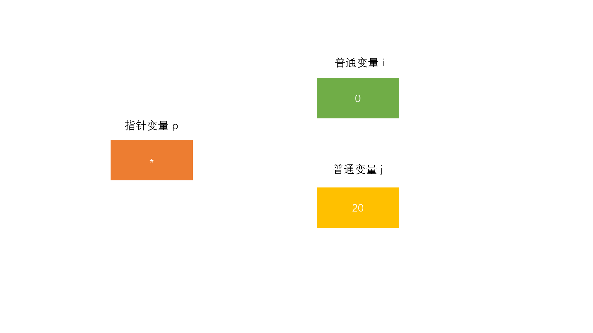

# 第一章：前言

## 1.1 概述

* 在 C 语言中， `const` 关键字用于定义常量，它指示编译器将标识符 （变量、函数参数、指针等）视为不可修改的值，从而提供了编译时的保护机制。
* 使用 `const` 可以增强代码的可维护性和可读性，避免不小心修改了某些值。

## 1.2 const 的用法

* ① `const` 关键字可以修饰`变量`、`指针`、`数组`和`函数`参数等，表示这些数据在初始化后就不能被修改。
* ② `const` 可以与`指针`结合使用，导致它的行为有些复杂：
  * `指针常量`：指针指向的数据是常量，但指针本身可以改变。
  * `常量指针`：指针本身是常量，不能修改指向的地址；但是，指向的数据可以修改。
  * `指向常量的常量指针`：指针本身和它所指向的数据都不可修改。

## 1.3 const VS define

*  ① `类型安全`：`const` 是类型安全的，编译器能够检查常量的类型，而宏在预处理阶段展开，不检查类型。
* ② `作用域`：`const` 常量有作用域，限定在声明它的函数或文件中，而宏常量在整个文件范围内有效。
* ③ `调试支持`：使用 `const` 变量时，可以像普通变量一样进行调试，而宏无法直接调试，因为它们在编译时会被替换。

## 1.4 const 应用场景

* ① `保护常量`：防止意外修改常量值。
* ② `提高可读性`：通过将数据声明为 `const`，使得代码更加清晰易懂。
* ③ `优化编译`：编译器可以更好地优化 `const` 数据。


# 第二章：const 的基本使用

## 2.1 普通常量

### 2.1.1 概述

* 如果一个变量使用 const 修饰，就变为常量，语法如下：

```c
const int MAX_NUM = 100; // 都可以，推荐这种方式
```

```c
int const MAX_NUM = 100; // 都可以，但是建议上面的方式
```

* 常量一旦被创建后其值就不能再改变，必须在定义的同时赋值（初始化），后面的任何赋值行为都将引发错误。

> [!TIP]
>
> 通常而言，常量名建议使用大驼峰的形式表示，如：`MAX_VALUE`，以便和普通的局部变量区分。

### 2.1.2 应用示例

* 示例：

```c {11}
#include <stdio.h>

int main() {

    // 禁用 stdout 缓冲区
    setbuf(stdout, nullptr);

    const double PI = 3.14;
    
    // 错误，不能修改常量
    PI = 3.1415;  // [!code error]

    return 0;
}
```

## 2.2 常量数组

### 2.2.1 概述

* 语法：

```c
const int arr[] = {10, 20, 30, 40};
```

* `常量数组`：指的是数组的元素值在程序运行期间不能被修改的数组。

> [!NOTE]
>
> `const` 关键字可以将`数组的元素`声明为`常量`，这样可以保护数组内容不被意外修改，提高代码的稳定性和可读性。

### 2.2.2 应用示例

* 示例：

```c
#include <stdio.h>

int main() {

    // 禁用 stdout 缓冲区
    setbuf(stdout, nullptr);

    // 定义一个常量数组
    const int arr[] = {10, 20, 30, 40};
    
    // 输出常量数组的元素
    for (int i = 0; i < 4; i++) {
        printf("%d ", arr[i]);
    }
    
    // 尝试修改常量数组的元素
    // 错误，编译时会报错，不能修改常量数组元素
    arr[0] = 100;  // [!code error]

    return 0;
}

```


* 示例：

```c
#include <stdio.h>

int main() {

    // 禁用 stdout 缓冲区
    setbuf(stdout, nullptr);

    // 定义一个常量数组
    const int arr[] = {10, 20, 30, 40};

    const int *p = arr; // p是指向常量的指针

    // 通过指针访问数组元素
    for (int i = 0; i < 4; i++) {
        printf("%d ", p[i]);
    }

    // 试图通过指针修改常量数组的元素
    // 错误，不能通过指针修改常量数组的值
    p[0] = 100;  // [!code error]

    return 0;
}
```


* 示例：

```c
#include <stdio.h>
// 传递常量数组作为参数
void print_array(const int arr[], int size) { // [!code highlight]
    for (int i = 0; i < size; i++) {
        printf("%d ", arr[i]);
    }
}
int main() {

    // 禁用 stdout 缓冲区
    setbuf(stdout, nullptr);

    const int arr[] = {10, 20, 30, 40};  // 定义常量数组
    print_array(arr, 4);

    return 0;
}

```

## 2.3 指向常量的指针（指针常量）作为函数参数

### 2.3.1 概述

* 在 C 语言中，单独定义 const 变量没有明显的优势，完全可以使用`#define`命令代替。

> [!NOTE]
>
> const 通常用在函数形参中，如果形参是一个指针，为了防止在函数内部修改指针指向的数据，就可以用 const 来限制。

* 在 C 语言标准库中，有很多函数的形参都被 `const` 修饰了，下面是部分函数的原型：

```c
size_t strlen ( const char * str );
```

```c
int strcmp ( const char * str1, const char * str2 );
```

```c
char * strcat ( char * destination, const char * source );
```

```c
char * strcpy ( char * destination, const char * source );
```

```c
int system (const char* command);
```

```c
int puts ( const char * str );
```

```c
int printf ( const char * format, ... );
```

### 2.3.2 应用示例

* 示例：

```c
#include <stdio.h>

/**
* 查找字符串中某个字符出现的次数
*/
size_t strnchr(const char *str, char ch){ // [!code highlight]
    int i, n = 0, len = strlen(str);

    for(i=0; i<len; i++){
        if(str[i] == ch){
            n++;
        }
    }
   
    return n;
}

int main(){
    char *str = "abcabcabcabcdfafere";
    char ch = 'a';
    int n = strnchr(str, ch);
    printf("%d\n", n);
    return 0;
}
```


# 第三章：const 和指针

## 3.1 概述

* 在实际开发中，我们是可以通过`指针变量`来修改所指向的变量的数据，如下所示：

```c
#include <stdio.h>

int main() {

    // 禁用 stdout 缓冲区
    setbuf(stdout, nullptr);

    int i = 10, j = 20;
    int *p = &i;

    *p = 30; // [!code highlight]

    printf("*p = %d\n", *p); // *p = 10
    
    return 0;
}
```

* 其在内存中，就是这样的，如下所示：



* 在实际开发中，我们也可以修改`指针变量`本身的值，如下所示：

```c
#include <stdio.h>

int main() {

    // 禁用 stdout 缓冲区
    setbuf(stdout, nullptr);

    int i = 10, j = 20;
    int *p = &i;

    p = &j; // [!code highlight]

    printf("*p = %d\n", *p); // *p = 20

    return 0;
}
```

* 其在内存中，就是这样的，如下所示：


* 但是，我们可以通过`指针变量`前加 `const` 关键字，来限制`指针变量`写的权限。

> [!NOTE]
>
> * ① `int *p = &i`，在内存中，就是这样的，如下所示：
>
> ::: details 点我查看
>
> 
>
> :::
>
> * ② `const int *p = &i`，在内存中，就是这样的，如下所示： 
>
> ::: details 点我查看
>
> 
>
> :::
>
> * ③ `int* const p = &1`，在内存中，就是这样的，如下所示：
>
> ::: details 点我查看
>
> 
>
> :::
>
> * ④ `const int* const p = &1`，在内存中，就是这样的，如下所示：
>
> ::: details 点我查看
>
> 
>
> :::

## 3.2 指向常量的指针(Pointer to Constant)

### 3.2.1 概述

* 语法：

```c
const int *p;
```

```c
int const *p;
```

> [!NOTE]
>
> * ① `“指向常量的指针”`，在有些书籍中，也被翻译为`“指针常量”`；其实，感觉很奇怪，大家还是记住对应的英文比较好！！！
> * ② 指向常量的指针，表示该指针所指向的对象的值是不能通过指针修改的，但是指针本身可以指向其它的地址。
> * ③ const 离变量名远，就是用来修饰指针指向的数据，即： `const` 在 `*` 号之前，表示 **指向的值不能修改，但是指针本身可以修改**。
> * ④ 其实，从语法上也可以看出来，即：`const` 修饰的是 `*p` ，即 `*p` 是固定的，即：不可以通过 `*p` 来修改数据。

### 3.2.2 应用示例

* 示例：

```c
#include <stdio.h>

int main() {

    // 禁用 stdout 缓冲区
    setbuf(stdout, nullptr);

    const int *p;   // 或者 int const *p;
    int a = 10;
    int b = 20;

    p = &a;  // 合法：可以改变指针指向
    // 错误，不能通过指针修改 a 的值
    *p = 30; // [!code error]
    p = &b;  // 合法：可以改变指针指向

    return 0;
}
```

## 3.3 常量指针(Constant Pointer)

### 3.3.1 概述

* 语法：

```c
int* const p;
```

> [!NOTE]
>
> * ① 常量指针（不变的指针）意味着指针本身是常量，不能指向其他地址，但指针所指向的对象的值可以修改。
> * ② const 离变量名近，就是用来修饰指针变量的，即：`const` 在 `*` 号之后，表示 **指针本身不能改变，但指向的值可以改变**。
> * ③ 其实，从语法上也可以看出来，即：`const` 修饰的是 `p` ，即 `p` 是固定的，即：不可以将 `p` 修改为其他指针。

### 3.3.2 应用示例

* 示例：

```c
#include <stdio.h>

int main() {

    // 禁用 stdout 缓冲区
    setbuf(stdout, nullptr);

    int a = 10;
    int *const p = &a; // p 是常量指针，必须在定义时初始化

    *p = 20; // 合法：可以通过指针修改 a 的值
    // 错误，不能改变指针的指向
    p = &a; // [!code error]  

    return 0;
}
```

## 3.4 指向常量的常量指针 (Constant Pointer to Constant)

### 3.4.1 概述

* 语法：

```c
const int* const p;
```

```c
int const * const p;
```

> [!NOTE]
>
> * ① 指向常量的常量指针就是指针的指向和指向的数据值都不能修改。
> * ② 在实际开发中，较少使用！！！

### 3.4.2 应用示例

* 示例：

```c
#include <stdio.h>

int main() {

    // 禁用 stdout 缓冲区
    setbuf(stdout, nullptr);

    int a = 10;
    const int *const p = &a; // 必须在定义时初始化

     // 错误，不能修改 a 的值
    *p = 20;  // [!code error]
     // 错误，不能改变指针的指向
    p = &a;   // [!code error]

    return 0;
}
```


# 第四章：深入理解 const 关键字

## 4.1 概述

* const 关键字修饰的变量，即：const 常量，一旦被定义就必须初始化，后面的任何赋值行为都将发生错误。

```c
#include <stdio.h>

int main() {

    // 禁用 stdout 缓冲区
    setbuf(stdout, nullptr);

    const double PI = 3.14;
    
    // 错误，不能修改常量
    PI = 3.1415;  // [!code error]

    return 0;
}
```

* 其实，这只是 C 语言的编译器在语法层面的限制而已：`我们无法通过变量名去修改一个 const 常量的取值，否则将会编译失败`。但是，作为程序员，我们可以在程序运行的时候，去修改 const 常量的值。

```c {14,16,18}
#include <stdio.h>

int getNum(){
    return 100;
}

int main(){
    
    // 禁用 stdout 缓冲区
    setbuf(stdout, nullptr);
    
    int n = 90;
    
    const int MAX_NUM1 = getNum();  // 运行时初始化
    
    const int MAX_NUM2 = n;  // 运行时初始化
    
    const int MAX_NUM3 = 80;  // 编译时初始化
  
    printf("%d, %d, %d\n", MAX_NUM1, MAX_NUM2, MAX_NUM3);

    return 0;
}
```

* 如果你还不能理解运行时，那么用户输入来修改 const 常量，总会属于运行时吧。

```c
#include <stdio.h>

int main() {

    // 禁用 stdout 缓冲区
    setbuf(stdout, nullptr);

    const int num = 10;

    printf("修改 num 的值：");
    scanf("%d", &num); // [!code highlight]

    // const int num = 20
    printf("const int num = %d\n", num);

    return 0;
}
```

> [!CAUTION]
>
> * ① 正因为 C 语言的这种“坑爹”的语法，很多程序员会将 const 修饰的变量，即：const 常量，称为只读变量。
> * ② 但是，对于使用 C 语言的程序员而言，可以使用指针、函数来动态修改 const 修饰的变量（即：const 常量）的值。

## 4.2 const 和 非 const 的转换

* 指向常量的指针，表示该指针所指向的对象的值是不能通过指针修改的，但是指针本身可以指向其它的地址，例如：`const char* str1`，而普通的指针变量本身既可以指向其他地址，所指向的对象的值也可以改变，例如：`char* str2` 。
* 在 C 语言中，指向常量的指针的数据类型（`const char*`）是不可以转换为普通指针的数据类型（`char*`），即：

```c
#include <stdio.h>

void func(char *str) {
    *str = "你好啊"; // [!code error]
}

int main() {

    // 禁用 stdout 缓冲区
    setbuf(stdout, nullptr);

    const char *str1 = "我是谁";
    // 不合法
    func(str1); // [!code error]

    return 0;
}
```

> [!NOTE]
>
> * ① 很好理解，`char*`指向的数据有读取和写入权限，而 `const char *`指向的数据只有读取权限，降低数据的权限并不会带来任何问题，但是提升数据的权限就有可能发生危险。
> * ② 在实际开发中，为了安全，权限的范围是越小越好。

* 在 C 语言中，普通的指针类型（`char*`）是可以转换为指针常量的类型（`const char*`），即：

```c
#include <stdio.h>

void func(const char *str) {
    printf("%s\n", str);
}

int main() {

    // 禁用 stdout 缓冲区
    setbuf(stdout, nullptr);

    char *str1 = "我是谁";
    
    // 合法
    func(str1); // [!code highlight]

    return 0;
}
```

> [!NOTE]
>
> * ① 很好理解，`char*`指向的数据有读取和写入权限，而 `const char *`指向的数据只有读取权限，降低数据的权限并不会带来任何问题，但是提升数据的权限就有可能发生危险。
> * ② 在实际开发中，为了安全，权限的范围是越小越好。

## 4.3 C 语言中编译期常量<Badge type="danger" text="^c23"/>

* 在之前的 C 标准中，如果我们定义普通常量是这样的（只读常量），如下所示：

```c
#include <stdio.h>

int getNum(){
    return 100;
}

int main(){
    
    // 禁用 stdout 缓冲区
    setbuf(stdout, nullptr);
    
    int n = 90;
    
    const int MAX_NUM1 = getNum();  // 运行时初始化
    
    const int MAX_NUM2 = n;  // 运行时初始化
    
    const int MAX_NUM3 = 80;  // 编译时初始化
  
    printf("%d, %d, %d\n", MAX_NUM1, MAX_NUM2, MAX_NUM3);

    return 0;
}
```

> [!NOTE]
>
> * ① 之前的 C 标准中的常量是 C 语言的编译器在语法层面的限制而已：`我们无法通过变量名去修改一个 const 常量的取值，否则将会编译失败`。
> * ② 但是，作为程序员，我们可以在程序运行的时候，去修改 const 常量的值。
> * ③ 很多程序员称上述的这种常量是`只读常量`。

* 在 C23 中，C 语言提供了 `constexpr` 关键字，用来定义真正的编译期常量，如下所示：

```c
#include <stdio.h>

int main() {

    // 禁用 stdout 缓冲区
    setbuf(stdout, nullptr);

    int n = 90;

    // 错误，constexpr 定义的常量是编译期常量，不可以在运行时修改
    constexpr int MAX_NUM = n; // [!code error]

    return 0;
}
```

```c
#include <stdio.h>

int getNum(){
    return 100;
}

int main() {

    // 禁用 stdout 缓冲区
    setbuf(stdout, nullptr);

    int n = 90;

    // 错误，constexpr 定义的常量是编译期常量，不可以在运行时修改
    constexpr int MAX_NUM = getNum(); // [!code error]

    return 0;
}
```


# 第五章：传入参数、传出参数和传入传出参数

## 5.1 概述

* C 语言中的函数支持传入参数、传出参数和传入传出参数。

## 5.2 传入参数（Input Paramter）

* `传入参数`就是将值从调用者传递给被调用的函数，函数内部可以使用这些值；但是，并不会修改调用者的原始数据。

> [!NOTE]
>
> * ① 在函数中，可以通过`普通值`或`指针常量`的方式，将数据从调用者传递传递给函数（传入参数）。
> * ② 其实，所谓的`传入参数`，就是对应 MySQL 存储过程和函数中，参数的参数类型 `IN` 类型。
>
> ::: details 点我查看
>
> ```sql {3}
> DELIMITER //
> 
> CREATE PROCEDURE greet_user(IN username VARCHAR(50))
> BEGIN
>     SELECT CONCAT('Hello, ', username, '!') AS greeting;
> END //
> 
> DELIMITER ;
> 
> -- 调用存储过程
> CALL greet_user('Alice');
> ```
>
> :::
>
> * ③ `传入参数`的特点：是函数内修改参数的值不会影响调用者。


* 示例：

``` c
#include <stdio.h>

void printValue(int value) { // [!code highlight]
    
    printf("%d\n", value);
}

int main() {

    // 禁用 stdout 缓冲区
    setbuf(stdout, nullptr);

    int num = 10;
    
    printValue(num);

    return 0;
}
```


* 示例：

```c
#include <stdio.h>

/**
* 查找字符串中某个字符出现的次数
*/
size_t strnchr(const char *str, char ch){ // [!code highlight]
    int i, n = 0, len = strlen(str);

    for(i=0; i<len; i++){
        if(str[i] == ch){
            n++;
        }
    }
   
    return n;
}

int main(){
    
    // 禁用 stdout 缓冲区
    setbuf(stdout, nullptr);
    
    char *str = "abcabcabcabcdfafere";
    char ch = 'a';
    
    int n = strnchr(str, ch);
    printf("%d\n", n);
    
    return 0;
}
```

## 5.3 传出参数（Output Paramter）

* `传出参数`用于从函数中传递结果给调用者，调用者通常会传入一个指针，函数通过指针修改调用者的数据。

> [!NOTE]
>
> * ① 在函数中，可以通过`指针`的方式，将函数中的结果，通过参数传递传递给调用者（传出参数）。
> * ② 其实，所谓的`传出参数`，就是对应 MySQL 存储过程和函数中，参数的类型 `OUT` 类型。
>
> ::: details 点我查看
>
> ```sql {3}
> DELIMITER //
> 
> CREATE PROCEDURE calculate_sum(IN num1 INT, IN num2 INT, OUT total INT)
> BEGIN
>     SET total = num1 + num2;
> END //
> 
> DELIMITER ;
> 
> -- 调用存储过程
> CALL calculate_sum(10, 20, @result);
> SELECT @result AS sum;
> ```
>
> :::
>
> * ③ `传出参数`的特点是：函数可以直接修改调用者的数据。


* 示例：

```c
#include <stdio.h>

void minAndMax(const int arr[], int len, int *pMin, int *pMax) { // [!code highlight]
    *pMin = arr[0];
    *pMax = arr[0];
    for (int i = 0; i < len; i++) {
        if (arr[i] <= *pMin) {
            *pMin = arr[i];
        }
        if (arr[i] > *pMax) {
            *pMax = arr[i];
        }
    }
}

int main() {

    // 禁用 stdout 缓冲区
    setbuf(stdout, nullptr);

    int arr[] = {1, 2, 3, 4, 5};
    int min = 0, max = 0;

    minAndMax(arr, sizeof(arr) / sizeof(arr[0]), &min, &max);

    printf("min: %d\n", min);
    printf("max: %d\n", max);

    return 0;
}

```

## 5.4 传入传出参数（Input-Output Parameter）

* 传入传出参数既可以将数据传入函数，又可以将修改后的数据传回调用者，通常也是通过指针实现。

> [!NOTE]
>
> * ① 在函数中，可以通过`指针`的方式，进行调用者和函数之间的共享数据（传入传出参数）。
> * ② 其实，所谓的`传入传出参数`，就是对应 MySQL 存储过程和函数中，参数的类型 `INOUT` 类型。
>
> ::: details 点我查看
>
> ```sql {3}
> DELIMITER //
> 
> CREATE PROCEDURE double_value(INOUT value INT)
> BEGIN
>     SET value = value * 2;
> END //
> 
> DELIMITER ;
> 
> -- 调用存储过程
> SET @number = 5; -- 设置初始值
> CALL double_value(@number);
> SELECT @number AS doubled_value;
> ```
>
> :::
>
> * ③ `传入传出参数`的特点是：调用者和函数之间共享数据，既可以输入值，也可以通过修改传出值。


* 示例：

```c
#include <stdio.h>

void processValue(int *value) {
    // 值加倍
    *value *= 2; // [!code highlight]
}

int main() {

    // 禁用 stdout 缓冲区
    setbuf(stdout, nullptr);

    int x = 5;
    printf("x = %d\n", x); // x = 5

    processValue(&x); // 传入地址，同时会被修改

    printf("x = %d\n", x); // x = 10

    return 0;
}
```

