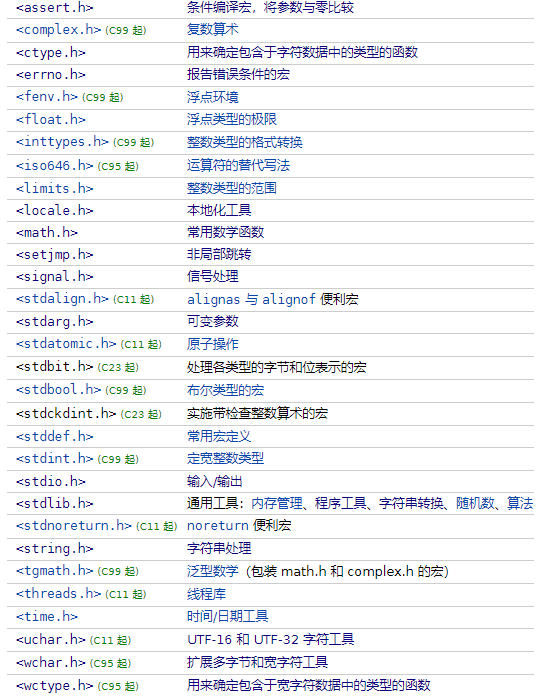

# 第一章：概述

## 1.1 介绍

* [库函数](/C标准库参考手册.pdf)并非 C 语言本身的组成部分，而是 C 语言编译系统为方便用户使用而提供的公共函数。 

> [!CAUTION]
>
> 不同的编译系统提供的函数数量和函数名、函数功能都不尽相同， 使用时要小心，必要时需要查一下库函数手册。

* C 标准库的头文件，如下所示：



## 1.2 常见的头文件和库函数

* 我们完全没必要记住所有的 C 语言头文件和库函数（也记不住），只需要熟悉常用的头文件和库函数。

| 头文件        | 功能说明                                                   | 常用函数和宏                                                 |
| :------------ | :--------------------------------------------------------- | :----------------------------------------------------------- |
| **stdio.h**   | 标准输入输出库                                             | `printf`， `scanf`， `fprintf`，`fscanf`，`fopen`， `fclose`，`fgets`， `fputs` |
| **stdlib.h**  | 标准库，提供内存分配、程序控制、类型转换、随机数生成等功能 | `malloc`， `free`， `exit`， `atoi`， `atof`，`rand`，`srand` |
| **string.h**  | 字符串处理库                                               | `strlen`， `strcpy`， `strncpy`， `strcat`， `strcmp`，`strstr`， `memset`， `memcpy` |
| **math.h**    | 数学库                                                     | `sin`， `cos`， `tan`， `exp`， `log`， `sqrt`， `pow`       |
| **time.h**    | 时间和日期库                                               | `time`， `clock`， `difftime`， `mktime`， `strftime`， `localtime`，`gmtime` |
| **ctype.h**   | 字符处理库                                                 | `isalnum`， `isalpha`， `isdigit`， `islower`， `isupper`， `tolower`， `toupper` |
| **stdbool.h** | 布尔类型库                                                 | `bool`， `true`， `false`                                    |
| **assert.h**  | 断言库                                                     | `assert`                                                     |


# 第二章：数学相关的库函数

## 2.1 概述

* 数学相关的库函数，在头文件 `<math.h>` 和 `<stdlib.h>`中。

## 2.2 绝对值

* 整数的绝对值：

```c
int abs (int __x); // 定义在 <stdlib.h> 中
```

```c
long int labs (long int __x) // 定义在 <stdlib.h> 中
```

```c
long long int llabs (long long int __x) // 定义在 <stdlib.h> 中
```

* 浮点数的绝对值：

```c
double fabs(double arg ); // 定义在 <math.h> 中
```


* 示例：

```c
#include <stdio.h>
#include <stdlib.h>

int main() {

    // 禁用 stdout 缓冲区
    setbuf(stdout, nullptr);

    // 10 的绝对值是 = 10
    printf("%d 的绝对值是 = %d\n", 10, abs(10)); 

    // -10 的绝对值是= 10
    printf("%d 的绝对值是= %d\n", -10, abs(-10)); 

    return 0;
}
```


* 示例：

```c
#include <stdio.h>
#include <stdlib.h>

int main() {

    // 禁用 stdout 缓冲区
    setbuf(stdout, nullptr);

    // 10 的绝对值是 = 10
    printf("%d 的绝对值是 = %ld\n", 10, labs(10)); 

    // -10 的绝对值是= 10
    printf("%d 的绝对值是= %ld\n", -10, labs(-10)); 

    return 0;
}
```


* 示例：

```c
#include <stdio.h>
#include <stdlib.h>

int main() {

    // 禁用 stdout 缓冲区
    setbuf(stdout, nullptr);

    // 10 的绝对值是 = 10
    printf("%d 的绝对值是 = %lld\n", 10, llabs(10)); 

    // -10 的绝对值是= 10
    printf("%d 的绝对值是= %lld\n", -10, llabs(10)); 

    return 0;
}
```


* 示例：

```c
#include <math.h>
#include <stdio.h>

int main() {

    // 禁用 stdout 缓冲区
    setbuf(stdout, nullptr);

    // 10.00 的绝对值是 = 10.00
    printf("%.2f 的绝对值是 = %.2lf\n", 10.00, fabs(10.00));

    // -10.00 的绝对值是= 10.00
    printf("%.2f 的绝对值是= %.2lf\n", -10.00, fabs(10.00));

    return 0;
}
```

## 2.3 平方根和立方根

* 平方根：

```c
float  sqrtf( float arg ); 
```

```c
double sqrt( double arg ); 
```

```c
long double sqrtl( long double arg ); 
```

* 立方根：

```c
float cbrtf( float arg ); 
```

```c
double cbrt( double arg ); 
```

```c
long double cbrtl( long double arg ); 
```


* 示例：

```c
#include <math.h>
#include <stdio.h>

int main() {

    // 禁用 stdout 缓冲区
    setbuf(stdout, nullptr);

    // 9.00 的平方根是 = 3.00
    printf("%.2f 的平方根是 = %.2f\n", 9.00, sqrt(9.00));

    return 0;
}
```


* 示例：

```c
#include <math.h>
#include <stdio.h>

int main() {

    // 禁用 stdout 缓冲区
    setbuf(stdout, nullptr);

    // 8.00 的立方根是 = 2.00
    printf("%.2f 的立方根是 = %.2f\n", 8.00, cbrt(8.00));

    return 0;
}
```

## 2.4 幂

* 计算幂（2^3）：

```c
float powf( float base, float exponent ); 
```

```c
double pow( double base, double exponent );
```

```c
long double powl( long double base, long double exponent );
```


* 示例：

```c
#include <math.h>
#include <stdio.h>

int main() {

    // 禁用 stdout 缓冲区
    setbuf(stdout, nullptr);

    // 2 ^ 3 是= 8.00
    printf("%d ^ %d 是= %.2f\n", 2, 3, pow(2, 3));

    return 0;
}
```

## 2.5 三角函数

* 正弦：

```c
float sinf( float arg );
```

```c
double sin( double arg );
```

```c
long double sinl( long double arg );
```

```c
_Decimal32  sind32( _Decimal32 arg );
```

```c
_Decimal64  sind64( _Decimal64 arg );
```

```c
_Decimal128 sind128( _Decimal128 arg );
```

* 余弦：

```c
float cosf( float arg );
```

```c
double cos( double arg );
```

```c
long double cosl( long double arg );
```

```c
_Decimal32  cosd32( _Decimal32 arg );
```

```c
_Decimal64  cosd64( _Decimal64 arg );
```

```c
_Decimal128 cosd128( _Decimal128 arg );
```

* 正切：

```c
float tanf( float arg );
```

```c
double tan( double arg );
```

```c
long double tanl( long double arg );
```

```c
_Decimal32 tand32( _Decimal32 arg );
```

```c
_Decimal64 tand64( _Decimal64 arg );
```

```c
_Decimal128 tand128( _Decimal128 arg );
```


* 示例：

```c
#include <math.h>
#include <stdio.h>

#define M_PI 3.14159265358979323846

int main() {

    // 禁用 stdout 缓冲区
    setbuf(stdout, nullptr);

    double angle_rad = M_PI / 4; 

    // sin(0.79) = 0.71
    printf("sin(%.2f) = %.2f\n", angle_rad, sin(angle_rad));
    // cos(0.79) = 0.71
    printf("cos(%.2f) = %.2f\n", angle_rad, cos(angle_rad));
    // tan(0.79) = 1.00
    printf("tan(%.2f) = %.2f\n", angle_rad, tan(angle_rad));

    return 0;
}
```

## 2.6 指数函数

* 指数函数（e 为底数）：

```c
float expf( float arg );
```

```c
double exp( double arg );
```

```c
long double expl( long double arg );
```

* 指数函数（2 为底数）：

```c
float exp2f( float n );
```

```c
double exp2( double n );
```

```c
long double exp2l( long double n );
```


* 示例：

```c
#include <math.h>
#include <stdio.h>

int main() {

    // 禁用 stdout 缓冲区
    setbuf(stdout, nullptr);

    // exp(1.0) = 2.72
    printf("exp(1.0) = %.2f\n", exp(1.0));

    return 0;
}
```

## 2.7 自然对数

* 自然对数（e 为底数）：

```c
float logf( float arg );
```

```c
double log( double arg );
```

```c
long double logl( long double arg );
```

* 自然对数（2 为底数）：

```c
float log2f( float arg );
```

```c
double log2( double arg );
```

```c
long double log2l( long double arg );
```


* 示例：

```c
#include <math.h>
#include <stdio.h>

int main() {

    // 禁用 stdout 缓冲区
    setbuf(stdout, nullptr);

    // log(2.00) = 0.69
    printf("log(%.2f) = %.2f\n", 2.00, log(2.00));

    return 0;
}
```

## 2.8 向上取整和向下取整

* 向上取整（计算不小于给定值的最小整数）：

```c
float ceilf( float arg );
```

```c
double ceil( double arg );
```

```c
long double ceill( long double arg );
```

* 向下取整（计算不大于给定值的最大整数）：

```c
float floorf( float arg );
```

```c
double floor( double arg );
```

```c
long double floorl( long double arg );
```


* 示例：

```c
#include <math.h>
#include <stdio.h>

int main() {

    // 禁用 stdout 缓冲区
    setbuf(stdout, nullptr);

    double float_val = -10.5;

    // ceil(-10.50) = -10.00
    printf("ceil(%.2f) = %.2f\n", float_val, ceil(float_val));

    // floor(-10.50) = -11.00
    printf("floor(%.2f) = %.2f\n", float_val, floor(float_val));

    return 0;
}
```


# 第三章：时间相关的库函数

## 3.1 概述

* 时间相关的库函数，在头文件 `<time.h>` 中。

## 3.2 获取当前时间

* 获取当前时间：

```c
time_t time( time_t *arg )
```

> [!NOTE]
>
> 格林尼治时间 1970 年 1 月 1 日 00:00:00 到当前时刻的时长，时长单位是秒。


* 示例：

```c
#include <stdio.h>
#include <time.h>

long sum(int num) {
    int i   = 0;
    int sum = 0;
    int j   = 0;
    for (i = 0; i < num; i++) {
        sum = 0;
        for (j = 0; j < 100; j++) {
            sum += j;
        }
    }
    return sum;
}

int main() {

    // 禁用 stdout 缓冲区
    setbuf(stdout, nullptr);

    // 开始时间和结束时间
    time_t start, end;
    // 获取当前时间
    time(&start);

    // 执行一些需要测量时间的操作
    long result = sum(10000000);
    printf("result = %ld\n", result);

    // 获取当前时间
    time(&end);

    // 打印结果
    printf("开始时间是: %ld秒\n", start);
    printf("结束时间是: %ld秒\n", end);

    return 0;
}
```

## 3.3 计算时间差

* 计算 end 和 start之间相差的秒数：

```c
ouble difftime( time_t end, time_t start )
```


* 示例：

```c
#include <stdio.h>
#include <time.h>

long sum(int num) {
    int i   = 0;
    int sum = 0;
    int j   = 0;
    for (i = 0; i < num; i++) {
        sum = 0;
        for (j = 0; j < 100; j++) {
            sum += j;
        }
    }
    return sum;
}

int main() {

    // 禁用 stdout 缓冲区
    setbuf(stdout, nullptr);

    // 开始时间和结束时间
    time_t start, end;
    // 获取当前时间
    time(&start);

    // 执行一些需要测量时间的操作
    long result = sum(10000000);
    printf("result = %ld\n", result);

    // 获取当前时间
    time(&end);

    // 耗时
    printf("耗时: %.2f秒\n", difftime(end, start));

    return 0;
}
```

## 3.4 本地时间

* 将时间戳转换为本地时间：

```c
struct tm* localtime  ( const time_t* timer );
```

```c
struct tm* localtime_r( const time_t* timer, struct tm* buf );
```

```c
struct tm* localtime_s( const time_t* restrict timer, struct tm* restrict buf );
```


* 示例：

```c
#include <stdio.h>
#include <time.h>

long sum(int num) {
    int i   = 0;
    int sum = 0;
    int j   = 0;
    for (i = 0; i < num; i++) {
        sum = 0;
        for (j = 0; j < 100; j++) {
            sum += j;
        }
    }
    return sum;
}

int main() {

    // 禁用 stdout 缓冲区
    setbuf(stdout, nullptr);

    // 获取当前时间
    time_t t = time(NULL);

    // 使用 localtime() 转换时间戳为本地时间
    struct tm *local_time = localtime(&t);
    printf("本地时间: %s", asctime(local_time));

    // 使用 gmtime() 转换时间戳为 GMT 时间
    struct tm *gmt_time = gmtime(&t);
    printf("GMT时间: %s", asctime(gmt_time));
    return 0;
}
```


# 第四章：字符相关的库函数

## 4.1 概述

* 字符相关的库函数，在头文件 `<ctype.h>` 中。

## 4.2 检查字符是否是字母？

* 检查字符是否是字母：

```c
int isalpha( int ch );
```


* 示例：

```c
#include <ctype.h>
#include <stdio.h>

int main() {

    // 禁用 stdout 缓冲区
    setbuf(stdout, nullptr);

    char ch1 = 'A';
    char ch2 = '9';
    char ch3 = 'b';

    // 使用 isalpha() 检查是否为字母

    if (isalpha(ch1)) {
        printf("%c 是字母字符\n", ch1);
    } else {
        printf("%c 不是字母字符\n", ch1);
    }

    if (isalpha(ch2)) {
        printf("%c 是字母字符\n", ch2);
    } else {
        printf("%c 不是字母字符\n", ch2);
    }

    if (isalpha(ch3)) {
        printf("%c 是字母字符\n", ch3);
    } else {
        printf("%c 不是字母字符\n", ch3);
    }

    return 0;
}
```

## 4.3 检查字符是否是数字？

* 检查字符是否是数字：

```c
int isdigit( int ch );
```


* 示例：

```c
#include <ctype.h>
#include <stdio.h>

int main() {

    // 禁用 stdout 缓冲区
    setbuf(stdout, nullptr);

    char ch1 = 'A';
    char ch2 = '9';
    char ch3 = 'b';

    // 使用 isdigit() 检查是否为数字

    if (isdigit(ch1)) {
        printf("%c 是数字字符\n", ch1);
    } else {
        printf("%c 不是数字字符\n", ch1);
    }

    if (isdigit(ch2)) {
        printf("%c 是数字字符\n", ch2);
    } else {
        printf("%c 不是数字字符\n", ch2);
    }

    if (isdigit(ch3)) {
        printf("%c 是数字字符\n", ch3);
    } else {
        printf("%c 不是数字字符\n", ch3);
    }

    return 0;
}
```

## 4.4 检查字符是否是字母或数字？

* 检查字符是否是字母或数字：

```c
int isalnum( int ch );
```


* 示例：

```c
#include <ctype.h>
#include <stdio.h>

int main() {

    // 禁用 stdout 缓冲区
    setbuf(stdout, nullptr);

    char ch1 = 'A';
    char ch2 = '9';
    char ch3 = 'b';

    // 使用 isalnum() 检查是否为字母或数字

    if (isalnum(ch1)) {
        printf("%c 是字母或数字字符\n", ch1);
    } else {
        printf("%c 不是字母或数字字符\n", ch1);
    }

    if (isalnum(ch2)) {
        printf("%c 是字母或数字字符\n", ch2);
    } else {
        printf("%c 不是字母或数字字符\n", ch2);
    }

    if (isalnum(ch3)) {
        printf("%c 是字母或数字字符\n", ch3);
    } else {
        printf("%c 不是字母或数字字符\n", ch3);
    }

    return 0;
}
```

## 4.5 检查字符是否小写？

* 检查字符是否小写：

```c
int islower( int ch );
```


* 示例：

```c
#include <ctype.h>
#include <stdio.h>

int main() {

    // 禁用 stdout 缓冲区
    setbuf(stdout, nullptr);

    char ch1 = 'A';
    char ch2 = '9';
    char ch3 = 'b';

    // 使用 islower() 检查是否为小写字母

    if (islower(ch1)) {
        printf("%c 是小写字母\n", ch1);
    } else {
        printf("%c 不是小写字母\n", ch1);
    }

    if (islower(ch2)) {
        printf("%c 是小写字母\n", ch2);
    } else {
        printf("%c 不是小写字母\n", ch2);
    }

    if (islower(ch3)) {
        printf("%c 是小写字母\n", ch3);
    } else {
        printf("%c 不是小写字母\n", ch3);
    }

    return 0;
}
```

## 4.6 检查字符是否大写？

* 检查字符是否大写：

```c
int isupper( int ch );
```


* 示例：

```c
#include <ctype.h>
#include <stdio.h>

int main() {

    // 禁用 stdout 缓冲区
    setbuf(stdout, nullptr);

    char ch1 = 'A';
    char ch2 = '9';
    char ch3 = 'b';

    // 使用 isupper() 检查是否为大写字母

    if (isupper(ch1)) {
        printf("%c 是大写字母\n", ch1);
    } else {
        printf("%c 不是大写字母\n", ch1);
    }

    if (isupper(ch2)) {
        printf("%c 是大写字母\n", ch2);
    } else {
        printf("%c 不是大写字母\n", ch2);
    }

    if (isupper(ch3)) {
        printf("%c 是大写字母\n", ch3);
    } else {
        printf("%c 不是大写字母\n", ch3);
    }

    return 0;
}
```

## 4.7 将字符转换为小写

* 将字符转换为小写：

```c
int tolower( int ch );
```


* 示例：

```c
#include <ctype.h>
#include <stdio.h>

int main() {

    // 禁用 stdout 缓冲区
    setbuf(stdout, nullptr);

    char ch1 = 'A';
    char ch2 = '9';
    char ch3 = 'b';

    // 使用 tolower() 将字符转换为小写

    printf("%c 转换为小写字母是 %c\n", ch1, tolower(ch1));
    printf("%c 转换为小写字母是 %c\n", ch2, tolower(ch2));
    printf("%c 转换为小写字母是 %c\n", ch3, tolower(ch3));

    return 0;
}
```

## 4.8 将字符转换为大写

* 将字符转换为大写：

```c
int toupper( int ch );
```


* 示例：

```c
#include <ctype.h>
#include <stdio.h>

int main() {

    // 禁用 stdout 缓冲区
    setbuf(stdout, nullptr);

    char ch1 = 'A';
    char ch2 = '9';
    char ch3 = 'b';

    // 使用 toupper() 将字符转换为大写

    printf("%c 转换为大写字母是 %c\n", ch1, toupper(ch1));
    printf("%c 转换为大写字母是 %c\n", ch2, toupper(ch2));
    printf("%c 转换为大写字母是 %c\n", ch3, toupper(ch3));

    return 0;
}
```


# 第五章：字符串相关的库函数

## 5.1 概述

* 字符串相关的库函数，在头文件 `<string.h>` 中。

## 5.2 计算字符串长度

* 计算字符串长度：

```c
size_t strlen( const char* str );
```

> [!NOTE]
>
> 该函数返回字符串的长度，并不包括末尾的 `'\0'`。


* 示例：

```c
#include <stdio.h>
#include <string.h>

int main() {

    // 禁用 stdout 缓冲区
    setbuf(stdout, nullptr);

    const char str[] = "How many characters does this string contain?";

    // 不计入空字符: 45
    printf("不计入空字符: %zu\n", strlen(str));
    // 计入空字符: 46
    printf("计入空字符: %zu\n", sizeof str);
 
    return 0;
}
```

## 5.2 复制字符串（了解）

* 复制字符串：

```c
char *strcpy( char *dest, const char *src );
```

> [!NOTE]
>
> * ① dest 的长度需要大于或等于 src 的长度；否则，将会出现溢出！！！
> * ② 此函数不是安全函数，推荐使用 `strncpy()` 函数代替！！！


* 示例：

```c
#include <stdio.h>
#include <string.h>

int main() {

    // 禁用 stdout 缓冲区
    setbuf(stdout, nullptr);

    char src[] = "hello";
    char dest[strlen(src) + 1]; //  +1 以适应空终止符

    strcpy(dest, src);

    printf("src = %s\n", src);
    printf("dest = %s\n", dest);

    return 0;
}
```

## 5.3 复制指定长度的字符串

* 复制指定长度的字符串：

```c
char *strncpy( char *dest, const char *src, size_t count );
```

> [!NOTE]
>
> count 应该小于等于 dest 原有的字符个数（不包括 `'\0'`）。


* 示例：

```c
#include <stdio.h>
#include <string.h>

int main() {

    // 禁用 stdout 缓冲区
    setbuf(stdout, nullptr);

    char dest[40] = "1234567890";
    char src[12]  = "hello world";

    strncpy(dest, src, 5);

    printf("src = %s\n", src);
    printf("dest = %s\n", dest);

    return 0;
}
```

## 5.4 拼接字符串

* 拼接字符串：

```c
char *strcat( char *dest, const char *src );
```

> [!NOTE]
>
> * ① 将字符串 src 拼接到字符串 dest 后面。
> * ② 字符串 dest 必须足够大，以容纳连接后的新字符串。


* 示例：

```c
#include <stdio.h>
#include <string.h>

int main() {

    // 禁用 stdout 缓冲区
    setbuf(stdout, nullptr);

    char dest[50] = "Hello ";
    char src[]    = "World!";

    printf("strcat(dest, src) = %s\n", strcat(dest, src));
    printf("src = %s\n", src);
    printf("dest = %s\n", dest);

    return 0;
}
```

## 5.5 拼接指定长度的字符串

* 拼接指定长度的字符串：

```c
char *strncat( char *dest, const char *src, size_t count )
```

> [!NOTE]
>
> 将 src 字符串的前 count 个字符拼接到 dest 字符串后面。


* 示例：

```c
#include <stdio.h>
#include <string.h>

int main() {

    // 禁用 stdout 缓冲区
    setbuf(stdout, nullptr);

    char dest[50] = "Hello ";
    char src[]    = "World!";

    printf("strcat(dest, src) = %s\n", strncat(dest, src, 3));
    printf("src = %s\n", src);
    printf("dest = %s\n", dest);

    return 0;
}
```

## 5.6 比较两个字符穿

* 比较两个字符串：

```c
int strcmp( const char* lhs, const char* rhs );
```

> [!NOTE]
>
> 字符串比较的规则是：将两个字符串自左至右逐个字符相比(按 ASCII 码值大小比较)，直到出现不同的字符或遇到 `'\0'` 为止。
>
> * ① 如果全部字符相同，则认为两个字符串相等。
> * ② 如果出现不相同的字符，如果返回值为正数，则字符串 lhs 大；反 之，返回值为负数，则字符串 rhs 大。


* 示例：

```c
#include <stdio.h>
#include <string.h>

int main() {

    // 禁用 stdout 缓冲区
    setbuf(stdout, nullptr);

    char *str1 = "abcy";
    char *str2 = "abcn";

    if (strcmp(str1, str2) == 0) {
        printf("%s 和 %s 相等\n", str1, str2);
    } else {
        printf("%s 和 %s 不相等\n", str1, str2);
    }

    return 0;
}
```

## 5.7 比较指定长度的字符串

* 比较指定长度的字符串：

```c
int strncmp( const char *lhs, const char *rhs, size_t count );
```


* 示例：

```c
#include <stdio.h>
#include <string.h>

int main() {

    // 禁用 stdout 缓冲区
    setbuf(stdout, nullptr);

    char *str1 = "abcy";
    char *str2 = "abcn";

    if (strncmp(str1, str2, 2) == 0) {
        printf("%s 和 %s 相等\n", str1, str2);
    } else {
        printf("%s 和 %s 不相等\n", str1, str2);
    }

    return 0;
}
```

## 5.8 在字符串中查找字符

* 在字符串中查找字符：

```c
char* strchr( const char* str, int ch );
```


* 示例：

```c
#include <stdio.h>
#include <string.h>

int main() {

    // 禁用 stdout 缓冲区
    setbuf(stdout, nullptr);

    char *str1 = "abcy";

    char target = 'o';

    char *char_pos = strchr(str1, 'o');
    if (char_pos != nullptr) {
        printf("字符 %c 出现的位置是: %ld\n", target, char_pos - str1);
    } else {
        printf("没有找到字符 %c\n", target);
    }

    return 0;
}
```

## 5.9 在字符串中查找子串

* 在字符串中查找子串：

```c
char* strstr( const char* str, const char* substr );
```


* 示例：

```c
#include <stdio.h>
#include <string.h>

void find_str(char const *str, char const *substr) {
    char const *pos = strstr(str, substr);
    pos ? printf("找到字符串 [%s] 位于 [%s] 的位置 %td\n",
                 substr, str, pos - str)
        : printf("没有在 [%s] 中找到 [%s]\n",
                 str, substr);
}

int main() {

    // 禁用 stdout 缓冲区
    setbuf(stdout, nullptr);

    char const *str = "one two three";
    find_str(str, "two");
    find_str(str, "");
    find_str(str, "nine");
    find_str(str, "n");

    return 0;
}
```

